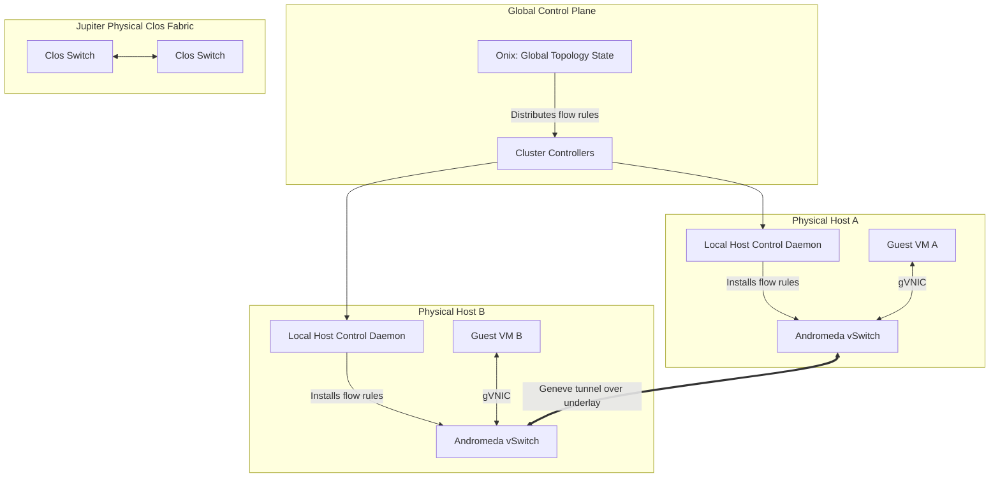

# GCP Andromeda: Software-Defined Networking, BGP, and Global VPC Routing

Provision two Compute Engine VMs in a single GCP VPC — one in `us-east1`, one in `europe-west3` — and they can reach each other over private RFC 1918 addresses as though they were plugged into the same physical switch, with no transit gateway, no VPC peering, and no VPN tunnel in between. In AWS or Azure, the equivalent setup requires an explicit cross-region peering connection or a transit gateway, because VPCs there are regional resources. Understanding why GCP can make a VPC a genuinely **global** resource requires understanding the two-layer system underneath it: **Jupiter**, the physical network, and **Andromeda**, the software-defined control plane running on top of it.

## The Problem: Physical Switches Cannot Scale to Cloud-Scale Multi-Tenancy

Traditional data center networking couples routing logic directly to physical hardware — routers, switches, and firewalls each maintain their own local configuration and forwarding tables (FIB) built from protocols like OSPF or BGP running hop-by-hop.

```text
TRADITIONAL HARDWARE-CENTRIC ROUTING
┌────────────────────────────────────────────────────────┐
│ [ Physical Server A ]                                  │
└───────────┬────────────────────────────────────────────┘
            │
            ▼
┌────────────────────────────────────────────────────────┐
│ [ Top-of-Rack (ToR) Switch ]     ◄── Localized MAC table│
└───────────┬────────────────────────────────────────────┘
            │
            ▼
┌────────────────────────────────────────────────────────┐
│ [ Aggregation Layer Switch/Router ] ◄── Local FIB      │
└───────────┬────────────────────────────────────────────┘
            │ OSPF / BGP hop-by-hop
            ▼
┌────────────────────────────────────────────────────────┐
│ [ Core Layer Router ]  ◄── TCAM table size limits       │
└────────────────────────────────────────────────────────┘
```

This model breaks down under cloud-scale multi-tenancy for two concrete, physical reasons:

1. **TCAM exhaustion.** Physical switch ASICs match packet headers against routing/ACL tables using expensive, power-hungry TCAM memory, typically capped around 10,000–100,000 entries. A public cloud spins up and tears down millions of transient VMs per hour — storing that address churn directly in switch hardware tables is not just impractical, it's physically impossible at the necessary scale.
2. **Convergence latency.** Hop-by-hop protocols (OSPF, BGP) propagate a topology change sequentially, node to node, taking anywhere from hundreds of milliseconds to tens of seconds to converge. In an elastic cloud where VMs are created and migrated constantly, that convergence delay means dropped packets and application-visible downtime on every routing change.

## The Andromeda Solution: Decouple Control Plane From Data Plane

Andromeda is Google's hierarchical SDN platform. It separates the **control plane** (the logic deciding routing and security policy) from the **data plane** (the actual packet encapsulation and forwarding happening on physical wires) — and pushes the data plane's smart logic down to the host hypervisor rather than the physical switch.



* **Onix** is a logically centralized, globally distributed state engine that tracks the topology of every virtual network, subnet, firewall rule, and VM placement.
* **Cluster Controllers** translate Onix's logical state into optimized, host-specific forwarding rules ("flow tables") and push them to each physical host's local control daemon.
* **The physical Jupiter fabric** — a flat, non-blocking Clos (leaf-spine) topology built from commodity switches — knows *nothing* about VPCs, tenants, or firewall rules. It only forwards encapsulated IP packets between physical host addresses at extreme throughput (aggregate bisection bandwidth exceeding a petabit per second per cluster). The switches are dumb and fast; the hypervisor is where the intelligence lives.

```text
[ Spine Switch 1 ]    [ Spine Switch 2 ]    [ Spine Switch 3 ]
       |  \  /                 |  \  /                 |  \  /
       |   X                   |   X                   |   X
       |  /  \                 |  /  \                 |  /  \
[ Leaf Switch A ]     [ Leaf Switch B ]     [ Leaf Switch C ]
       |                       |                       |
   [ Host 1 ]              [ Host 2 ]              [ Host 3 ]
```

Every leaf connects to every spine — any two hosts in the fabric are always exactly the same number of hops apart, so there is no localized hotspot and no meaningfully "closer" physical path to optimize for.

## Under the Hypervisor: Kernel Bypass and Geneve Encapsulation

Traditional virtualization pushes every guest packet through several kernel boundaries — guest kernel, host kernel bridge, host driver, physical NIC — each hop costing a CPU interrupt and a memory copy. Andromeda avoids this with a combination of:

* **gVNIC** — a virtual NIC driver purpose-built for Google's infrastructure, managing send/receive queues directly in user space.
* **A user-space Andromeda vSwitch** — using DPDK-style polling or IPU hardware offload, this bypasses the host kernel network stack entirely, so packets are processed and forwarded without a kernel-mode context switch.

To carry a tenant's private packet across the shared, single-tenant Jupiter underlay, Andromeda wraps it in a **Geneve** overlay header:

```text
+─────────────────────────────────────────────────────────────────────────────────────────────+
|                                    ANDROMEDA ENCAPSULATED WIRE PACKET                        |
+─────────────────────────────────────────────────────────────────────────────────────────────+
|  OUTER IP HEADER  | UDP HEADER |   GENEVE OVERLAY HEADER   |  INNER IP HEADER   | TCP/UDP     |
|   Src: Host A IP  | Src: Hash  |  VNI / VPC Tenant ID (24b)|   Src: Guest VM A  | HEADER      |
|   Dst: Host B IP  | Dst: 6081  |  Security tags / policy   |   Dst: Guest VM B  | (Port 443)  |
+─────────────────────────────────────────────────────────────────────────────────────────────+
```

Two details matter operationally:

* The **outer UDP source port** is a hash of the *inner* packet's headers, not a fixed value. Physical Clos switches use ECMP hashing on the outer headers to load-balance across redundant fiber paths — by hashing inner-packet identity into the outer source port, Andromeda ensures different guest connections spread evenly across thousands of physical paths instead of collapsing onto one.
* The **Geneve VNI (24-bit)** identifies the tenant VPC and carries embedded security-group tags, enforced by the receiving host's vSwitch — the physical network transports the packet, but firewall enforcement happens at the encapsulation/decapsulation boundary on the hosts, not in the fabric.

### Packet Lifecycle, Host A to Host B

1. Guest VM A emits a raw packet via its `gVNIC` interface.
2. The Andromeda vSwitch intercepts it and checks its local flow cache.
3. **Cache hit:** the destination host mapping is already known — proceed directly to encapsulation.
   **Cache miss:** the data plane pauses, queries the local host control daemon, which asks the Cluster Controller for the destination host IP and validates firewall policy, then installs a persistent flow rule for future packets.
4. The vSwitch wraps the packet in a Geneve header carrying the VNI and security tags.
5. The encapsulated packet exits over the physical NIC onto the Jupiter fabric, which forwards it purely on the outer (host-to-host) IP header.
6. Host B's vSwitch strips the Geneve header, validates the tenant/security tags, and writes the original inner packet into Guest VM B's memory.

## Global VPCs: No Transit Gateway Required

Because Onix's topology state is global rather than regional, a Cluster Controller in `europe-west3` can resolve the physical host location of a VM running in `asia-east1` directly — there is no intermediate regional router or transit gateway hop to traverse. Combined with Google's own private fiber backbone (including undersea cables), packets between regions travel entirely over Google-owned infrastructure, never the public internet, and never through an intermediate virtual appliance.

```bash
# A single VPC spans multiple regions natively — no peering required
gcloud compute networks create global-vpc --subnet-mode=custom

gcloud compute networks subnets create us-subnet \
    --network=global-vpc --region=us-central1 --range=10.0.1.0/24

gcloud compute networks subnets create eu-subnet \
    --network=global-vpc --region=europe-west1 --range=10.0.2.0/24
```

## Dynamic Hybrid Routing: Cloud Router Is Control-Plane Only

A common misconception is that **Cloud Router** sits in the data path, physically forwarding bytes between an on-premises network and GCP. It does not — Cloud Router is a control-plane-only BGP speaker.

```text
 CONTROL PLANE (BGP peering and route compilation)
 ┌─────────────────┐   BGP Peering   ┌──────────────┐   Route Sync   ┌─────────────────────┐
 │ On-Premises      │◄───────────────►│ Cloud Router │───────────────►│ Andromeda Global    │
 │ Physical Router  │                 │ (Control VM) │                │ Control Plane       │
 └─────────────────┘                 └──────────────┘                └─────────────────────┘
                                                                                │
                                                                                │ compiles into
                                                                                ▼ flow rules
 DATA PLANE (direct hardware encapsulation, bypasses Cloud Router entirely)
 ┌─────────────────┐   Encapsulated traffic over Interconnect/VPN   ┌─────────────────────┐
 │ On-Premises      │◄════════════════════════════════════════════►│ Andromeda On-Host   │
 │ Border Gateway   │                                                │ Virtual Switch      │
 └─────────────────┘                                                └─────────────────────┘
```

1. Cloud Router establishes a BGP session with the on-premises edge router and receives route advertisements (e.g. `192.168.10.0/24`).
2. Rather than installing these into its own hardware routing table, Cloud Router hands them to Andromeda's global control plane, which compiles them into flow rules: *"traffic to `192.168.10.0/24` → encapsulate and forward to the Interconnect border gateway."*
3. Andromeda pushes those flow rules to every hypervisor host running a VM in the affected VPC.
4. Data actually flows directly from the on-host vSwitch to the physical Interconnect link, bypassing Cloud Router entirely. **If the Cloud Router VM itself crashes, active traffic keeps flowing** — the flow tables are already cached on the hosts, and only *new* route learning is interrupted.

### Terraform: Provisioning the Global VPC and BGP Peer

```hcl
resource "google_compute_network" "global_vpc" {
  name                    = "global-prod-vpc"
  auto_create_subnetworks = false
  routing_mode            = "GLOBAL" # Enables cross-region dynamic routing
}

resource "google_compute_subnetwork" "subnet_us_east1" {
  name          = "subnet-us-east1"
  ip_cidr_range = "10.128.0.0/20"
  region        = "us-east1"
  network       = google_compute_network.global_vpc.id

  log_config {
    aggregation_interval = "INTERVAL_5_SEC"
    flow_sampling        = 0.1 # Sample 10% of flows — see cost note below
    metadata             = "INCLUDE_ALL_METADATA"
  }
}

resource "google_compute_router" "hybrid_router" {
  name    = "us-east1-hybrid-router"
  network = google_compute_network.global_vpc.id
  region  = "us-east1"
  bgp {
    asn = 64513
  }
}
```

```bash
gcloud compute routers add-bgp-peer us-east1-hybrid-router \
    --peer-name=onprem-core-neighbor \
    --interface=bgp-vlan-attachment-01 \
    --peer-ip-address=169.254.1.2 \
    --peer-asn=65001 \
    --region=us-east1

# Verify the BGP session established and learned routes
gcloud compute routers get-status us-east1-hybrid-router \
    --region=us-east1 --format="yaml(bgpPeerStatus)"
```

## Cost Note: VPC Flow Logs Sampling

Flow log capture itself is nearly free in performance terms — Andromeda records flow metadata directly in the vSwitch fast path with sub-1% CPU overhead. The real cost trap is **log storage and ingestion billing**: capturing 100% of flows at petabyte scale can become one of the largest line items on a cloud bill. Set `flow_sampling` to 0.01–0.1 for non-critical subnets and add a `filter_expr` to narrow captured traffic to the ports you actually need to audit.

## Premium vs. Standard Network Tier: Where Traffic Enters Google's Backbone

```text
 PREMIUM TIER ("cold potato"): enters Google's network at the point closest to the USER
 [User (London)] ───► [Google Edge, London] ═══════════════════► [VM (Oregon)]
                                                (private fiber, low jitter)

 STANDARD TIER ("hot potato"): enters Google's network at the point closest to the VM
 [User (London)] ───► [Public ISP hop] ───► [Public ISP hop] ───► [Google Edge, Oregon] ─► [VM]
```

Premium tier crosses the public internet as little as possible and supports global load balancing via a single anycast IP. Standard tier is cheaper but subject to public-internet routing variance and forces regional (not global) public IPs.

## Comparison to AWS and Azure

| Feature | GCP (Andromeda) | AWS | Azure |
|---|---|---|---|
| VPC scope | Global | Regional | Regional |
| Cross-region connectivity | Native, flat underlay routing | VPC Peering / Transit Gateway | vNet Peering / Virtual WAN |
| External BGP peering | Cloud Router (pure control plane) | Virtual Private Gateway / Transit Gateway | VPN Gateway / ExpressRoute Gateway |
| Encapsulation | Custom Geneve | Geneve (in transit gateway paths) | VXLAN / NVGRE |

## Conclusion

Andromeda's core architectural move is refusing to let physical switch hardware carry any tenant-aware state. Routing, firewalling, and encapsulation all happen at the hypervisor edge, driven by a globally-consistent control plane (Onix), while the physical Jupiter fabric stays a dumb, extremely fast, passive transport layer. That split is precisely what makes a GCP VPC a global resource by default, and what makes Cloud Router safe to lose without an outage — the data plane never depended on it being alive in the first place.
