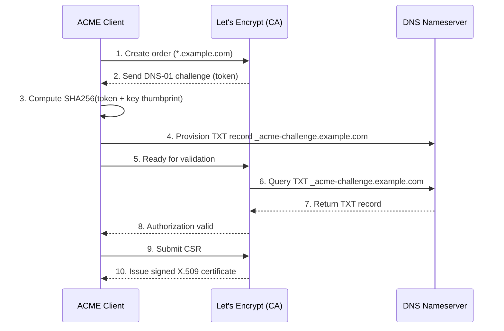

# ACME Protocol Internals: HTTP-01 vs DNS-01 Domain Validation

## The Problem: The Manual PKI Nightmare

Before Let's Encrypt launched in 2015, securing a website with TLS meant a slow, manual, and error-prone workflow: generate a private key and Certificate Signing Request (CSR) on the server, upload the CSR to a Certificate Authority's web portal, pay a fee, wait for a validation email, download the issued certificate, and hand-configure the web server. Because the process was so tedious, organizations bought certificates valid for three to five years to minimize how often they had to repeat it — and inevitably, the one engineer who understood the renewal process left the company, the certificate silently expired, and a very visible, very avoidable outage followed.

The **Automated Certificate Management Environment (ACME)** protocol, standardized as **RFC 8555**, eliminates the human from this loop entirely. An ACME client (like `certbot`) running on your infrastructure communicates with a CA via a JSON-over-HTTPS API, autonomously proving domain control and requesting certificates without a human ever touching a web portal.

## The ACME Lifecycle

Every ACME issuance follows the same four-step lifecycle:

1. **Account creation** — the client generates an account key pair and registers it with the CA.
2. **Order creation** — the client submits an order for a certificate covering one or more identifiers (e.g., `example.com`, `*.example.com`).
3. **Challenge execution** — the CA responds with a set of authorizations, each listing one or more challenges the client can complete to prove control of that identifier. The client only needs to satisfy *one* challenge type per identifier.
4. **CSR submission and issuance** — once all required authorizations are validated, the client submits a CSR signed with a fresh certificate key, and the CA returns the signed X.509 certificate.

The core engineering question at step 3 is: **which challenge type should the client use?** The two dominant options — HTTP-01 and DNS-01 — make fundamentally different trade-offs.

## HTTP-01: Prove Control by Serving a File

The HTTP-01 challenge asks the client to make a specific file available over plain HTTP.

1. The CA issues a random `token`.
2. The client computes a **key authorization**: `token.account_key_thumbprint`, a SHA-256 thumbprint of the account's public key concatenated with the token.
3. The client places that string in a file at:
   `http://<domain>/.well-known/acme-challenge/<token>`
4. The client tells the CA it's ready. The CA makes an outbound HTTP GET to that exact URL from its own infrastructure. If the response body matches the expected key authorization, the domain is validated.

**Strengths:** trivially easy to automate on any standard web server (Apache, Nginx) already listening on port 80.

**Hard limitations:**
- The web server **must be reachable on port 80 from the public internet** at the moment of validation — this fails for anything behind a corporate firewall, a private VPC with no public ingress, or a server that only serves internal traffic.
- It **cannot issue wildcard certificates** (`*.example.com`). The CA's HTTP-01 validator can only prove control of the *specific* hostname it connects to; a wildcard covers infinitely many possible subdomains, none of which the validator can enumerate and check individually.

## DNS-01: Prove Control by Publishing a DNS Record

When the server is firewalled, or a wildcard certificate is required, HTTP-01 is a dead end. DNS-01 proves control over the domain's DNS infrastructure instead of its web server.

1. The CA issues a random `token`.
2. The client computes the same key authorization string as HTTP-01, then hashes it with SHA-256 and base64-encodes the digest.
3. The client calls its DNS provider's API (Route 53, Cloudflare, etc.) to publish a TXT record:
   `_acme-challenge.example.com. IN TXT "<base64-sha256-digest>"`
4. The client tells the CA it's ready. The CA performs a DNS lookup for that TXT record. If the value matches, the domain is validated.

**Why this solves both HTTP-01 limitations:** the CA never needs to reach your web server at all — only your DNS zone, which is public by definition. And because the same `_acme-challenge` TXT record mechanism works identically whether you're proving `example.com` or `*.example.com` (wildcards are validated via the base domain's TXT record, not a per-subdomain check), DNS-01 is the *only* supported challenge type for wildcard issuance.

**The trade-off:** DNS-01 requires programmatic API access to your DNS provider, which is a meaningfully larger blast radius if that API credential leaks — anyone who can write TXT records for your zone can obtain a valid certificate for your domain from any public CA.

## Issuance and the Forced Renewal Cadence

Once a challenge is validated, the client generates a fresh key pair for the *certificate itself* (distinct from the account key), builds a CSR, and submits it. The CA signs the CSR and returns the X.509 certificate.

Because the entire workflow is automatable end to end, Let's Encrypt enforces a deliberately short **90-day expiration** on every certificate it issues. This is a design choice, not an oversight: a short lifetime forces every consumer of the CA to build real renewal automation (systemd timers or cron running at roughly the 60-day mark) rather than treating certificate expiry as a once-a-year fire drill — see *Automating TLS Certificate Renewal: Certbot, Systemd Timers, and Deploy Hooks* for the operational side of that automation.

## Choosing a Challenge Type in Practice

| Scenario | Use |
|---|---|
| Standard public web server, single hostname or SAN list, port 80 reachable | HTTP-01 |
| Wildcard certificate (`*.example.com`) | DNS-01 (required) |
| Server behind a firewall / no public port 80 | DNS-01 |
| Internal service with a public DNS zone but no public HTTP endpoint | DNS-01 |

## Key Takeaways

- ACME (RFC 8555) automates the CA's core job — proving domain control — via a JSON-over-HTTPS API, removing the human bottleneck that made pre-2015 certificate renewal so failure-prone.
- HTTP-01 is the simplest challenge but requires public port 80 reachability and cannot issue wildcard certificates.
- DNS-01 proves control via a TXT record instead of an HTTP response, working through firewalls and enabling wildcard issuance — at the cost of requiring DNS API credentials with write access to your zone.
- Let's Encrypt's 90-day certificate lifetime is an intentional forcing function for automation, not an arbitrary limitation.
