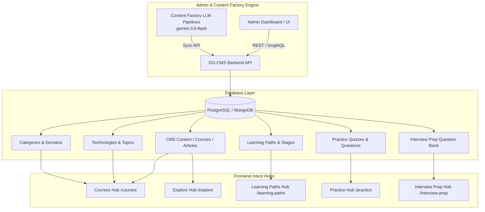

# GeekGully Content Catalog & Backend Integration Blueprint

> **Purpose**: This document provides a complete content specification and catalog of all learning items, structure, and taxonomy introduced across the GeekGully platform. You can use this blueprint to author content manually in **GG-CMS Admin**, or automatically generate and publish full courses, articles, quizzes, and interview sets using **Content Factory** (`gemini-3.6-flash`).

---

## 1. System Integration & Publishing Mapping

All data visible on the frontend platform is fully driven by backend database models and configurable via GG-CMS / Content Factory.



---

## 2. Taxonomy & Ecosystem Matrix

### A. Core Domains
| Domain Name | Slug | Icon | Subdomains / Key Focus Areas |
| :--- | :--- | :--- | :--- |
| **Cloud & DevOps** | `cloud-devops` | `Cloud` | Kubernetes, Cloud Native Architecture, CI/CD Pipelines, Infrastructure as Code |
| **System Design & Architecture** | `system-design` | `Server` | Microservices, High Scalability, Distributed Systems, Event-Driven Systems |
| **AI & Machine Learning** | `ai-ml` | `Cpu` | LLM Engineering, MLOps, Vector Databases, Prompt Engineering |
| **Backend Engineering** | `backend-engineering` | `Code` | Go, Rust, Java, High-Performance Microservices, Database Internals |
| **Cybersecurity** | `cybersecurity` | `Shield` | OWASP Security, Zero Trust, Cloud Security, Threat Modeling |

### B. Supported Technologies Engine
| Technology | Slug | Category | Key Topics |
| :--- | :--- | :--- | :--- |
| **Go (Golang)** | `golang` | `language` | Goroutines, Channels, Memory Management, Microservices |
| **Kubernetes** | `kubernetes` | `devops` | Pods, Deployments, Operators, Service Mesh, Ingress |
| **PostgreSQL** | `postgresql` | `database` | Indexing, Query Optimization, Connection Pooling, Replication |
| **Docker** | `docker` | `tool` | Containerization, Multi-stage Builds, Security, Docker Compose |
| **AWS** | `aws` | `cloud` | IAM, EKS, Serverless (Lambda), VPC Networking |
| **Kafka** | `kafka` | `framework` | Event Streaming, Partitions, Consumer Groups, Schema Registry |
| **Redis** | `redis` | `database` | Caching Strategies, Data Structures, Pub/Sub, Redis Cluster |
| **Terraform** | `terraform` | `tool` | State Management, Modules, Provider Ecosystem, Infrastructure Specs |

---

## 3. Courses Catalog Blueprint

### Course 1: Advanced Go Microservices Architecture
- **Slug**: `advanced-golang-microservices`
- **Category / Domain**: `backend-engineering`
- **Level**: `advanced` | **Duration**: 14 Hours
- **Prerequisites**: Basic Go syntax, HTTP protocol fundamentals
- **Target Technologies**: `golang`, `docker`, `kubernetes`, `postgresql`
- **Summary**: Build production-ready microservices using idiomatic Go, gRPC, PostgreSQL, and Clean Architecture patterns.
- **Module Breakdown**:
  1. *Clean Architecture & Domain Driven Design in Go*
  2. *High Performance gRPC & Protocol Buffers*
  3. *Database Connection Pooling & Migration Strategies (GORM/pgx)*
  4. *Distributed Tracing with OpenTelemetry & Jaeger*
  5. *Docker Containerization & Kubernetes Deployment Specs*

### Course 2: Kubernetes In Production: Zero to Hero
- **Slug**: `kubernetes-in-production`
- **Category / Domain**: `cloud-devops`
- **Level**: `intermediate` | **Duration**: 18 Hours
- **Prerequisites**: Linux CLI basics, Docker basics
- **Target Technologies**: `kubernetes`, `docker`, `aws`, `terraform`
- **Summary**: Comprehensive deep-dive into Kubernetes cluster orchestration, ingress controllers, ArgoCD gitops, and monitoring with Prometheus/Grafana.
- **Module Breakdown**:
  1. *Kubernetes Architecture: Control Plane vs Worker Nodes*
  2. *Workload Management: StatefulSets, DaemonSets, and CronJobs*
  3. *Cluster Networking, CNI, and Ingress NGINX*
  4. *GitOps Continuous Delivery with ArgoCD*
  5. *Production Hardening, RBAC, and Secret Management*

### Course 3: Master System Design & High Scalability
- **Slug**: `master-system-design-scalability`
- **Category / Domain**: `system-design`
- **Level**: `advanced` | **Duration**: 22 Hours
- **Prerequisites**: Distributed systems basics, Database knowledge
- **Target Technologies**: `kafka`, `redis`, `postgresql`, `aws`
- **Summary**: Master architectural trade-offs, caching topologies, message queues, database sharding, and consensus algorithms for modern enterprise systems.
- **Module Breakdown**:
  1. *Vertical Scaling vs Horizontal Sharding*
  2. *Caching Topologies (Write-Through, Cache-Aside, Write-Back)*
  3. *Asynchronous Messaging with Apache Kafka*
  4. *Designing Rate Limiters and Web Crawlers*
  5. *CAP Theorem, PACELC, and Distributed Consensus (Raft/Paxos)*

---

## 4. Learning Paths Catalog Blueprint

### Path 1: Cloud & DevOps Engineer Specialist
- **Slug**: `cloud-devops-engineer`
- **Target Role**: `devops-engineer` | **Level**: `beginner-to-advanced`
- **Estimated Hours**: 45 Hours | **Total Stages**: 4
- **Skills Acquired**: Docker, Kubernetes, CI/CD Pipelines, Terraform, AWS Security, Prometheus
- **Stage Progression**:
  - **Stage 1: Containerization Fundamentals**
    - *Topics*: Docker architecture, Dockerfile optimization, multi-stage builds.
    - *Resources*: Docker Crash Course (Course), Multi-stage Docker Labs (Lab), Docker Cheat Sheet.
  - **Stage 2: Infrastructure as Code (IaC)**
    - *Topics*: Terraform HCL, state locking, module creation, AWS VPC automation.
    - *Resources*: Terraform AWS Deep Dive (Guide), IaC Practice Quiz (Quiz).
  - **Stage 3: Kubernetes Operations**
    - *Topics*: Cluster administration, ConfigMaps, Secrets, Ingress, Helm Charts.
    - *Resources*: Kubernetes In Production (Course), K8s Troubleshooting Cheat Sheet.
  - **Stage 4: CI/CD & Observability**
    - *Topics*: GitHub Actions, ArgoCD, Prometheus metrics, Grafana dashboards.
    - *Resources*: Production CI/CD Pipeline Blueprint (Guide), DevOps Interview Questions Set.

### Path 2: Senior Backend Architect (Go & Distributed Systems)
- **Slug**: `senior-backend-architect`
- **Target Role**: `backend-engineer` | **Level**: `advanced`
- **Estimated Hours**: 60 Hours | **Total Stages**: 4
- **Skills Acquired**: Go Concurrency Patterns, Distributed Systems, Database Tuning, gRPC, Kafka
- **Stage Progression**:
  - **Stage 1: Idiomatic Go Masterclass**
    - *Topics*: Memory allocation, Garbage Collection, Sync package, Channels.
    - *Resources*: Advanced Go Microservices (Course), Go Memory Management (Deep Dive).
  - **Stage 2: Distributed Data Stores**
    - *Topics*: Postgres B-Tree vs LSM trees, Redis clustering, Kafka event streaming.
    - *Resources*: Postgres Query Tuning Guide (Guide), Kafka Partitioning Lab (Lab).
  - **Stage 3: High Scale Architecture**
    - *Topics*: Circuit breakers, Rate limiting algorithms, Distributed locking.
    - *Resources*: System Design Scalability (Course), System Design Interview Prep Set.
  - **Stage 4: Security & Compliance**
    - *Topics*: OAuth2, JWT Security, Mutual TLS (mTLS), OWASP Security Guidelines.
    - *Resources*: Security Hardening Guide (Guide), Backend Architect Capstone Project.

---

## 5. Explore Content Catalog (Articles, Cheat Sheets & Labs)

### A. Guides & Deep Dives
| Title | Slug | Type | Target Tech / Domain | Est. Time |
| :--- | :--- | :--- | :--- | :--- |
| **Go Memory Allocation & GC Deep Dive** | `golang-memory-allocation-gc` | `deep-dive` | `golang` / `backend-engineering` | 15 min |
| **Production Kubernetes Security Hardening** | `kubernetes-security-hardening-guide` | `guide` | `kubernetes` / `cloud-devops` | 20 min |
| **PostgreSQL Indexing & Query Tuning Blueprint** | `postgresql-indexing-query-tuning` | `guide` | `postgresql` / `backend-engineering` | 18 min |
| **Kafka Event Partitioning & Rebalance Strategies** | `kafka-partitioning-rebalance-strategies` | `deep-dive` | `kafka` / `system-design` | 25 min |

### B. Interactive Labs
| Title | Slug | Target Tech | Focus |
| :--- | :--- | :--- | :--- |
| **Hands-On: Build a Distributed Rate Limiter in Go** | `lab-distributed-rate-limiter-go` | `golang`, `redis` | Token Bucket & Leaky Bucket implementation |
| **Hands-On: Setting Up Prometheus & Grafana for K8s** | `lab-prometheus-grafana-k8s` | `kubernetes` | Metrics scraping, Alertmanager setup |
| **Hands-On: OWASP LLM Vulnerability Defense Setup** | `lab-owasp-llm-security-defense` | `ai-ml`, `cybersecurity` | Prompt Injection mitigation |

### C. Cheat Sheets
| Title | Slug | Target Tech | Key Quick Reference Items |
| :--- | :--- | :--- | :--- |
| **Kubernetes kubectl Commands Cheat Sheet** | `kubectl-commands-cheat-sheet` | `kubernetes` | Debugging, logs, pod exec, rollouts |
| **Go Concurrency & Sync Package Cheat Sheet** | `golang-concurrency-cheat-sheet` | `golang` | WaitGroup, Mutex, Channels, Context |
| **PostgreSQL Performance Optimization Cheat Sheet** | `postgresql-performance-cheat-sheet` | `postgresql` | EXPLAIN ANALYZE, Vacuum, Index types |

---

## 6. Practice Engine & Quiz Question Bank

### Quiz Set: Go Concurrency & Memory Management
- **Quiz Slug**: `quiz-golang-concurrency`
- **Topic**: `golang-concurrency` | **Difficulty**: `intermediate`

#### Question 1 (Multiple Choice)
- **Question**: What happens when writing to an unbuffered, non-nil Go channel without a corresponding receiver goroutine?
- **Code Snippet** (`go`):
  ```go
  ch := make(chan int)
  ch <- 42 // No receiver active
  ```
- **Options**:
  1. The code panics with `errChannelOverflow`
  2. The executing goroutine blocks indefinitely (causing a deadlock if all goroutines block)
  3. The value `42` is silently discarded
  4. The channel converts to a buffered channel automatically
- **Correct Option**: `2` (Index 1)
- **Explanation**: Unbuffered channels require synchronous handshake between sender and receiver. Writing to an unbuffered channel blocks until another goroutine executes a read operation on that channel.

#### Question 2 (Multiple Choice)
- **Question**: Which `sync` package primitive is best suited for guaranteeing a heavy setup function runs exactly once across multiple goroutines?
- **Options**:
  1. `sync.WaitGroup`
  2. `sync.Mutex`
  3. `sync.Once`
  4. `sync.Cond`
- **Correct Option**: `3` (Index 2)
- **Explanation**: `sync.Once` provides thread-safe execution of a function `Do(f)` ensuring `f` is called only once regardless of how many goroutines invoke it.

---

## 7. Interview Prep Question Bank Blueprint

### Question 1: System Design (Senior / Staff)
- **Slug**: `system-design-distributed-rate-limiter`
- **Role**: `backend-engineer` | `sre` | **Round**: `system-design`
- **Question**: *How would you design a distributed rate limiter that handles 100,000 requests per second across multi-region Kubernetes clusters?*
- **Hint**: Consider memory efficiency vs global accuracy, Redis Sliding Window log vs Token Bucket algorithm.
- **Answer Solution**:
  1. **Algorithm Selection**: Token Bucket or Sliding Window Counter. Token Bucket allows burst handling while enforcing maximum sustained rate.
  2. **Storage Layer**: Redis Cluster with local in-memory L1 caching (guava/ristretto) for high-frequency hits to reduce cross-datacenter latency.
  3. **Concurrency Control**: Use Redis Lua scripts (`EVALSHA`) to perform atomic key increment and timestamp checks in a single round trip.
  4. **Failure Strategy**: Fail-open mode with fallback local rate limiters if Redis becomes unreachable.
- **Common Mistakes**:
  - Relying on non-atomic Redis `GET` then `SET` calls (causes race conditions).
  - Failing to account for multi-region network latency (synchronous global locks destroy throughput).

### Question 2: Cloud & Kubernetes (Mid / Senior)
- **Slug**: `k8s-pod-eviction-troubleshooting`
- **Role**: `devops-engineer` | `cloud-engineer` | **Round**: `technical`
- **Question**: *What causes a Kubernetes Pod to enter the `OOMKilled` state, and how do you diagnose and fix it?*
- **Answer Solution**:
  1. **Root Cause**: The container exceeded its configured memory `limits` (not `requests`). The Linux kernel cgroup OOM Killer terminates the process.
  2. **Diagnosis**: Run `kubectl describe pod <pod-name>` and look at `Last State: Terminated` with `Reason: OOMKilled` and `Exit Code: 137`.
  3. **Resolution**: Inspect application memory profiling (e.g. pprof in Go, heap dumps in Java), fix memory leaks, or adjust memory `limits` with dynamic pod autoscaling (VPA).

---

## 8. Content Publishing via Content Factory & Admin API

### A. Publishing JSON Payload Example for GG-CMS API
```json
POST /api/v1/admin/cms
Header: Authorization: Bearer <ADMIN_JWT_TOKEN>

{
  "title": "Advanced Go Microservices Architecture",
  "slug": "advanced-golang-microservices",
  "type": "course",
  "domain_slug": "backend-engineering",
  "technology_slugs": ["golang", "docker", "kubernetes"],
  "difficulty": "advanced",
  "estimated_minutes": 840,
  "status": "published",
  "content_markdown": "# Advanced Go Microservices Architecture\n\nWelcome to this comprehensive course...",
  "metadata": {
    "prerequisites": ["Basic Go Syntax", "HTTP Protocol"],
    "modules_count": 5
  }
}
```

### B. Content Factory Automated Generation Prompt Template
To generate new complete courses or articles using Content Factory (`gemini-3.6-flash`), trigger the Content Factory pipeline with the following prompt configuration:

```yaml
target_model: gemini-3.6-flash
domain: cloud-devops
type: course
prompt: |
  Create a production-grade 5-module technical course for Kubernetes in Production.
  Include code examples, CLI commands, architecture diagrams in mermaid format, 
  and module quizzes with explanation solutions.
```

---

## 9. Next Steps for Content Authors

1. **Manual Entry**: Log in to GG-CMS Admin Panel (`/admin`) and navigate to **Content Management** -> **Create Content** to enter course or article details.
2. **Automated LLM Generation**: Execute Content Factory batch jobs (`content-factory/deploy-test.sh` / `content-factory/deploy-prod.sh`) to generate and sync full markdown content directly into the storage bucket `gs://ggcms-free-tier-vivek-content-factory-data`.
