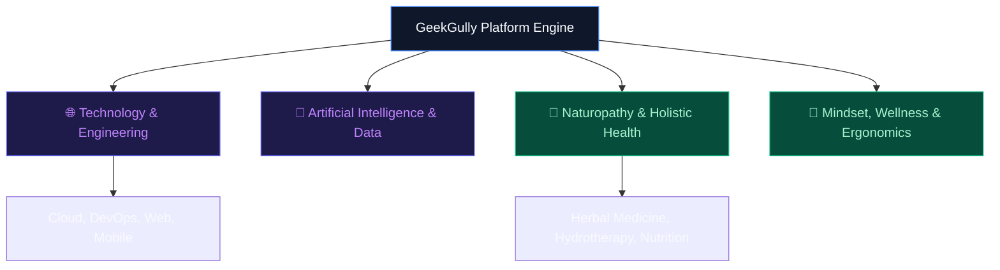

# GeekGully — Universal Taxonomy, Role Relations & Publishing Architecture

> **Document Type:** Architectural Review & Platform Taxonomy Blueprint  
> **Target Audience:** Product, Engineering & Content Teams  
> **Platform Intent:** Evolving GeekGully into a multi-domain learning & publishing ecosystem (Substack + Medium + Coursera hybrid).

---

## 1. Executive Summary & Vision

GeekGully is designed as an interactive, high-engagement platform for knowledge sharing, continuous learning, and digital publishing. While initially optimized for the tech and software space, the platform architecture must seamlessly expand into diverse domains such as **Naturopathy & Holistic Health**, **Business & Entrepreneurship**, **Design**, and **Personal Leadership**.

### Core Platform Goals
1. **Universal Taxonomy**: Support multi-domain growth without database schema changes or custom code rewrites.
2. **Substack + Medium Hybrid Model**: Support individual articles, structured courses, curated publications/newsletters, and community tagging.
3. **Role & Pathway Driven**: Connect content nodes into structured learning paths based on user roles and career/health objectives.
4. **Smart Cross-Recommendation Engine**: Recommend related content across intersecting domains (e.g., *API Security* ↔ *Cloud Infrastructure*, or *Naturopathy* ↔ *Stress Management for Tech Professionals*).

---

## 2. Multi-Domain Support: Will it work for Naturopathy and beyond?

**Yes, absolutely.** The proposed architecture relies on a **Universal N-Level Tree Taxonomy + Graph Tagging System**. 

Whether the content is about **Kubernetes Containers** or **Herbal & Botanical Medicine**, the underlying engine treats both as hierarchical nodes with relationships, prerequisites, and tags.



---

## 3. Master Domain & Category Taxonomy

Below is the preconfigured root pillar structure designed to accommodate Technology, Naturopathy, Business, and emerging fields.

| Root Pillar Domain | Level 2 Sub-Category | Level 3 Topics / Specializations |
| :--- | :--- | :--- |
| **1. Technology & Engineering** | **Web & Backend Development** | React, Next.js, Go, Python, APIs, Microservices |
| | **Cloud & DevOps** | AWS, GCP, Docker, Kubernetes, Terraform, CI/CD |
| | **Systems & Embedded** | Rust, C++, Embedded Systems, WebAssembly, IoT |
| **2. AI, ML & Data Science** | **Generative AI & LLMs** | Prompt Engineering, RAG Systems, LangChain, Fine-tuning |
| | **Machine Learning** | PyTorch, Deep Learning, Computer Vision, MLOps |
| | **Data Engineering** | Spark, Kafka, Databricks, PostgreSQL, Data Warehousing |
| **3. Cybersecurity & Privacy** | **Application Security** | OWASP, API Security, OAuth2/JWT, Cryptography |
| | **Cloud & Infrastructure Sec** | IAM, Zero Trust Architecture, Kubernetes Security |
| **4. Naturopathy & Holistic Health** | **Herbal & Botanical Medicine** | Phytotherapy, Plant Remedies, Herbal Formulations |
| | **Nutrition & Clinical Dietetics** | Whole Food Nutrition, Fasting Protocols, Gut Health |
| | **Natural Therapies** | Hydrotherapy, Mud Therapy, Fasting & Detoxification |
| | **Mind-Body Practices** | Yoga Therapy, Meditation, Breathwork, Sleep Hygiene |
| **5. Product, UX & Design** | **UI/UX Design** | Design Systems, Figma Workflows, Accessibility |
| | **Product Management** | Agile, User Research, Product Metrics, Product Growth |
| **6. Business, Startups & Leadership** | **Tech Economy & SaaS** | Bootstrapping, SaaS Metrics, Venture Capital, Marketing |
| | **Career & Workplace** | Engineering Management, Technical Writing, Remote Work |

---

## 4. Role-Based Learning Paths & Cross-Category Relations

Content in GeekGully is connected via **Learning Pathways** and **Cross-Domain Relations**.

### Example 1: Tech Role — Cloud DevOps & Platform Engineer
1. **Stage 1 (Foundation)**: Linux Administration & Networking Fundamentals
2. **Stage 2 (Development)**: Python/Go Scripting & Git Workflows
3. **Stage 3 (Cloud Core)**: AWS/GCP Infrastructure & Databases
4. **Stage 4 (Containers & CI/CD)**: Docker, Kubernetes & GitHub Actions
5. **Stage 5 (Advanced)**: Infrastructure Security & Chaos Engineering

### Example 2: Wellness Role — Naturopathic Wellness Practitioner
1. **Stage 1 (Foundation)**: Fundamentals of Human Anatomy & Natural Living Principles
2. **Stage 2 (Nutrition)**: Clinical Plant-Based Nutrition & Gut Microbiome
3. **Stage 3 (Therapies)**: Hydrotherapy, Detoxification & Botanical Preparations
4. **Stage 4 (Lifestyle Integration)**: Sleep Science, Stress Relief & Ergonomics for Knowledge Workers

### Cross-Domain Intersection Example
A publication titled **"The Tech Worker's Guide to Preventing Burnout & Digital Fatigue"** automatically links across:
- Primary Category: `Naturopathy & Health` $\rightarrow$ `Mind-Body Practices`
- Secondary Category: `Business & Leadership` $\rightarrow$ `Career & Workplace`
- Dynamic Tags: `#developer-health`, `#naturopathy`, `#burnout`, `#productivity`

---

## 5. Substack & Medium Publishing Model

To operate like Substack and Medium, GeekGully supports **4 Content Layer Types**:

```
 ┌──────────────────────────────────────────────────────────────────┐
 │                       PUBLICATION / NEWSLETTER                   │
 │                (e.g., "The Modern Architect Weekly")              │
 └────────────────────────────────┬─────────────────────────────────┘
                                  │
         ┌────────────────────────┴────────────────────────┐
         ▼                                                 ▼
┌─────────────────────────┐                       ┌─────────────────────────┐
│     SINGLE ARTICLES     │                       │    STRUCTURED COURSES   │
│   (Posts / Newsletters) │                       │  (Multi-Module Lessons) │
└────────────┬────────────┘                       └────────────┬────────────┘
             │                                                 │
             └────────────────────────┬────────────────────────┘
                                      ▼
                        ┌───────────────────────────┐
                        │   TAXONOMY & TAG GRAPH    │
                        │  (Category Tree + Tags)   │
                        └───────────────────────────┘
```

1. **Articles / Posts**: Individual long-form posts or newsletter issues.
2. **Courses / Path Modules**: Sequential learning units with completion tracking.
3. **Publications (Substack Model)**: Branded publications owned by creators or GeekGully editors.
4. **Dynamic Tags (Medium Model)**: Dynamic user/creator hashtags for trending topics.

---

## 6. Recommended Technical Implementation (Data Schema)

### PostgreSQL Schema Blueprint

```sql
-- 1. Self-Referencing Category Tree (Infinite Depth / Universal Taxonomy)
CREATE TABLE categories (
    id          UUID PRIMARY KEY DEFAULT gen_random_uuid(),
    name        VARCHAR(255) NOT NULL,
    slug        VARCHAR(255) UNIQUE NOT NULL,
    description TEXT,
    icon        VARCHAR(100),
    parent_id   UUID REFERENCES categories(id) ON DELETE SET NULL, -- Self reference
    created_at  TIMESTAMP WITH TIME ZONE DEFAULT CURRENT_TIMESTAMP
);

-- 2. Publications / Substack-Style Newsletters
CREATE TABLE publications (
    id          UUID PRIMARY KEY DEFAULT gen_random_uuid(),
    name        VARCHAR(255) NOT NULL,
    slug        VARCHAR(255) UNIQUE NOT NULL,
    description TEXT,
    owner_id    UUID NOT NULL REFERENCES users(id),
    cover_image VARCHAR(512),
    created_at  TIMESTAMP WITH TIME ZONE DEFAULT CURRENT_TIMESTAMP
);

-- 3. Content Items (Articles & Courses)
CREATE TABLE content_items (
    id             UUID PRIMARY KEY DEFAULT gen_random_uuid(),
    title          VARCHAR(255) NOT NULL,
    slug           VARCHAR(255) UNIQUE NOT NULL,
    type           VARCHAR(50) NOT NULL, -- 'article', 'course', 'newsletter_issue'
    content        TEXT NOT NULL,
    publication_id UUID REFERENCES publications(id) ON DELETE SET NULL,
    author_id      UUID NOT NULL REFERENCES users(id),
    status         VARCHAR(50) DEFAULT 'draft',
    published_at   TIMESTAMP WITH TIME ZONE
);

-- 4. Multi-Category Junction Table (Enables Poly-Hierarchy)
CREATE TABLE content_categories (
    content_id  UUID NOT NULL REFERENCES content_items(id) ON DELETE CASCADE,
    category_id UUID NOT NULL REFERENCES categories(id) ON DELETE CASCADE,
    is_primary  BOOLEAN DEFAULT FALSE,
    PRIMARY KEY (content_id, category_id)
);

-- 5. Tag Graph (Dynamic Medium-Style Tags)
CREATE TABLE tags (
    id   UUID PRIMARY KEY DEFAULT gen_random_uuid(),
    name VARCHAR(100) UNIQUE NOT NULL,
    slug VARCHAR(100) UNIQUE NOT NULL
);

CREATE TABLE content_tags (
    content_id UUID NOT NULL REFERENCES content_items(id) ON DELETE CASCADE,
    tag_id     UUID NOT NULL REFERENCES tags(id) ON DELETE CASCADE,
    PRIMARY KEY (content_id, tag_id)
);
```

---

## 7. Next Steps & Implementation Roadmap

1. **Phase 1 (Database Migration)**: Update backend schema to support self-referencing `parent_id` categories and many-to-many junction tables.
2. **Phase 2 (Preconfigure Categories)**: Seed default root categories (`Technology`, `AI & Data`, `Naturopathy & Health`, `Business & Startups`).
3. **Phase 3 (Recommendation Engine)**: Implement cross-category recommendation queries based on shared categories and tags.
4. **Phase 4 (Substack / Medium Features)**: Launch custom Publications, Newsletter Subscriptions, and Author Profiles.
