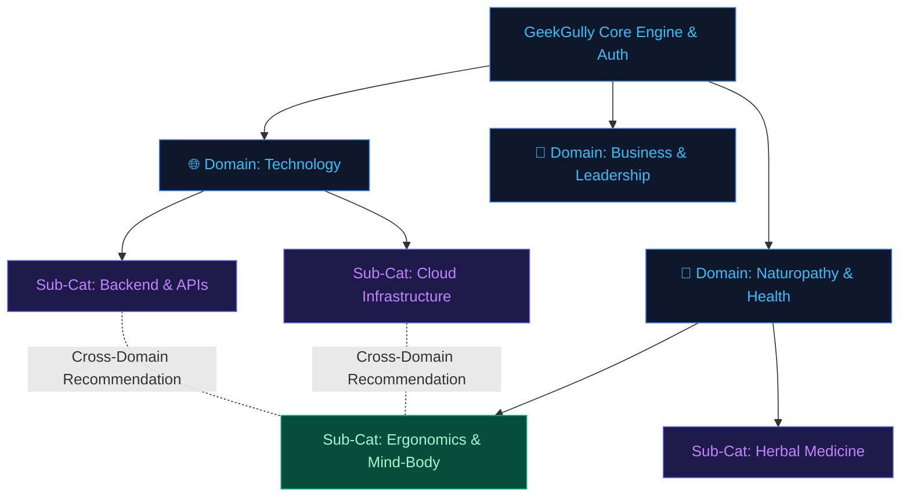

# GeekGully — Dedicated Domain Hubs, Universal Taxonomy & Publishing Architecture

> **⚠️ ARCHIVED / SUPERSEDED (2026-09-09):** This document predates and conflicts with the current governing architecture in `docs/TAXONOMY_ARCHITECTURE_DECISION.md` and `docs/GG_CMS_AI_NATIVE_PLATFORM_CONSOLIDATED_REVIEW.md` — most notably its UUID-based schema (vs. the actual `SERIAL`/`uint` schema in gg-cms), its "Naturopathy & Health"/"Business & Leadership" domain examples (vs. the tech-focused domain seed derived from actual shipped topics), and its `subcategory_relations` cross-domain mechanism (superseded by the topics/topic_relationships knowledge-graph approach). It has **not** been reconciled against the current direction — kept here for reference only (e.g., the general "dedicated domain hubs" and "Substack-style publications" ideas may still be worth revisiting), not as an active plan. Do not implement from this document without first checking it against the current governing docs.

> **Document Type:** Architectural Blueprint & Platform Review Document (ARCHIVED)  
> **Target Audience:** Product, Engineering & Content Strategy Teams  
> **Platform Vision:** A multi-domain learning & digital publishing platform (Substack + Medium + Coursera hybrid) supporting dedicated domain verticals (**Technology**, **Naturopathy & Health**, **Business**, **Design**, etc.) powered by a single core engine.

---

## 1. Executive Summary & Core Platform Vision

GeekGully is designed as an interactive, high-engagement knowledge sharing and digital publishing ecosystem. 

Rather than mixing all categories into a single monolithic list, GeekGully organizes content into **Dedicated Domain Hubs** (e.g., `geekgully.com/tech`, `geekgully.com/naturopathy`). Each Domain Hub maintains its own clean sub-category hierarchy, while a **Cross-Domain Relationship Engine** connects intersecting topics behind the scenes.



---

## 2. Key Architecture Pillars

### Pillar A: Dedicated Domain Verticals
- Each Domain (e.g., `Technology`, `Naturopathy`, `Business`) acts as a dedicated vertical hub with its own landing page, navigation menu, and curated sub-categories.
- Users exploring `Technology` see pure tech sub-categories without clutter from unrelated domains.

### Pillar B: Cross-Domain Relationship Graph
- Sub-categories in one domain can declare **Cross-Domain Relations** with sub-categories in another domain.
- *Example*: A DevOps Cloud article can recommend a Naturopathy article on *"Ergonomics & Postural Relief for High-Stress Tech Engineers"*.

### Pillar C: Substack + Medium Publishing Model
- **Articles & Newsletter Posts**: Individual long-form posts or subscriber email issues.
- **Structured Courses**: Sequential learning modules with milestone tracking.
- **Publications (Substack Model)**: Branded publications owned by creators or GeekGully editors (e.g., *"The Modern Naturopath"* or *"The Cloud Architect"*).
- **Dynamic Tags (Medium Model)**: Hashtags (`#kubernetes`, `#herbal-medicine`, `#jwt`, `#burnout`) for trending discovery.

---

## 3. Preconfigured Domain & Sub-Category Tree

| Domain Hub | Sub-Category | Specialization / Topic Nodes |
| :--- | :--- | :--- |
| **🌐 Technology** | **Web & Backend Engineering** | React, Next.js, Go, Python, APIs, Microservices, API Security |
| | **Cloud & DevOps Infrastructure** | AWS, GCP, Docker, Kubernetes, Terraform, CI/CD, Cloud Security |
| | **Systems & Embedded** | Rust, C++, Embedded Systems, WebAssembly, IoT |
| **🤖 AI & Data Science** | **Generative AI & LLMs** | Prompt Engineering, RAG Systems, LangChain, Fine-tuning |
| | **Machine Learning & MLOps** | PyTorch, Computer Vision, Model Serving, Feature Stores |
| | **Data Engineering** | Apache Spark, Kafka, Databricks, PostgreSQL, Data Warehousing |
| **🌿 Naturopathy & Health** | **Herbal & Botanical Medicine** | Phytotherapy, Plant Remedies, Herbal Formulations |
| | **Nutrition & Clinical Dietetics** | Whole Food Nutrition, Fasting Protocols, Microbiome |
| | **Natural Therapies** | Hydrotherapy, Mud Therapy, Detoxification Protocols |
| | **Mind-Body & Ergonomics** | Yoga Therapy, Meditation, Stress Management, Workstation Ergonomics |
| **💼 Business & Leadership** | **Tech Economy & SaaS** | Bootstrapping, SaaS Metrics, Venture Capital, Marketing |
| | **Career & Management** | Engineering Leadership, Technical Writing, Remote Culture |

---

## 4. Role-Based Learning Paths Across Domains

Content in GeekGully is connected via **Stage-by-Stage Pathways**.

### Tech Path: Cloud DevOps & Platform Engineer
1. **Stage 1 (Foundation)**: Linux Administration & Networking
2. **Stage 2 (Development)**: Python/Go Scripting & Git
3. **Stage 3 (Cloud Core)**: AWS/GCP Infrastructure & Databases
4. **Stage 4 (Containers & CI/CD)**: Docker, Kubernetes & GitHub Actions
5. **Stage 5 (Advanced)**: Zero Trust Security & Chaos Engineering

### Wellness Path: Certified Naturopathic Practitioner
1. **Stage 1 (Foundation)**: Human Physiology & Principles of Natural Healing
2. **Stage 2 (Nutrition)**: Plant-Based Clinical Nutrition & Gut Health
3. **Stage 3 (Natural Therapies)**: Hydrotherapy, Detox & Botanical Formulations
4. **Stage 4 (Lifestyle Integration)**: Sleep Hygiene, Stress Relief & Ergonomics

---

## 5. Technical Implementation (PostgreSQL Database Schema)

```sql
-- 1. Top-Level Domains (Tech, Naturopathy, Business, etc.)
CREATE TABLE domains (
    id          UUID PRIMARY KEY DEFAULT gen_random_uuid(),
    name        VARCHAR(100) NOT NULL,
    slug        VARCHAR(100) UNIQUE NOT NULL,
    description TEXT,
    icon        VARCHAR(100),
    created_at  TIMESTAMP WITH TIME ZONE DEFAULT CURRENT_TIMESTAMP
);

-- 2. Sub-Categories (Linked to a primary Domain with Tree Support)
CREATE TABLE subcategories (
    id          UUID PRIMARY KEY DEFAULT gen_random_uuid(),
    domain_id   UUID NOT NULL REFERENCES domains(id) ON DELETE CASCADE,
    name        VARCHAR(255) NOT NULL,
    slug        VARCHAR(255) NOT NULL,
    description TEXT,
    parent_id   UUID REFERENCES subcategories(id) ON DELETE SET NULL, -- Self-referencing tree
    created_at  TIMESTAMP WITH TIME ZONE DEFAULT CURRENT_TIMESTAMP,
    UNIQUE(domain_id, slug)
);

-- 3. Cross-Domain Sub-Category Relations (Links across domains)
CREATE TABLE subcategory_relations (
    source_subcategory_id UUID REFERENCES subcategories(id) ON DELETE CASCADE,
    target_subcategory_id UUID REFERENCES subcategories(id) ON DELETE CASCADE,
    relation_type         VARCHAR(50) DEFAULT 'cross_domain', -- 'cross_domain', 'prerequisite', 'related'
    PRIMARY KEY (source_subcategory_id, target_subcategory_id)
);

-- 4. Substack-Style Publications / Newsletters
CREATE TABLE publications (
    id          UUID PRIMARY KEY DEFAULT gen_random_uuid(),
    domain_id   UUID REFERENCES domains(id) ON DELETE SET NULL,
    name        VARCHAR(255) NOT NULL,
    slug        VARCHAR(255) UNIQUE NOT NULL,
    description TEXT,
    owner_id    UUID NOT NULL REFERENCES users(id),
    cover_image VARCHAR(512),
    created_at  TIMESTAMP WITH TIME ZONE DEFAULT CURRENT_TIMESTAMP
);

-- 5. Content Items (Articles & Courses)
CREATE TABLE content_items (
    id             UUID PRIMARY KEY DEFAULT gen_random_uuid(),
    title          VARCHAR(255) NOT NULL,
    slug           VARCHAR(255) UNIQUE NOT NULL,
    type           VARCHAR(50) NOT NULL, -- 'article', 'course', 'newsletter_issue'
    content        TEXT NOT NULL,
    publication_id UUID REFERENCES publications(id) ON DELETE SET NULL,
    author_id      UUID NOT NULL REFERENCES users(id),
    status         VARCHAR(50) DEFAULT 'draft',
    published_at   TIMESTAMP WITH TIME ZONE
);

-- 6. Content Sub-Category Associations
CREATE TABLE content_subcategories (
    content_id     UUID NOT NULL REFERENCES content_items(id) ON DELETE CASCADE,
    subcategory_id UUID NOT NULL REFERENCES subcategories(id) ON DELETE CASCADE,
    is_primary     BOOLEAN DEFAULT FALSE,
    PRIMARY KEY (content_id, subcategory_id)
);

-- 7. Dynamic Medium-Style Tags
CREATE TABLE tags (
    id   UUID PRIMARY KEY DEFAULT gen_random_uuid(),
    name VARCHAR(100) UNIQUE NOT NULL,
    slug VARCHAR(100) UNIQUE NOT NULL
);

CREATE TABLE content_tags (
    content_id UUID NOT NULL REFERENCES content_items(id) ON DELETE CASCADE,
    tag_id     UUID NOT NULL REFERENCES tags(id) ON DELETE CASCADE,
    PRIMARY KEY (content_id, tag_id)
);
```

---

## 6. Execution Roadmap

1. **Phase 1 (Domain Schema & Seed)**: Implement `domains`, `subcategories`, and `subcategory_relations` tables in Go/PostgreSQL.
2. **Phase 2 (Domain Hub Router)**: Support domain-filtered views (`/tech`, `/naturopathy`, `/business`).
3. **Phase 3 (Cross-Domain Engine)**: Power the recommendation algorithm to cross-recommend relevant articles across domains based on `subcategory_relations` and shared `tags`.
4. **Phase 4 (Publications & Subscriptions)**: Enable Substack-style custom publications and newsletter subscription management.
