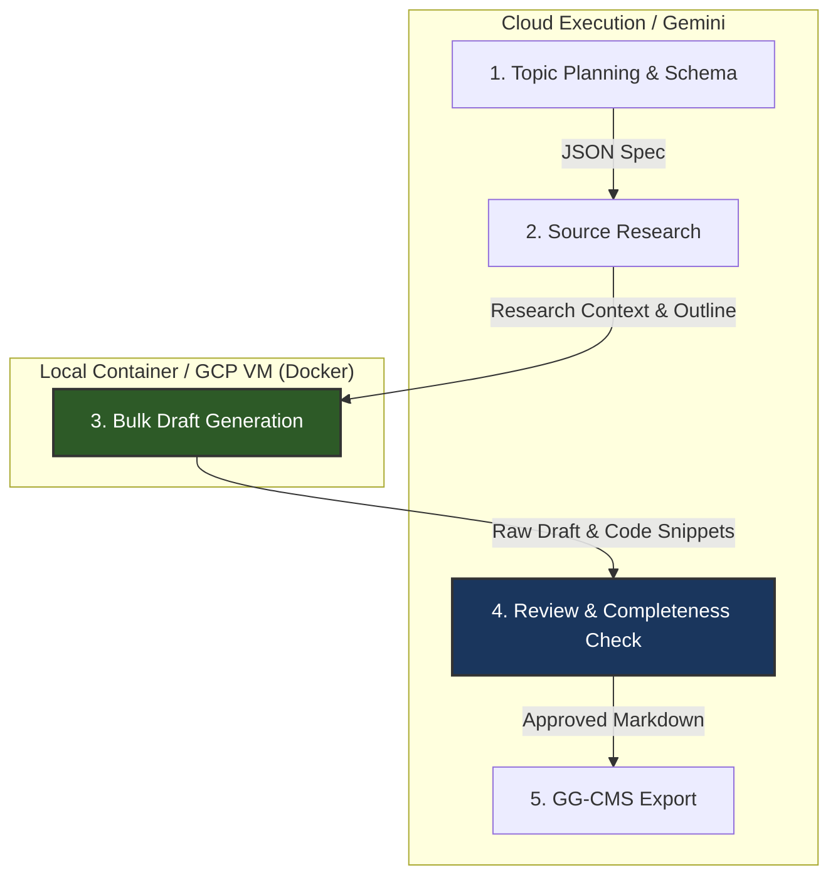

# Proposal: Hybrid Architecture for Autonomous Content Factory
## Low-Cost Local LLM Draft Generation with Gemini Quality Review

**Document Version:** 1.2.0  
**Date:** September 13, 2026  
**Status:** PROPOSED  
**Target Subsystem:** `content-factory`  

---

## 1. Executive Summary

As the **GG-CMS Content Factory** scales up to generate hundreds of technical topics, courses, lessons, and developer tutorials, **API token costs** for LLM generation scale linearly with volume. The initial drafting phase accounts for over **70%–80% of total token consumption**.

This proposal outlines a **Hybrid LLM Architecture**:
1. **Local / Container-Hosted Open-Weight LLM (Writer Role):** Generates bulk initial content drafts, code examples, and raw lesson material at **$0 API cost** using a specialized open-weight model (e.g., *Qwen 2.5 Coder 14B/32B* or *DeepSeek R1 Distill*) running via Docker (Ollama or vLLM).
2. **Cloud Frontier Model (Reviewer / Auditor Role):** Uses **Gemini 3.6 Flash** (or *Gemini 1.5 Pro*) as the auditor to review drafts for accuracy, completeness, structural integrity, and code correctness before finalizing.

**Key Outcome:** Reduces total LLM API costs by **80%–90%** while maintaining production-grade editorial and technical content quality.

---

## 2. Problem Statement & Cost Motivation

Currently, Content Factory relies on cloud LLMs across all four pipeline roles (`planner`, `researcher`, `writer`, `reviewer`). 

```
+-----------------------------------------------------------------------------------+
|  CURRENT MODEL (100% Cloud API)                                                  |
|  Planner (Gemini) -> Researcher (Gemini) -> Writer (Gemini) -> Reviewer (Gemini)  |
|  [High API Volume ($$$) for long prose & code drafting]                          |
+-----------------------------------------------------------------------------------+
                                        vs
+-----------------------------------------------------------------------------------+
|  PROPOSED HYBRID MODEL                                                            |
|  Planner (Gemini) -> Researcher (Gemini) -> Writer (Local Docker) -> Reviewer (Gemini)|
|  [Bulk drafting at $0 API cost, minimal cost for Reviewer & Planning]             |
+-----------------------------------------------------------------------------------+
```

### Cost Analysis per 100 Technical Articles (Avg. 2,500 words / ~4,000 tokens per article)
* **Draft Generation Input/Output Tokens:** ~500,000 input tokens + ~400,000 output tokens.
* **Pure Gemini 3.6 Flash / Pro Cost:** ~$1.50 – $15.00 per batch.
* **Hybrid (Local Writer + Gemini Reviewer):** ~$0.15 – $0.80 per batch (**~90% savings**).
* **At 1,000+ articles/month:** Financial savings scale into hundreds of dollars monthly with zero rate limits on drafting speed.

---

## 3. Proposed Hybrid Architecture

The content pipeline decouples **heavy prose generation** from **editorial reasoning and compliance checking**.



### Role & Responsibility Matrix

| Agent Role | Execution Target | Recommended Engine / Model | Responsibility |
| :--- | :--- | :--- | :--- |
| **`planner`** | Cloud (Gemini) | `gemini-3.6-flash` | Generates structured syllabus, topic taxonomy, and JSON schemas. |
| **`researcher`** | Cloud (Gemini) | `gemini-3.6-flash` | Performs web scraping, document parsing, and topic synthesis. |
| **`writer`** | **Local / Container LLM** | **`qwen2.5-coder:14b`** / **`32b`** | **Generates initial long-form prose, tutorials, and code blocks ($0 API cost).** |
| **`reviewer`** | Cloud (Gemini) | `gemini-3.6-flash` | **Audits draft for completeness, fixes formatting, checks edge cases, and polishes text.** |

---

## 4. Recommended Open-Weight Models for Technical Content

### Model Comparison Matrix

| Model | Size | Best For | Hardware Sizing | Recommended Quantization |
| :--- | :--- | :--- | :--- | :--- |
| **Qwen 2.5 Coder** | **14B** | Technical writing, developer tutorials, code samples | 16GB RAM / GPU VRAM (Apple M1/M2/M3 or NVIDIA RTX 3060+) | `Q4_K_M` or `Q8_0` |
| **Qwen 2.5 Coder** | **32B** | Complex software engineering docs, multi-file code examples | 32GB+ RAM / 24GB VRAM (NVIDIA RTX 3090/4090 or Mac M-Series) | `Q4_K_M` |
| **DeepSeek R1 Distill** | **14B / 32B** | Architectural reasoning, deep research summaries | 16GB–32GB RAM | `Q4_K_M` |
| **Llama 3.1 / 3.3** | **8B / 70B** | General Markdown writing, structured JSON outputs | 8GB (8B) or 48GB+ VRAM (70B) | `Q4_K_M` |
| **Codestral** | **22B** | Fast developer documentation & inline code generation | 24GB RAM / VRAM | `Q4_K_M` |

---

## 5. Dual Recommended Deployment Strategies

We explicitly recommend **two production-grade deployment strategies**, tailored to budget, scale, and performance needs:

### 🟢 **RECOMMENDATION 1: 100% Zero-Cost Local Setup ($0 / month)**
* **Target Environment:** Developer Laptop/Workstation (Mac Apple Silicon / Linux CPU) + Google AI Studio Free Tier API.
* **Writer Model:** `qwen2.5-coder:7b` or `14b` running via Docker + Ollama on local CPU/RAM.
* **Reviewer Model:** `gemini-3.6-flash` or `gemini-2.5-flash` using **Google AI Studio Free API Key** (up to 1,000,000 tokens/min and 1,500 free requests/day).
* **Application Hosting:** GCP Cloud Run Free Tier (2,000,000 requests/month free).
* **Total Cost:** **$0.00 / month**.
* **Best Used For:** Initial development, testing, and low-to-medium volume automated batch generation. Slowness on CPU is non-blocking because Content Factory runs tasks in asynchronous background workers.

#### Quick Container Launch Command (Local Docker / Ollama):
```bash
docker run -d \
  --name content-factory-local-llm \
  --restart always \
  -v ollama_storage:/root/.ollama \
  -p 11434:11434 \
  ollama/ollama:latest

# Pull 7B model
docker exec -it content-factory-local-llm ollama pull qwen2.5-coder:7b
```

---

### 🚀 **RECOMMENDATION 2: High-Performance On-Demand GCP GPU Batch Setup (~$1–$5 / month)**
* **Target Environment:** GCP Compute Engine (`g2-standard-4` with 1x NVIDIA L4 24GB GPU, or Spot VM instance) + Google AI Studio / Vertex AI Gemini.
* **Writer Model:** `qwen2.5-coder:32b` or `deepseek-r1-distill-qwen-32b` running via vLLM or Ollama container.
* **Reviewer Model:** `gemini-3.6-flash`.
* **Execution Workflow:** Automated batch script starts the GCP GPU VM -> processes 50–100 articles in 30 minutes at **~100 tokens/sec** -> automatically turns off the VM when batch queue drains!
* **Total Cost:** **~$1.00 – $5.00 / month** (paying only for the 1–2 hours per week the GPU VM is active).
* **Best Used For:** Enterprise scaling, generating hundreds of deep technical courses/lessons per batch with GPT-4o level drafting quality.

---

## 6. Integration API Keys, Free Tiers & Security Specs

Content Factory uses specialized API keys for web research, image generation, and LLM providers. All keys are managed via the System Settings UI.

### 6.1 Security & Key Masking Specification
To prevent key leaks:
* **Server-Side Masking ([system_settings_service.py](file:///Users/vivek/work/Serenyax/Product/Sandbox/ggcms/content-factory/backend/services/system_settings_service.py#L107-L114)):** Plaintext API key values (`gemini_api_key`, `tavily_api_key`, `pexels_api_key`) are **never returned to the frontend**. The GET API returns `value=""` and `is_set=true/false`.
* **UI Status Indicator:** The frontend displays a **"Configured"** status badge rather than exposing partial or full key strings.
* **Blank Input Safeguard:** Leaving secret key inputs blank on update submits an empty string, which the backend treats as *"keep existing value"*, preventing accidental erasure.

---

### 6.2 Tavily API Key (`tavily_api_key`) Specs
* **Free Tier Allowance:** **1,000 free web search queries / month** (no credit card required at [tavily.com](https://tavily.com)).
* **Purpose:** AI-native web search and RAG extraction for technical research.
* **Value Created:**
  1. **Anti-Hallucination:** Fetches real-time, modern library documentation (e.g. Go 1.22+, Next.js 15, Python 3.12).
  2. **Token Efficiency:** Pre-parses HTML into clean markdown snippets, saving up to **90% of prompt token costs** compared to raw web scraping.
  3. **Topic Discovery Verification:** Verifies market search trends before course generation ([opportunities.py](file:///Users/vivek/work/Serenyax/Product/Sandbox/ggcms/content-factory/backend/api/routers/opportunities.py)).

---

### 6.3 Pexels API Key (`pexels_api_key`) & Free Alternatives

#### **Is Pexels Free?**
**YES!** Pexels provides a **100% Free API** with **20,000 free requests per month** (200 requests/hour limit, no credit card required at `pexels.com/api`).

#### **Difference Between Tavily and Pexels:**
* **Tavily:** Search engine for **text research, documentation, and facts** (used by `researcher` agent).
* **Pexels:** Stock photo API for **visual course banners, header graphics, and lesson illustrations** (used by `image_service.py`).

#### **Free Alternatives for Images & Visual Media:**

| Provider | Type | Free Tier Limits | Key Advantages |
| :--- | :--- | :--- | :--- |
| **Pexels** *(Built-in)* | Stock Photos | **20,000 requests / month** | 100% free, high resolution, soft-fails gracefully if missing. |
| **Unsplash API** | Stock Photos | **5,000 requests / hour** (prod) | Superior editorial quality photos for software & technology headers. |
| **Pixabay API** | Photos & Vectors | **5,000 requests / hour** | Includes free vector illustrations and technical diagrams. |
| **Pollinations.ai** | AI Image Gen | **100% Unlimited Free** | Generates custom AI tech illustrations via direct URL string (no API key needed). |
| **Stable Diffusion (Docker)**| Local AI Gen | **Unlimited ($0)** | Fully self-hosted container image generation for custom technical diagrams. |

---

## 7. Deployment Strategy Comparison

| Metric | Recommendation 1 (100% Free Local) | Recommendation 2 (GCP On-Demand GPU) | 100% Cloud API (Status Quo) |
| :--- | :--- | :--- | :--- |
| **Model Quality** | High (`Qwen 7B/14B`) | **Highest (`Qwen 32B`)** | High (Cloud API) |
| **Drafting Cost** | **$0.00 / mo** | **~$1.00 – $5.00 / mo** | ~$75.00 – $150.00 / mo |
| **Reviewer Cost** | **$0.00** (Free API Tier) | ~$1.00 – $3.00 / mo | ~$15.00 / mo |
| **Total Monthly Bill** | **$0.00 / month** | **~$1.00 – $5.00 / month** | **~$90.00 – $165.00 / month** |
| **Execution Speed** | CPU Speed (~5-15 tok/sec) | **GPU Speed (~100 tok/sec)** | API Rate-Limited |
| **Web Research (Tavily)**| **$0.00** (1,000 free searches/mo) | **$0.00** (1,000 free searches/mo) | **$0.00** |
| **Images (Pexels)** | **$0.00** (20,000 free req/mo) | **$0.00** (20,000 free req/mo) | **$0.00** |

---

## 8. Content Factory Integration Code Changes

Content Factory's architecture encapsulates LLM model instantiation in `backend/services/model_provider.py` and settings in `backend/configs/settings.py`.

### 8.1 Configuration Updates ([backend/configs/settings.py](file:///Users/vivek/work/Serenyax/Product/Sandbox/ggcms/content-factory/backend/configs/settings.py))

```python
class Settings(BaseSettings):
    # Existing settings...
    llm_provider: str = Field(default="gemini", validation_alias="LLM_PROVIDER")
    
    # Local / Custom Provider Settings
    local_llm_base_url: str = Field(default="http://localhost:11434/v1", validation_alias="LOCAL_LLM_BASE_URL")
    local_llm_api_key: str = Field(default="ollama", validation_alias="LOCAL_LLM_API_KEY")
    local_model_writer: str = Field(default="qwen2.5-coder:14b", validation_alias="LOCAL_MODEL_WRITER")
```

### 8.2 Provider Switcher Update ([backend/services/model_provider.py](file:///Users/vivek/work/Serenyax/Product/Sandbox/ggcms/content-factory/backend/services/model_provider.py))

```python
from langchain_openai import ChatOpenAI

def _build_chat_model(model_name: str, temperature: float):
    # Route local models to local container via OpenAI compatible endpoint
    if model_name.startswith("local/") or model_name.startswith("ollama/"):
        target_model = model_name.split("/", 1)[1]
        return ChatOpenAI(
            model=target_model,
            api_key=settings.local_llm_api_key or "ollama",
            base_url=settings.local_llm_base_url,
            temperature=temperature,
            max_retries=2,
        )

    if settings.llm_provider == "claude":
        # Existing Claude logic...
        ...

    # Existing Gemini logic...
    ...
```

---

## 9. Phased Implementation Roadmap

1. **Phase 1 (Local Container Verification):**
   * Run Docker container with `ollama/ollama` and `qwen2.5-coder:7b` locally.
   * Verify HTTP completions endpoint at `http://localhost:11434/v1/chat/completions`.

2. **Phase 2 (Content Factory Provider Enhancement):**
   * Update `backend/configs/settings.py` and `backend/services/model_provider.py` to support `local/` model prefixes.
   * Add unit tests in Content Factory backend to verify provider switching.

3. **Phase 3 (E2E Generation & Review Test):**
   * Run an automated topic generation test using local Qwen for `writer` and Gemini 3.6 Flash for `reviewer`.
   * Verify output completeness and quality.

4. **Phase 4 (Deployment & System Settings Integration):**
   * Expose local/custom model selection in system settings UI and deploy container service for production environments.

---

### Document Sign-off & Next Steps
* [ ] Review proposal with engineering team.
* [ ] Select preferred deployment strategy (Recommendation 1 for $0 dev setup vs Recommendation 2 for GCP GPU batching).
* [ ] Execute Phase 1 & Phase 2 provider updates.
