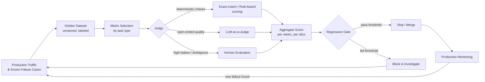

# AI Evaluation Explained: How Do You Know a Model Actually Works?

> "It works on my test prompts" is not evaluation. This article lays out the actual discipline — golden datasets, metrics that match the task, LLM-as-a-judge versus human review, and regression testing — that answers the question a demo never can: does this model actually work?

## The Problem: The Demo Lied to You

Picture a customer support team that just shipped an LLM-powered assistant to draft replies to incoming tickets. Before launch, an engineer typed fifteen realistic-looking questions into a chat window — "How do I reset my password?", "My order hasn't arrived", "Can I get a refund?" — and the model handled every one of them well. Confident, correct, well-formatted. The team shipped it.

Three weeks later, the assistant confidently tells a customer that a product ships internationally when it doesn't. It quotes a return policy that changed six months ago. It answers a billing question with the right tone and the wrong number. None of this shows up as a crash, an exception, or a 500 error. Every one of these responses is fluent, plausible, and wrong — and a system built for pass/fail testing has no idea anything went wrong at all.

This is not a story about a careless engineer. It's the default outcome of treating "I tried it and it seemed fine" as evaluation. It isn't. It's a demo. A demo tells you the model can succeed on the cases you thought to try. It tells you nothing about the cases you didn't think to try — which, in production, is most of them.

Traditional software has a bug-vs-no-bug model of correctness: a function either returns the right value or it doesn't, and a unit test either passes or fails. LLMs break that model. The same prompt can produce a slightly different answer on every call. "Correct" is often a matter of degree — partially right, right but poorly phrased, right but missing a caveat that matters. A test suite built for deterministic software has no vocabulary for any of that, which is exactly why teams that ship LLM features using only that vocabulary keep getting surprised in production.

## Why This Problem Is Difficult

Three things make LLM evaluation a genuinely different discipline from ordinary software testing, not just "testing but with a chatbot."

**1. Outputs are non-deterministic and open-ended.** A REST endpoint returning a wrong status code is unambiguous. An LLM generating a paragraph that is 90% correct, well-written, and confidently states one wrong fact is a much harder thing to score — there's no single "expected output" string to `assert equals` against. Two different phrasings of the same correct answer can both be right; two nearly identical phrasings can differ in one clause that makes one of them dangerously wrong.

**2. "Good" depends entirely on the task.** A summarization model needs to be judged on faithfulness to the source document. A SQL-generation model needs to be judged on whether the query actually runs and returns the right rows. A customer-support agent needs to be judged on task completion and tone. A classifier still benefits from precision, recall, and F1. There is no universal "AI quality score" — picking the wrong metric for the task tells you something, just not the thing you needed to know. (See "Evaluating ML Models: Precision, Recall, F1-Score, and ROC-AUC" for the classical classification metrics this article assumes as background where the task is genuinely a classification problem.)

**3. The failure surface is much larger than functional bugs.** A model can fail on correctness (wrong fact), faithfulness (fact not supported by the given context — see hallucination, below), safety (unsafe or biased output), robustness (falls apart on a slightly reworded prompt), and consistency (gives a different answer to the same question asked twice). A traditional test suite that only checks "did it crash" catches none of these.

## A Simple Mental Model

Think of evaluation the way a driving test works, not the way a single driving lesson works.

A driving lesson is one instructor, one car, one set of streets, on one day — useful, but it tells you almost nothing reliable about how the student will handle a new city, bad weather, or a car that cuts them off. A driving *test* is standardized: the same maneuvers, scored against the same rubric, for every candidate, repeated over time as roads and rules change. It doesn't guarantee the driver will never make a mistake. It gives you a calibrated, repeatable signal about whether they're safe to put on the road, and it gives you the same signal again next year when you need to check they still are.

"I tried some prompts" is the driving lesson. A golden dataset scored against fixed metrics, re-run on every change, is the driving test. The rest of this article is about building that test — and this analogy has a limit worth naming up front: unlike a human driver, a model can be evaluated thousands of times in parallel, cheaply, which is exactly what makes automated evaluation (LLM-as-a-judge, in particular) both attractive and dangerous — cheap signal is not the same as trustworthy signal, and the sections below spend real time on that gap.

## Before We Continue

This article assumes you're comfortable with the basics of how an LLM generates text (tokens, sampling, prompts) and that you've seen at least one production LLM system described end-to-end — both covered in "LLM Engineering Explained: From Prompting to Production Systems." It also assumes rough familiarity with classification metrics (precision, recall, F1) from classical ML, since generation-quality metrics borrow heavily from that vocabulary. If retrieval-augmented generation (RAG) is new to you, the companion article "Evaluating RAG/Agents: Automated Metrics using RAGAS and LLM-as-a-Judge" covers RAG-specific metrics (context precision, context recall, faithfulness) that this article treats as one instance of the broader discipline rather than repeating in full.

## The Core Idea: Evaluation Is a System, Not a Step

Evaluation is not something you do once, right before launch, and then forget. It's an ongoing system with four parts that all have to exist together, or the whole thing quietly stops working:

1. **A golden dataset** — a fixed, representative, versioned set of inputs (and, where possible, expected outputs or grading criteria) that stands in for real production traffic.
2. **Metrics matched to the task** — the right way to turn a model's output into a number (or a small set of numbers) that actually reflects quality for *this* task.
3. **A judge** — something that applies the metric to each output: a human, an LLM acting as a grader, or a deterministic check, depending on what the task allows.
4. **A regression harness** — a mechanism that re-runs the dataset through the metrics every time the model, prompt, or pipeline changes, and flags a drop.

Skip the dataset and your metrics have nothing representative to run against. Skip the right metric and you measure the wrong thing precisely. Skip the judge design and your numbers are noise dressed up as a score. Skip the regression harness and every one of the first three becomes a one-time report that goes stale the moment someone edits a prompt. The rest of this article builds each piece in that order.

## How It Actually Works: From Traffic to a Trustworthy Signal



Walk the loop once in words:

1. **Production traffic and known failures feed the dataset.** Real user queries, logged edge cases, and bug reports discovered in production all become candidates for inclusion — this is what keeps the dataset representative instead of a wish-list written by an engineer's imagination.
2. **The dataset is versioned like code.** It's checked in, reviewed, and changed deliberately — not a spreadsheet someone edits ad hoc.
3. **Metric selection is a deliberate step**, not a default. Different slices of the dataset may need different metrics (a factual-QA slice needs correctness; a tone-sensitive slice needs a different rubric).
4. **The judge varies by what the task allows.** Deterministic checks where possible (cheapest, most reliable), LLM-as-a-judge for open-ended quality at scale, human evaluation where stakes are high or the judge itself needs calibrating.
5. **Scores aggregate per metric and per slice** — an overall average can hide a metric that's collapsed on exactly the segment of traffic that matters most (more on this under "What Can Go Wrong").
6. **A regression gate compares the new run against a baseline** and blocks the change if quality drops past a threshold — this is what turns evaluation from a report into an enforcement point, the same structural idea used for the governance gate described in "AI Governance Explained."
7. **Production monitoring surfaces failures the dataset didn't anticipate**, and those failures flow back into the dataset — closing the loop.

## Let's Walk Through an Example

Take the support-ticket assistant from the opening scenario, after the team decides to actually evaluate it instead of demo it.

**Step 1 — build the golden dataset.** The team pulls 300 real historical tickets (with customer PII scrubbed), stratified across categories: password resets, shipping questions, refund requests, billing disputes, and a deliberately-included slice of ambiguous or adversarial tickets — a customer trying to get a refund outside policy by rephrasing the request three different ways. For each ticket, a support lead writes a short rubric of what a *correct* reply must contain (e.g., "must state the actual return window from the current policy doc; must not promise a refund the policy doesn't allow").

**Step 2 — pick metrics per slice.** For policy-fact tickets, the key metric is factual correctness against the current policy document — closer to a faithfulness check than free-form quality. For tone-sensitive tickets (an angry customer), a rubric-based quality score matters more than exact wording. For the adversarial slice, the metric is binary: did the assistant hold the line on policy or not.

**Step 3 — choose the judge per metric.** Factual correctness against a policy document is checked with a combination of a deterministic keyword/number check (did the reply cite the return window that's actually in the current policy doc?) backed up by an LLM-as-a-judge pass for cases the deterministic check can't resolve. Tone and helpfulness are scored by an LLM-as-a-judge with a fixed rubric. A random 10% sample of every batch is also reviewed by a human, specifically to catch cases where the LLM judge itself is wrong (see "LLM-as-a-Judge vs. Human Evaluation" below for why this sampling step is load-bearing, not optional).

**Step 4 — set a regression gate.** The team defines a baseline score for each slice from the currently deployed model. Any change to the prompt, the model, or the retrieval step must score at or above baseline (minus a small tolerance) on every slice, not just the overall average — because the whole point is to catch a regression hiding on one segment behind an improvement on another.

Run this dataset today and the wrong-international-shipping failure and the stale-refund-policy failure from the opening scenario both get caught before deployment, because they live in the dataset now — that's the entire difference between a demo and an evaluation system: the demo only exercises what someone thought to type.

## Under the Hood: Golden Datasets

### What makes a dataset "golden"

A golden dataset earns the name by being three things at once, and it's common to get one or two of these right while missing the third:

- **Representative** — its distribution of inputs should resemble real production traffic, not an engineer's mental model of "typical" usage. This usually means sampling from actual logs, not hand-writing every example from imagination.
- **Labeled with intent, not just an answer** — for open-ended tasks, a single "expected output" string is often too rigid (many correct phrasings exist). A rubric — the specific facts, constraints, or behaviors a correct answer must satisfy — travels better than one fixed reference answer, and is exactly what makes LLM-as-a-judge scoring workable in the first place.
- **Deliberately including edge cases and adversarial inputs** — ambiguous phrasing, contradictory requests, prompt-injection attempts if the system takes any external input, and known past failures. A dataset built only from "normal" traffic will never catch the failure mode that only shows up when a user does something unusual — which, at scale, happens constantly.

### Where the examples come from

In practice, teams build golden datasets from a mix of sources: sampled and anonymized production logs, deliberately hand-authored edge cases that stress specific requirements (policy boundaries, safety constraints), and — critically — every bug ever found in production, added back into the dataset as a permanent regression case the moment it's fixed. That last source is what prevents a team from fixing the same failure twice.

### Dataset size and the temptation to skip this

There's no universal magic number, and any specific figure should be treated as a rule of thumb rather than a standard — a narrow, high-stakes classification task can be usefully evaluated on a few dozen carefully chosen examples per category, while a broad, open-ended assistant needs several hundred to meaningfully cover its input space. The size that matters is the size that gives you dataset *coverage* of the failure modes you actually care about — a large dataset that's all near-duplicates of the same three query types is weaker than a smaller one that actually spans the input distribution.

> **Verification Note**
> Any specific numeric guidance on golden-dataset size (e.g., "N examples per category") is task- and risk-dependent and should be validated against your own production traffic distribution and, where applicable, your organization's model-risk or compliance requirements — treat published rules of thumb as starting points, not standards.

## Under the Hood: Metrics That Match the Task

Trying to compress every AI evaluation problem into one score is the single most common mistake teams make after they've already accepted that evaluation matters. The right metric depends on what kind of thing the model is producing.

**Classification-style tasks** (intent detection, content moderation flags, routing decisions) — these have a genuinely correct answer, so the classical metrics apply directly: precision, recall, F1, and ROC-AUC, exactly as covered in "Evaluating ML Models: Precision, Recall, F1-Score, and ROC-AUC." The same imbalanced-class trap applies: a moderation classifier that always says "safe" can post a deceptively high accuracy score on a dataset where 99% of content genuinely is safe.

**Generation-quality tasks** (summarization, drafting, open-ended Q&A) — no single ground-truth string exists, so evaluation leans on:
- **Faithfulness / groundedness** — is every claim in the output actually supported by the given source material, or did the model add something not present in it? This is the technical definition of *hallucination* used throughout this pillar: a fluent, confident output that is not supported by the provided context or verifiable fact, regardless of whether it happens to be true.
- **Relevance** — does the output actually address what was asked, rather than a plausible-sounding tangent?
- **Rubric-based scoring** — does the output satisfy a checklist of required elements (a specific fact, a required disclaimer, a tone constraint)? This is where the golden dataset's rubrics from the previous section get used directly.
- **Reference-based overlap metrics** (BLEU, ROUGE, and similar n-gram overlap scores) — useful as a cheap, deterministic proxy for translation and tightly-scoped summarization tasks, but a poor fit for open-ended generation, where a correct answer phrased differently from the reference gets penalized for the phrasing, not the content. Treat these as a coarse signal, not a verdict.

**Task-completion metrics** (agents, tool-using systems) — the question shifts from "was the text good" to "did the agent actually accomplish the goal": did it call the right tool with the right arguments, did the multi-step task terminate in a correct end state, how many steps or tool calls did it take versus an efficient path. RAG systems sit partway between generation-quality and task-completion metrics — retrieval-specific measures like context precision and context recall (covered in depth in "Evaluating RAG/Agents") are a specialization of the faithfulness/relevance ideas above, applied to whether the *retrieval* step, not just the generation step, did its job.

The practical rule: name the failure mode you're most afraid of for this specific feature, then pick the metric that would actually catch it. "Overall quality feels good" is not a metric; it's a feeling.

## Under the Hood: LLM-as-a-Judge vs. Human Evaluation

### Human evaluation

Human evaluation — domain experts or trained raters scoring outputs against a rubric — is the gold standard for judgment quality, especially on nuanced, high-stakes, or ambiguous cases. Its problems are structural, not incidental: it's slow, expensive, doesn't scale to thousands of examples on every code change, and it introduces its own inter-rater inconsistency (two people can reasonably disagree on a judgment call) that has to be measured and managed with a documented rubric and inter-rater agreement checks, not assumed away.

### LLM-as-a-judge

Using a strong LLM to grade another model's outputs against a rubric solves the scale and cost problem directly — a judge model can score thousands of outputs in the time a human panel scores dozens, and it can run automatically on every pull request. This is what makes an automated regression gate practical at all.

But a judge model is still a model, with its own failure modes that a team has to actively guard against:

- **Verbosity bias** — many judge setups have a documented tendency to rate longer, more elaborate answers as higher quality independent of correctness, so a judge prompt needs to explicitly instruct against rewarding length.
- **Position bias** — in pairwise comparisons ("which answer is better, A or B"), some judge configurations show a tendency to favor whichever answer appears first (or second) in the prompt; a common mitigation is running the comparison both ways and checking for agreement.
- **Self-preference** — a judge model can show a tendency to rate outputs from its own model family more favorably, which matters if you're using an LLM-as-a-judge to compare your own model against a competitor's.
- **The judge inherits the same weaknesses it's grading for** — a judge asked to check "is this faithful to the source" can itself hallucinate a judgment, which is exactly why judge output needs its own spot-check.

> **Verification Note**
> The specific magnitude and prevalence of verbosity bias, position bias, and self-preference bias vary by judge model, prompt design, and version, and shift over time as judge models improve — treat the existence of these biases as well-established and their exact size as something to measure against your own judge setup rather than assume from a fixed figure.

### The practical answer: neither alone

The pattern that actually works in production is layered, not either/or:

1. Use **deterministic checks** wherever the task allows one (did the SQL query execute, does the output match a required schema, is a banned phrase absent) — cheapest, no bias, run them first.
2. Use **LLM-as-a-judge** for open-ended quality at scale, with an explicit, written rubric (not "is this good?") and both-orders comparison where position bias is a risk.
3. Use **human evaluation** as the calibration layer, not the volume layer: a periodic sample (the 10% figure used in the walkthrough above is illustrative, not a rule) reviewed by humans specifically to check whether the LLM judge and the human rater agree. When they diverge, that's a signal to fix the judge's rubric — not to quietly trust whichever one gave the more convenient answer.

This layering is the same idea as defense in depth in security: no single layer is trusted completely, and each layer's blind spot is covered by a different one.

## Implementation: A Minimal Evaluation Harness

The following is a deliberately small, illustrative harness — not a production framework — that demonstrates the shape of the four-part system described above: a versioned dataset, per-item metric selection, a pluggable judge, and an aggregate pass/fail gate.

```python
"""
Minimal evaluation harness sketch.
Illustrates the shape of golden-dataset evaluation, not a production-ready library.
Assumes Python 3.10+ and an LLM client with a synchronous `.generate(prompt)` -> str method.
"""

from dataclasses import dataclass, field
from enum import Enum
from typing import Callable


class MetricType(str, Enum):
    EXACT_MATCH = "exact_match"       # deterministic check
    RUBRIC_LLM_JUDGE = "rubric_llm_judge"  # LLM-as-a-judge against a written rubric
    HUMAN_REVIEW = "human_review"     # placeholder: routed to a human queue


@dataclass
class GoldenExample:
    example_id: str
    input_prompt: str
    metric_type: MetricType
    # For EXACT_MATCH: the required substring/value.
    # For RUBRIC_LLM_JUDGE: the rubric text the judge model checks against.
    grading_criteria: str
    slice_tags: list[str] = field(default_factory=list)  # e.g. ["refund", "adversarial"]


@dataclass
class EvalResult:
    example_id: str
    passed: bool
    score: float
    judge_rationale: str = ""


def judge_with_llm(judge_client, model_output: str, rubric: str) -> tuple[bool, float, str]:
    """
    Ask a separate, stronger LLM to grade model_output against a written rubric.
    Returns (passed, score, rationale) so failures are debuggable, not just a number.
    """
    judge_prompt = f"""
    You are grading an AI system's response against a strict rubric.
    Do not reward length or confident tone by themselves — grade only against the rubric.

    RUBRIC (the response must satisfy this):
    {rubric}

    RESPONSE TO GRADE:
    {model_output}

    Respond with a score from 0.0 to 1.0 and a one-sentence rationale,
    in the form: SCORE: <float>\nRATIONALE: <text>
    """
    raw = judge_client.generate(judge_prompt)
    # Real implementations should use structured output (e.g. a Pydantic schema)
    # instead of parsing free text — shown minimally here for clarity.
    score_line = next(line for line in raw.splitlines() if line.startswith("SCORE:"))
    rationale_line = next(line for line in raw.splitlines() if line.startswith("RATIONALE:"))
    score = float(score_line.split(":", 1)[1].strip())
    rationale = rationale_line.split(":", 1)[1].strip()
    return score >= 0.8, score, rationale


def run_evaluation(
    model_client,
    judge_client,
    dataset: list[GoldenExample],
) -> list[EvalResult]:
    results: list[EvalResult] = []
    for example in dataset:
        output = model_client.generate(example.input_prompt)

        if example.metric_type == MetricType.EXACT_MATCH:
            passed = example.grading_criteria.strip() in output
            results.append(EvalResult(example.example_id, passed, 1.0 if passed else 0.0))

        elif example.metric_type == MetricType.RUBRIC_LLM_JUDGE:
            passed, score, rationale = judge_with_llm(judge_client, output, example.grading_criteria)
            results.append(EvalResult(example.example_id, passed, score, rationale))

        elif example.metric_type == MetricType.HUMAN_REVIEW:
            # In a real system this enqueues the (input, output) pair for a human rater
            # and the pipeline blocks or scores it once the rating lands.
            # Never default an unreviewed item to a passing score — that's a fail-open
            # gate, and it silently defeats the per-slice regression check below (see
            # "What Can Go Wrong"). Stubbed here as fails-closed / not-yet-resolved
            # until a real human rating replaces this placeholder.
            results.append(EvalResult(example.example_id, passed=False, score=0.0,
                                       judge_rationale="pending human review — fails closed until reviewed"))

    return results


def aggregate_by_slice(dataset: list[GoldenExample], results: list[EvalResult]) -> dict[str, float]:
    """
    Aggregate pass rate per slice tag — critical because an overall average
    can hide a regression that's concentrated in one slice (e.g. "adversarial").
    """
    slice_scores: dict[str, list[float]] = {}
    results_by_id = {r.example_id: r for r in results}

    for example in dataset:
        result = results_by_id[example.example_id]
        for tag in example.slice_tags or ["untagged"]:
            slice_scores.setdefault(tag, []).append(result.score)

    return {tag: sum(scores) / len(scores) for tag, scores in slice_scores.items()}


def regression_gate(current_scores: dict[str, float], baseline_scores: dict[str, float],
                     tolerance: float = 0.02) -> tuple[bool, list[str]]:
    """
    Fail the gate if ANY slice drops more than `tolerance` below its baseline —
    not just if the overall average drops. This is what catches a regression
    hiding behind an improvement elsewhere in the dataset.
    """
    failures = []
    for slice_tag, baseline in baseline_scores.items():
        current = current_scores.get(slice_tag, 0.0)
        if current < baseline - tolerance:
            failures.append(f"{slice_tag}: {current:.3f} < baseline {baseline:.3f} (tolerance {tolerance})")
    return (len(failures) == 0), failures
```

The two design choices worth calling out explicitly:

- **Per-slice aggregation, not a single overall number.** `aggregate_by_slice` and `regression_gate` deliberately refuse to collapse everything into one average. A model that improves on easy tickets while regressing on the adversarial slice would look like a net win on an overall average — and be a real, shippable failure.
- **The judge returns a rationale, not just a number.** `judge_with_llm` always returns why it scored the way it did. A bare 0.63 tells you nothing when a run fails; the rationale is what a human reviews when auditing the judge itself, which is the mechanism that lets you catch judge bias before it becomes silent policy.

Wiring `run_evaluation` and `regression_gate` into a CI/CD pipeline — so it runs automatically on every prompt or model change and blocks the merge on failure — is the subject of the next article in this series, "Building an LLM Evaluation Harness From Scratch," which extends this sketch into something closer to production shape (structured judge output, dataset versioning, historical trend tracking).

## What Can Go Wrong?

**The golden dataset goes stale.** Products change, policies change, user behavior shifts — a dataset frozen at launch slowly stops representing production traffic. A stale dataset gives you a confident, wrong "still passing" signal. Treat the dataset itself as something that needs periodic review and refresh from current traffic, not a one-time artifact.

**Overall averages hide slice-level collapse.** As shown in the implementation above, a model can improve on 90% of a dataset while completely failing the 10% that matters most (the adversarial or high-stakes slice) and still show a higher average score. Always look at per-slice numbers, not just the headline metric.

**The judge is never itself evaluated.** Teams that stand up LLM-as-a-judge and never check its agreement against human raters are trusting an unvalidated instrument. If the judge silently drifts (a judge-model version upgrade changes its grading behavior) nobody notices until a customer does.

**Metric gaming.** Once a metric becomes a target, it stops being a perfect measure of the underlying thing (a well-known dynamic sometimes called Goodhart's Law). A model fine-tuned or prompted specifically to score well on your rubric can learn the rubric's shape rather than genuinely improving — which is exactly why real production failures discovered later need to keep flowing back into the dataset as fresh, previously-unseen cases.

**Evaluation as a one-time launch gate instead of a continuous loop.** The single most common structural failure: a team builds a solid evaluation suite before launch, ships, and never re-runs it as a required gate on subsequent changes. Six months later a prompt tweak or a model version bump silently regresses something the original suite would have caught — if it had still been running.

## Security Considerations

Evaluation infrastructure is not a neutral, side-channel concern — it touches several real trust boundaries:

- **The golden dataset itself is a sensitive asset.** If it's built from real production traffic (as it should be), it likely contains PII or other sensitive data that needs the same access controls, scrubbing, and handling discipline as any other production data export.
- **A model that knows it's being evaluated can behave differently than it does in production** — this is a genuine and actively studied concern for advanced models, sometimes discussed under evaluation awareness or gaming. Rotating held-out examples that were never in any public or training-adjacent dataset, and treating evaluation results as one signal rather than a guarantee, both help.
- **LLM-as-a-judge introduces a second model into your trust boundary.** If the judge model itself is served by a third party, its outputs (and, in agentic evaluation setups, any tool calls it makes while grading) deserve the same scrutiny you'd give any other external LLM call — including the prompt-injection risk if graded content can influence the judge's own instructions.
- **A gate that can never fail is a gate that provides no security value.** If your regression gate has never once blocked a merge, that's a signal to interrogate the gate's thresholds and dataset coverage, not evidence that every change so far has been safe — the same principle covered in "AI Governance Explained" for approval gates generally.

## Common Misconceptions

**Misconception:** A high overall accuracy or quality score means the model is ready for production.
**Reality:** An aggregate score can hide a complete failure on the specific slice of traffic that matters most — the adversarial cases, the high-stakes category, the 5% of users who phrase things unusually. Always evaluate per slice, not just in aggregate.

**Misconception:** LLM-as-a-judge is basically as reliable as a careful human reviewer, so you can skip human evaluation once it's set up.
**Reality:** Judge models carry documented biases (verbosity, position, self-preference) and can hallucinate a judgment the same way any LLM can hallucinate an answer. Periodic human calibration isn't a nice-to-have — it's the check that tells you whether the judge itself is still trustworthy.

**Misconception:** Once you've built a golden dataset, you're done — it's a launch artifact.
**Reality:** A dataset that never grows stops representing your actual failure modes. Every production bug that gets fixed should become a permanent new entry, and the dataset needs periodic review against current traffic.

**Misconception:** BLEU/ROUGE-style overlap scores are a general-purpose way to measure "how good" generated text is.
**Reality:** These are reference-overlap metrics, strongest for translation and tightly-scoped summarization where phrasing is expected to closely track a reference. For open-ended generation, a correct answer phrased differently from the reference gets penalized for the phrasing rather than the substance — they measure similarity to a reference, not correctness.

## Real-World Architecture

In a mature setup, evaluation sits as its own stage in the ML/LLM delivery pipeline, not bolted onto the end of it: a prompt or model change triggers a pipeline run against the versioned golden dataset, deterministic checks run first (fastest, cheapest, catch the clearest failures), an LLM-as-a-judge pass scores the open-ended slices with structured output logged alongside its rationale, a small sampled subset routes to human reviewers for ongoing judge calibration, and per-slice scores compare against a stored baseline before the change is allowed to merge or deploy. Results — not just pass/fail, but the full per-example scores and rationales — feed into the same observability stack that traces prompts, tokens, and failures in production (see "Observability for LLM Applications"), so a regression caught in production can be traced back to exactly which evaluation slice should have caught it, and that gap gets closed by adding the case to the dataset.

## Expert Insight

The trade-off experienced teams navigate constantly is **evaluation cost versus evaluation coverage**, and it shows up as a very concrete engineering decision: how much of the dataset runs on every single pull request versus nightly versus only before a release.

The pattern that tends to work is tiering the evaluation suite itself, the same way test suites in traditional software separate fast unit tests from slow integration tests: a small, fast, mostly-deterministic subset runs on every change as a cheap smoke test; the full golden dataset with LLM-as-a-judge scoring runs nightly or on every merge to a release branch; and the human-calibration sample runs on a slower cadence (weekly or per-release) since its purpose is catching judge drift, not catching every individual regression. Skipping this tiering in either direction causes a predictable failure: an eval suite that's too heavy to run on every change gets skipped under deadline pressure (exactly the same bypass dynamic covered for governance gates); a suite that's too shallow lets real regressions through because it's optimized for speed over coverage.

A second, quieter practice: treat disagreement between the LLM judge and the sampled human raters as a metric in its own right, and track it over time. A judge that agrees with humans 95% of the time on launch day but drifts to 80% agreement two months later (because the judge model was silently upgraded, or because production traffic shifted into territory the judge's rubric never anticipated) is a leading indicator that your automated gate is quietly becoming less trustworthy — and it's much easier to catch that in the agreement-rate trend than to notice it only after a bad model ships.

## Try It Yourself

**Goal:** Build a tiny golden-dataset evaluation loop end to end, to feel the difference between "I tried some prompts" and an actual evaluation system.

**Starting Point:** Access to any LLM API (or a local model), and a simple task you can define ground truth for — for example, a "summarize this short paragraph in one sentence" task, where you control the source paragraphs.

**Task:**
1. Write 15 example paragraphs, split across at least three categories: straightforward, ambiguous (multiple reasonable one-sentence summaries), and adversarial (a paragraph containing a fact that's easy to mis-summarize, such as a number or a negation — "the product does *not* ship internationally").
2. For each example, write a short rubric of what a correct summary must and must not contain (borrowing the rubric style from the "Implementation" section above), rather than one fixed reference sentence.
3. Run all 15 through the model and collect the outputs.
4. Grade the outputs two ways: first, grade them yourself by hand against your rubrics; second, use a second LLM call as an LLM-as-a-judge against the same rubrics.
5. Compare your human grades to the judge's grades. Find every case where they disagree, and read the judge's rationale for that case.

**Expected Result:** At least one case in the adversarial category where either the model itself gets the summary wrong, or the LLM judge disagrees with your own grading — and a specific, readable reason why, from the judge's rationale.

**What You Learned:** The gap between your hand-grading and the judge's grading is exactly the calibration signal described under "LLM-as-a-Judge vs. Human Evaluation" — and the adversarial category is where an "it works on my test prompts" check would never have looked in the first place.

## Pause and Think

A team reports that their new model version scores 94% on their evaluation suite, up from 91% on the previous version. They ship it. Two weeks later, a specific category of customer complaint — about refund policy — spikes noticeably. When the team re-checks their evaluation results, the refund-policy slice actually *dropped* from 88% to 79% between the two versions; it was outweighed in the overall average by a big gain on a much larger, easier slice of the dataset.

What evaluation practice, if it had been in place *before* shipping, would have caught this — and why didn't a 94% overall score catch it on its own?

### Answer

Per-slice aggregation with a regression gate that checks every slice independently, not just the overall average — exactly the pattern implemented in `aggregate_by_slice` and `regression_gate` in the Implementation section above. A single blended score is a lossy compression of many different sub-questions ("is this good at refunds," "is this good at shipping questions," "is this good at password resets") into one number, and improvement on a large, easy slice can mathematically outweigh a real regression on a smaller, harder, higher-stakes one. The fix isn't a better overall score — it's refusing to let one number stand in for all of them, and setting a gate that fails if *any* tracked slice regresses past tolerance, regardless of what the average does.

## Key Takeaways

- "It works on my test prompts" is a demo, not evaluation — it only tells you about the inputs someone thought to try, and production traffic is mostly the inputs nobody thought to try.
- A golden dataset needs to be representative of real traffic, labeled with rubrics (not just one reference answer), deliberately include edge cases and adversarial inputs, and be versioned and refreshed like code — not frozen at launch.
- There is no universal AI quality metric. Match the metric to the task: classical precision/recall/F1 for classification, faithfulness/relevance/rubric scoring for open-ended generation, task-completion metrics for agents.
- LLM-as-a-judge makes automated evaluation practical at scale but carries real, documented biases (verbosity, position, self-preference) — it needs periodic human calibration, not blind trust.
- Always score and gate per slice of the dataset, not just on an overall average. A regression hiding behind an unrelated improvement is one of the most common real-world evaluation failures.
- Evaluation only has teeth once it's wired into a regression gate that runs automatically on every change and can actually block a merge or a deployment — a report nobody re-runs is not a safety mechanism.

## What to Learn Next

This article established the discipline: what a golden dataset actually is, how to pick metrics that fit the task, how LLM-as-a-judge and human evaluation fit together, and why regression testing is what turns evaluation into an enforcement point rather than a one-time report. The next article in this series, **Building an LLM Evaluation Harness From Scratch**, takes the minimal sketch from the Implementation section here and builds it out into a working harness: structured judge output, dataset versioning, historical trend tracking, and wiring the regression gate directly into a CI/CD pipeline.

From there, two adjacent paths are worth following depending on what you're building next:

- If your system involves retrieval (RAG) or multi-step tool use, go deeper on the retrieval- and agent-specific metrics in "Evaluating RAG/Agents: Automated Metrics using RAGAS and LLM-as-a-Judge" — context precision, context recall, and faithfulness are a direct application of the ideas in this article to that specific architecture.
- If your concern is turning evaluation results into an accountable, auditable record for governance or compliance purposes, continue into "AI Governance Explained: Turning Responsible AI Principles Into Engineering Practice," which covers the model-card and audit-trail structures that evaluation results ultimately feed into.
