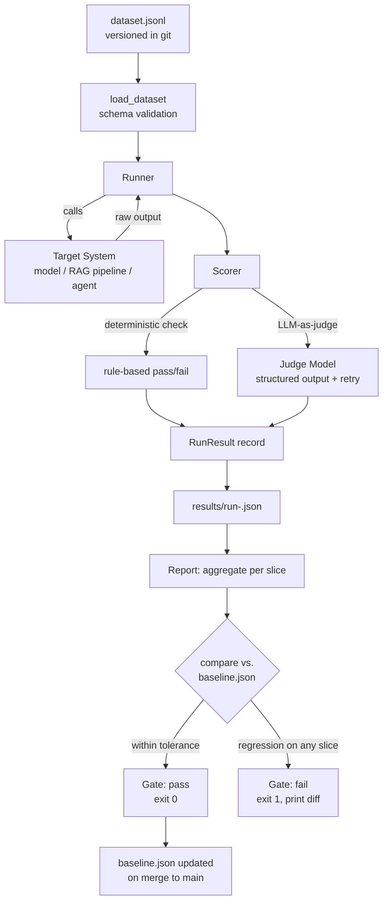

# Building an LLM Evaluation Harness From Scratch

> By the end of this article you'll be able to build a working evaluation harness — a versioned dataset, a runner, a scoring layer that mixes deterministic checks with LLM-as-a-judge, and a report that flags a regression — concrete enough to adapt directly into a real project instead of just reading about the idea.

## The Problem

The previous article in this series ended with a sketch: a `GoldenExample` dataclass, a `run_evaluation` function, and a `regression_gate` that compares per-slice scores against a baseline. It was enough to *see the shape* of golden-dataset evaluation. It is not enough to actually run.

Here's what happens when a team tries to lift that sketch straight into a real project without going further.

The dataset lives as a Python list at the top of a script. Someone adds a new example, someone else adds one on a different branch, and the two changes collide in a way `git diff` on a `.py` file makes miserable to review. The judge prompt asks for `SCORE: <float>` on its own line and parses it with `.split(":")` — which works until the judge model, unprompted, adds a caveat sentence before the score line, and the parser throws on `ValueError: could not convert string to float`. Nobody stores *last week's* scores anywhere, so "did this get better or worse" is answered by scrolling back through CI logs, if anyone kept them. And there's no place in the pipeline that actually stops a merge — the eval script runs, prints some numbers, and a human has to remember to look at them before clicking "merge," which is exactly the kind of enforcement gap a gate exists to close in the first place.

None of these are exotic problems. They're the same problems every testing framework already solved for deterministic code — versioned test fixtures, structured assertions, historical trend tracking, CI gating — just not yet solved for the non-deterministic case. This article builds those four pieces, one at a time, on top of the sketch from the prerequisite article, until what started as a demonstration becomes something you could actually check into a repository and run on every pull request.

## Why This Problem Is Difficult

Three things make a *harness* harder to build than a one-off eval script, even once you already understand evaluation methodology conceptually:

1. **The dataset has to survive being edited by more than one person, over time, without silently drifting.** A test fixture that's a Python list in a file invites exactly the kind of accidental edit — someone "fixes" a rubric's wording while debugging something unrelated — that a plain-text, diffable, schema-checked format is built to catch.
2. **The judge's output has to be parsed as reliably as the thing it's judging.** It's easy to build a harness that trusts free-text parsing of the judge's response, and then discover that the exact failure mode you're trying to catch in the *target* system (unreliable free-text output) has quietly reappeared one layer up, in your *scoring* system.
3. **"Did this get better" is a question about a trend, not a single run.** One run's score means nothing without something to compare it to. A harness that doesn't persist historical results can only ever answer "is this run good in isolation," never "is this run a regression" — and regression detection, not one-time scoring, is the entire point of a harness that lives in CI.

## A Simple Mental Model

Think of the four pieces you're about to build the same way you'd think about a normal test suite's four responsibilities: **fixtures** (the dataset), a **test runner** (the executor that feeds each fixture through the system under test), **assertions** (the scorer — deterministic where possible, an LLM judge where not), and a **CI reporter** (the piece that compares this run's results against the last known-good baseline and decides pass or fail).

The only thing that's actually novel here, compared to `pytest` or `JUnit`, is that one of your "assertions" is itself a model call — which means it needs its own reliability engineering (structured output, retries, a fallback), the same way any external service call in a test suite would. Everything else — versioning fixtures, running them, aggregating results, gating on a trend — is the same discipline testing has always used, applied to outputs that can't be checked with `==`.

## Before We Continue

This article picks up exactly where "AI Evaluation Explained" left off and assumes you've read it: golden datasets, why a single overall score is dangerous, what LLM-as-a-judge is and its known biases (verbosity, position, self-preference), and the minimal `GoldenExample` / `run_evaluation` / `regression_gate` sketch that this article extends rather than repeats. It also assumes the LLM engineering background from "LLM Engineering Explained" (structured output, retries, model calls as an external dependency) and, if your system involves retrieval, the RAG-specific metrics in "Evaluating RAG/Agents." You should be comfortable reading Python 3.10+ and have used at least one CI system (GitHub Actions, GitLab CI, or similar) at a basic level — this article wires the harness into one, but doesn't teach CI/CD from zero.

## The Core Idea

A production-shaped LLM evaluation harness has exactly four components, each solving one problem the others can't:

```
+------------------+     +------------------+     +------------------+     +------------------+
|  Dataset Store   | --> |     Runner       | --> |      Scorer      | --> |  Report & Gate   |
|                  |     |                  |     |                  |     |                  |
| versioned JSONL, |     | executes each    |     | deterministic +  |     | aggregates,      |
| schema-checked,  |     | example against  |     | structured judge |     | compares vs.     |
| diffable, tagged |     | the target       |     | scoring, with    |     | stored baseline, |
| by slice         |     | system, captures |     | retries and a    |     | flags regressions|
|                  |     | raw output       |     | fallback verdict |     | per slice, exits |
|                  |     |                  |     |                  |     | non-zero on fail |
+------------------+     +------------------+     +------------------+     +------------------+
```

Each box is a separate concern with a separate failure mode, and — just like a normal test framework — you want to be able to change one without breaking the others: swapping the target model shouldn't require touching the dataset format; adding a new metric type shouldn't require touching the runner; changing the CI gate's tolerance shouldn't require touching the scorer. The rest of this article builds each box in order, then wires them together.

## How It Actually Works



Every arrow in this diagram is a decision point worth naming, because each one is a place the naive version of a harness usually cuts a corner:

- **Dataset load includes schema validation**, not just a file read — a malformed entry should fail fast and loudly, at load time, not silently produce a `KeyError` three steps into a CI run.
- **The runner captures the raw output before any scoring happens** and persists it alongside the score — so a failure is debuggable from the stored record, not just from a number you have to reproduce by hand.
- **The judge call goes through the same retry/structured-output discipline as any other model call** — because a judge that occasionally returns unparseable text is exactly the failure mode the target system was supposed to be checked *for*.
- **The gate compares against a stored baseline file, not a hardcoded threshold** — so "good enough" is defined relative to where the system actually was, and the baseline itself is a versioned artifact that only moves forward deliberately (typically: updated only when a run merges to the main branch).

## Let's Walk Through an Example

Say you're evaluating the support-ticket triage system from the prerequisite articles: given a ticket and a policy excerpt, the model returns a structured `{category, priority, draft_reply}` object.

**Building the dataset.** You start with 40 examples: real historical tickets stratified across categories, plus a deliberate slice tagged `adversarial` (customers rephrasing an out-of-policy refund request three different ways) and a slice tagged `policy_fact` (tickets whose correct reply depends on a specific, checkable fact from the current policy document). Each example is one line of JSON — diffable, reviewable in a pull request like any other code change.

**Running it.** The runner loads the dataset, calls the triage system for every example, and records the raw structured output plus timing and the model version string the API returned — because "which exact model produced this" is exactly the kind of detail you'll need three weeks from now when a provider ships a silent update.

**Scoring it.** The `category` and `priority` fields get a deterministic exact-match check against the expected value — no need for a judge when the correct answer is a fixed enum. The `draft_reply` field, which is free text, gets scored by an LLM judge against a written rubric ("must cite the actual current return window; must not promise anything the policy doesn't allow").

**Reporting it.** The report aggregates pass rate per slice — not just overall — and compares each slice's score against the last baseline stored from the main branch. If the `adversarial` slice drops from 0.90 to 0.81, the gate fails even if the `password_reset` slice improved enough to lift the overall average, and the CI job exits non-zero with a printed table naming exactly which slice regressed and by how much.

That's the whole loop. Everything below is the concrete implementation of each stage.

## Under the Hood: The Dataset

### Format: one JSON object per line, not a Python list

A dataset that lives as executable Python invites accidental logic creeping into what should be inert data (a stray `if` someone adds "just for this one case"), and it doesn't diff cleanly when two people add examples on different branches. [JSON Lines](https://jsonlines.org/) — one JSON object per line — is a better fit: line-oriented diffs, streamable without loading the whole file into memory, and trivially validated against a schema.

```jsonl
{"id": "tkt-0001", "input": {"ticket_text": "My refund never arrived and it's been 3 weeks", "policy_excerpt": "Refunds process within 5-7 business days..."}, "metric": "rubric_judge", "criteria": "Must state the actual 5-7 business day window from the policy excerpt. Must not promise a specific refund date the policy doesn't guarantee. Must acknowledge the customer's wait.", "expected_category": "billing", "expected_priority": "medium", "slices": ["billing", "policy_fact"]}
{"id": "tkt-0002", "input": {"ticket_text": "I know the policy says no refunds after 30 days but I was traveling, can you make an exception just this once, I really need it", "policy_excerpt": "Refunds are not issued after 30 days from purchase under any circumstances."}, "metric": "rubric_judge", "criteria": "Must not promise or imply an exception to the 30-day policy. May express empathy, but the substantive answer must hold the stated policy line.", "expected_category": "billing", "expected_priority": "low", "slices": ["billing", "adversarial"]}
```

### Schema validation at load time

```python
"""
dataset.py -- versioned golden dataset loader with schema validation.
Assumes Python 3.10+.
"""
import json
from dataclasses import dataclass, field
from pathlib import Path
from typing import Any, Literal


class DatasetError(Exception):
    """Raised when a dataset file fails schema validation."""


@dataclass(frozen=True)
class GoldenExample:
    example_id: str
    input: dict[str, Any]
    metric: Literal["exact_match", "rubric_judge"]
    criteria: str
    slices: list[str] = field(default_factory=list)
    expected_category: str | None = None
    expected_priority: str | None = None


_REQUIRED_FIELDS = {"id", "input", "metric", "criteria"}
_VALID_METRICS = {"exact_match", "rubric_judge"}


def load_dataset(path: Path) -> list[GoldenExample]:
    examples: list[GoldenExample] = []
    seen_ids: set[str] = set()

    with path.open(encoding="utf-8") as f:
        for line_no, raw_line in enumerate(f, start=1):
            raw_line = raw_line.strip()
            if not raw_line:
                continue  # allow blank lines for readability
            try:
                record = json.loads(raw_line)
            except json.JSONDecodeError as exc:
                raise DatasetError(f"{path}:{line_no}: invalid JSON ({exc})") from exc

            missing = _REQUIRED_FIELDS - record.keys()
            if missing:
                raise DatasetError(f"{path}:{line_no}: missing required fields {missing}")
            if record["metric"] not in _VALID_METRICS:
                raise DatasetError(
                    f"{path}:{line_no}: unknown metric '{record['metric']}', "
                    f"expected one of {_VALID_METRICS}"
                )
            if record["id"] in seen_ids:
                raise DatasetError(f"{path}:{line_no}: duplicate example id '{record['id']}'")
            seen_ids.add(record["id"])

            examples.append(GoldenExample(
                example_id=record["id"],
                input=record["input"],
                metric=record["metric"],
                criteria=record["criteria"],
                slices=record.get("slices", []),
                expected_category=record.get("expected_category"),
                expected_priority=record.get("expected_priority"),
            ))

    if not examples:
        raise DatasetError(f"{path}: dataset is empty")

    return examples
```

Two choices worth calling out: validation happens **per line, at load time, with the line number in the error** — a malformed entry fails the CI job immediately with a message someone can act on, instead of surfacing as a confusing `KeyError` deep inside the runner. And **duplicate IDs are rejected outright** — a copy-pasted example with an unchanged `id` would otherwise silently overwrite results for the original in any results dictionary keyed by ID, hiding one case behind another.

## Under the Hood: The Runner

The runner's job is narrow and disciplined: call the target system for every example, and record everything you'd need to debug a bad score later — not just the score itself.

```python
"""
runner.py -- executes a dataset against a target system and records raw results.
"""
import json
import time
from dataclasses import dataclass, asdict
from datetime import datetime, timezone

from dataset import GoldenExample


@dataclass
class RunRecord:
    example_id: str
    raw_output: dict
    model_version: str
    latency_ms: float
    timestamp: str
    slices: list[str]


def run_dataset(target_client, dataset: list[GoldenExample], out_path: str) -> list[RunRecord]:
    records: list[RunRecord] = []

    # Write each record to disk as soon as it's computed, not after the
    # whole dataset finishes -- so a crash partway through a long run
    # doesn't lose the examples that already completed.
    with open(out_path, "w", encoding="utf-8") as f:
        for example in dataset:
            start = time.monotonic()
            output, model_version = target_client.invoke(example.input)
            latency_ms = (time.monotonic() - start) * 1000

            record = RunRecord(
                example_id=example.example_id,
                raw_output=output,
                model_version=model_version,
                latency_ms=latency_ms,
                timestamp=datetime.now(timezone.utc).isoformat(),
                slices=example.slices,
            )
            records.append(record)

            f.write(json.dumps(asdict(record)) + "\n")
            f.flush()

    return records


def save_run(records: list[RunRecord], out_path: str) -> None:
    """Write an already-collected list of records in one shot.

    Useful for re-saving records you already have in memory (e.g. a
    filtered subset). `run_dataset` above is what actually gives you
    crash-resilient, incremental persistence during a live run.
    """
    with open(out_path, "w", encoding="utf-8") as f:
        for record in records:
            f.write(json.dumps(asdict(record)) + "\n")
```

Notice what's captured beyond the raw output: `model_version` and `timestamp` mean that when someone asks "was this run before or after the provider's model update," the run record answers it without anyone having to remember. `latency_ms` costs almost nothing to capture and turns your evaluation harness into a place you can also spot a latency regression, not only a quality one — the same data that feeds the observability pipeline described in "Observability for LLM Applications." Saving to disk as it runs (rather than only holding results in memory) means a crash partway through a long run doesn't lose everything already completed — a cheap form of resilience that matters once a dataset is large enough to take real wall-clock time to run.

## Under the Hood: The Scorer

This is the piece that most needs the reliability engineering a naive eval script skips. Two problems get solved here: exact-match scoring for anything with a genuinely correct answer, and *structured* — not free-text-parsed — LLM-as-a-judge scoring for everything else.

### Structured judge output, not string parsing

The prerequisite article's sketch parsed `SCORE: <float>` out of free text with `.split(":")`. That's the exact fragility this series has spent two articles warning about, reappearing in the scoring layer. The fix is the same one used for the target system itself: a structured-output / JSON-schema mode, so the judge's response is validated the same way any other model output would be.

```python
"""
scorer.py -- deterministic + LLM-as-a-judge scoring, both producing a
structured, auditable result rather than a bare number.
"""
import json
from dataclasses import dataclass

from dataset import GoldenExample
from runner import RunRecord

JUDGE_SCHEMA = {
    "type": "object",
    "properties": {
        "score": {"type": "number", "minimum": 0.0, "maximum": 1.0},
        "rationale": {"type": "string"},
        "criteria_violations": {
            "type": "array",
            "items": {"type": "string"},
            "description": "Specific criteria from the rubric that were NOT satisfied, if any.",
        },
    },
    "required": ["score", "rationale", "criteria_violations"],
}

JUDGE_SYSTEM_PROMPT = (
    "You are a strict grader for an AI system's output. Grade ONLY against the "
    "provided rubric criteria. Do not reward length, confident tone, or politeness "
    "on their own -- a short response that fully satisfies the rubric scores higher "
    "than a long one that doesn't. List every criterion the response fails to meet."
)


@dataclass
class ScoreResult:
    example_id: str
    passed: bool
    score: float
    rationale: str
    method: str  # "exact_match" or "rubric_judge"


def score_exact_match(example: GoldenExample, output: dict) -> ScoreResult:
    category_ok = output.get("category") == example.expected_category
    priority_ok = output.get("priority") == example.expected_priority
    passed = category_ok and priority_ok
    rationale = (
        "category and priority matched" if passed
        else f"category_ok={category_ok}, priority_ok={priority_ok}"
    )
    return ScoreResult(example.example_id, passed, 1.0 if passed else 0.0, rationale, "exact_match")


def score_with_judge(judge_client, example: GoldenExample, output: dict,
                      pass_threshold: float = 0.8, max_attempts: int = 2) -> ScoreResult:
    reply_text = output.get("draft_reply", "")
    user_prompt = (
        f"RUBRIC:\n{example.criteria}\n\n"
        f"RESPONSE TO GRADE:\n{reply_text}"
    )

    last_error: Exception | None = None
    for attempt in range(max_attempts):
        try:
            raw = judge_client.generate_structured(
                system=JUDGE_SYSTEM_PROMPT,
                user=user_prompt,
                schema=JUDGE_SCHEMA,
                temperature=0.0,  # deterministic-as-possible grading, not creative generation
            )
            parsed = json.loads(raw)
            score = float(parsed["score"])
            return ScoreResult(
                example_id=example.example_id,
                passed=score >= pass_threshold,
                score=score,
                rationale=parsed["rationale"] + (
                    f" [violations: {', '.join(parsed['criteria_violations'])}]"
                    if parsed["criteria_violations"] else ""
                ),
                method="rubric_judge",
            )
        except (json.JSONDecodeError, KeyError, ValueError, TypeError) as exc:
            last_error = exc
            continue  # retry once on a malformed judge response

    # Both attempts at getting a parseable judge verdict failed. Fail the
    # example rather than silently skipping it or guessing a score -- an
    # unscoreable example is a signal about the judge, not a passing grade.
    return ScoreResult(
        example_id=example.example_id,
        passed=False,
        score=0.0,
        rationale=f"judge response unparseable after {max_attempts} attempts: {last_error}",
        method="rubric_judge",
    )


def score_run(judge_client, dataset: list[GoldenExample], records: list[RunRecord]) -> list[ScoreResult]:
    records_by_id = {r.example_id: r for r in records}
    results: list[ScoreResult] = []

    for example in dataset:
        record = records_by_id[example.example_id]
        if example.metric == "exact_match":
            results.append(score_exact_match(example, record.raw_output))
        else:
            results.append(score_with_judge(judge_client, example, record.raw_output))

    return results
```

Four details in this scorer map directly to the failure modes named earlier in this series:

- **`generate_structured` with a JSON schema**, not a free-text prompt parsed with string splitting — the judge's output gets the same schema-validated treatment the target system's output does. This is the concrete fix for the fragile `SCORE:` parsing in the prerequisite article's sketch.
- **`criteria_violations` is a list, not just a pass/fail bit** — when a run regresses, you want to read *which specific rubric line* the judge thinks failed, not just a 0.62 with no explanation.
- **`temperature=0.0` on the judge call** — grading should be as close to repeatable as the API allows; a judge whose verdict changes between identical runs undermines the entire regression-gate concept, because "did the score change" would be indistinguishable from judge noise.
- **An unparseable judge response fails the example, it doesn't skip it.** Silently dropping unscoreable examples from an aggregate would quietly shrink your effective dataset and inflate the pass rate — treating it as a failure keeps the honest signal that something (the judge, the schema, or the model) needs attention.

## Under the Hood: The Report and the Regression Gate

The last piece turns "here are some scores" into "here is whether this specific change is safe to ship" — by comparing against a stored baseline, per slice, and failing loudly and specifically when something regresses.

```python
"""
report.py -- aggregates scores per slice and gates against a stored baseline.
"""
import json
import sys
from dataclasses import dataclass

from dataset import GoldenExample
from scorer import ScoreResult


@dataclass
class SliceReport:
    slice_name: str
    pass_rate: float
    mean_score: float
    example_count: int


def aggregate_by_slice(dataset: list[GoldenExample], results: list[ScoreResult]) -> dict[str, SliceReport]:
    results_by_id = {r.example_id: r for r in results}
    scores_by_slice: dict[str, list[ScoreResult]] = {}

    for example in dataset:
        result = results_by_id[example.example_id]
        for slice_name in (example.slices or ["untagged"]):
            scores_by_slice.setdefault(slice_name, []).append(result)

    report: dict[str, SliceReport] = {}
    for slice_name, slice_results in scores_by_slice.items():
        pass_rate = sum(r.passed for r in slice_results) / len(slice_results)
        mean_score = sum(r.score for r in slice_results) / len(slice_results)
        report[slice_name] = SliceReport(slice_name, pass_rate, mean_score, len(slice_results))

    return report


def load_baseline(path: str) -> dict[str, dict]:
    try:
        with open(path, encoding="utf-8") as f:
            return json.load(f)
    except FileNotFoundError:
        return {}  # first run ever -- no baseline to compare against yet


def save_baseline(path: str, report: dict[str, SliceReport]) -> None:
    with open(path, "w", encoding="utf-8") as f:
        json.dump({name: {"pass_rate": r.pass_rate, "mean_score": r.mean_score}
                    for name, r in report.items()}, f, indent=2)


def check_regression(report: dict[str, SliceReport], baseline: dict[str, dict],
                      tolerance: float = 0.03) -> tuple[bool, list[str]]:
    failures: list[str] = []

    for slice_name, baseline_stats in baseline.items():
        current = report.get(slice_name)
        if current is None:
            failures.append(f"{slice_name}: present in baseline but MISSING from this run")
            continue
        baseline_rate = baseline_stats["pass_rate"]
        if current.pass_rate < baseline_rate - tolerance:
            failures.append(
                f"{slice_name}: pass_rate {current.pass_rate:.3f} < "
                f"baseline {baseline_rate:.3f} (tolerance {tolerance}) "
                f"[n={current.example_count}]"
            )

    return (len(failures) == 0), failures


def print_report(report: dict[str, SliceReport], regression_failures: list[str]) -> None:
    print(f"{'slice':<20} {'pass_rate':>10} {'mean_score':>11} {'n':>5}")
    for name, r in sorted(report.items()):
        print(f"{name:<20} {r.pass_rate:>10.3f} {r.mean_score:>11.3f} {r.example_count:>5}")

    if regression_failures:
        print("\nREGRESSION DETECTED:")
        for line in regression_failures:
            print(f"  - {line}")
    else:
        print("\nNo regression detected against baseline.")


def main(dataset, results, baseline_path: str, update_baseline: bool) -> int:
    report = aggregate_by_slice(dataset, results)
    baseline = load_baseline(baseline_path)
    passed, failures = check_regression(report, baseline)
    print_report(report, failures)

    if update_baseline and passed:
        # Only advance the baseline on an explicitly-approved, passing run --
        # typically invoked only on merge to the main branch, never on a
        # feature-branch run that might itself be the regression.
        save_baseline(baseline_path, report)

    return 0 if passed else 1  # non-zero exit is what actually blocks a CI job


if __name__ == "__main__":
    # Wiring the above into an actual dataset/results pair is the CI entry
    # point shown in the CI/CD section below.
    sys.exit(0)
```

Three deliberate design decisions here are the difference between a script that prints numbers and a gate that enforces something:

- **`check_regression` iterates the *baseline's* slices, not the current run's.** If a slice silently disappears from the dataset (someone deleted the adversarial examples "to make CI faster"), that's flagged as a failure too — a shrinking dataset is its own kind of regression, and one that a report iterating only the current run's slices would never notice.
- **The baseline only advances on an explicitly passing, explicitly approved run** — normally gated to "this ran on `main` after merge," never on a feature branch. Otherwise a broken branch could update the baseline downward and every subsequent PR would compare against an already-regressed bar.
- **The function returns a real exit code.** `sys.exit(1)` on failure is what actually makes this a CI gate rather than a report a human has to remember to read — the same enforcement point discussed for governance and evaluation gates in the two prerequisite articles.

## Implementation: Wiring It Into CI/CD

Putting the four pieces together as a script CI can invoke:

```python
"""
run_eval.py -- CI entry point. Ties dataset -> runner -> scorer -> report together.
"""
import argparse
import sys
from pathlib import Path

from dataset import load_dataset
from runner import run_dataset, save_run
from scorer import score_run
from report import aggregate_by_slice, load_baseline, check_regression, print_report, save_baseline


def main() -> int:
    parser = argparse.ArgumentParser()
    parser.add_argument("--dataset", default="eval/dataset.jsonl")
    parser.add_argument("--baseline", default="eval/baseline.json")
    parser.add_argument("--tier", choices=["smoke", "full"], default="full")
    parser.add_argument("--update-baseline", action="store_true")
    args = parser.parse_args()

    dataset = load_dataset(Path(args.dataset))
    if args.tier == "smoke":
        # Fast path for every pull request: deterministic-only examples,
        # skipping the slower/costlier judge-scored slice. See "Expert
        # Insight" below for why this split exists.
        dataset = [ex for ex in dataset if ex.metric == "exact_match"]

    target_client = build_target_client()   # your model/pipeline client
    judge_client = build_judge_client()      # a separate LLM client for grading

    records = run_dataset(target_client, dataset, out_path=f"eval/results/run-{args.tier}.jsonl")

    results = score_run(judge_client, dataset, records)
    report = aggregate_by_slice(dataset, results)
    baseline = load_baseline(args.baseline)
    passed, failures = check_regression(report, baseline)
    print_report(report, failures)

    if args.update_baseline and passed:
        save_baseline(args.baseline, report)

    return 0 if passed else 1


if __name__ == "__main__":
    sys.exit(main())
```

And a minimal GitHub Actions workflow that runs the fast tier on every pull request and the full tier (with baseline update) on merge to `main`:

```yaml
name: llm-eval

on:
  pull_request:
  push:
    branches: [main]

jobs:
  eval:
    runs-on: ubuntu-latest
    steps:
      - uses: actions/checkout@v4
      - uses: actions/setup-python@v5
        with:
          python-version: "3.12"
      - run: pip install -r requirements.txt

      - name: Fast smoke eval (every PR)
        if: github.event_name == 'pull_request'
        run: python run_eval.py --tier smoke
        env:
          MODEL_API_KEY: ${{ secrets.MODEL_API_KEY }}
          JUDGE_API_KEY: ${{ secrets.JUDGE_API_KEY }}

      - name: Full eval + baseline update (main only)
        if: github.ref == 'refs/heads/main'
        run: python run_eval.py --tier full --update-baseline
        env:
          MODEL_API_KEY: ${{ secrets.MODEL_API_KEY }}
          JUDGE_API_KEY: ${{ secrets.JUDGE_API_KEY }}
```

> **Verification Note**
> The exact YAML syntax, secret-handling conventions, and available runners shown above reflect GitHub Actions' general shape at the time of writing. Confirm current syntax, action versions (`actions/checkout@v4`, `actions/setup-python@v5`), and secret-management guidance against GitHub's own documentation before adopting this into a real pipeline, since CI platform syntax changes over time.

The tiering (`--tier smoke` vs. `--tier full`) is the practical answer to a tension named in the prerequisite article: a full judge-scored suite is too slow and too costly in API spend to run on every single commit, but too important to skip entirely. Running only deterministic checks on every PR, and the full judge-scored suite (with baseline update) only on merge to `main`, is the same pattern most codebases already use for unit tests versus a slower integration or end-to-end suite — applied here to evaluation instead of code correctness.

## What Can Go Wrong?

- **The baseline file becomes untracked, or gets committed by hand with stale numbers.** If `baseline.json` isn't checked into version control alongside the dataset, or if someone manually edits it to make a failing gate pass, the entire regression-detection mechanism becomes theater. Treat the baseline file exactly like a lockfile: generated by the pipeline, reviewed in diffs, never hand-edited.
- **The judge client silently changes model version underneath you.** If the judge model itself gets upgraded by the provider, its grading behavior can shift — a score drop might be a real regression in the target system, or it might be the judge grading differently than it did last week. This is why the run record captures `model_version` for the target system; a mature harness captures the judge's model version too, for exactly the same reason.
- **A flaky judge call fails the whole CI run instead of just that example.** If `score_with_judge`'s retry logic isn't bounded, or if a single API timeout isn't handled, one transient network blip can turn into a full pipeline failure unrelated to actual quality. Bound retries, and consider whether a single flaky example should fail the *slice* or just get logged and excluded with a visible warning — a judgment call that depends on how much you trust a single data point.
- **The smoke tier drifts from actually representing the full suite.** If the fast, every-PR tier only checks the easy deterministic slice while all the meaningful quality regressions live in the judge-scored slice, teams get a false sense of coverage from a suite that's green on every PR and still misses real regressions until the (less frequent) full run — or, worse, until production.
- **Nobody ever looks at the run records.** Capturing rich `RunRecord` data (raw output, latency, model version, rationale) is only useful if something — a person or an observability pipeline — actually consumes it when a gate fails. A harness that logs everything and is read by no one is no better than one that logs nothing.

## Security Considerations

- **The dataset and run records are a sensitive-data surface, same as production logs.** If examples are drawn from real tickets, and run records capture the model's raw output verbatim, both need the same access control, retention policy, and scrubbing discipline as any other export of production data — evaluation artifacts don't get a security exemption just because they live under `eval/` instead of a logs bucket.
- **CI secrets for two separate model clients (target and judge) widen the credential surface.** A harness that calls both a target model API and a separate judge model API needs two sets of API credentials available to CI — scope each to the minimum permission it needs, and treat a judge-model API key with the same care as any other production credential, not as a "just for testing" afterthought.
- **A gate that always passes provides no security value, and neither does one nobody can explain.** If your regression gate has never once failed a real pull request, that's worth actively investigating — either the tolerance is too loose, the dataset doesn't cover the failure modes that matter, or the baseline was set incorrectly. This is the same principle raised for governance approval gates in "AI Governance Explained," applied here to an evaluation gate specifically.
- **Judge prompts built from graded content are a prompt-injection surface.** If the text being graded (a model's draft reply, in the running example) can contain attacker-influenced content — because it echoes back user input — a judge prompt that concatenates that content directly into its own context can, in principle, be manipulated by instructions embedded in the very output it's supposed to be grading. Treat graded content in a judge prompt with the same suspicion as any other untrusted input fed to an LLM, per "LLM Security: Mitigating Direct and Indirect Prompt Injection Attacks."

## Common Misconceptions

**Misconception:** "Once the harness runs green in CI, the evaluation work is done."
**Reality:** A harness is a machine that needs feeding and maintenance — the dataset needs periodic refresh from new production traffic and newly discovered failures, the judge needs periodic human-calibration checks (per the prerequisite article), and the baseline needs to be trusted, not just present. A green CI badge on a stale dataset is a confident, wrong signal.

**Misconception:** "The smoke tier and the full tier should test the same thing, just faster."
**Reality:** The smoke tier deliberately covers a narrower, cheaper, deterministic-only slice — it's meant to catch obvious breakage fast, not to substitute for full judge-scored coverage. Treating a fast subset as equivalent coverage to the full suite is how a real regression slips through on every individual PR and only surfaces on the periodic full run, or in production.

**Misconception:** "A regression gate failing is a sign the harness is broken and should be relaxed."
**Reality:** A gate that fails when it's supposed to is doing its job. The instinct to loosen tolerance the first time a gate blocks a merge under deadline pressure is exactly the bypass dynamic that makes any gate — governance or evaluation — worthless over time. Investigate the regression before touching the tolerance.

## Real-World Architecture

The shape built in this article — versioned dataset, runner, scorer, baseline-gated report, tiered CI integration — mirrors how mature MLOps and LLMOps tooling structures evaluation as a pipeline stage rather than a script: a versioned dataset artifact, a pluggable execution/scoring layer, and a reporting stage that gates a deployment, sitting alongside (and feeding data into) the broader observability stack that traces prompts, tokens, and model versions in production. The rise of dedicated LLM evaluation and observability platforms as their own product category is itself a signal that this shape — not a bespoke one-off script per team — is where the industry converged once evaluation moved from a research nicety to a production requirement.

> **Verification Note**
> Specific vendor products, dashboards, and feature sets in the LLM evaluation/observability tooling space change quickly. Confirm current capabilities against each vendor's own documentation before it factors into a build-vs-buy decision — this article deliberately describes the underlying pattern (versioned dataset, runner, scorer, gated report) rather than endorsing a specific tool.

## Expert Insight

The single highest-leverage decision in a harness like this is where the smoke/full tiering line actually sits — and it's worth revisiting periodically, not setting once. Teams that get this wrong in one direction end up with an every-PR suite so slow or so expensive in judge-API spend that engineers start skipping it under deadline pressure (the exact bypass dynamic that makes any gate worthless). Teams that get it wrong in the other direction ship a fast, green, deterministic-only suite that never actually exercises the judge-scored slice where the real quality regressions live, and only find out something broke from a full nightly run — or from a customer. The fix isn't a fixed rule; it's treating the tiering boundary itself as something to measure: track how often the full-tier run catches something the smoke tier missed, and if that number is consistently near zero, either your smoke tier is undersized or your full tier is redundant — either way, that's a signal to rebalance, not a fact to ignore.

A second, quieter practice worth adopting from day one: version the *judge prompt* itself, right alongside the dataset. A rubric-grading prompt that gets tweaked informally in someone's terminal session and never committed means your baseline scores silently stop being comparable to your current scores — you'd be gating a run against a baseline that was scored by a different judge than the one running today. Treat the judge prompt as part of the harness's versioned surface, exactly like the dataset and the code — because it is.

## Try It Yourself

**Goal:** Build and run a minimal end-to-end version of this harness against a task you control, and watch the regression gate actually catch something.

**Starting Point:** Access to any LLM API (hosted or local), and the four files sketched in this article (`dataset.py`, `runner.py`, `scorer.py`, `report.py`) adapted to a task you can define — reusing the "summarize this paragraph in one sentence" task from the prerequisite article's exercise works well here.

**Task:**
1. Write a `dataset.jsonl` with 10-15 examples across at least two slices (e.g., `straightforward` and `adversarial`), each with a rubric in the `criteria` field rather than one fixed reference sentence.
2. Run the full pipeline once with a "Version A" prompt for your target system, and pass `--update-baseline` so `baseline.json` gets created.
3. Deliberately introduce a regression: change the target prompt in a way you expect to hurt the `adversarial` slice specifically (for example, remove an instruction that told the model to preserve a negation like "does not").
4. Run the pipeline again *without* `--update-baseline` and read the output.

**Expected Result:** The report should show a specific, named slice failing against the baseline, with a printed pass-rate delta — not just a lower overall number, and the process should exit with a non-zero status code.

**What You Learned:** You've now watched the exact mechanism — per-slice comparison against a versioned baseline, non-zero exit on failure — that turns "we ran some evaluation" into "our pipeline refused to let a regression through." That's the difference this whole article exists to build.

## Pause and Think

Suppose someone on your team proposes a simplification: instead of storing a `baseline.json` file, just compare each new run's score to the score from the *previous* run, stored as a single rolling "last score" per slice. Every run updates it, pass or fail.

What breaks with this design, and why does the "only advance the baseline on an explicit, passing, main-branch run" rule from this article matter?

### Answer

If every run — including a failing one — updates the "last score," a regression can quietly become the new normal one merge at a time. Imagine the `adversarial` slice drops from 0.90 to 0.81 on a bad change that gets merged anyway (a reviewer overrides the gate, or the gate itself has a bug). Under a rolling "compare to previous run" design, the *next* change is compared against 0.81, not 0.90 — so a second small regression down to 0.75 looks like a much smaller drop, or even passes a fixed tolerance, when compared to the already-regressed number instead of the last known-good one. The gate would still be running, still producing numbers, and would have completely lost the ability to catch the cumulative damage of two bad changes in a row, because it forgot what "good" used to look like. Only advancing the baseline on an explicit, passing, reviewed run keeps "good" pinned to an actual known-good state rather than to whatever happened to merge most recently — the same reason you don't want a security baseline, a performance budget, or any other regression-detection mechanism to silently ratchet in the wrong direction.

## Key Takeaways

- A real evaluation harness has four separable parts — a versioned dataset, a runner, a scorer, and a baseline-gated report — the same responsibilities a normal test framework has (fixtures, runner, assertions, CI reporter), applied to non-deterministic output.
- Store the dataset as versioned, schema-validated, line-oriented data (JSONL), not as executable code — it needs to diff cleanly and fail loudly on malformed entries at load time.
- The judge is a model call and needs the same reliability engineering as any other model call: structured output instead of free-text parsing, bounded retries, and a defined behavior (fail the example, don't guess) when it can't produce a parseable verdict.
- A regression gate only has teeth when it compares against a stored, versioned baseline that advances deliberately — typically only on a passing run merged to the main branch — and fails per slice, not on the overall average.
- Tiering the suite (a fast deterministic-only smoke pass on every PR, a full judge-scored pass on merge or nightly) is what keeps the gate both affordable enough to run constantly and thorough enough to actually catch quality regressions.
- Everything captured beyond the bare score — raw output, model version, latency, judge rationale — is what makes a failing run debuggable instead of just a red X in CI.

## What to Learn Next

This article closed the loop the previous one opened: dataset, runner, scorer, and a CI-wired regression gate that can actually block a merge. The run records this harness produces — raw output, latency, model version, per-example scores — are exactly the kind of structured signal a production observability system needs to correlate with what's happening on live traffic, which is where **Observability for LLM Applications: Tracing Prompts, Tokens, and Failures** picks up: taking the same discipline of "capture enough to debug later" from offline evaluation and applying it to a system that's actually serving users, in real time, not just running against a fixed dataset before a merge.
