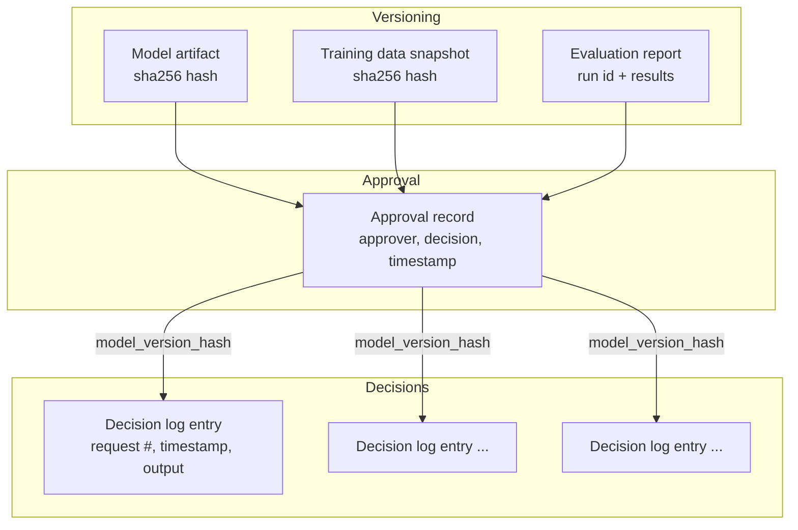

# AI Model Cards and Audit Trails: Documenting AI Systems for Accountability

> A model card tells you what a system was built to do. An audit trail tells you what it actually did, to whom, and who let it. Accountability needs both, and most organizations that get burned by an AI incident are missing one of the two, not both.

## The Problem: "Why Did It Do That, on That Day, to That Person?"

The prerequisite article on AI governance ended with a bank that built a real deployment gate: a model card, a fairness evaluation, an approval, a signed deployment record. That's a genuine improvement over a charter nobody enforces. But now fast-forward eighteen months.

A customer disputes a loan denial from fourteen months ago and escalates to a regulator. The regulator doesn't ask "is your AI governance program good in general?" They ask a much narrower, much harder question: *"Show us exactly what model made this specific decision, on this specific date, using what inputs, evaluated against what fairness criteria, and approved by whom."*

The deployment record the bank built in the prerequisite article answers "which model version went live on 2026-08-14." It does not answer "which model version scored *this specific applicant* on 2026-11-03," because by November the model may have been retrained twice, redeployed under the same name, or silently rolled back after an incident. A model card and a deployment log tell you about the *model*. They say nothing, by themselves, about the *decision* — the one specific inference that affected one specific person on one specific day.

This is the gap this article closes. A model card is necessary but describes a version, not an event. An audit trail has to go one level more granular: it has to log the decision itself, link that decision to the exact model version and data snapshot that produced it, and preserve that link somewhere nobody — including the team that built the model — can quietly edit after the fact.

## Why This Problem Is Difficult

**Decisions vastly outnumber deployments.** A model might get redeployed twenty times a year. It might make twenty million individual predictions in that same year. Logging "we deployed model X on date Y" is cheap. Logging "which exact model version and which exact input produced *this* output" at production inference volume, without drowning your storage budget or your compliance team, is a genuinely different engineering problem.

**The thing you need to prove is negative as often as positive.** It's not enough to show the model that produced a bad outcome — you often have to show that the model in question was actually the *approved* one, running the *approved* version, at the time the decision happened, and not a stale replica, a rolled-back version some regional cluster never picked up, or a version modified outside the approval process. That means the audit trail has to be tamper-evident, not just "logged somewhere."

**Privacy and accountability pull in opposite directions.** The most useful audit record would capture every input feature that went into a decision. But logging raw personal data (income, zip code, medical history, browsing behavior) into a long-lived audit store creates a second, often larger, privacy liability — a store of sensitive data that itself needs its own access controls, retention limits, and legal basis for existing. A naive audit trail can accidentally become the biggest privacy risk in the whole system.

**Retention requirements and deletion requirements can conflict.** Many regulatory frameworks require you to *keep* records of automated decisions for years. Data-protection frameworks in many jurisdictions require you to *honor deletion requests* for personal data. An audit trail that stores raw personal data directly is caught between those two obligations. The way out — reference data by a pseudonymous or hashed identifier rather than storing it in the log itself — is a design decision, not an afterthought.

> **Verification Note**
> Exact retention and deletion obligations depend on your jurisdiction, industry, and the specific regulatory framework(s) that apply to you (for example, GDPR-style data-protection law versus sector-specific financial or health record-retention law). Treat "log a reference, not the raw data" as a sound engineering default, but verify actual retention/deletion requirements with your organization's legal and compliance function before finalizing a design.

## A Simple Mental Model

Think about a commercial aircraft. It has two very different kinds of recorded information, and mixing them up is a category error.

There's the **type certificate and maintenance record** — the document that says "this specific airframe, tail number N12345, is a Boeing 737-800, certified for these operating conditions, with these known limitations, last inspected on this date, cleared by this inspector." That's a snapshot describing the *aircraft*. It changes rarely, and each version is a formal, reviewed document.

Then there's the **flight data recorder** — the black box. It continuously logs altitude, airspeed, control inputs, and dozens of other parameters, tens of times per second, for every single flight. Nobody reviews it during a routine flight. It exists entirely for the moment something goes wrong and an investigator needs to reconstruct exactly what happened, second by second.

A model card is the type certificate: a reviewed, versioned document describing what one model version is, what it's for, what it was evaluated against, and what its known limitations are. An audit trail is the flight data recorder: a continuous, granular, largely-unreviewed-until-needed log of individual decisions, deployments, and approvals, whose entire value is realized only during an investigation.

The analogy has a limit worth naming up front: an aircraft's flight recorder captures physical telemetry that can't be faked without physical evidence. A software audit log is just data, written by the same systems it's supposed to hold accountable — which is exactly why, later in this article, tamper-evidence (not just "we have logs") is treated as the load-bearing property, not a nice-to-have.

## Before We Continue

This article assumes you've already read the prerequisite governance article and are comfortable with: the governance lifecycle (development → documentation → evaluation → approval gate → deployment → monitoring), what a model registry and a CI/CD pipeline stage are, and the basic model-card and deployment-audit examples shown there. It also assumes the general production-systems vocabulary from the LLM engineering article (model versions, prompt/config changes as a form of "deployment") and enough Kubernetes/CI-CD familiarity to picture a pipeline stage that can block a release.

We will not re-derive the governance lifecycle or the approval-gate script from that article. This article goes one level deeper into the two artifacts themselves: what a model card must actually contain to be useful, and how an audit trail is built so it can survive an investigation, not just exist.

## The Core Idea: Two Documents, Two Timescales

| | Model card | Audit trail |
|---|---|---|
| **What it describes** | One version of the model | Every decision, deployment, and approval event |
| **How often it changes** | Once per version (retraining, fine-tune, or material config change) | Continuously — every inference, every deploy, every approval |
| **Who reviews it** | A human, before release | Usually nobody, until an investigation |
| **Primary failure mode if missing** | Nobody knows what the model was *supposed* to do | Nobody can prove what the model *actually* did |
| **Governing question** | "What is this model?" | "What happened, when, and who allowed it?" |

Both are necessary and neither substitutes for the other. A perfect model card with no audit trail can tell a regulator "this is what version 14 was designed to do" but not "version 14 is what actually scored this applicant, and not some other version." A perfect audit trail with no model card can prove "version 14 scored this applicant on this date" but not answer "was version 14 even evaluated for this kind of applicant, and what were its documented limitations?"

The rest of this article treats them as one system with two write patterns: infrequent, reviewed writes (the card) and frequent, append-only writes (the trail) — both referencing the same underlying model version by the same identifier, so they can always be joined back together.

## How It Actually Works

### Anatomy of a real model card

The prerequisite article showed a minimal card schema. A card that actually survives scrutiny needs each of these sections to do real work, not just exist as a checkbox:

**Intended use and out-of-scope use.** Not "credit scoring" — specifically, *which* decision, at *which* stage, with *what* human involvement. "Second-stage risk scoring; a human loan officer makes the final decision" is a materially different, and materially less risky, deployment than "fully automated approval/denial." The out-of-scope section matters just as much: explicitly naming what the model was *not* validated for is often the single most useful sentence in the whole document, because it's the sentence that stops someone from repurposing the model into a use case nobody evaluated.

**Training data provenance.** Where the data came from, over what date range, and — critically — what's known to be *missing or skewed* in it. "Under-represents applicants with fewer than three years of credit history" is not a confession; it's the exact information a downstream user needs to know when the model's outputs can and can't be trusted. A card that only describes data in aggregate ("5 years of loan outcomes") without naming known gaps is decorative.

**Evaluation results — disaggregated, not just aggregate.** An overall accuracy or AUC number hides exactly the kind of group-level disparity that governance exists to catch. A useful card reports evaluation metrics broken out by the subgroups that matter for the use case (this is the same distinction the prerequisite article's disparate-impact metric relies on — an aggregate accuracy number can look fine while a subgroup-level metric fails).

**Limitations and known failure modes**, stated as specifically as the evaluation allows — not a generic "no model is perfect" disclaimer, but the actual conditions under which this model is known to underperform (a specific input range, a specific population segment, a specific combination of features).

**Ethical considerations and misuse potential**, named explicitly rather than left implicit — what harm looks like if this model is used outside its intended scope, and by whom it could plausibly be misused.

**Ownership, versioning, and maintenance** — who owns it, what triggers a re-evaluation (a fixed schedule, a drift alert, or both), and how to reach the responsible team.

> **Verification Note**
> The model card concept originates from the widely cited 2019 paper "Model Cards for Model Reporting" (Mitchell et al., Google). Several organizations — including Hugging Face's model card format and Google's own Model Cards toolkit — have since published their own concrete schemas with somewhat different section names and required fields. Treat the section list above as the *conceptual* minimum that any credible schema converges on, and check the specific schema your organization or platform requires before treating a field list as complete.

### Anatomy of an audit trail: three things it must link together

An audit trail earns the name only when it can join three kinds of record back to the same identifier — a specific model version:

1. **Versioning records** — an immutable, content-addressed identity for the model artifact, the training data snapshot, and (where applicable) the exact prompt/config used, so "version 14" always means one specific, byte-identical thing rather than a mutable label someone could silently overwrite.
2. **Approval records** — who reviewed the evaluation results, what threshold was checked, what the decision was, and when — the human (or policy) accountability layer from the governance gate.
3. **Decision logs** — a record of individual inferences: which model version served this request, at what timestamp, with what output, and (where a human could override the model) whether a human did.



Every decision log entry carries the same `model_version_hash` that the approval record signed off on. That single shared key is what lets an investigator start from *any* of the three — a customer complaint (a decision), a compliance audit (an approval), or an incident report (a version) — and walk to the other two.

## Let's Walk Through an Example

Continue the bank's story from the prerequisite article, now eighteen months on. `credit-risk-v14` was approved and deployed on 2026-08-14 with a disparate impact ratio of 0.89. Since then, drift monitoring triggered two more cycles: `v15` shipped in January after a routine quarterly retrain, and `v16` shipped in June after a monitoring alert flagged the disparate impact ratio drifting toward 0.81.

Now, in November, a customer disputes a denial from October 3rd and escalates. Here's what a properly built audit trail lets the team do, step by step:

1. **Find the decision.** Query the decision log for the specific application ID (or a hashed reference to it) and get back: `model_version_hash: sha256:7b2e...`, timestamp `2026-10-03T14:22:07Z`, output `denied, score 0.31`.
2. **Resolve the version.** That hash resolves — via the model registry — to `credit-risk-v16`, not v14 or v15. Without the hash, "the model deployed around that time" would be a guess; with it, it's a fact.
3. **Pull the approval record for v16.** Approved 2026-06-02, disparate impact ratio 0.86 at approval time, approved by the on-call ML lead, evaluation run `#5390`.
4. **Pull the model card for v16.** Confirms intended use ("second-stage scoring, human loan officer makes final decision"), and — importantly — confirms a human loan officer's sign-off is *also* logged as part of the decision, satisfying the "not sole basis for denial" constraint stated in the card's out-of-scope section.
5. **Check monitoring history between approval and the decision date.** No drift alert fired between June 2nd and October 3rd for the disparate impact metric, meaning the model that made this decision was operating within its evaluated and approved envelope at the time.

The team can now answer the regulator's actual question completely: which model, trained on what data, evaluated with what result, approved by whom, operating within what monitored bounds, at the moment it made this specific decision. None of that required looking anything up in Slack, a wiki, or someone's memory. It required the versioning, approval, and decision-log records to share one identifier and be queryable by it.

## Under the Hood: Hash Chains and Tamper Evidence

Storing audit records in an "append-only" table is a policy, not a guarantee — anyone with write access to that table can, in principle, still edit or delete a row unless something makes tampering *detectable*. The standard technique, used in systems ranging from Git's commit history to blockchain ledgers, is a **hash chain**: each new record includes the cryptographic hash of the previous record, alongside a hash of its own content. (Certificate Transparency logs, discussed later in this section, use a related but structurally different design — a Merkle tree rather than a simple linear chain — precisely so that tamper-evidence can be checked with a short proof instead of a full linear scan.)

```
record[0].hash = SHA256(record[0].content)
record[1].hash = SHA256(record[1].content + record[0].hash)
record[2].hash = SHA256(record[2].content + record[1].hash)
```

If anyone edits `record[1]` after the fact — even changing a single character — its hash changes, which no longer matches what `record[2]` was built on top of, which breaks the chain from that point forward. The tampering doesn't have to be *prevented*; it has to be *detectable*, and cheaply so: verifying the whole chain is a linear scan recomputing hashes, something you can run as a routine integrity check without trusting any single party's word that "nothing was edited."

This doesn't replace access control — you still want write permissions restricted, ideally to a service identity separate from the one that performs deployments (so a compromised deploy credential can't also rewrite its own history). Hash chaining is what turns "we restricted access" into "we can *prove*, after the fact, that nothing was altered even by someone who did have access."

> **Verification Note**
> Production implementations of this pattern range from a simple hash-chained log table to full "transparency log" designs backed by Merkle trees (as used in Certificate Transparency and in-toto/SLSA-style software supply-chain attestations). The right level of sophistication depends on your threat model and regulatory context — verify the exact guarantees of any specific implementation (including managed services that advertise "immutable" or "WORM" storage) against your own requirements rather than assuming a marketing term implies cryptographic tamper-evidence.

## Implementation: Structured Decision Logging

The governance-gate script in the prerequisite article handled deployment-time checks. This is the complementary piece: a lightweight decision logger called at *inference* time, designed around three rules — reference the model by hash, don't log raw sensitive inputs, and chain each entry to the last.

```python
# decision_logger.py
# Requires Python 3.9+
import hashlib
import hmac
import json
import time
from dataclasses import dataclass, asdict
from typing import Optional


@dataclass
class DecisionRecord:
    model_version_hash: str      # identifies the exact model artifact, not a mutable label
    request_id: str              # opaque reference — never the raw application/customer record
    input_feature_hash: str      # keyed hash (HMAC) of the feature vector, so inputs are provable without storing raw PII
    output: dict
    human_override: Optional[dict]
    timestamp: float
    prev_hash: str

    def content_hash(self) -> str:
        payload = json.dumps(asdict(self), sort_keys=True).encode()
        return hashlib.sha256(payload).hexdigest()


class DecisionLog:
    """Minimal in-process illustration of a hash-chained decision log.
    A production version writes each entry to append-only storage
    (e.g. an object store with object-lock, or a dedicated audit
    log service) immediately after computing its hash — never buffers
    unwritten entries where a crash could lose the chain link.
    """

    def __init__(self, hmac_key: bytes, genesis_hash: str = "0" * 64):
        # hmac_key must be a securely generated, access-controlled secret
        # (e.g. from a KMS/secrets manager) — never derived from the data itself.
        self._hmac_key = hmac_key
        self._last_hash = genesis_hash

    def record(
        self,
        model_version_hash: str,
        request_id: str,
        input_features: dict,
        output: dict,
        human_override: Optional[dict] = None,
    ) -> DecisionRecord:
        # A plain SHA-256 of a low-cardinality feature vector (e.g. age,
        # zip code, a handful of categorical fields) is brute-forceable —
        # an attacker with read access to the log can just hash every
        # plausible input combination and match it against the stored
        # hash. A keyed hash (HMAC) with a secret held outside the log
        # is what actually makes the reference one-way in practice.
        input_feature_hash = hmac.new(
            self._hmac_key,
            json.dumps(input_features, sort_keys=True).encode(),
            hashlib.sha256,
        ).hexdigest()

        entry = DecisionRecord(
            model_version_hash=model_version_hash,
            request_id=request_id,
            input_feature_hash=input_feature_hash,
            output=output,
            human_override=human_override,
            timestamp=time.time(),
            prev_hash=self._last_hash,
        )
        self._last_hash = entry.content_hash()
        return entry
```

Three design choices here are doing the real work, not the hashing mechanics:

- **`input_feature_hash`, not the raw feature vector — and keyed with a secret (HMAC), not a plain hash.** The log can prove *which* input produced an output (by recomputing the HMAC over a candidate input with the same key and comparing) without becoming a second copy of sensitive personal data. A plain SHA-256 hash isn't enough on its own: real-world feature vectors (age, zip code, a handful of categorical fields) have low enough cardinality that an attacker with read access to the log could brute-force every plausible combination and match it to a stored hash, effectively recovering the input. Keying the hash with a secret held outside the log (an HMAC) closes that gap. If you later need the raw input for an investigation, it's fetched from the system of record that already has proper access controls and retention rules for that data — the audit log holds a provable reference, not a duplicate.
- **`model_version_hash`, not a version string like `"v16"`.** Version labels get reused, rolled back, and occasionally typo'd. A hash of the actual model artifact can't be ambiguous about which bytes served this request.
- **`prev_hash` computed and chained before anything else touches the entry.** This is the piece that makes the log tamper-evident rather than merely append-only by convention.

## What Can Go Wrong

**Decision logs that don't reference a model version hash.** The single most common gap: teams log inputs and outputs but tag them with whatever the "current" model label was assumed to be at request time, inferred from a deployment timestamp rather than recorded directly on the request. Under concurrent rollouts (canary deployments, multi-region staggered rollout), that inference is frequently wrong.

**Model cards that report only aggregate metrics.** A card showing "AUC 0.83" with no subgroup breakdown reads as complete and is not — it's exactly the shape of document that would have hidden the zip-code proxy bias in the prerequisite article's bank example if the evaluation itself hadn't disaggregated the metric.

**Logging raw sensitive data "just in case."** The instinct to over-log — capturing full request payloads for maximum future usefulness — creates a second sensitive-data store that inherits none of the access controls, retention limits, or deletion procedures the original system of record has. It also directly conflicts with data-minimization principles common to most privacy regulation.

**Sampling decision logs at high volume without a flagging strategy.** At sufficient inference volume, logging every single decision at full fidelity is a genuine cost and storage problem, so teams sample. The failure mode is sampling *uniformly* — which means the one decision someone disputes eighteen months later has a low chance of having been captured in full. A better pattern (covered under Expert Insight) samples routine decisions but always captures anything crossing a review threshold, receiving a low-confidence score, or being overridden by a human.

**Treating the audit trail and the application's normal logs as the same system.** General application logs are usually mutable, rotated, and retained for weeks. An audit trail needs different retention (often years), different access control (write-restricted, ideally by an identity distinct from the deploying service), and tamper-evidence. Piping audit-relevant events into the same log aggregator as debug output, with the same retention policy, quietly downgrades an accountability record into disposable operational noise.

## Security Considerations

Walking the same asset → threat → mitigation chain used throughout this knowledge base, applied specifically to the artifacts in this article:

- **Asset:** the model card, the decision log, the approval record, and the hash-chain linkage between them.
- **Threat:** an insider or compromised credential edits a past decision-log entry to remove evidence of an out-of-bounds decision; someone regenerates a model card after the fact to retroactively describe a use case the model was never actually evaluated for; a deploying identity is also the identity with write access to the audit store, so a single compromised credential can rewrite its own history.
- **Vulnerability:** hash chains that are computed but never independently verified (so tampering would be *detectable* in principle but nobody checks); decision logs that store enough raw input to make the log itself a high-value target for exfiltration; a model registry where the "current" pointer is mutable and not itself logged when it moves.
- **Mitigation:** run periodic, automated hash-chain verification as its own scheduled job — not a manual step someone remembers to do during an incident. Separate the write identity for the audit store from the identity that performs deployments and inference (least privilege, applied to the logging path itself). Reference sensitive inputs by hash rather than storing them raw. Log every change to the "current model" pointer in the registry as its own audit event, with the same versioning discipline as a deployment.
- **Residual risk:** hash chaining proves an entry wasn't altered *after being written* — it does nothing to stop a bad entry from being written correctly and truthfully in the first place (a poorly evaluated model, honestly logged). Tamper-evidence and correctness are different guarantees; this article's mechanisms only give you the first one. The evaluation quality itself is the concern of the evaluation practices covered elsewhere in this knowledge base.

## Common Misconceptions

**Misconception:** A model card and an audit trail are basically the same kind of documentation, just at different levels of detail.
**Reality:** They answer structurally different questions on structurally different timescales — "what is this model version" (reviewed, infrequent) versus "what did the system actually do, when, to whom" (append-only, continuous). Treating them as interchangeable usually means a team builds one well and assumes the other is covered.

**Misconception:** Storing logs in a database with restricted write permissions is "tamper-evident."
**Reality:** Restricted access controls *who can write*. It says nothing about whether an edit, made by someone who legitimately has write access (or a compromised credential impersonating them), is *detectable*. That's what hash chaining adds on top of access control, not instead of it.

**Misconception:** Logging every input feature for every decision is the safest, most defensible approach.
**Reality:** It maximizes forensic completeness at the cost of creating a large, sensitive, long-retained copy of personal data with its own breach and compliance exposure. Referencing inputs by hash, with raw data fetched only from its proper system of record when actually needed, gets most of the accountability value with a fraction of the privacy liability.

**Misconception:** A version number like `model-v16` is a sufficient identifier for audit purposes.
**Reality:** Version labels are human-assigned and can be reused, retagged, or rolled back. Only a content-addressed hash of the actual artifact guarantees that "v16" always means the same specific bytes across every system that references it.

## Real-World Architecture

Most production implementations of card + trail accountability converge on the same four pieces working together:

1. **A model registry with content-addressed versioning** — the model artifact is identified by hash, and the registry stores the model card as structured metadata alongside it, not as a separate document a human has to remember to keep in sync. Major managed ML platforms (AWS SageMaker Model Registry, Google Cloud Vertex AI Model Registry, Azure Machine Learning's model catalog) provide native support for this pattern.
2. **A decision-logging pipeline**, usually built on the same event-streaming infrastructure already used for other high-volume application events, writing to append-only or object-locked storage rather than a general-purpose mutable log store.
3. **A periodic integrity-verification job** that independently recomputes the hash chain (or verifies a Merkle-tree-based transparency log, for more sophisticated setups) and alerts if verification ever fails — turning tamper-evidence from a theoretical property into an operational one that's actually checked.
4. **A query layer that joins by the shared identifier** — typically the model version hash — across the registry, the approval records, and the decision log, so an investigation can start from any one of the three and reach the others without a manual, cross-team archaeology exercise.

> **Verification Note**
> Specific product names, feature availability, and exact capabilities for any named cloud platform's model registry change over time. Verify current features against that vendor's own official documentation before relying on a specific capability in a design document.

## Expert Insight

The practical tension experienced teams run into first is **decision-log volume versus fidelity** at scale. Logging every field of every inference, forever, at high request volume is rarely sustainable, but sampling naively is how you end up with a disputed decision that simply isn't in the log. The pattern that works in practice is **risk-weighted sampling**: log a representative sample of routine decisions at full fidelity for statistical monitoring purposes, but *always* log — at full fidelity, no sampling — any decision that crosses a review threshold (denials, low-confidence scores, anything a human overrides, anything flagged by an anomaly detector). The decisions most likely to be disputed later are exactly the ones least safe to sample away.

A second, quieter practice: **treat "who can move the registry's current-version pointer" as security-critical as "who can approve a deployment."** Teams spend real effort locking down the approval gate and then leave the model registry's tagging/promotion mechanism (which model artifact is "production" right now) writable by a broad set of engineers for operational convenience. That pointer move is itself a deployment event and deserves the same audit rigor — if it isn't logged with the same hash-chained discipline as everything else, an investigator six months later has no way to know that "production" briefly pointed somewhere unapproved during an incident.

## Try It Yourself

**Goal:** Build a minimal hash-chained decision log and prove to yourself, mechanically, what tamper-evidence actually detects.

**Starting Point:** The `DecisionLog` class from the Implementation section (or your own equivalent in any language), and a small list of five or six fake "decisions" (model version hash, a toy input dict, an output).

**Task:**
1. Record all five decisions in sequence, keeping the returned `DecisionRecord` objects in a list.
2. Write a `verify_chain(records)` function that walks the list and recomputes each record's `content_hash()`, checking it matches the *next* record's `prev_hash`. It should return `True` only if every link matches.
3. Confirm `verify_chain` returns `True` on your original, untouched list.
4. Now tamper with one field (change the `output` on record #2, leaving `prev_hash` alone, as an attacker who edits a value without recomputing the whole chain would). Run `verify_chain` again.
5. Note exactly which record the failure is detected at, and why it's record #3 (the *next* one) that fails to match, not record #2 itself.

**Expected Result:** A working verifier that passes on the untouched chain and fails, at a specific and explainable point, the moment any single field in any earlier record changes.

**What You Learned:** Tamper-evidence doesn't protect the record that was changed — it breaks the *link* to whatever comes after it. This is exactly why an attacker who wants to edit history undetected would need to also recompute every subsequent hash, which is precisely the work an independent, periodic chain-verification job (as described under Real-World Architecture) is positioned to catch.

## Pause and Think

A team stores its model cards in a well-organized internal wiki with full version history, and its decision logs in a separate, access-controlled data warehouse table. Both individually look solid: the wiki shows exactly which card version was live on any date, and the warehouse table has millions of well-structured decision records going back three years.

Six months into an investigation, the team discovers they can't actually answer "what did the model card say about this model's limitations on the day it made this specific decision" — because nothing links a specific decision-log row to a specific model-card version.

What's missing?

### Answer

The shared identifier. Both artifacts can independently be excellent — a versioned wiki and a well-structured decision log are both real engineering work — and still fail to produce accountability together, because nothing in either system carries the *other* system's key. The decision log needs to store the exact `model_version_hash` (or an equivalent unambiguous identifier) that the card describes, and the card needs to be retrievable *by that same hash*, not by a human-assigned version label that might not map cleanly onto "which card was current on this date." This is the same lesson as the Pause and Think in the prerequisite article, one layer deeper: individually good artifacts without a structural link between them is documentation, not accountability. The fix is almost always the same: make the identifier that ties them together a first-class field in both systems from day one, not something bolted on when an investigation first needs it.

## Key Takeaways

- A model card is a reviewed, versioned snapshot describing *one model version*: intended use, out-of-scope use, training data provenance and known gaps, disaggregated evaluation results, and specific (not generic) limitations.
- An audit trail is a continuous, append-only record of *events* — versioning, approvals, and individual decisions — and only becomes useful when every event references the exact model version by a content-addressed hash, not a mutable label.
- Access control restricts who can write to a log; hash chaining is what makes an unauthorized or after-the-fact edit to that log detectable. Both are needed — neither substitutes for the other.
- Reference sensitive inputs in decision logs by hash rather than storing them raw, to avoid the audit trail itself becoming a second, uncontrolled copy of personal data.
- At production scale, sample routine decisions for volume but always log denials, low-confidence outputs, and human overrides at full fidelity — those are the decisions most likely to need reconstruction later.
- Card and trail are only accountable *together*: the test is whether you can start from a single disputed decision and walk, without guessing, to the exact model version, its card, and its approval record.

## What to Learn Next

This article went deep on documenting and logging a single model's decisions and versions. The natural next question is where the model artifact itself — and the data and code that produced it — came from, and whether *that* chain of custody can be trusted. The next article, **AI Supply Chain Risk: Securing Models, Datasets, and Weights**, picks up exactly where the content-addressed hashing in this article leaves off: verifying not just "which version made this decision" but "was this model artifact ever tampered with between training and deployment."

Two other paths connect directly to what you just covered:

- If your interest is in *proving* the evaluation numbers a model card reports are trustworthy in the first place, the AI Evaluation series builds the harnesses that produce those numbers.
- If your interest is in the human side of approval records — segregation of duties, who's allowed to approve what, and how that's enforced organizationally rather than just technically — the Identity Governance and Administration article in `related` covers the same accountability principle applied to human access and approvals broadly, not just AI model deployments.
