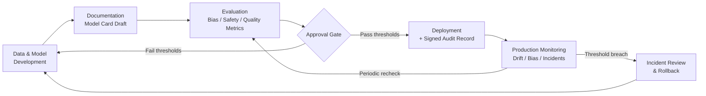

# AI Governance Explained: Turning Responsible AI Principles Into Engineering Practice

> Every company now has a "Responsible AI" page. Almost none of them have a system that stops an unfair, undocumented, unreviewed model from reaching production. This article is about building that system.

## The Problem: A Policy Nobody Can Enforce

Picture a mid-sized bank. Legal and the ethics committee spent six months writing a Responsible AI charter: the company will build AI systems that are fair, transparent, and accountable. It's a good document. It gets a page on the intranet, a slide in the all-hands deck, and a signature from the Chief Risk Officer.

Three months later, a data science team ships a credit-risk model that quietly scores applicants from certain zip codes lower — not because anyone told it to, but because the training data encoded decades of biased lending decisions. Nobody on the team was violating the charter on purpose. Nobody was violating it at all, in the sense of consciously breaking a rule. The rule simply had no mechanism attached to it. There was no step in the pipeline that asked "does this model treat groups differently?" There was no person whose job it was to check before the model went live. There was no record afterward showing who approved it, what data trained it, or what the evaluation results were.

When a regulator, a journalist, or an internal auditor eventually asks "how do you know this model is fair?", the honest answer is: nobody checked, and even if someone had, there's no artifact proving it.

This is the actual failure mode behind almost every "AI governance" story that ends up in the news. It is rarely a team that decided fairness didn't matter. It is a team that had no engineering surface where fairness, transparency, or accountability could attach — no gate, no document, no log, no owner. A principle without an enforcement point is a wish.

## Why This Problem Is Difficult

Governance is hard for AI systems in a way it wasn't for traditional software, for three structural reasons:

**1. The failure is statistical, not functional.** A biased loan model doesn't crash. It doesn't throw an exception. It returns a plausible-looking score every single time, and the harm is distributed across thousands of individual decisions, each of which looks fine in isolation. Traditional QA — "does the function return the right output for this input?" — doesn't catch a systemic disparity, because there usually isn't a single "wrong" input. The wrongness is in the aggregate pattern.

**2. The system keeps changing after it ships.** A model trained today can drift as the world changes, be fine-tuned again next quarter, or have its behavior altered by a prompt template change with no code review at all (see the prerequisite article on LLM engineering for how much behavior lives in prompts, not code). A governance control that only runs once, at initial launch, misses everything that happens after.

**3. Responsibility is diffuse by default.** A model touches data engineers (who chose the training data), ML engineers (who chose the architecture and hyperparameters), a platform team (who built the serving infrastructure), a product team (who decided what to do with the output), and end users (who experience the decision). "Everyone is responsible for responsible AI" sounds good in a charter and produces, in practice, a system where no single person owns the check. Compare this to application security: "everyone owns security" was also once the norm, and it produced exactly as many secure systems as you'd expect — which is why the industry moved to explicit gates (SAST/DAST in CI, mandatory security review for certain changes) rather than relying on good intentions alone.

## A Simple Mental Model

Think about how a bank actually prevents fraud. It doesn't rely on tellers being honest — it relies on cameras, dual-control on cash drawers, transaction limits that trigger manual review, and an audit trail that lets an investigator reconstruct exactly what happened after the fact. Honesty is necessary but nowhere near sufficient; the controls are what make honesty *verifiable* and dishonesty *expensive to hide*.

AI governance works the same way. "Our AI is fair and transparent" is the honesty. Model cards, bias evaluations, approval gates, and audit logs are the cameras and the dual-control locks. The principle tells you what you're aiming for; the engineering artifact is what lets anyone — including you, six months later — verify that you actually got there.

The analogy has a limit worth naming: bank fraud controls assume a known, finite set of bad actions (an unauthorized withdrawal). AI harms are often emergent and only visible in aggregate (a subtly skewed approval rate across a demographic group), so the "camera" for AI governance has to be a continuous statistical measurement, not a single audit rule. Keep that difference in mind as we get into monitoring later.

## Before We Continue

This article assumes you're comfortable with the building blocks these controls sit on top of:

- **Generative AI / ML basics** — what a model is, what training data and fine-tuning are, what "inference" means. If you haven't yet, the LLM engineering article in this series covers this.
- **Cloud platforms and containers/Kubernetes** — governance gates typically live inside a CI/CD pipeline and a model-serving platform; you don't need to be an expert, but you should know what a pipeline stage and a deployment are.
- **Basic security thinking** — asset, threat, control, residual risk. We'll reuse this vocabulary.

We will *not* re-derive what an LLM is or how Kubernetes schedules pods. This article is specifically about the layer above those: how you turn "be responsible" into something a pipeline actually checks.

## The Core Idea: Principles Need Enforcement Points

"Responsible AI" is usually described with three to five principles. The most common set:

| Principle | What it means in plain language | What happens without an engineering control |
|---|---|---|
| **Fairness** | The system doesn't produce systematically worse outcomes for some groups than others, for reasons unrelated to the legitimate purpose of the decision | Bias goes undetected until an external party (a regulator, a journalist, an affected user) finds it |
| **Transparency** | Someone outside the team that built the model can understand what it does, on what data, with what known limitations | Every question about the model ("why does it behave this way?") requires archaeology through Slack history and someone's memory |
| **Accountability** | A specific person or team can be named as responsible for a decision the system made, and there's a record of who approved what | When something goes wrong, there's no way to reconstruct who changed what, or why the change was allowed |
| **Privacy** | The system doesn't leak, retain, or infer more about individuals than its stated purpose requires | Training data or logs become a silent secondary use of personal data nobody consented to |
| **Safety / Reliability** | The system behaves predictably within its intended operating range and fails safely outside it | Edge cases and out-of-scope use are discovered by users in production, not by testers before launch |

Each principle in the left column is a *value judgment*. Each row in the right column is a *systems failure*, and systems failures are fixed with systems, not with better values. The engineering practice that closes each gap is specific and buildable:

- Fairness → **bias evaluation with quantitative thresholds**, run automatically before and after deployment.
- Transparency → **model cards**: a standardized document that ships with the model, not alongside it in someone's memory.
- Accountability → **audit trails and approval gates**: an immutable record of who trained, evaluated, and approved a model, wired into the deployment path itself.
- Privacy → **data lineage tracking and access controls** on training and logging data (this overlaps heavily with the identity-governance practices covered in the IGA article in `related`).
- Safety/Reliability → **production monitoring** for drift, anomalous outputs, and out-of-scope usage, with defined rollback procedures.

The rest of this article is about the middle three — model cards, approval gates, audit trails, and monitoring — because they're the mechanism that makes the other two enforceable too.

## How It Actually Works: The Governance Lifecycle

Governance isn't a single checkpoint; it's a lifecycle that runs alongside the model's own lifecycle, from training to retirement.



Walk the loop once in words:

1. **Development** produces a candidate model — a fine-tuned LLM, a classifier, a scoring pipeline.
2. **Documentation** happens *before* the model is considered done, not after, because a model card written from memory two months later is a work of fiction. The card records intended use, known limitations, training data provenance, and evaluation methodology.
3. **Evaluation** runs the model against fairness metrics, safety test suites, and quality benchmarks, and produces numbers — not opinions.
4. **The approval gate** is the enforcement point: a human, a policy engine, or (usually) both, compares the evaluation numbers against pre-agreed thresholds. This is the step most organizations skip, which is exactly why skipping it is the root cause in most public AI governance failures — the evaluation might even have existed, but nothing *stopped* deployment when it failed.
5. **Deployment** only happens after the gate passes, and it happens with a signed record: which model version, which data version, which evaluation report, who approved it.
6. **Monitoring** doesn't stop once the model is live — drift in the input distribution or in the model's own outputs can silently move a model from "fair" to "not fair" without a single line of code changing.
7. **Incident review** feeds back into development: if monitoring or an external report surfaces a problem, there needs to be a defined path back to retraining or rollback, with its own audit trail.

Notice what makes this different from a policy document: every box in that diagram is something a machine can check, log, or block. That's the entire point.

## Let's Walk Through an Example

Back to the bank. Suppose they'd built the lifecycle above instead of just the charter. Here's what would have actually happened:

**Development.** The team fine-tunes a gradient-boosted model (this doesn't need to be a giant LLM — governance applies to any consequential automated decision, and credit scoring is a textbook example under existing fair-lending law) on five years of loan outcomes.

**Documentation.** Before anyone can request a deployment, the pipeline requires a model card with, at minimum: the training data's source and date range, the intended use ("second-stage risk scoring, human loan officer makes final decision"), explicitly out-of-scope uses ("not validated for auto lending, not to be used as sole basis for denial"), and the fairness metric that will be measured.

**Evaluation.** An automated job computes disparate impact — the ratio of approval rates between a protected group and the reference group — across the zip-code feature the team didn't realize was acting as a proxy for race. The number comes back at 0.71. Many fair-lending compliance frameworks flag anything under roughly 0.8 as requiring further investigation (this is the "four-fifths rule" heuristic used in U.S. employment discrimination analysis, adapted by many fairness practitioners to other domains — treat the exact figure as a starting point for your own legal and compliance review, not a universal legal threshold).

**Approval gate.** The pipeline's policy check compares 0.71 against the team's own pre-committed threshold of 0.8 and fails the build. No human even has to be in the loop to catch this instance — the number failed, so the deployment doesn't happen. This is the difference between "we care about fairness" and "we cannot deploy an unfair model even if we forget to check," which is the entire value of automating the gate.

**Back to development.** The team investigates, finds the zip-code proxy, removes or transforms the feature, retrains, and re-runs evaluation. The new disparate impact ratio is 0.89. The gate passes.

**Deployment with audit record.** The system logs: model version `credit-risk-v14`, trained on data snapshot `2026-08-01`, evaluated by pipeline run `#4821`, disparate impact `0.89`, approved by the on-call ML lead, deployed at a specific timestamp.

**Monitoring.** Three months later, the input population shifts (a new customer acquisition channel brings in a different demographic mix). A weekly re-evaluation job — not a one-time check — recomputes disparate impact on live traffic and flags a drop to 0.79. This alerts the team before a regulator or a lawsuit does.

Nothing in this walkthrough required new AI research. It required wiring existing evaluation techniques into a pipeline that could say "no."

## Under the Hood: What These Artifacts Actually Contain

### The model card

The term comes from a well-known 2019 research paper by Margaret Mitchell and colleagues at Google, "Model Cards for Model Reporting," which proposed a standardized, short document accompanying every trained model — the ML equivalent of a nutrition label. The exact schema varies by organization, but a useful minimum includes:

```yaml
model_card:
  name: "credit-risk-v14"
  owner_team: "risk-modeling"
  version: "14.0.0"
  training_data:
    source: "internal loan outcomes warehouse"
    snapshot_date: "2026-08-01"
    known_gaps: "under-represents applicants under 3 years credit history"
  intended_use:
    - "second-stage risk scoring; human loan officer makes final decision"
  out_of_scope_use:
    - "sole basis for denial without human review"
    - "auto lending or any product outside residential mortgage"
  evaluation:
    fairness_metric: "disparate impact ratio (protected group / reference group)"
    fairness_result: 0.89
    fairness_threshold: 0.80
    quality_metric: "AUC-ROC"
    quality_result: 0.83
  limitations: >
    Not validated on applicants with fewer than 2 years of credit history.
    Performance degrades on joint applications with mismatched income sources.
  approved_by: "jane.doe@bank.example (ML Lead)"
  approval_date: "2026-08-14"
```

The card is not decorative documentation — in a properly built pipeline, the fields under `evaluation` are populated *automatically* from the evaluation job's output, not typed in by hand, which is what keeps it truthful over time instead of drifting from reality the way hand-maintained wiki pages do.

### The audit trail

An audit trail for a model is not the same thing as application logs. It needs to answer, months later and under scrutiny: *who changed what, when, and who allowed it.* A minimal structured record per deployment:

```json
{
  "event": "model_deployment",
  "model_name": "credit-risk-v14",
  "model_version_hash": "sha256:3f9a1c...",
  "training_data_snapshot": "2026-08-01",
  "evaluation_run_id": "pipeline-run-4821",
  "evaluation_results": {
    "disparate_impact_ratio": 0.89,
    "auc_roc": 0.83
  },
  "gate_decision": "pass",
  "approver": "jane.doe@bank.example",
  "approval_timestamp": "2026-08-14T09:02:11Z",
  "deployed_by": "ci-pipeline-service-account",
  "deployment_timestamp": "2026-08-14T09:05:44Z"
}
```

Two properties matter more than the exact schema:

- **Immutability.** This record has to be write-once, append-only — stored somewhere a deploying engineer cannot quietly edit after the fact (a dedicated audit log store, or at minimum a log sink with restricted write and no delete permissions). An audit trail that the audited party can edit isn't an audit trail.
- **Linkage.** The record must reference the *specific* model artifact (by hash, not just by name/version string, which can be reused or overwritten) and the *specific* evaluation run that produced the numbers. "We ran a fairness check at some point" is not accountability; "run #4821, this exact hash, these exact numbers, this named approver" is.

### The approval gate

The gate is the piece that actually has teeth. It can be implemented at two levels, and mature setups use both:

- **Policy-as-code**, evaluated automatically in the pipeline — a hard, machine-checked threshold (like the disparate-impact example above). Tools like Open Policy Agent (OPA)/Rego are commonly used for this kind of automated policy check in CI/CD generally; treat the specific tool as one option among several rather than a required dependency.
- **Human-in-the-loop review**, required for anything the automated check can't fully capture — new use cases, higher-risk decision categories, or metrics that came back borderline rather than clearly pass/fail.

## Implementation: A Governance Gate in a CI/CD Pipeline

Here's a simplified but realistic shape of what this looks like wired into a pipeline. The important part isn't the exact YAML dialect — it's the *shape*: documentation and evaluation are inputs the gate step reads, and the gate step's exit code is what the deployment step obeys.

```yaml
# .ci/pipeline.yml (illustrative — adapt to your CI system)
stages:
  - train
  - document
  - evaluate
  - governance_gate
  - deploy

governance_gate:
  stage: governance_gate
  script:
    - python governance_gate.py \
        --model-card artifacts/model_card.yaml \
        --eval-report artifacts/eval_report.json \
        --policy policy/fairness_thresholds.yaml
  # Deployment is a separate stage that only runs if this one exits 0.
  # There is no path to "deploy" that skips this stage in the pipeline graph.
```

And the gate script itself, doing the two things a gate must do — check that the documentation exists and is complete, and check that the numbers clear the bar:

```python
# governance_gate.py
# Requires Python 3.9+ (uses PEP 585 built-in generics like list[str]).
import argparse
import sys
import json
import yaml

REQUIRED_CARD_FIELDS = [
    "name", "owner_team", "training_data", "intended_use",
    "out_of_scope_use", "evaluation", "limitations", "approved_by",
]

def load(path, is_yaml=False):
    with open(path) as f:
        return yaml.safe_load(f) if is_yaml else json.load(f)

def check_model_card_complete(card: dict) -> list[str]:
    missing = [f for f in REQUIRED_CARD_FIELDS if not card.get("model_card", {}).get(f)]
    return [f"model card missing required field: {f}" for f in missing]

def check_thresholds(eval_report: dict, policy: dict) -> list[str]:
    failures = []
    for metric, rule in policy["thresholds"].items():
        value = eval_report.get(metric)
        if value is None:
            failures.append(f"required metric not evaluated: {metric}")
            continue
        direction = rule.get("direction")
        if direction == "min" and value < rule["value"]:
            failures.append(
                f"{metric}={value} below required minimum {rule['value']}"
            )
        elif direction == "max" and value > rule["value"]:
            failures.append(
                f"{metric}={value} above required maximum {rule['value']}"
            )
        elif direction not in ("min", "max"):
            # Fail closed: an unrecognized or missing direction must never
            # be silently treated as "no constraint" for a security gate.
            failures.append(
                f"policy for {metric} has invalid direction {direction!r} "
                "(must be 'min' or 'max')"
            )
    return failures

def parse_args():
    parser = argparse.ArgumentParser()
    parser.add_argument("--model-card", required=True)
    parser.add_argument("--eval-report", required=True)
    parser.add_argument("--policy", required=True)
    return parser.parse_args()

def main():
    args = parse_args()
    card = load(args.model_card, is_yaml=True)
    eval_report = load(args.eval_report)
    policy = load(args.policy, is_yaml=True)

    failures = check_model_card_complete(card) + check_thresholds(eval_report, policy)

    if failures:
        print("GOVERNANCE GATE: FAILED")
        for f in failures:
            print(f" - {f}")
        sys.exit(1)  # non-zero exit blocks the deploy stage

    print("GOVERNANCE GATE: PASSED")
    sys.exit(0)

if __name__ == "__main__":
    main()
```

Two things are worth calling out explicitly, because they're where teams get the implementation subtly wrong:

- **The threshold values live in a policy file, not in the script.** That means changing a fairness threshold is a reviewable, diffable change to `policy/fairness_thresholds.yaml` — itself something you'd want under the same approval process as the model, not a silent edit buried in application code.
- **A missing metric is a failure, not a pass.** A common bug in home-grown gates is treating "field not present" the same as "check not applicable," which silently lets undocumented or unevaluated models through. The gate above explicitly fails closed.

## What Can Go Wrong

**Governance theater.** The model card exists, the gate exists in the pipeline definition — but the thresholds are set so loosely that nothing ever fails, or the card's `evaluation` fields are hand-typed instead of populated from the actual evaluation run. This produces every artifact an auditor would ask for, with none of the substance. The tell is usually that the fairness threshold has never once caused a build to fail; a gate that never rejects anything is either measuring the wrong thing or set too low to matter.

**Shadow AI / shadow deployment.** A team routes around the governed pipeline entirely — calling a model directly from an application, or standing up a quick internal tool that calls a third-party LLM API — because the governed path is slower than just shipping. This is the single most common real-world failure mode, and it isn't solved by writing a stricter policy; it's solved by making the governed path fast enough that bypassing it isn't the rational choice, and by having *some* way to discover ungoverned AI usage (network egress monitoring to known model-API endpoints is a common practical control here).

**Stale model cards.** A model gets retrained or fine-tuned, but the card describing it doesn't get regenerated, because regeneration isn't wired into the same pipeline stage that produces the new artifact. Six months later the card describes a model that no longer exists in production. This is why the card fields should be generated from the evaluation run's actual output (as in the YAML example above), not maintained by hand in a wiki.

**Monitoring blind spots.** The team monitors overall accuracy and average latency — the metrics that were already being tracked for reliability reasons — but never wires up the *fairness* metric to run continuously in production, only at initial launch. Since fairness can degrade purely from population drift (as in the credit-risk example), a one-time check at launch tells you nothing about month six.

**Rubber-stamp human approval.** The human-in-the-loop step exists on paper, but the approver is given a link and five minutes before a release deadline, with no realistic way to evaluate a fairness report they didn't produce. A human gate without the time, context, or authority to say no is not a control — it's a liability shield.

## Security Considerations

Governance and security overlap more than most teams initially assume, and it's worth walking the same asset → threat → mitigation chain used elsewhere in this knowledge base:

- **Asset:** the model artifact, its training data, its evaluation results, and the audit trail itself.
- **Threat:** an insider (or a compromised CI credential) silently swaps a model artifact, edits an evaluation report to clear a threshold, or deletes an inconvenient audit entry after an incident.
- **Vulnerability:** an audit log with delete or edit permissions granted to the same service account that performs deployments; a model registry where "latest" is a mutable pointer rather than an immutable, hash-addressed artifact; a gate script whose policy thresholds live in the same repo and same review path as everything else, with no extra scrutiny.
- **Mitigation:** treat the audit trail as a security-critical system in its own right — write-once storage, a separate write-permission boundary from the deploy pipeline's own credentials, and cryptographic hashing of the model artifact referenced in every audit record (so "which exact model" is never in question). Treat changes to governance policy thresholds themselves as requiring the same or higher approval bar as a production code change, not less.
- **Residual risk:** even a well-built gate only checks what it was told to measure. A genuinely novel harm — one nobody wrote a metric for — will pass a gate that's only checking known fairness and safety dimensions. This is why periodic human review of the *gate's own coverage* (not just the model) is part of a mature program, not an optional extra.

If you've read the AI-agent security material in this knowledge base, you'll recognize the pattern: governance failures and security failures are often the same root cause — a decision point that trusted an artifact or a human step without verification — wearing different clothes.

## Common Misconceptions

**Misconception:** Responsible AI is an ethics or legal problem, not an engineering one.
**Reality:** Ethics and law define *what* matters (don't discriminate, be transparent about automated decisions). Engineering is the only thing that determines whether that definition is ever actually checked. A legal team can write the best fairness policy in the industry; if it's not wired into a pipeline that can block a deployment, it's advisory, not enforced.

**Misconception:** A model card is just documentation — it has no enforcement value.
**Reality:** A model card that's required as a pipeline input, with fields validated by the gate (as in the implementation above), *is* an enforcement mechanism — missing or incomplete documentation becomes a hard blocker, not a nice-to-have.

**Misconception:** Governance only matters for consumer-facing generative AI (chatbots, image generators).
**Reality:** The credit-risk example in this article is a classical ML model, not an LLM, and it's a textbook governance case. Any system that makes or materially influences a consequential decision about a person — lending, hiring, insurance pricing, content moderation, medical triage — is in scope, regardless of whether the underlying model is a gradient-boosted tree from 2015 or a fine-tuned LLM from this year.

**Misconception:** Once a model passes the gate at launch, it's "governed."
**Reality:** As the drift example showed, a model's fairness and safety properties can change after launch without any code change at all, purely because the world the model operates on changed. Governance without continuous monitoring only covers day one of what might be a multi-year deployment.

## Real-World Architecture

Most mature implementations of this pattern share the same four architectural pieces, regardless of cloud provider:

1. **A model registry** that stores model artifacts by immutable, hashed version, alongside their model cards and evaluation reports as first-class metadata — not as a separate wiki page someone has to remember to update. Major cloud ML platforms now ship native model-registry features with attached documentation and lineage (for example, AWS SageMaker and Google Cloud Vertex AI both publish official documentation on model registries with card-style metadata, and Microsoft's Azure Machine Learning documents a comparable Responsible AI dashboard and model-catalog feature set).

   > **Verification Note**
   > Exact feature names, UI locations, and capabilities for any specific cloud vendor's model registry or responsible-AI tooling change frequently. Verify current specifics against that vendor's own official documentation (AWS, Google Cloud, or Microsoft Learn) before relying on a particular feature name in a design document.

2. **A CI/CD pipeline with a dedicated governance stage** — the pattern shown in the Implementation section — sitting between evaluation and deployment, structurally unable to be skipped because deployment depends on its exit status.

3. **A policy engine** (whether a general-purpose one like OPA, or a purpose-built internal tool) that externalizes thresholds from code, so policy changes go through their own review path.

4. **A continuous monitoring layer**, usually built on the same observability stack used for infrastructure monitoring, extended with model-specific signals: input distribution drift, output distribution drift, and periodic re-computation of the same fairness metrics used at launch time — not just uptime and latency.

Two well-known frameworks are useful as a structural checklist even though neither is engineering-specific by itself:

- The **NIST AI Risk Management Framework (AI RMF)**, published by the U.S. National Institute of Standards and Technology, organizes governance activities into four functions — **Govern, Map, Measure, Manage** — which map cleanly onto the lifecycle diagram earlier in this article (Govern ~ policy and ownership, Map ~ documentation, Measure ~ evaluation and monitoring, Manage ~ the gate and incident response).
- The **EU AI Act** takes a risk-tiered regulatory approach — the exact tier a system falls into (for example, "high-risk" for many employment, credit, and safety-related AI uses) determines which obligations apply, including technical documentation, logging, and human oversight requirements that map directly onto model cards and audit trails.

  > **Verification Note**
  > Both frameworks have specific compliance deadlines, tier definitions, and enforcement details that continue to evolve. Verify current applicability, deadlines, and exact obligations against the official NIST publication and the official EU AI Act text (or current EU guidance) rather than relying on a general description here.

## Expert Insight

The single biggest trade-off in real governance programs is **gate weight versus velocity**, and the teams that get this wrong tend to fail in one of two opposite directions.

Fail one way — a single, heavyweight gate applied uniformly to every model, from an internal experiment with ten users to a system making million-dollar lending decisions — and engineers learn to route around governance entirely, which is how you get shadow AI. Fail the other way — no differentiation at all, "self-certify and ship" — and you get the bank example that opened this article.

The pattern that tends to work in practice is **risk-tiered gating**, deliberately mirroring how the EU AI Act itself is structured: classify a model's use case by potential impact (a low-stakes internal tool vs. a decision that affects someone's credit, employment, or safety) *before* development starts, and let the tier determine gate weight. A low-risk internal tool might need a lightweight, mostly-automated card and a single automated fairness/safety check. A high-risk model gets the full lifecycle in this article: mandatory human review, a named accountable approver, and continuous production monitoring. Applying the heavy version uniformly is not "extra safe" — it's a tax on velocity that predictably causes exactly the bypass behavior that makes the system less safe overall.

A second, quieter expert practice: **treat the gate's own false-negative rate as a metric you track**, the same way a security team tracks how many vulnerabilities its scanners miss. Every retrospective on an AI governance failure should ask not just "why did the model fail" but "why didn't the gate catch it" — and feed that answer back into the policy thresholds and evaluation suite, the same way a missed security vulnerability feeds back into what the SAST/DAST tooling checks for next time.

## Try It Yourself

**Goal:** Build a minimal, working governance gate you can point at any toy model, to feel the mechanics before you wire this into a real pipeline.

**Starting Point:** Any binary classifier you already have lying around (even a simple `scikit-learn` model trained on a public dataset like the UCI Adult Income dataset, which is commonly used in fairness tutorials precisely because it has a known demographic skew), plus predictions on a held-out test set that include a sensitive attribute column (e.g., a demographic group column) purely for measurement purposes.

**Task:**
1. Write a function that computes the disparate impact ratio: (positive-prediction rate for the disadvantaged group) ÷ (positive-prediction rate for the reference group).
2. Write a `model_card.yaml` for your model by hand, using the schema shown earlier in this article, and deliberately leave one required field blank.
3. Adapt the `governance_gate.py` script from the Implementation section to run against your card and your computed metric with a threshold of `0.8`.
4. Run the gate. Confirm it fails — twice, for two independent reasons (the missing field, and, if your model has the skew the Adult Income dataset is known for, likely the fairness threshold too).
5. Fix the model card, and either accept the result if the metric passes 0.8, or note in your own words what a real team would do next if it didn't (hint: look back at the "back to development" step in the walkthrough).

**Expected Result:** A gate script that produces two distinct, specific, human-readable failure reasons on the first run, and a clean pass after you fix the documentation gap — proving to yourself that "gate" here means an actual blocking check, not a report nobody reads.

**What You Learned:** The difference between measuring fairness and enforcing fairness is entirely in step 3 and 4 — the moment a non-zero exit code exists and something downstream actually respects it.

## Pause and Think

A team builds a beautiful model card template, fills it out for every model, and stores it in a shared drive folder. Six months later, an auditor asks to see the fairness evaluation for a model that's currently in production. It takes two days to find the right version of the card, and when they find it, its numbers don't match the model that's actually deployed, because the model was retrained twice since the card was written.

Has this team implemented AI governance?

### Answer

No — and this is the single most common gap in real organizations, which is exactly why it's worth pausing on. They've implemented AI *documentation*, which is a necessary ingredient but not the same thing. Governance requires that the artifact (the card), the check (the evaluation), and the gate (something that blocks deployment on failure or staleness) are structurally linked to the *specific deployed model version* — not stored in a general-purpose folder that has no connection to what's actually running. The fix isn't "remind people to update the wiki." The fix is making card generation an automatic output of the same pipeline stage that produces the deployable model artifact, exactly as shown in the Implementation section, so that a stale card and a stale model can't diverge — either both are current, or the pipeline never ran and nothing new deployed.

## Key Takeaways

- Responsible AI principles (fairness, transparency, accountability) describe *values*; they don't enforce themselves. Enforcement requires an engineering artifact and a blocking gate.
- Map each principle to a specific control: fairness → automated bias evaluation with real thresholds; transparency → machine-generated model cards; accountability → immutable, hash-linked audit trails and named approvers.
- The governance lifecycle isn't a one-time launch checklist — it's a loop that includes continuous production monitoring, because model behavior can degrade purely from real-world drift with no code change.
- A gate only has value if it can actually fail a build. If your fairness threshold has never once blocked a deployment, that's a signal to investigate the gate, not evidence the models are all fine.
- Treat the audit trail itself as a security-critical asset: write-once storage, separated write permissions from the deploying identity, and artifacts referenced by cryptographic hash rather than mutable version labels.
- Risk-tier your gates. A uniform heavyweight process on every model teaches engineers to bypass governance; a uniformly light process leaves you with the bank example from the top of this article.

## What to Learn Next

This article established *why* governance needs engineering enforcement and the shape of the lifecycle. The next article in this series, **AI Model Cards and Audit Trails: Documenting AI Systems for Accountability**, goes deep on the artifacts themselves — full schema design, how to auto-generate cards from pipeline metadata at scale, and how to design an audit trail that survives a real regulatory inquiry.

From there, two adjacent paths are worth following depending on what you're building next:

- If your concern is *who and what* is allowed to act on your AI systems (including the AI agents themselves), continue into the identity-governance material in `identity-access/` and `ai-security/` — the same accountability principle applies to non-human identities, not just to models.
- If your concern is *proving the model actually works* before it ever reaches the gate described here, the AI Evaluation series covers building the evaluation harnesses that feed the numbers this article assumed you already had.
