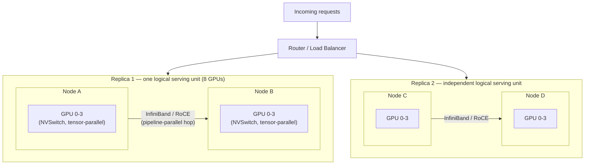

# GPU Clusters and Model Serving: How AI Compute Actually Scales

> By the end of this article you'll be able to explain, mechanically, what happens when a model is too big or too popular for one GPU — how the hardware is wired together, how a scheduler decides where things run, and how a serving framework turns a pile of interconnected accelerators into one coherent service.

## The Problem

*AI Infrastructure Explained* left off with a single GPU node quietly doing enormous amounts of work: tokenizing, batching, running the forward pass, streaming tokens back. That picture is honest as far as it goes, but it has a boundary drawn around exactly one machine. Two very ordinary things break that boundary immediately in production.

First: some models simply do not fit. A large model's weights, plus the KV cache for every in-flight request, can exceed what even the largest single GPU's memory holds. There is no setting, no optimization flag, no clever batching trick that makes weights larger than the GPU's memory somehow fit — the only fix is to put the model on more than one GPU at once.

Second: even a model that *does* fit on one GPU will get more traffic than one GPU can serve. A popular endpoint doesn't get one user, it gets thousands, and one GPU has a hard ceiling on concurrent throughput no matter how well it's batched.

Both problems have the same shape — "one accelerator isn't enough" — but they demand almost opposite solutions. The first means splitting *a single model* across multiple GPUs that must cooperate on *one* request. The second means running *many independent copies* of a model, each serving different requests, that must never need to talk to each other at all. Confusing these two is one of the most common conceptual mistakes in AI infrastructure, and this article exists to keep them permanently separate in your head — because the hardware, the scheduler, and the serving software each treat them completely differently.

## Why This Problem Is Difficult

Splitting one model across GPUs isn't like splitting a stateless computation across worker threads. During a single forward pass, GPUs that are cooperating on the same model must exchange partial results — sometimes many times *within* one layer's computation — fast enough that the coordination overhead doesn't cancel out the benefit of having more compute at all. That requirement rules out "just use the network you already have." A link fast enough to move files between servers is often far too slow to keep GPUs synchronized at the rate a transformer's attention and matrix-multiplication layers demand.

That's the hardware half of the difficulty. The other half is orchestration: a scheduler that's used to placing interchangeable, stateless pods now has to reason about *which specific GPUs* are wired to each other, *how fast*, and whether it can allocate a whole group of them atomically — because a job that gets 6 of the 8 GPUs it needs, with the rest queued behind someone else's workload, isn't running at reduced capacity, it's not running at all.

And underneath both of those, the serving software has to solve a third problem simultaneously: once you have many GPU groups (each one a full copy, or a shard, of the model), which group should handle the next request, and does it matter which one? It turns out it matters quite a bit, for reasons that have nothing to do with raw compute and everything to do with what's already sitting in a GPU's memory.

## A Simple Mental Model

Think of a single GPU as one delivery truck. One truck can only carry so much cargo (memory) and only drive so fast (compute). *AI Infrastructure Explained* covered what happens inside one truck. This article is about the depot.

When a shipment is too big for one truck, you don't build a bigger truck on demand — you convoy several trucks together, driving in tight formation so they can hand cargo between each other at speed (that's multi-GPU parallelism, and the "tight formation" is the interconnect). Convoying trucks is only practical over short, well-built roads (NVLink within a server); over long highways between depots, you need a different kind of coordination and a purpose-built freight corridor (InfiniBand or RoCE between servers), because ordinary city streets (commodity Ethernet) weren't built for that volume of hand-offs at that speed.

Separately, when the *depot* gets more delivery orders than one convoy can fulfill, you don't ask the existing convoy to drive faster — you stand up more convoys and need a dispatcher (the router/load balancer) deciding which convoy takes the next order. That dispatcher does a much better job if it remembers which convoy already has a route memorized (cached working state) instead of assigning purely at random.

Where the analogy strains: trucks don't actually merge into one bigger vehicle mid-drive. GPUs cooperating on tensor parallelism effectively do — for the duration of a forward pass, several physically separate chips behave as lanes of one wider compute unit, exchanging partial sums so fast that the seams should be invisible to correctness (though never invisible to latency). Keep that in mind: the "convoy" isn't a metaphor for teamwork, it's closer to several engines temporarily sharing one drivetrain.

## Before We Continue

This article builds directly on *AI Infrastructure Explained: The Stack Behind Every LLM Call* and assumes you already have those mechanisms available without re-derivation:

- **Prefill vs. decode**, and why decode is memory-bandwidth-bound.
- **The KV cache** — what it is, why it grows, and why it's the thing that usually exhausts GPU memory first.
- **Continuous batching** — why it beats static batching for asynchronous, independent request arrivals.
- **Tensor and pipeline parallelism**, at the level of "GPUs split either individual matrix operations or whole layers between them."

If any of those feel shaky, go back to that article first — this one goes *underneath* the model-serving box in its architecture diagram, into the hardware that makes multi-GPU cooperation possible at all, and the scheduling and routing logic that decides how a whole fleet of GPUs gets used.

## The Core Idea

There are really two independent scaling axes, and almost everything in this article is one of them:

- **Scaling a single model across GPUs** (because it doesn't fit, or one GPU can't hit the needed throughput alone) — this is a *tight-coupling* problem. The GPUs involved must communicate at very high speed and very low latency, because they're jointly computing one thing.
- **Scaling traffic across replicas** (because there's more demand than any single GPU group can serve) — this is a *loose-coupling* problem. Replicas don't talk to each other at all; the only shared concern is which replica a router sends the next request to.

Every layer below exists to serve one of those two axes:

- **Intra-node interconnects** (NVLink, NVSwitch) exist because tight coupling needs to happen at very high bandwidth and very low latency, and that's only affordable over short, purpose-built physical links inside one server chassis.
- **Inter-node fabrics** (InfiniBand, RoCE, RDMA) exist because sometimes tight coupling has to cross server boundaries anyway — a model too big even for one fully-loaded server — and ordinary data-center networking wasn't designed for that role.
- **Cluster schedulers with topology and gang-scheduling awareness** exist because placing a tightly-coupled GPU group is not the same problem as placing an independent pod, and a scheduler that doesn't know the difference will silently produce a slow or broken deployment.
- **Serving-fleet routing** exists because, once you have many independent replicas (or replica-groups), "which one handles this request" is a real optimization problem with a wrong answer (naive round robin) and a much better one (locality- and load-aware routing).

## How It Actually Works

### Inside one server: NVLink and NVSwitch

A server built for AI workloads typically holds several GPUs connected two ways at once: through the same general-purpose **PCIe** bus every other device in the server uses (storage, network cards, the CPU itself), and through a dedicated, GPU-to-GPU interconnect built for nothing else. PCIe is a shared, general-purpose bus — adequate for moving a model's weights from storage into GPU memory once, but not for the sustained, extremely high-bandwidth traffic that tensor parallelism requires *during* every forward pass.

That dedicated interconnect is what NVIDIA calls **NVLink**, and in servers with more than a couple of GPUs, those NVLink connections are typically routed through an **NVSwitch** — an all-to-all switching fabric inside the chassis, so that any GPU can talk to any other GPU in the same server at full interconnect bandwidth, rather than being limited to whichever GPUs happen to sit next to it on a point-to-point link. Without a switch, GPU 0 talking to GPU 3 might have to hop through GPU 1 and GPU 2, adding latency and stealing bandwidth those GPUs needed for their own work.

> **Verification Note**
> Exact NVLink/NVSwitch generation, per-link bandwidth, and how many GPUs a single NVSwitch domain spans are hardware-generation-specific and change with every new accelerator platform. Confirm current figures against the vendor's own datasheet before using them in a capacity plan — the mechanism (dedicated, switched, all-to-all GPU interconnect) is the durable fact; the numbers are not.

### Between servers: InfiniBand, RoCE, and RDMA

When a model needs more GPUs than fit in one chassis, the tight coupling has to cross a physical network — and a standard Ethernet link, built for general client-server traffic, usually isn't fast or low-latency enough to keep multiple servers' GPUs synchronized during a single forward pass.

Two purpose-built alternatives dominate here:

- **InfiniBand** — a networking technology built from the ground up for high-throughput, low-latency, lossless data-center interconnects, historically the default choice in HPC and AI supercomputing clusters.
- **RoCE (RDMA over Converged Ethernet)** — gets a similar programming model and much of the latency benefit on top of Ethernet hardware, trading some of InfiniBand's guarantees for compatibility with more conventional data-center networking.

Both exist to enable **RDMA (Remote Direct Memory Access)**: a mechanism that lets one machine read or write another machine's memory directly, without routing the data through the remote machine's CPU and operating-system network stack on every transfer. That matters enormously here, because the usual network path — kernel, sockets, context switches — adds latency and CPU overhead that a tightly-coupled, many-times-per-forward-pass exchange cannot afford. **GPUDirect RDMA** takes this one step further: it lets a network card read directly from, or write directly into, GPU memory, skipping a copy through host (CPU) memory that would otherwise sit in the critical path of every cross-node exchange.

> **Verification Note**
> Specific InfiniBand/RoCE bandwidth, latency figures, and which GPUDirect RDMA capabilities ship on which hardware/driver combination are vendor- and generation-specific. Treat any exact number as something to confirm against current vendor documentation, not as a fixed fact.

The practical consequence: tensor parallelism (splitting individual matrix operations) is almost always kept **within** a single NVSwitch domain — one server — because it needs the lowest possible latency, many times per forward pass. Pipeline parallelism (splitting whole layers) tolerates the higher latency of an inter-node fabric far better, because it only needs to hand off activations once per layer boundary rather than deep inside every matrix multiplication. This is the same trade-off *AI Infrastructure Explained* introduced — the interconnect story here is *why* that trade-off exists physically, not just conceptually.

### The cluster scheduler's real job

A scheduler placing a stateless web pod asks one question: "which healthy node has enough free CPU and memory?" A scheduler placing a multi-GPU serving job has to answer several harder ones at once:

- **Which GPUs are wired to each other, and how well?** Placing four tensor-parallel GPUs across four different servers, each reachable only over a slower inter-node fabric, doesn't just underperform — it can make the multi-GPU configuration slower than fewer GPUs would have been, because the communication overhead swallows the compute benefit.
- **Can I allocate the whole group atomically?** A job that needs 8 GPUs to run at all gains nothing from getting 6 now and 2 later — worse, if it partially starts, it may hold those 6 idle while waiting on the rest, starving other work that could have used them in the meantime. This need — allocate all of a group's resources together, or none of them — is called **gang scheduling**, and it is not something a general-purpose scheduler provides by default.
- **Should I pack tightly or spread out?** Bin-packing (filling nodes as densely as possible before opening new ones) minimizes fragmentation and cost. Spreading a workload across more physical failure domains improves availability. These pull in opposite directions, and the right answer depends on whether you're optimizing for GPU-hour cost or for blast-radius when a node fails.

Kubernetes, on its own, exposes GPUs to the scheduler through a **device plugin** model — GPUs show up as a discrete, non-shareable countable resource (`nvidia.com/gpu`), and the stock scheduler can bin-pack or spread pods using ordinary affinity and topology-spread rules. What stock Kubernetes does *not* know, without additional components, is which GPUs share an NVSwitch domain, which nodes share a rack-level InfiniBand fabric, or how to gang-schedule a job so it either gets everything it needs or nothing. Projects such as **Kueue** and **Volcano** exist specifically to add gang scheduling and more sophisticated queuing on top of Kubernetes for exactly this class of workload; vendor GPU operators layer in topology awareness on top of the base device-plugin mechanism.

> **Verification Note**
> Exact feature coverage and current maturity of any specific scheduling add-on (Kueue, Volcano, vendor GPU operators, or their equivalents) changes frequently. Confirm against that project's own documentation before depending on a specific capability.

### Distributing one model vs. distributing a fleet

This is the distinction the rest of the article has been building toward, and it's worth stating as plainly as possible:

**Splitting a model across a GPU group** (tensor parallelism within a node, pipeline parallelism across nodes, sometimes both together) produces *one logical serving unit* built from several physical GPUs. Every GPU in that group is necessary for every request that unit serves. Lose one GPU in the group, and the whole unit is broken, not degraded.

**Replicating that unit across many groups** is a completely separate scaling dimension — sometimes called **data parallelism** at the serving layer, though the term is more associated with training. Each replica is a complete, independent copy (or shard-group) of the model, capable of serving requests entirely on its own. Replicas don't need to communicate with each other at all. Losing one replica just means the fleet has one fewer unit of capacity — everything else keeps serving traffic.

A production deployment of a very large model typically has *both* dimensions active simultaneously: several GPUs cooperating tightly to hold and run one copy of the model, and several such groups running in parallel, independent of each other, to absorb traffic volume. Mixing up which dimension a given piece of infrastructure belongs to is a common source of confused capacity planning — adding GPUs to make a single request faster (more tensor-parallel shards) is a fundamentally different lever than adding GPUs to serve more concurrent users (more replicas), and past a point, the first lever stops helping at all while the second keeps paying off.

## Let's Walk Through an Example

Consider two versions of the same rollout, to make the two axes concrete.

**Version A — a mid-sized model, high traffic.** The model fits comfortably on a single GPU's memory. The problem is purely traffic volume. The fix is straightforward: run many independent replicas (one GPU each, or a small tensor-parallel group each) behind a router, and scale the *number of replicas* with demand. No cross-GPU cooperation is needed within a single request.

**Version B — a frontier-scale model, moderate traffic.** The model's weights alone exceed what fits on several GPUs combined, before a single token of KV cache is accounted for. Now tensor parallelism splits each layer's matrix operations across, say, four GPUs wired together by NVSwitch inside one server, and pipeline parallelism spans that unit across two servers connected by InfiniBand, so that one full copy of the model spans 8 physical GPUs across 2 nodes acting as one logical serving unit. *Then*, if traffic requires more throughput than that one 8-GPU unit can provide, the whole 8-GPU unit is replicated — a second 8-GPU group, on different hardware, running independently — and a router distributes requests across the two units exactly as it would in Version A.



Notice what's *not* connected in that diagram: nothing links Group 1 to Group 2. That absence is the point — replicas are deliberately independent, so that adding capacity never means adding more tight coupling, only more of the same self-contained unit.

## Under the Hood

### Why routing across replicas isn't just round robin

Round robin treats every replica as identical and stateless, which is a reasonable assumption for a plain web service but a costly one here, for a reason specific to how LLM serving actually works: the KV cache.

If two requests share a long common prefix — the same system prompt, the same few-shot examples, the same document context — and they land on the *same* replica, that replica may already have (or be able to reuse) cached attention state for the shared prefix, meaning it can skip recomputing the prefill work for everything the two requests have in common. Send the second request to a *different* replica at random, and that replica starts from nothing, redoing prefill work another replica had already effectively paid for.

This is why production routers for LLM fleets increasingly do **prefix-cache-aware routing** (sometimes called cache-aware or session-aware load balancing): routing requests that share a prefix toward the same replica when possible, rather than spreading purely by instantaneous load. It's a genuine trade-off against pure load balancing — a naive "always route by shared prefix" policy can overload one popular replica while others sit idle — so real systems blend cache affinity with load signals (queue depth, in-flight tokens, time since last request) rather than picking one strategy exclusively.

### Autoscaling a GPU fleet is not autoscaling a web fleet

*AI Infrastructure Explained* already noted that a new inference replica means loading potentially hundreds of gigabytes of weights before it's useful. At the cluster level, this shows up as an autoscaling design problem, not just a slow individual pod start: the signal that should trigger scale-out is queue depth or time-to-first-token creeping upward, not CPU utilization (a GPU-bound serving process can show misleadingly low CPU usage while its GPU and memory bandwidth are fully saturated), and the scale-out action itself needs enough lead time that new capacity actually arrives before the traffic spike that triggered it has already passed.

### Fault domains at the interconnect level

A tensor-parallel group is a single fault domain in a way independent replicas are not. If one GPU in an 8-GPU tensor-parallel group fails, hangs, or is preempted, the entire group typically has to stop and be replaced together — there's no meaningful "degrade gracefully to 7 GPUs" for a computation that assumed a fixed partition of every matrix across exactly 8 shards. This is a direct, unavoidable consequence of tight coupling: it buys you the ability to serve a model that wouldn't otherwise fit, at the cost of a larger blast radius per hardware failure. Pipeline-parallel stages spanning multiple nodes inherit the same property across node boundaries, which is part of why gang scheduling (allocate the whole group atomically, and typically also *replace* it atomically on failure) matters as much for reliability as it does for startup.

## Implementation

Two illustrative snippets — not a specific product's exact syntax, but the shape every serving framework and scheduler in this space converges on.

**Launching a serving engine that splits one model across a GPU group** (tensor-parallel within a node, pipeline-parallel across two nodes):

```bash
# Illustrative serving-engine invocation. Flag names and defaults are
# specific to each framework and change between versions — the shape
# (declare how many GPUs to split across, and along which dimension)
# is the durable, transferable idea.
serving-engine \
  --model large-model-checkpoint \
  --tensor-parallel-size 4 \
  --pipeline-parallel-size 2 \
  --port 8000
```

**Asking a cluster scheduler for a topology-aware, co-located GPU group**, rather than four GPUs that merely happen to be free somewhere:

```yaml
apiVersion: v1
kind: Pod
metadata:
  name: llm-tp-group-member
  labels:
    app: llm-inference
    tp-group: "replica-1"        # all pods in this label form one logical serving unit
spec:
  nodeSelector:
    gpu-interconnect: "nvswitch"  # only schedule onto nodes with a full NVSwitch domain
  affinity:
    podAffinity:                  # keep this tensor-parallel group on the same physical node
      requiredDuringSchedulingIgnoredDuringExecution:
        - labelSelector:
            matchLabels:
              tp-group: "replica-1"
          topologyKey: "kubernetes.io/hostname"
  containers:
    - name: serving-engine
      resources:
        limits:
          nvidia.com/gpu: 1   # this pod is one rank of the 4-GPU tensor-parallel group, not the whole group
```

A few things worth connecting back to the concepts above:

- `podAffinity` with `topologyKey: kubernetes.io/hostname` is doing the "keep tensor-parallel GPUs inside one NVSwitch domain" job described earlier — without it, the scheduler has no reason to avoid scattering this group across nodes connected only by the slower inter-node fabric.
- Nothing in this YAML expresses **gang scheduling** — plain Kubernetes will happily start 3 of these 4 pods and leave the 4th pending indefinitely if the cluster is tight on capacity, which is exactly the partial-allocation failure mode described earlier. Achieving true atomic all-or-nothing placement is what add-on schedulers (Kueue, Volcano, or a vendor operator built for this) are for — it is not something the base scheduler provides by itself.
- This YAML places *one* replica's GPU group. A second, independent `tp-group: "replica-2"` would be a completely separate set of pods with no affinity rule linking it to this one — deliberately, because the two replicas should never need to be co-located.

## What Can Go Wrong?

- **Topology-blind placement.** A scheduler (or a human) that treats all GPUs as interchangeable can place a tensor-parallel group across nodes connected by a slower fabric than intended. The result isn't just "somewhat slower" — communication overhead can exceed the compute benefit entirely, producing worse latency than running on fewer, better-connected GPUs would have.
- **Partial gang allocation.** Without gang scheduling, a multi-GPU job can get some of the GPUs it needs and sit holding them idle while waiting on the rest — simultaneously wasting capacity and never actually starting.
- **Fleet-wide cache misses from naive routing.** Pure round-robin (or random) routing across replicas throws away the prefix-cache locality benefit described above, inflating prefill work across the fleet even though the necessary state already existed somewhere.
- **Autoscaling signals that don't reflect GPU reality.** Scaling policies built around CPU utilization (copied from a standard web-service playbook) can fail to trigger, or trigger too late, because GPU and memory-bandwidth saturation don't always show up as CPU pressure.
- **Correlated failure inside a tightly-coupled group.** Because a tensor-parallel or pipeline-parallel group behaves as one unit, a single failed or preempted GPU can take down every request in flight on the entire group at once — a much larger blast radius per failure than an independent-replica architecture has.
- **Fabric contention across tenants.** On a shared inter-node fabric, one workload's heavy cross-node traffic (whether legitimate pipeline-parallel exchange or a misbehaving job) can degrade another tenant's latency on the same physical network, in ways that are harder to isolate than compute-cycle contention.

## Security Considerations

- **RDMA bypasses the usual network security stack.** Because RDMA is designed to let one machine read or write another's memory with minimal CPU and kernel involvement, traditional host-based network controls (packet filtering that assumes traffic transits the normal kernel networking path) don't automatically apply the same way. A GPU cluster's RDMA fabric needs its own access-control and segmentation model — don't assume the protections you rely on for ordinary TCP/IP traffic extend to it unmodified.
- **The interconnect fabric is a new lateral-movement surface.** In a multi-tenant cluster, a fast, low-latency fabric connecting many nodes is exactly the kind of high-bandwidth internal network an attacker who's compromised one node would want for lateral movement or data exfiltration. Segmenting that fabric by tenant, and not just by ordinary VPC/network boundaries, matters more here than in a typical stateless-service cluster.
- **The scheduler is a higher-value target than usual.** A component with the authority to gang-schedule GPU groups, and to decide which physical hardware a given tenant's model lands on, has significant blast radius if compromised — including the ability to influence which workloads share a physical fault domain or fabric segment with which other workloads.
- **Topology metadata itself can be sensitive.** Knowledge of which physical nodes or rack a given customer's or model's workload runs on can be useful reconnaissance in a shared cluster (for targeting noisy-neighbor attacks or attempting to co-locate with a specific victim workload) — treat detailed topology and placement information with the same care as other internal infrastructure metadata.
- **Cross-node GPUDirect RDMA paths need the same weight-protection discipline as local storage.** If model weights or intermediate activations are ever transferred node-to-node over RDMA, the confidentiality and integrity of that path deserves the same scrutiny given to weight storage at rest — a fast internal fabric is still a data path, not an inherently trusted one.

## Common Misconceptions

**Misconception:** "More GPUs in the cluster means the scheduler can put a multi-GPU job anywhere there's free capacity."
**Reality:** Free capacity is necessary but not sufficient. If the available GPUs aren't well-connected to each other (same NVSwitch domain for tensor parallelism, adequate inter-node fabric for pipeline parallelism), placing the job there can make it slower than not splitting the model as widely at all.

**Misconception:** "GPU cluster scheduling is just Kubernetes bin-packing with a different resource type."
**Reality:** Bin-packing answers "is there room," not "will these specific GPUs cooperate fast enough" or "can I get all of them atomically." Both of the latter questions need topology awareness and gang scheduling that the base scheduler doesn't provide on its own.

**Misconception:** "Load balancing across model replicas is the same problem as load balancing across any stateless service replicas."
**Reality:** Replicas here can carry meaningfully different cached state (via the KV cache and prefix locality) even though they're running the identical model — so where you route a request can change how much redundant work gets done, in a way plain stateless load balancing never has to consider.

**Misconception:** "InfiniBand and NVLink are just faster versions of a normal network link."
**Reality:** They're built on a different mechanism — RDMA, which lets memory be read or written directly, largely bypassing the CPU and kernel network stack that ordinary networking depends on. That's a difference in kind, with its own performance characteristics, failure modes, and security posture, not just a difference in speed.

## Real-World Architecture

- **Hyperscale managed inference platforms** hide essentially everything in this article behind a single API surface — a developer calling a hosted model endpoint never sees the NVSwitch domain, the InfiniBand fabric, or the gang-scheduling logic underneath, but all of it is still there, operated by the provider.
- **Self-managed Kubernetes GPU clusters** are where teams most directly confront the concepts here: device plugins expose GPUs as a schedulable resource, vendor GPU operators add topology and health awareness on top, and gang-scheduling add-ons (Kueue, Volcano, or equivalents) close the gap between "Kubernetes can place a pod" and "Kubernetes can atomically place a whole tensor-parallel group."
- **HPC-heritage schedulers** (the Slurm-style batch schedulers long used in supercomputing) are the other common pattern, particularly on the training side of this stack, and natively support gang scheduling and rigid, topology-aware placement in ways Kubernetes had to grow additional components to approach — a difference in heritage (interactive web-service orchestration vs. batch HPC job scheduling) that still shows up in how naturally each platform handles this workload.
- **Purpose-built serving frameworks** (dedicated inference servers responsible for continuous batching, KV cache management, and multi-GPU coordination) are what actually implement the tensor/pipeline parallelism and prefix-cache-aware routing described above — the cluster and interconnect layers this article covers are what those frameworks run *on top of*.

> **Verification Note**
> Specific product names, current feature sets, and which scheduling/serving framework leads on any particular capability change quickly in this space. Confirm current specifics against the relevant vendor's or project's own documentation before making a design decision that depends on them.

## Expert Insight

The most consequential decision in a multi-GPU deployment often isn't which parallelism strategy to use — it's **where to draw the boundary between tight coupling and replication**. Teams that default to maximum tensor-parallel width "for performance" frequently discover that beyond a certain group size, added GPUs buy less and less speedup per request while making every failure more expensive (a bigger fault domain) and every placement decision harder (a bigger, harder-to-fit group for the scheduler). The experienced move is usually to find the smallest GPU group that serves one request acceptably, and scale everything past that point through replication instead — because replication failures are cheap (lose one unit of capacity) and tight-coupling failures are not (lose the whole group's in-flight requests at once).

The second thing that surprises teams moving from standard Kubernetes operations into GPU clusters: **the scheduler you already trust probably isn't gang-aware, and you will only discover this under load.** A cluster that looks perfectly healthy in normal conditions — jobs start, GPUs get allocated — can start silently wasting capacity the moment contention appears, because partial allocations sit holding resources without making progress, and nothing in a standard dashboard distinguishes "GPU allocated and working" from "GPU allocated and waiting on the rest of its gang." Verifying gang-scheduling behavior *before* a capacity crunch, not during one, is one of the cheapest reliability investments available in this space.

## Try It Yourself

**Goal:** Observe the difference between tight-coupling placement and replica-level load balancing without needing a real multi-node GPU cluster.

**Starting Point:** A local machine with two or more GPUs (or, failing that, a small serving engine configured to simulate multiple workers on CPU is enough to observe the routing behavior, even without real interconnect effects).

**Task:**
1. Launch a serving engine configured to split a small model across two GPUs (tensor-parallel size 2) and note the startup behavior — specifically, whether it starts serving *any* traffic before both GPUs are ready.
2. Separately, launch two fully independent replicas of a small model (no parallelism, one GPU each) behind a simple round-robin proxy, and send it a burst of concurrent requests that repeat a long shared prefix. Watch whether response latency for later requests improves when they land on a replica that already handled an earlier, similar request.
3. Kill one process in each setup (one GPU worker in the tensor-parallel group, one full replica in the independent-replica setup) and compare what happens to in-flight requests in each case.

**Expected Result:** The tensor-parallel setup should refuse to serve *anything* until all its GPUs are ready, and killing one GPU worker should break every in-flight request on that group. The independent-replica setup should keep serving through the surviving replica, and requests routed to the same replica as an earlier, similar request should show a measurable latency advantage.

**What You Learned:** Tight coupling and replication aren't just different configuration flags — they produce genuinely different failure and performance behavior that you can observe directly, even on hardware far smaller than a production cluster.

## Pause and Think

Why does tensor parallelism almost always stay within a single server (one NVSwitch domain), while pipeline parallelism regularly spans multiple servers connected by InfiniBand or RoCE?

### Answer

Tensor parallelism splits *individual matrix operations* across GPUs — meaning the GPUs in the group must exchange partial results many times during the computation of a single layer, at a frequency and volume that only a very high-bandwidth, very low-latency link (NVLink through an NVSwitch fabric) can sustain without the coordination overhead swallowing the compute benefit. Pipeline parallelism splits *whole layers* across GPUs instead — each stage hands off a complete activation to the next stage once per layer boundary, which happens far less often and can tolerate meaningfully higher latency per hand-off. That difference in *how often* communication has to happen is exactly why tensor-parallel groups are built to stay inside one NVSwitch domain, while pipeline-parallel stages can reasonably span nodes connected by a slower (though still purpose-built) inter-node fabric.

## Key Takeaways

- "One accelerator isn't enough" is actually two separate problems: a model too big for one GPU (needs tight, multi-GPU cooperation) and traffic too high for one GPU (needs independent, replicated capacity) — and they demand different hardware, scheduling, and software treatment.
- Intra-node interconnects (NVLink/NVSwitch) and inter-node fabrics (InfiniBand/RoCE, via RDMA and GPUDirect RDMA) exist because tightly-coupled multi-GPU computation needs bandwidth and latency that general-purpose networking can't provide — and the physical distance/speed trade-off between them is exactly why tensor parallelism stays within a server while pipeline parallelism can cross servers.
- Cluster schedulers need topology awareness (which GPUs are well-connected) and gang scheduling (allocate a multi-GPU group atomically) that a general-purpose, stateless-pod scheduler doesn't provide by default.
- Distributing one model across a GPU group and distributing traffic across many replicas of that group are different scaling axes with different failure properties: a tightly-coupled group fails as a unit, while replicas fail independently.
- Fleet-level routing benefits from being cache-aware (routing to a replica that already holds relevant KV-cache state), not just load-aware — a distinction plain round-robin load balancing has no way to express.
- The interconnect fabric, the scheduler, and topology metadata each introduce security considerations beyond standard multi-tenant compute isolation, because RDMA-based fabrics don't sit inside the usual network security stack the same way ordinary TCP/IP traffic does.

## What to Learn Next

This article stayed on the serving side of the stack — how a trained model gets split and replicated to answer live traffic. The next article in this series, *Understanding AI Supercomputing: Networking, Storage, and Scheduling for Training*, crosses over to the other half of AI infrastructure: the networking, storage, and scheduling patterns that dominate when the workload is training a model from scratch rather than serving one — a setting where the bottlenecks, the tolerance for restarts, and the definition of "utilization" all differ from what this article covered.
