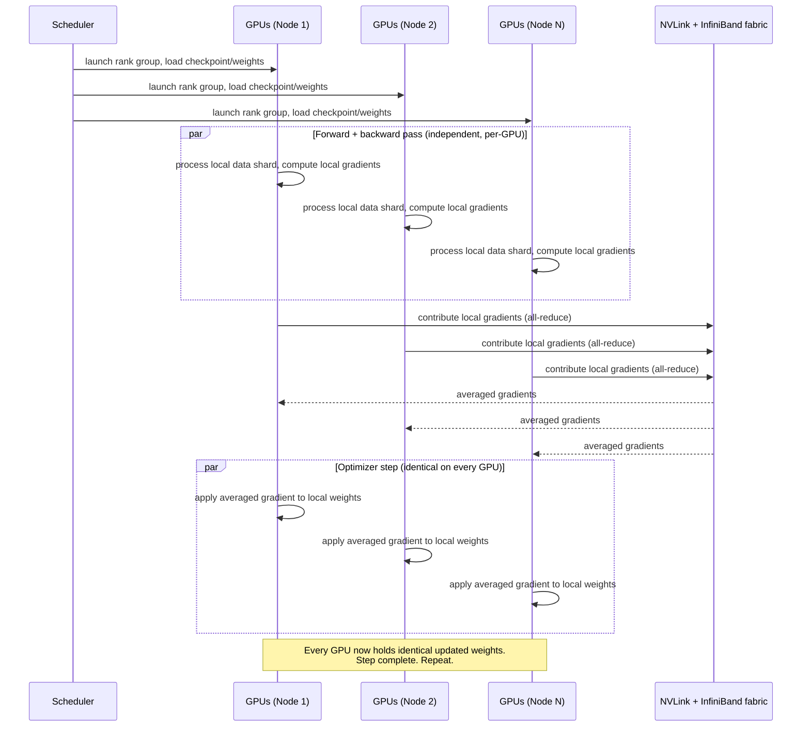

# Understanding AI Supercomputing: Networking, Storage, and Scheduling for Training

> By the end of this article you'll understand what actually turns a rack of GPUs into an "AI supercomputer" for training — not marketing language, but the specific networking, storage, and scheduling engineering that lets thousands of separate physical machines behave as one synchronized computer for weeks at a time.

## The Problem

Picture a training job that needs 512 GPUs, spread across 64 physical servers, running continuously for three weeks to train a single model. Every one of those GPUs is computing gradients on a different slice of data. Before any of them can take a single optimizer step, they all have to agree — exactly, numerically — on the *average* of everyone's gradients. Then they all take that step together, and do it again. Millions of times.

Now ask the question that "just add more GPUs" quietly assumes away: what happens when GPU #347 finishes its share of the work 200 milliseconds after everyone else, because the network path to it happened to cross a busier switch? The answer is that all 511 other GPUs — each one a very expensive, otherwise idle piece of hardware — sit and wait. Training is not "many independent workers doing their own thing and reporting back occasionally," the way a web crawler or a batch ETL job is. It's closer to a single, enormous, synchronous computation that happens to be physically distributed across a building full of machines. Every step is a barrier: nobody moves forward until everybody has arrived.

That single fact — that training is a tightly synchronized, lock-step computation, not a loosely coupled batch of independent work — is what makes an "AI supercomputer" a fundamentally different kind of infrastructure than a normal data-center cluster, and it's why this article exists as a companion to (not a repeat of) the inference-serving story. [*AI Infrastructure Explained*](./601-ai-infrastructure-explained.md) covered how a cluster serves many independent, bursty requests from many users. Training is the opposite shape of problem: one enormous, predictable, all-or-nothing job that needs the entire cluster to move in lockstep, for days or weeks, without ever quite stopping.

## Why This Problem Is Difficult

Three properties of large-scale training make it a genuinely different infrastructure problem than either inference serving or classic distributed computing:

1. **It's synchronous by default.** The most common way to train across many GPUs — data parallelism — requires every GPU to finish its local computation and then combine results with every other GPU *before any of them can proceed*. Unlike a web service where a slow request only affects the user who made it, one slow GPU in a training step slows down the entire job. There's no "let the fast ones finish and move on" option built in; you have to engineer around it.
2. **The network isn't a side channel — it's on the critical path of the actual computation.** In a typical distributed system, the network moves requests and responses between otherwise-independent units of work. In a training cluster, GPUs are exchanging enormous tensors of gradient data *inside* the timing budget of a single training step. If that exchange is slow, the GPUs — which are the expensive resource you bought specifically for their compute — sit idle waiting on data to move. Network bandwidth and latency become as central to your GPU utilization as the GPUs themselves.
3. **The job is long enough that failure isn't an edge case — it's a certainty.** A training run spanning hundreds of GPUs for multiple weeks will experience hardware failures during that window, as a matter of basic reliability math, not bad luck. A scheduler and a data pipeline built for "this will probably just work" don't survive contact with a real frontier-scale training run; the infrastructure has to assume interruption is normal and design for cheap, fast recovery.

Put together: you need a network fast enough that synchronization doesn't dominate your step time, storage fast enough that GPUs are never waiting on data, and a scheduler that treats "give me all N nodes at once, and get me back to where I was after one of them dies" as the default case, not a special one.

## A Simple Mental Model

Think of a large training run as a rowing crew, not a group of freelancers.

A group of freelancers (the inference-serving mental model from the previous article) can each work at their own pace on their own tasks — nobody needs to move in sync with anyone else. A rowing crew is different: every rower has to pull their oar at exactly the same moment, at exactly the same pace, or the boat doesn't just go slower — it becomes unstable and inefficient for everyone, because the rowers who *are* in sync are fighting the water disturbance created by the ones who aren't. The coxswain calling the stroke rate is the scheduler; the boat's rigging holding everyone's oar to the same hull is the network fabric; and the fact that the whole crew has to stop and wait if even one rower's oar breaks is exactly what happens when one GPU in a training job stalls or fails.

Where the analogy breaks down: a rowing crew is only ever as fast as its slowest member for that one stroke, but a training cluster has a second dimension a boat doesn't — it also has to keep an enormous, continuous supply of "fuel" (training data) flowing to every rower fast enough that nobody's arms are ever idle waiting for the next stroke's worth of energy to arrive. That's the storage half of this article, and it's every bit as important as the synchronization half.

## Before We Continue

This article builds directly on ground covered elsewhere in this knowledge base and assumes you're comfortable with:

- **The GPU/cluster fundamentals from *AI Infrastructure Explained*.** In particular, why GPUs are used for this workload at all, and the idea of tensor and pipeline parallelism — splitting a model too large for one GPU across several. This article assumes that background and focuses on the *training-specific* consequences: the data-parallel dimension, the network fabric that makes any of this possible at scale, and the scheduling layer that keeps it running for weeks.
- **General cluster orchestration concepts** — nodes, pods, schedulers, and the basic idea of a workload manager deciding where work runs. If terms like "scheduler," "node," and "pod" are unfamiliar as cluster-orchestration concepts, start with *Why Kubernetes Exists*.
- **What a model's forward and backward pass actually compute**, at least at the level of "the backward pass produces gradients that get used to update weights." If gradients, backpropagation, or the transformer architecture itself are new territory, *The Transformer Architecture: Encoder-Decoder Blocks and Self-Attention* is the right prerequisite.

We won't re-derive backpropagation or re-explain what a GPU is here — this article is about the physical and systems engineering that lets many GPUs act as one training machine.

## The Core Idea

Everything in this article exists to answer one question: **how do you make hundreds or thousands of physically separate machines behave, for the purposes of one training run, as if they were a single computer with one enormous GPU and one enormous, infinitely fast disk?**

That framing explains why each piece exists:

- You need **fast intra-node interconnects** (NVLink/NVSwitch) because GPUs within the same physical server need to exchange data so frequently, and in such large volumes, that even a fast standard network link would become the bottleneck.
- You need **fast inter-node fabrics** (InfiniBand or RDMA-capable Ethernet) because the moment your job spans more than one server — which any serious training run does — the same synchronization traffic now has to cross physical machine boundaries, and it has to do so without falling back to the general-purpose, higher-latency networking stack that ordinary applications use.
- You need **collective communication algorithms** (all-reduce, among others) because "every GPU needs the average of everyone's gradients" is a specific, well-studied communication pattern, and doing it naively (every GPU sending its full gradient to every other GPU) would swamp any network, however fast.
- You need **storage engineered for sustained aggregate throughput** because a cluster of idle GPUs waiting on the next batch of training data is exactly as wasteful as idle GPUs waiting on a slow network — and because the same storage layer also has to absorb enormous, bursty writes every time the job checkpoints its progress.
- You need a **scheduler built for gang allocation and fault tolerance** because a training job doesn't want "some" of its requested capacity — it needs all N nodes at once, atomically, and it needs a credible plan for what happens the moment one of those N nodes disappears mid-run.

Every section below is really an answer to: "what would go wrong, specifically, if this layer didn't exist or wasn't purpose-built for training?"

## How It Actually Works

Here's the shape of a distributed training job, end to end, deliberately drawn at the level of "what has to physically happen," not any one framework's API:

```
 +--------------------------------------------------------------+
 |                      Training Job (N GPUs)                   |
 |                                                                |
 |   Node 1                Node 2                 Node K         |
 |  +--------+            +--------+             +--------+      |
 |  | GPU 0..7|<--NVLink-->| GPU 0..7|<--NVLink-->| GPU 0..7|     |
 |  |(NVSwitch)|           |(NVSwitch)|            |(NVSwitch)|    |
 |  +----+---+            +----+---+             +----+---+      |
 |       |                     |                       |         |
 |       +----- InfiniBand / RDMA fabric (leaf-spine) --+         |
 |                              |                                 |
 |                     +--------+---------+                       |
 |                     |  Parallel / high-  |                     |
 |                     |  throughput storage |                     |
 |                     |  (training shards,  |                     |
 |                     |   checkpoints)      |                     |
 |                     +--------------------+                     |
 +--------------------------------------------------------------+
                              ^
                              |
                  Scheduler (Slurm or K8s-based):
                  allocates all K nodes atomically,
                  restarts the job on failure
```

Walking through the layers:

**Inside a node.** Each server typically holds several GPUs (commonly eight in modern training servers). Those GPUs need to move data between each other constantly — for gradient synchronization within the node, and for tensor/pipeline parallelism when a model is split across them. This traffic is handled by **NVLink**, a direct GPU-to-GPU interconnect, often fanned out through an **NVSwitch** so that every GPU in the server can talk to every other GPU at full speed rather than being limited to whichever GPUs happen to be physically adjacent.

**Between nodes.** The moment your job needs more GPUs than fit in one server, that same gradient-synchronization traffic has to leave the box. This is where a specialized fabric — most commonly **InfiniBand**, or increasingly RDMA-capable Ethernet (**RoCE** — RDMA over Converged Ethernet) — takes over. The defining feature of both is **RDMA** (Remote Direct Memory Access): one machine's network card can write directly into a registered region of another machine's memory without routing that data through the receiving machine's CPU or general-purpose networking stack. Reaching GPU memory specifically — rather than staging through host RAM first — requires an additional capability called **GPUDirect RDMA**, which lets the NIC write straight into GPU memory; this is what NCCL relies on for GPU-to-GPU transfers over InfiniBand/RoCE in training clusters. Either way, that matters because the CPU-mediated path (the one ordinary application traffic takes) adds latency and CPU overhead that becomes the bottleneck at the message sizes and frequencies training generates.

**Collective communication on top of the fabric.** Neither NVLink nor InfiniBand is training-specific by itself — they're general-purpose high-speed interconnects. What sits on top of them is a library implementing **collective communication operations**, most importantly **all-reduce**: every GPU contributes a value (its local gradient), and every GPU ends up with the combined result (the averaged gradient), without any single GPU having to receive a full copy from every other GPU individually. NVIDIA's NCCL (NVIDIA Collective Communications Library) is the library most commonly used for this on NVIDIA hardware; it's aware of the topology below it — NVLink within a node, InfiniBand between nodes — and picks a communication pattern (commonly a ring or tree topology) that uses that hardware efficiently rather than treating every GPU as equally reachable.

**Storage.** Two very different I/O patterns have to be served well: mostly-sequential, high-throughput *reads* of training data streaming continuously into every GPU's data pipeline, and enormous, bursty, cluster-wide *writes* every time the job checkpoints its progress. Both are covered in depth below.

**The scheduler.** Sitting above all of this, a workload manager (Slurm in the traditional HPC world, or a Kubernetes-based training operator in the cloud-native world) is responsible for handing the job all of the nodes it asked for, at the same time, with awareness of which nodes are physically close to each other on the network — and for getting the job running again, from its last checkpoint, when (not if) something in that cluster fails partway through.

## Let's Walk Through an Example

Say a team kicks off a training run using data-parallel training across 4 nodes, 8 GPUs each (32 GPUs total). Here's what one training step looks like, mechanically:



Two details in that diagram matter enormously in practice:

- The forward/backward pass box runs **in parallel** across all GPUs — but the step doesn't end until the *slowest* GPU in that box finishes, because the all-reduce that follows needs a contribution from every single one. This is the "rowing crew" property from the mental model: one straggler stalls everyone.
- After the all-reduce, every GPU applies the identical averaged gradient and ends the step holding **identical weights** to every other GPU. That's the entire point of the synchronization — it's what makes 32 physically separate GPUs behave, from the model's perspective, like one giant GPU training on the combined batch.

## Under the Hood

### Why data parallelism is the default, and what it costs you in network traffic

The most common way to scale training across many GPUs is **data parallelism**: every GPU holds a full copy of the model, processes a different shard of the current batch, computes its own gradients, and then all GPUs average those gradients via all-reduce before updating weights (as shown above). Data parallelism is popular because it's conceptually simple and scales cleanly with more GPUs — but notice what it costs: every GPU must communicate a copy of *every one of the model's parameters' gradients* on *every single training step*. For a model with tens of billions of parameters, that's an enormous, repeating volume of data that has to cross the network fast enough not to become the bottleneck. This is the direct reason NVLink/NVSwitch and InfiniBand exist as dedicated infrastructure rather than "just use the regular data-center network" — a standard Ethernet link between commodity servers, built for request/response application traffic, was never designed to carry this pattern of traffic at this frequency and volume without becoming the slowest part of the entire system.

> **Verification Note**
> When a model's parameters (and optimizer state) don't fit comfortably in one GPU's memory even for data parallelism, teams combine data parallelism with the tensor and pipeline parallelism covered in *AI Infrastructure Explained*, and often with parameter-sharding techniques (commonly grouped under the term ZeRO, and implemented in frameworks such as PyTorch's Fully Sharded Data Parallel) that spread optimizer state and parameters across GPUs and reconstruct them on demand. This meaningfully increases network traffic beyond plain gradient all-reduce (it adds parameter all-gather traffic on top). The exact trade-offs and terminology vary by framework version — treat specific claims about a given library's sharding behavior as something to verify against that library's current documentation.

### Intra-node: NVLink and NVSwitch

Within a single server, GPUs are connected by NVLink — a direct, high-bandwidth, point-to-point link between GPUs, distinct from (and much faster than) the general-purpose PCIe bus those same GPUs also use to talk to the CPU. In servers with more than two or three GPUs, an NVSwitch acts as a crossbar so that any GPU can reach any other GPU in the same server at full NVLink bandwidth, instead of bandwidth degrading based on which GPUs happen to be "next to" each other. This is why tensor parallelism — which requires very frequent, low-latency exchange of partial results *inside* a single layer's computation — is almost always confined to GPUs within one NVLink-connected server: the moment that traffic has to leave the server and cross a general network, the latency cost usually outweighs the benefit of splitting the computation further.

> **Verification Note**
> Specific NVLink and NVSwitch bandwidth figures change with every GPU generation, and exact numbers are easy to get subtly wrong from memory. Treat any specific throughput figure (GB/s per link, aggregate switch bandwidth) as something to confirm against the current vendor datasheet for the exact hardware generation in question, rather than as a fixed fact.

### Inter-node: InfiniBand and RoCE

Once a job spans more than one server, the same style of traffic — now gradient all-reduce across nodes rather than tensor-parallel exchange within one — has to cross a network between physically separate machines. This is the job of a purpose-built, low-latency fabric, most commonly:

- **InfiniBand** — a networking technology built from the ground up for high-performance computing, offering very low latency and native support for RDMA. It's long been the default choice in HPC and, more recently, large AI training clusters.
- **RoCE (RDMA over Converged Ethernet)** — brings RDMA's core benefit (bypassing the CPU and OS network stack for data transfer) onto Ethernet hardware, letting organizations get much of InfiniBand's benefit while staying on a more familiar and broadly supported networking base.

The common thread is **RDMA**: rather than a message being copied from the sender's application into its OS network stack, across the wire, into the receiving OS's network stack, and finally into the receiving application's memory (the path ordinary TCP/IP traffic takes), RDMA lets a network card write data directly into a registered region of remote memory, with the CPU largely uninvolved. In a training cluster, that registered region is typically GPU memory itself, via the **GPUDirect RDMA** extension that NCCL uses for its InfiniBand/RoCE transports — without it, data would still take an extra hop through host RAM before reaching the GPU. Either way, this removes a chain of copies and context switches that would otherwise dominate the latency budget of a training step at this message frequency.

Just as important as raw bandwidth is **network topology**. Large training clusters are typically built as a **fat-tree** (or similar leaf-spine) topology specifically so that any pair of nodes can communicate at close to full bandwidth, and jobs are placed with topology in mind — keeping the nodes in one job as close together on the physical network (ideally under the same leaf switch, or "rail") as possible, to minimize the number of network hops gradient traffic has to cross. A scheduler that ignores this and scatters one job's nodes randomly across the data center can turn a fabric that's fast in principle into a bottleneck in practice, simply by forcing traffic through more congested, higher-hop paths than necessary.

> **Verification Note**
> Specific InfiniBand generation names, link speeds, and RoCE configuration details change frequently and vary by vendor and deployment. Confirm current specifics against the relevant vendor's official networking documentation before relying on exact throughput numbers.

### Storage: keeping thousands of GPUs fed

The other half of "never let an expensive GPU sit idle" is data supply. Training reads enormous volumes of data, continuously, for the entire duration of the run — and unlike a typical application's database traffic, the access pattern is largely predictable and sequential (each GPU streams through its shard of the dataset), which is workable, but the *volume* is the challenge.

A rough way to reason about the requirement: if each GPU can process *X* samples per second, and each sample requires *Y* megabytes of data, then that single GPU alone needs roughly *X × Y* MB/s of sustained read throughput just to stay fed — and a cluster of hundreds of GPUs needs that figure multiplied across all of them, delivered *simultaneously*, from shared storage. A storage system sized for "enough total capacity" but not for "enough aggregate throughput" will leave GPUs stalled waiting on the next batch, which shows up as poor GPU utilization that looks like a compute problem but is actually an I/O problem.

This is why large training clusters typically don't lean on general-purpose network-attached storage the way a typical application would. Common patterns include:

- **Parallel filesystems** (such as Lustre, or IBM Storage Scale/GPFS) that stripe data across many storage servers so that aggregate read throughput scales with the number of servers involved, not the speed of any single one.
- **High-throughput object storage paired with local NVMe caching**, where a first pass through the dataset (or a preprocessing stage) stages frequently-reused shards onto fast local disks attached to each compute node, so repeated epochs don't have to re-fetch everything from slower, farther-away storage every time.
- **Data sharding and streaming loaders** that split the dataset so each node/rank reads a distinct portion, avoiding every GPU in the cluster hammering the same files at once.

> **Verification Note**
> Specific product names, throughput figures, and architectural details for any named storage system or managed service change over time and by deployment configuration. Confirm current capabilities against that provider's or project's own documentation before relying on specifics for a capacity-planning decision.

### The checkpoint storm problem

Reading training data is a sustained, mostly-predictable load. **Checkpointing** is the opposite: it's a large, sudden burst. Periodically — often every so many steps, or every so many minutes — a training job writes out its full state (model weights, optimizer state, and enough metadata to resume exactly where it left off) so that a failure doesn't cost the entire run. For a large model, that write can be many gigabytes to terabytes of data, and if every rank in the cluster writes its portion of that state to shared storage at the same moment, you get a synchronized burst of write traffic across potentially thousands of processes hitting the same storage system simultaneously — sometimes informally called a **checkpoint storm**.

Two things make this worse than it sounds: first, while a checkpoint write is in progress, training is typically paused (or at least the GPUs involved are idle) until the checkpoint completes, so a slow checkpoint directly costs GPU-hours. Second, checkpoint *frequency* is itself a trade-off — checkpoint too rarely and a failure costs you hours or days of recomputation; checkpoint too often and you spend a meaningful fraction of your total GPU-hours just writing state instead of training. Production teams address this with **asynchronous checkpointing** (offload the write to a background process or a faster local tier so the GPUs can resume computing sooner), **sharded checkpoint writes** (each rank writes only its own slice, in parallel, rather than funneling everything through one writer), and storage systems specifically sized to absorb that burst without starving the concurrent read traffic that data loading still needs during the same window.

## Implementation

You don't need a data-center full of InfiniBand-connected servers to understand the scheduling boundary — the two dominant approaches show the same underlying requirement (atomic, topology-aware allocation of a fixed set of nodes) expressed in two different ecosystems.

### Slurm: HPC-style gang scheduling

Slurm (Simple Linux Utility for Resource Management) is the traditional workload manager of the HPC world, and it remains extremely common for dedicated AI training clusters. A training job typically requests an exact, fixed set of nodes and GPUs, and Slurm allocates them **atomically** — the job doesn't start running until every requested node is available at once, which is exactly what a synchronous, data-parallel job needs (there's no useful way to "start with half the nodes and add more later" for a job built around every rank in lockstep).

```bash
#!/bin/bash
#SBATCH --job-name=llm-pretrain
#SBATCH --nodes=4                 # gang allocation: all 4 or none
#SBATCH --ntasks-per-node=8       # one task per GPU
#SBATCH --gres=gpu:8              # 8 GPUs per node
#SBATCH --exclusive                # no other job shares these nodes
#SBATCH --time=72:00:00

# Slurm hands every launched process its rank/world-size context;
# torchrun (or an equivalent launcher) uses that to set up the
# distributed process group before training starts.
srun torchrun \
  --nnodes=$SLURM_JOB_NUM_NODES \
  --nproc_per_node=8 \
  --rdzv_backend=c10d \
  --rdzv_endpoint=$SLURM_LAUNCH_NODE_IPADDR:29500 \
  train.py --checkpoint-dir=/shared/checkpoints/run-42
```

A few details worth noticing:

- `--nodes=4` with no partial-allocation option is the point: this is **gang scheduling** — the job either gets its full, exact allocation or it waits in the queue. That's a deliberate design choice for synchronous training jobs, and it's structurally different from how a typical web-service scheduler thinks about placement.
- `--exclusive` reflects a common production pattern: dedicate whole nodes to one training job rather than sharing them, both to get predictable performance (no noisy-neighbor contention on the NVLink/InfiniBand fabric) and because GPUs are usually not meaningfully shareable across unrelated jobs at this scale anyway.
- The launcher (`torchrun` here, standing in for whichever distributed launcher a given framework uses) is what actually establishes the distributed process group across all the ranks Slurm started — Slurm's job is placement and lifecycle, not the training framework's internal coordination.

### Kubernetes-based training

Kubernetes wasn't originally built with gang scheduling in mind — its default scheduler places one pod at a time, which works fine for stateless web services but creates a real problem for a job that needs all N pods running simultaneously: if only some of a job's pods get scheduled while others wait for resources held by an unrelated job, you can get a partial allocation that never completes, wasting the GPUs that *did* get allocated while they wait for pods that may never start. This is exactly why running training on Kubernetes generally means adding a training-aware layer on top of the base scheduler — a training operator (such as the Kubeflow Training Operator's `PyTorchJob` custom resource) paired with a gang-scheduling-aware scheduler plugin (such as Volcano or the Kubernetes scheduler's coscheduling plugin) that reserves the whole set of pods atomically, the same way Slurm does natively.

```yaml
apiVersion: kubeflow.org/v1
kind: PyTorchJob
metadata:
  name: llm-pretrain
spec:
  pytorchReplicaSpecs:
    Master:
      replicas: 1
      template:
        spec:
          containers:
            - name: pytorch
              image: your-registry/training-image:latest
              resources:
                limits:
                  nvidia.com/gpu: 8
                  rdma/ib: 1          # InfiniBand device access
          hostNetwork: true            # required for RDMA to bypass the pod network overlay
    Worker:
      replicas: 3                      # 3 workers + 1 master = 4 nodes, matching the Slurm example
      template:
        spec:
          containers:
            - name: pytorch
              image: your-registry/training-image:latest
              resources:
                limits:
                  nvidia.com/gpu: 8
                  rdma/ib: 1
          hostNetwork: true
```

Notice how much of this mirrors the Slurm example's intent even though the mechanism is completely different: `nvidia.com/gpu: 8` requests a full node's worth of GPUs per replica, `rdma/ib: 1` exposes the InfiniBand hardware to the container instead of forcing RDMA traffic through the normal pod network overlay (which would defeat the entire purpose of RDMA), and `hostNetwork: true` is there for the same reason — a standard Kubernetes pod network adds exactly the kind of CPU-mediated, higher-latency path that RDMA exists to avoid. The training operator watching this resource is responsible for the gang-scheduling behavior that plain Kubernetes doesn't provide out of the box: it waits until Master and all Workers can be placed before starting any of them, and it handles restarting the job (from the last checkpoint) if a pod fails mid-run.

> **Verification Note**
> Exact CRD field names, GPU/RDMA device-plugin resource names, and required pod networking settings vary by Kubernetes distribution, GPU vendor, and training-operator version. Verify current syntax against the relevant operator's and device plugin's documentation before deploying.

## What Can Go Wrong?

- **Stragglers stall the entire job.** Because every training step is a synchronization barrier, one GPU running even slightly slower than the rest — from thermal throttling, a flaky NVLink connection, or simply drawing a busier network path — slows down all the others, every single step, for the life of the run. This is often invisible in per-GPU utilization metrics (each GPU looks "busy") but shows up clearly in step-time variance and overall throughput.
- **Topology-unaware placement wastes network capacity you already paid for.** Scattering one job's nodes across distant parts of the physical network, when a topology-aware scheduler could have kept them close together, can turn a fast fabric into the bottleneck simply by adding avoidable hops to every all-reduce.
- **Storage that can't sustain aggregate throughput starves the GPUs.** A dataset stored somewhere with plenty of capacity but not enough aggregate read bandwidth leaves GPUs idle waiting for the next batch — a failure mode that looks like a compute or scheduling problem on a dashboard but is actually an I/O sizing problem.
- **Checkpoint storms stall training and can even fail outright.** A checkpoint write that saturates shared storage, or that isn't sharded across ranks, can pause a large fraction of an expensive cluster for minutes at a time, repeatedly, over a multi-week run — and if the storage system can't absorb the burst at all, the checkpoint write itself can fail, risking loss of the very safety net checkpointing exists to provide.
- **Silent hardware degradation is harder to catch than a hard failure.** A GPU or network link that's degraded but not fully failed — for example, running at reduced NVLink speed, or with an ECC memory correction rate creeping upward — can quietly slow a job or, in rarer cases, produce subtly incorrect results, without triggering an obvious crash. Large-scale training operations typically run continuous hardware health checks and benchmark "canary" jobs specifically to catch this class of problem before it corrupts a long run.
- **Elastic recovery that isn't actually tested fails when you need it most.** A scheduler configured to "just restart the job on failure" is only as good as the checkpoint/restart path underneath it — if resuming from a checkpoint silently drops optimizer state, or the restart logic assumes the exact same node count that's no longer available after a hardware failure, the recovery mechanism itself becomes the outage.

## Security Considerations

Training clusters carry a somewhat different threat profile than the inference-serving stack, on top of everything already true of that stack:

- **Checkpoints are an even more concentrated asset than served model weights.** A mid-training checkpoint can represent weeks of compute spend and unreleased model capability, sitting on shared storage that many processes across the cluster can read and write. Treat checkpoint storage with the same rigor as any other high-value secret store — strict access control, encryption at rest, and audit logging on who reads or copies checkpoint data.
- **RDMA fabrics trade some isolation for speed.** RDMA's entire performance benefit comes from letting a remote machine write directly into local memory with minimal CPU/OS mediation — which also means the traditional OS-level network security controls (packet inspection at the kernel network stack, for instance) that exist on conventional networking largely aren't in the data path for RDMA traffic. Multi-tenant training clusters need to think about network-level isolation (dedicated fabrics or partitions per tenant/job) rather than assuming the same in-OS controls used for ordinary traffic apply here too.
- **Training data provenance is a supply-chain question, not just a data-quality question.** The dataset a model trains on is as much a software supply-chain input as any dependency you'd pin and verify — unvetted or unverified training data sources are a path for data poisoning, and the same provenance rigor applied to code dependencies and model weights belongs here too.
- **Scheduler and cluster-management credentials are extremely high-value targets.** Whatever has the authority to submit jobs to a shared training cluster, or to read/write shared storage across many jobs, is a target whose compromise could mean unauthorized use of very expensive compute, or access to every tenant's data and checkpoints on that storage — this deserves the same least-privilege and credential-hygiene treatment as any other high-privilege infrastructure control plane, and arguably more, given the cost of the underlying resource.
- **Multi-tenant GPU/network sharing needs verification, not assumption.** As with inference clusters, don't assume that "different job" or "different namespace" implies full isolation on shared GPU or network hardware without checking what the specific platform actually guarantees — this is an active area of ongoing hardening across the industry, not a fully solved problem.

## Common Misconceptions

**Misconception:** "Training scales the same way inference does — just add more GPUs and the job goes faster."
**Reality:** Training scaling is bounded by synchronization cost, not just raw compute. Past a certain point, adding more GPUs to a data-parallel job increases the amount of gradient data that has to move across the network on every step without proportionally increasing useful work per step — if your network can't keep up, more GPUs can mean *more* idle waiting, not faster training.

**Misconception:** "A fast network is a nice-to-have that helps training go a bit quicker."
**Reality:** For any multi-node training job, the network is not incidental — it's on the critical path of every single step, and an undersized or poorly-placed network can leave very expensive GPUs sitting idle for a large fraction of the run. Sizing the network is as central to training-cluster design as sizing the GPUs themselves.

**Misconception:** "Kubernetes schedules workloads, so it can just schedule a training job like any other deployment."
**Reality:** Plain Kubernetes scheduling is pod-by-pod and has no native concept of "give me all N pods atomically or none at all." Running gang-scheduled, topology-aware training on Kubernetes requires a training-aware layer (an operator plus a gang-scheduling plugin) on top of the base scheduler — it isn't automatic.

**Misconception:** "Checkpointing is just a backup mechanism — a nice safety net that doesn't affect performance."
**Reality:** At the scale of a large training run, checkpoint writes are large enough and frequent enough to be a first-class performance and storage-sizing concern in their own right, not a background afterthought — the trade-off between checkpoint frequency and recovery cost is something teams actively tune.

**Misconception:** "Training infrastructure and inference infrastructure are just two configurations of the same cluster."
**Reality:** As the previous article in this series noted, they optimize for genuinely different things — training rewards sustained, synchronous, fault-tolerant throughput on a fixed job over weeks; inference rewards low, consistent latency for unpredictable, bursty, interactive traffic. The network topology priorities, storage access patterns, and scheduling philosophy differ enough that they're generally treated, staffed, and even hardware-provisioned as separate problems.

## Real-World Architecture

The same shape — fast intra-node interconnect, dedicated inter-node fabric, high-throughput storage, gang-aware scheduling — recurs across the industry under different names, which is a reasonable signal that it reflects the actual shape of the problem rather than one vendor's preference:

- **Purpose-built AI training clusters** from major cloud providers combine NVLink/NVSwitch-connected multi-GPU servers with a dedicated, topology-aware InfiniBand or RDMA-Ethernet fabric specifically for training workloads — distinct from the general-purpose networking used for the rest of that provider's infrastructure.
- **Dedicated HPC-style schedulers** (Slurm remains extremely common in this space) continue to be the default choice for organizations running large, sustained training clusters, precisely because gang scheduling and topology awareness are native to that ecosystem rather than requiring an additional layer.
- **Kubernetes-based training platforms** (Kubeflow's Training Operator, and gang-scheduling plugins such as Volcano, alongside commercial AI-platform offerings built on Kubernetes) bring the same properties into cloud-native environments for organizations standardizing their whole compute estate on Kubernetes rather than running a separate HPC stack.
- **Purpose-built parallel filesystems and high-throughput storage tiers**, often paired with local NVMe caching on the compute nodes themselves, are the common answer to the "keep thousands of GPUs fed without checkpoint storms stalling the cluster" problem described above.

> **Verification Note**
> Specific cloud provider product names, cluster architectures, and interconnect generations for named training-infrastructure offerings change frequently. Confirm current specifics against that provider's own architecture-center or HPC documentation before relying on them for a design decision.

## Expert Insight

The lesson teams running large training clusters learn early, often expensively: **GPU utilization percentage lies if you only look at compute, and network/storage sizing is where the real engineering work is.** A dashboard showing 95% GPU compute utilization can still hide a job that's spending a meaningful fraction of wall-clock time in synchronization barriers or waiting on checkpoint I/O — because "compute utilization" typically measures whether the GPU's arithmetic units are busy *while a kernel is running*, not the gaps between kernels where the GPU is idle waiting on a collective operation or a data load. The metric that actually matters for a training run's economics is closer to *useful step throughput over wall-clock time including every stall*, and getting a true picture of that requires instrumenting the network and storage layers with the same seriousness as the GPUs themselves.

The second hard-earned lesson: **at real training scale, hardware failure is a scheduling input, not an exception.** With enough GPUs, network links, and storage nodes running for enough days, the question is never "will something fail during this run" — it's "how many things will fail, and how expensive is recovering from each one." This is why serious training operations invest as heavily in fast checkpoint/restart, elastic re-scheduling around failed nodes, and continuous hardware health-checking as they do in raw interconnect speed — a cluster that's blazing fast between failures but slow to recover from them loses far more wall-clock time over a multi-week run than a slightly slower cluster with a fast, well-tested recovery path.

## Try It Yourself

**Goal:** Feel the difference between single-GPU and multi-GPU synchronized training directly, without needing an actual multi-node cluster.

**Starting Point:** A machine with at least two GPUs (a single multi-GPU workstation or cloud instance is enough — you don't need InfiniBand or multiple physical nodes to observe the underlying behavior), and a deep learning framework with built-in distributed training support (for example, PyTorch's `torchrun` and `DistributedDataParallel`).

**Task:**
1. Run a small training script on a single GPU and record the time per training step.
2. Run the same script across 2 GPUs on the same machine using data-parallel training (for example, `torchrun --nproc_per_node=2 train.py`), and compare step time and effective throughput (samples processed per second) against the single-GPU run.
3. Add an artificial delay to one process only (for example, a `time.sleep()` inserted into just one rank's training loop, gated on its rank number) and observe what happens to the *other* rank's step time — not just the delayed one's.

**Expected Result:** Step 2 should show a throughput improvement, though usually not a clean 2x, since some time now goes to gradient synchronization. Step 3 should show every rank's step time increasing to match the artificially delayed one — direct, hands-on proof of the straggler effect described earlier in this article, visible even on a single machine with no real network involved.

**What You Learned:** Synchronization cost and the straggler effect aren't abstract distributed-systems trivia — they're observable in wall-clock step time the moment you run more than one GPU in a synchronized job, which is exactly why network speed and per-GPU consistency matter so much more in training than in most other kinds of parallel computing.

## Pause and Think

Why does adding *more* GPUs to a data-parallel training job eventually stop making training faster, and can sometimes make effective throughput worse, even if every individual GPU is healthy and fast?

### Answer

Because the volume of data that has to move across the network for gradient synchronization on every step scales with the number of GPUs participating (and with the model's size, which is fixed), while the useful compute work per GPU per step doesn't grow to compensate — each GPU is still just processing its own shard of the batch. Past a certain GPU count, the time spent in the all-reduce step (bounded by your network's bandwidth and latency, and by how many hops the topology forces traffic through) starts to take a larger share of total step time than the time spent on actual forward/backward computation. At that point, adding more GPUs adds more synchronization overhead without adding proportionally more useful throughput — and if the network is also topology-unaware (nodes scattered across distant parts of the fabric), that overhead can grow faster than the added compute helps, making the job slower in wall-clock terms despite having "more" hardware. This is precisely why network bandwidth, topology-aware placement, and techniques that reduce synchronization frequency or volume are treated as first-class training-cluster design concerns rather than a secondary detail to tune later.

## Key Takeaways

- Training is a synchronous, lock-step computation distributed across many machines — not a batch of loosely coupled independent jobs — which is why one slow GPU (a straggler) can stall an entire cluster of otherwise-healthy hardware.
- NVLink/NVSwitch handle the extremely frequent, high-volume GPU-to-GPU traffic inside one server; InfiniBand or RDMA-capable Ethernet (RoCE) extend that same low-latency, CPU-bypassing communication model between servers — both exist because ordinary networking wasn't built for this traffic pattern.
- Collective communication operations, especially all-reduce, are the specific pattern that makes "average everyone's gradients" efficient at scale, and topology-aware placement of a job's nodes on the physical network materially affects how much of your fabric's theoretical bandwidth you actually get to use.
- Storage for training has to sustain high aggregate read throughput to keep GPUs fed, and separately has to absorb large, bursty checkpoint writes without stalling the cluster — these are two related but distinct sizing problems.
- Gang scheduling — allocating an entire fixed set of nodes atomically, whether via Slurm's native model or a Kubernetes training operator paired with a gang-scheduling plugin — exists because a synchronous training job can't usefully start with a partial allocation the way a stateless service can.
- At real training scale, hardware and network failures during a run are a certainty to plan for, not an edge case — fast, well-tested checkpoint/restart and elastic recovery are as important to overall training throughput as raw interconnect speed.

## What to Learn Next

This article deliberately focused on what makes *training* infrastructure a different problem from the inference-serving stack covered in *AI Infrastructure Explained* — the networking, storage, and scheduling layers that turn many physical machines into one synchronized training system. From here, *GPU Provisioning for Platform Teams: Scheduling Scarce AI Compute* moves from "how does one training job get its resources" to the platform-team question underneath it: how do you fairly and efficiently allocate a genuinely scarce pool of GPUs across many competing teams and jobs, training and inference alike. *GPU Clusters and Model Serving: How AI Compute Actually Scales* is the companion piece on the inference side of that same underlying cluster hardware, if you haven't already covered it.
