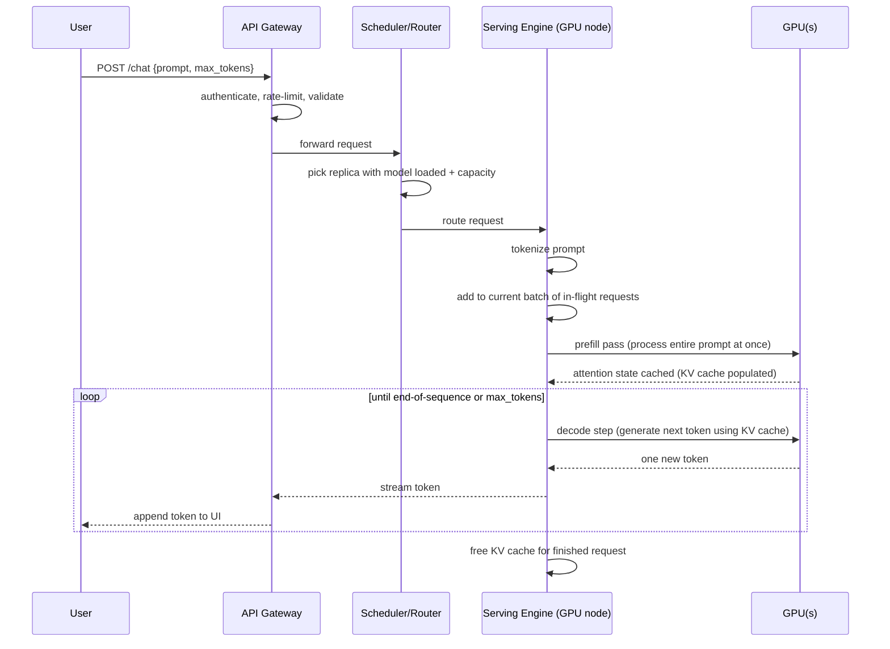

# AI Infrastructure Explained: The Stack Behind Every LLM Call

> By the end of this article you'll be able to trace exactly what happens — mechanically, not magically — between a user pressing Enter on a prompt and a model streaming back tokens, and why every stage of that path is its own engineering problem.

## The Problem

Here's the mental model most developers carry around: an LLM is an API. You `POST` a prompt, you get back text. Same shape as calling a weather API or a payments API — a stateless function call over HTTPS.

That model is fine for writing a client. It is dangerously wrong if you're the one who has to keep that API alive for a million users.

A "call an API" mental model hides the fact that a single chat request to a large model can mean loading hundreds of gigabytes of weights into memory, running trillions of floating-point operations, and coordinating multiple physical accelerators just to answer one message — and then doing that again, thousands of times a second, for every other user hitting the same service at the same moment. Nothing about a normal REST backend prepares you for that. A typical web service scales by adding more identical, cheap, stateless replicas behind a load balancer. AI inference does not scale that way, because the "replica" here is not a lightweight process — it's one or more physical GPUs, each costing tens of thousands of dollars, each with a hard ceiling on how much model state fits in its memory, and each shared across many requests in ways that directly affect every other user's latency.

This is why "AI infrastructure" exists as its own discipline, distinct from "backend engineering" or "DevOps." It's the layer of systems — hardware, schedulers, networking, and serving software — whose entire job is to make an enormously expensive, physically constrained computation *feel* like a simple API call to the person making the request.

## Why This Problem Is Difficult

Three properties of LLM inference make it structurally different from serving a typical web application:

1. **The workload doesn't fit on one chip's cheapest resource.** A large model's weights, plus the working memory it needs while generating a response, can exceed what a single GPU's memory holds. That forces you to split a single inference request across multiple GPUs — a coordination problem that a stateless web server never has.
2. **The computation is not free per request; it's proportional to model size and sequence length.** Doubling the number of users doubles your compute bill in a way that doubling users on a CRUD API mostly doesn't (a CRUD API's cost is dominated by I/O, not compute). This makes over-provisioning expensive and under-provisioning immediately visible as latency.
3. **Requests are stateful across time in a way HTTP isn't.** Generating a response is not one unit of work — it's many, because the model produces one token, feeds it back into itself, and produces the next one, over and over, and needs to remember useful working state between those steps. A load balancer that doesn't know this will happily bounce a long-running generation across machines that don't share that state.

Put together: you have a workload that's memory-constrained, compute-expensive, and stateful, running on scarce and costly hardware, serving a stream of interactive users who all expect chatbot-speed replies. That combination is what AI infrastructure exists to solve.

## A Simple Mental Model

Think of AI infrastructure as a municipal water system, not a water bottle vending machine.

A vending machine (the naive "AI is an API" model) assumes the product already exists — you press a button, a pre-made bottle drops out. A water system is different: nothing is pre-made. When you turn on the tap, a chain of real physical work happens on demand — a pump moves water from a reservoir, it travels through trunk mains, then local pipes, through a pressure-regulating valve sized for your street, and out your tap. If too many people open their taps at once, pressure drops for everyone, not just the newcomers. If a pipe is undersized, water is fine at a trickle but can't keep up at volume.

LLM inference is the same. Nothing is pre-computed and waiting — every response is generated on demand by physical hardware (the reservoir and pumps are the GPU cluster), coordinated by a scheduler (the pressure-regulating valves deciding who gets capacity right now), moved over real wires with real bandwidth limits (the pipes are the cluster network), and shaped by software that decides how to batch many people's "taps" together efficiently (the valve logic is the model-serving layer).

Where the analogy breaks down: water is a passive substance moving through fixed infrastructure. A GPU cluster is actively computing something different for every request, and the "pipe" itself (the network fabric) is sometimes the very thing multiple GPUs use to act as if they were one bigger GPU. Keep that distinction in mind as we go — an LLM cluster isn't just moving a resource around, parts of it are temporarily fusing into a single logical machine to do the work at all.

## Before We Continue

This article assumes you're comfortable with:

- **Cloud compute fundamentals** — VMs, instance types, autoscaling groups, and the general idea of a managed compute platform.
- **Containers and Kubernetes basics** — pods, nodes, schedulers, and how a cluster decides where workloads run. If you haven't covered this, start with *Why Kubernetes Exists* and *Distributed Systems from Scratch*, since GPU scheduling builds directly on the general cluster-scheduling problem.
- **What an LLM actually does, mechanically** — tokens, embeddings, and the transformer's attention mechanism. If terms like "attention," "tokenization," or "autoregressive generation" are new to you, read *The Transformer Architecture: Encoder-Decoder Blocks and Self-Attention* first. This article treats the model itself as a (very expensive) building block and focuses on everything *around* it.

We won't re-derive how attention works or how transformers are trained here — this article is about what has to exist operationally so that a trained model can answer anyone at all.

## The Core Idea

Everything in AI infrastructure exists to solve one problem: **turn a scarce, indivisible, physically constrained resource (accelerator memory and compute) into a service that behaves like an elastic, shared, always-available API.**

That single sentence explains why every layer we're about to walk through exists:

- You need a **serving layer** because raw model weights aren't a service — something has to load them, accept requests, tokenize input, run the forward pass, and stream tokens back.
- You need **batching and scheduling** because GPUs are efficient in large batches but requests arrive one at a time, from independent users, at unpredictable moments.
- You need a **cluster orchestrator** because no single GPU (or even single machine) can serve global traffic, so requests must be routed to one of many replicas — and sometimes split across several GPUs acting as one.
- You need specialized **networking** because when a model is too big for one GPU, the GPUs working on it must talk to each other fast enough that the extra communication doesn't erase the benefit of having more compute.
- You need **memory management** (the KV cache, in particular) because autoregressive generation would otherwise redo enormous amounts of duplicate work for every single new token.

Every section below is really an answer to: "what breaks if this layer didn't exist?"

## How It Actually Works

Let's build the full path a request takes, end to end. This is deliberately vendor-neutral — the same shape appears whether you're calling a hosted model API or standing up your own cluster with an open-weights model.

```
 Client (browser / app / agent)
      |
      |  HTTPS request: prompt + parameters
      v
 +-------------------+
 |  API Gateway /    |   authN, rate limiting, request validation,
 |  Load Balancer    |   routing to the right model/region
 +---------+---------+
           |
           v
 +-------------------+
 |  Router /         |   picks a model replica / GPU pool based on
 |  Cluster Scheduler |   model type, current load, GPU availability
 +---------+---------+
           |
           v
 +-------------------------------------------+
 |            Model-Serving Layer            |
 |  (e.g. a serving engine on each replica)  |
 |                                            |
 |  - tokenizes the prompt                   |
 |  - queues/batches it with other requests  |
 |  - manages the KV cache                   |
 |  - runs the forward pass on GPU(s)        |
 |  - detokenizes + streams tokens back      |
 +---------+----------------------------------+
           |
           v
 +-------------------+       +--------------------+
 |   GPU(s)          | <---> | High-speed intra/  |
 |  (compute engine)  |       | inter-node network |
 +-------------------+       +--------------------+
           |
           v
     Streamed tokens back through the same path to the client
```

Walking through each hop:

**API gateway / load balancer.** Same job as in any distributed system: authenticate the caller, enforce rate limits and quotas, validate the request shape, and pick which regional deployment should handle it. Nothing AI-specific yet — this is standard distributed-systems hygiene.

**Router / cluster scheduler.** This is where AI-specific decisions start. The scheduler needs to know which physical GPUs currently hold *this particular model's* weights loaded and ready, which of those replicas has spare capacity, and — for very large models — which *group* of GPUs together form one logical serving unit (because the model was split across them). This is a fundamentally harder placement problem than "route to any healthy pod," because not every node can serve every model, and moving a large model's weights onto a new node is not instantaneous.

**Model-serving layer.** This is the software (running on each GPU node) that turns "a model" into "a service." It owns tokenization, request batching, memory management for in-flight generations, and the interface between incoming HTTP/gRPC requests and the actual GPU kernels doing matrix multiplication. Purpose-built serving engines exist specifically because a naive "run the model in a loop" implementation wastes most of the GPU's capacity — we'll get into why in the next section.

**GPU compute + networking.** The actual matrix multiplications happen here. For a model that fits on one GPU, this is comparatively simple. For a model that doesn't, multiple GPUs must exchange intermediate results *during* a single forward pass, at speeds fast enough that the coordination overhead doesn't dominate. That's the job of the specialized, high-bandwidth interconnects inside and between GPU nodes — a plain Ethernet link between commodity servers usually isn't fast enough for this role.

**Streaming back.** Because generation is token-by-token, well-built serving layers stream partial output back to the client as soon as each token is ready (typically over Server-Sent Events or a WebSocket) rather than waiting for the entire response — this is why chat UIs show text appearing word by word instead of arriving all at once.

## Let's Walk Through an Example

Say a user asks a chat application: *"Summarize this paragraph in one sentence."*



Two phases are worth naming explicitly, because the rest of this article keeps referring back to them:

- **Prefill**: the model processes the *entire input prompt* in one pass, computing attention over all prompt tokens at once. This step is compute-heavy — lots of matrix multiplication relative to the amount of data — and GPUs are very good at exactly this kind of dense, parallel arithmetic.
- **Decode**: the model generates output tokens one at a time. Each step only computes one new token, but it must repeatedly read a growing amount of cached state (the KV cache, explained below) from GPU memory. This step is memory-bandwidth-heavy rather than compute-heavy — the GPU spends more time moving data than doing arithmetic on it.

That distinction — prefill is compute-bound, decode is memory-bound — is one of the most important facts in this entire discipline, and it drives most of the design decisions in modern serving engines.

## Under the Hood

### Why GPUs, specifically

A GPU is built around thousands of small arithmetic units that all execute the same instruction on different pieces of data simultaneously (a design called SIMT — single instruction, multiple threads). A transformer's forward pass is dominated by matrix multiplications, which decompose naturally into exactly that pattern: the same multiply-accumulate operation, repeated across huge grids of numbers. A CPU, built for fast sequential branching logic on a handful of cores, is a poor fit for this shape of work — it's not that a CPU *can't* multiply matrices, it's that a GPU can do vastly more of that specific operation per second, per watt, per dollar. Modern GPUs used for AI workloads also include tensor cores — units purpose-built for the exact multiply-accumulate pattern that matrix multiplication requires, distinct from the general-purpose shader cores used for graphics.

> **Verification Note**
> Specific GPU memory sizes, interconnect bandwidth figures, and generation-to-generation performance comparisons (e.g., exact HBM bandwidth or NVLink throughput on a particular accelerator model) change between hardware generations and vendors. Treat any specific number you encounter elsewhere as something to verify against the current vendor datasheet rather than as a fixed fact.

### The KV cache

During decode, generating token *N* requires attending back over all previous tokens (both prompt and previously generated tokens). Recomputing that attention from scratch for every new token would mean redoing almost all the work you already did for the previous token — wasteful in the same way that re-reading an entire book from page one every time you want the next sentence would be wasteful.

The fix is the **KV cache**: the model caches the "key" and "value" projections it already computed for every prior token, in GPU memory, and each new decode step only needs to compute the new token's own key/value and then attend against the cache. This turns an operation that would otherwise grow quadratically more expensive per token into something closer to linear — but it comes at a direct cost: the KV cache grows with every generated token, consumes GPU memory for as long as that request is in flight, and is the single biggest reason a GPU can run out of memory mid-generation on long conversations, even though the model weights themselves fit comfortably.

### Batching: static vs. continuous

GPUs are efficient when they process many requests' matrix multiplications together as one larger batch, because the fixed overhead of launching work on the GPU is amortized across more data. But requests don't arrive in neat batches — they trickle in from independent users at independent times, and each one finishes generating (reaches an end-of-sequence token) at a different point.

Early serving approaches used **static batching**: wait for a batch to fill up (or a timeout to expire), run the whole batch through prefill and decode together, and only start a new batch once the whole previous batch has finished — including the request that happened to need the longest response. That means a short reply sits blocked behind a long one, wasting GPU capacity and adding latency for no good reason.

Modern serving engines use **continuous batching** (sometimes called in-flight or dynamic batching): new requests can join a batch and finished requests can leave it at every decode step, not just at batch boundaries. This keeps the GPU busy with useful work almost continuously and is one of the biggest single throughput improvements in modern LLM serving — it's the direct infrastructure answer to the "prefill is compute-bound, decode is memory-bound, and requests arrive asynchronously" problem described above.

### Splitting a model across GPUs

When a model doesn't fit in one GPU's memory, or a single GPU can't hit the required throughput alone, the model is split across multiple GPUs using one or both of:

- **Tensor parallelism** — individual matrix-multiplication operations are split across GPUs (e.g., each GPU holds a slice of a weight matrix), and the GPUs exchange partial results *within* a single layer's computation. This requires very low-latency, high-bandwidth communication, because it happens many times per forward pass — this is why tensor-parallel GPUs are almost always in the same physical server, connected by a dedicated high-speed interconnect rather than a general-purpose network link.
- **Pipeline parallelism** — different *layers* of the model are placed on different GPUs (or nodes), and activations flow from one stage to the next like an assembly line. This tolerates higher communication latency than tensor parallelism because it happens once per layer boundary rather than deep inside every matrix multiplication, which is why pipeline-parallel stages can more reasonably span separate nodes.

Both techniques trade extra communication overhead for the ability to serve a model that no single accelerator could hold or run fast enough alone — which is exactly why the *network fabric* between GPUs is treated as a first-class infrastructure component, not an afterthought, in AI clusters.

## Implementation

You don't need to build a serving engine from scratch to reason about this stack — but seeing the scheduling boundary in real configuration makes the abstract parts concrete. Here's what it looks like to ask a Kubernetes cluster for a GPU-backed inference pod:

```yaml
apiVersion: apps/v1
kind: Deployment
metadata:
  name: llm-inference-server
spec:
  replicas: 2
  selector:
    matchLabels:
      app: llm-inference
  template:
    metadata:
      labels:
        app: llm-inference
    spec:
      containers:
        - name: serving-engine
          image: your-registry/llm-serving-engine:latest
          resources:
            limits:
              nvidia.com/gpu: 1        # requests one whole GPU per pod
              memory: "64Gi"
            requests:
              nvidia.com/gpu: 1
              memory: "64Gi"
          ports:
            - containerPort: 8000
      nodeSelector:
        gpu-type: "high-memory-accelerator"   # matches nodes with the right GPU class
```

A few things worth noticing, because each one maps directly to a concept above:

- `nvidia.com/gpu: 1` is not a CPU-style "give me some fraction of a core" request. Kubernetes' device-plugin model treats GPUs as discrete, non-shareable units by default — you get a whole GPU or you don't get one, unless the platform layer adds GPU-sharing or fractional-GPU support on top (a deliberate, more advanced configuration, not the default). That's a direct consequence of the "scarce, indivisible resource" framing from earlier.
- `nodeSelector` matters because, unlike stateless web workloads, this pod cannot run on just any node — it needs a node with the correct accelerator type and, for larger models, correct placement relative to other GPUs it needs to talk to.
- The Deployment abstraction (replicas, rolling updates) still works here, but it's answering a much heavier question underneath: each new replica means loading potentially hundreds of gigabytes of weights onto a fresh GPU before it can serve a single request — which is why AI inference services generally have much slower, heavier autoscaling behavior than typical web services, and why naive Kubernetes Horizontal Pod Autoscaler defaults (built for CPU/memory metrics on lightweight pods) usually need to be replaced with custom scaling signals (queue depth, GPU utilization, time-to-first-token) for this workload.

The actual model-serving software running inside that container (a dedicated inference server responsible for batching, KV cache management, and multi-GPU coordination) is a deep topic on its own, covered in the next article in this series.

## What Can Go Wrong?

- **KV cache exhaustion.** Long conversations, large context windows, or too many concurrent requests can grow the KV cache until GPU memory runs out mid-generation — a failure mode that looks like an out-of-memory crash but is really a capacity-planning problem, not a bug in the model.
- **Head-of-line blocking from poor batching.** A serving layer using static batching (or a poorly tuned continuous batching config) can let one unusually long generation hold up GPU capacity that shorter, faster requests need — the AI-infrastructure equivalent of a slow database query blocking a connection pool.
- **Cold-start latency.** Loading a large model's weights from storage into GPU memory is not instantaneous. A scheduler that spins up a "new" replica in response to a traffic spike can leave users waiting far longer than they would for a typical web server's cold start, because the thing being loaded is measured in tens or hundreds of gigabytes, not megabytes.
- **Network bottlenecks between GPUs.** If tensor-parallel or pipeline-parallel GPUs are placed without regard for the physical network topology (e.g., across racks connected by a slower link than intended), the added communication cost can outweigh the compute benefit of splitting the model at all — you can end up with *more* hardware and *worse* latency.
- **Noisy-neighbor effects in shared clusters.** Multiple tenants or workloads sharing GPU nodes can create unpredictable latency for each other if isolation isn't enforced carefully, especially around memory bandwidth and interconnect contention, which are harder to hard-partition than compute cycles.
- **Scheduler mismatch between training and inference workloads.** A scheduler tuned for long-running, batch-style training jobs (which tolerate queuing and restart) behaves very differently from what interactive inference needs (low queuing tolerance, fast placement decisions) — running both on the same scheduling policy without adjustment causes problems for one or the other.

## Security Considerations

AI infrastructure introduces trust boundaries that don't exist in a typical stateless web service:

- **Model weights as a protected asset.** Trained model weights can represent enormous investment and, for some organizations, a competitive or safety-sensitive asset. The threat here is straightforward exfiltration: anyone with sufficient access to the storage layer, the GPU node's filesystem, or a misconfigured artifact registry can copy the weights wholesale. Treat model weight storage and distribution with the same rigor as secrets management — access control, encryption at rest, and audit logging on who pulled what.
- **Multi-tenant isolation on shared GPUs.** When multiple customers' or teams' workloads share the same physical GPU or node (common in cost-optimized clusters), the isolation boundary is weaker than most engineers assume from CPU/VM experience. GPU memory is not always cleanly wiped between contexts by default configuration, and side-channel risks from shared compute resources are an active area of research rather than a fully solved problem. Don't assume "different pod" means "fully isolated" without verifying the platform's specific isolation guarantees.
- **Prompt and completion data in transit through the stack.** Every hop in the diagram above — gateway, scheduler, serving engine — is a point where request and response content (which may include sensitive user data) passes through logs, traces, or caches. Infrastructure-layer logging that captures full prompts/completions "for debugging" is a common, easily overlooked data-exposure path.
- **Supply chain of the model itself.** A model's weights, and the serving engine that runs them, are software artifacts pulled from somewhere — a registry, a bucket, a third-party host. Unverified or unpinned model artifacts are a supply-chain risk in the same category as any other unverified dependency; this deserves the same provenance and integrity checks you'd apply to a container image or a package dependency, not an exception because it's "just weights."
- **Scheduler and orchestration credentials as high-value targets.** The component with authority to schedule workloads onto GPU nodes, or to pull model weights into memory, is itself a high-value target — compromising it can mean unauthorized access to models, data flowing through inference, or the ability to run arbitrary compute on expensive hardware at someone else's cost.

None of this replaces application-level LLM security (prompt injection, output handling, and so on) — this is the infrastructure layer underneath that, and it needs its own threat model.

## Common Misconceptions

**Misconception:** "The model runs on the CPU like normal application code; the GPU is just an optional speedup."
**Reality:** For any model beyond toy scale, the GPU (or equivalent accelerator) isn't optional acceleration — it's the only place the forward pass can run at a usable speed at all. The CPU's role is largely orchestration: handling the request, tokenizing, managing the serving loop, and shuttling data to and from the GPU.

**Misconception:** "One GPU serves one request at a time, like one worker thread handling one job."
**Reality:** A single GPU, through batching, is typically serving many concurrent requests' decode steps interleaved together. That's precisely what makes continuous batching valuable — and it's why GPU utilization metrics and per-request latency can move in ways that surprise engineers used to one-request-per-worker models.

**Misconception:** "Scaling an AI service is the same problem as scaling a web service — just add more replicas."
**Reality:** Adding a replica here means provisioning expensive, sometimes scarce hardware and loading a large amount of state onto it before it's useful — a much heavier and slower operation than spinning up another stateless container, and one that needs its own scheduling and capacity strategy.

**Misconception:** "More GPUs always means a faster response for a single request."
**Reality:** More GPUs help you serve *more concurrent requests*, or run a model too large for fewer GPUs. Splitting a single request's computation across additional GPUs (parallelism) only helps up to the point where communication overhead between those GPUs doesn't exceed the compute time saved — beyond that point, adding GPUs to a single request can make it slower, not faster.

**Misconception:** "Training infrastructure and inference infrastructure are basically the same thing, just used differently."
**Reality:** They optimize for different things. Training favors sustained, predictable, extremely high aggregate throughput across a fixed batch job that can tolerate restarts. Inference favors low, consistent latency for unpredictable, bursty, interactive traffic. The scheduling policies, network topology priorities, and even the definition of "utilization" differ enough that they're usually treated as separate infrastructure problems, covered separately later in this series.

## Real-World Architecture

Across hyperscale cloud providers and open-source serving stacks, the same layering shows up under different names, which is a good sign that it reflects the actual shape of the problem rather than one vendor's preference:

- **Managed inference endpoints** (the general pattern behind offerings like AWS's and Azure's managed model-hosting services, and Google Cloud's Vertex AI endpoints) wrap the gateway, scheduler, and serving-engine layers behind a single API, so a developer calling the endpoint sees only the top of the diagram from this article — the rest is the provider's implementation of everything below it.
- **Kubernetes-based GPU scheduling** is the common pattern for teams running their own inference clusters: a device-plugin model exposes GPUs as schedulable resources (as shown in the YAML example above), often paired with a purpose-built inference server as the actual serving-engine layer (Kubernetes' own device-plugin framework and the NVIDIA GPU Operator are the reference implementation of this pattern for NVIDIA hardware).
- **Purpose-built inference servers** — dedicated software whose entire job is continuous batching, KV cache management, and multi-GPU coordination — sit inside the "model-serving layer" box in the architecture diagram, and are what turns raw model weights plus raw GPUs into an actual service.
- **Cluster interconnect fabrics** (high-bandwidth, low-latency networks purpose-built for GPU-to-GPU communication, as opposed to general-purpose data-center Ethernet) exist specifically to make tensor and pipeline parallelism viable at all — this is the layer that later articles in this series (on GPU clusters and AI supercomputing) go into in depth.

> **Verification Note**
> Specific product names, service tiers, and architectural details for any named cloud provider's managed inference offering change frequently. Confirm current capabilities against that provider's own architecture-center documentation before relying on specifics for a design decision.

## Expert Insight

The single biggest lever engineers underestimate in production AI infrastructure is **batch size versus latency**, and it's a genuine trade-off, not a tuning knob with a universally correct answer. A serving configuration tuned for maximum throughput (large batches, longer queuing tolerance) will show great GPU utilization numbers on a dashboard while quietly making individual users wait longer for their first token. A configuration tuned for minimum latency (small batches, aggressive preemption) will look responsive per-request while burning far more GPU-hours per unit of useful output — which shows up a month later as a much larger bill for the same traffic. Neither number tells you the other is wrong; they're both true, and the right point on that curve depends on what the product actually needs (a coding assistant tolerates more latency than a live voice agent).

The second thing experienced teams learn the hard way: **idle GPU capacity is not "safety margin," it's the majority of the cost.** Because GPUs are provisioned in large, discrete, expensive units rather than fine-grained slices, and because model load times are heavy, teams tend to over-provision "just in case" — and then discover that the overwhelming majority of their AI infrastructure spend is capacity sitting idle for traffic that never quite arrives at the provisioned peak. This is exactly why frontier AI providers and large platform teams invest heavily in custom schedulers, fine-grained autoscaling signals (queue depth and time-to-first-token, not just CPU/GPU utilization percentage), and sometimes GPU-sharing techniques that standard Kubernetes defaults don't provide out of the box — the economics of this workload reward scheduling sophistication far more than most infrastructure domains do.

## Try It Yourself

**Goal:** Observe the prefill/decode distinction and batching behavior directly, without needing a data-center GPU cluster.

**Starting Point:** A machine with a single consumer or cloud GPU (or even CPU-only, for a small enough model), and a local open-weights serving engine you can install (a small model in a framework like vLLM, or a lightweight local runner such as Ollama, is enough to see the shape of the behavior even if the scale is tiny).

**Task:**
1. Send a single short prompt and time how long it takes until the *first* token appears versus the time for the *full* response to finish. Note that the first-token delay corresponds to prefill; the rest is decode.
2. Send several requests concurrently (a small script firing 5–10 requests at once) and watch whether your serving engine's logs show them being processed together or strictly one after another.
3. Send one very long prompt alongside several short ones at the same time, and observe whether the short ones appear to wait on the long one.

**Expected Result:** You should see a measurable gap between "first token" latency and "last token" latency, and — if your serving engine supports continuous batching — the short requests should not be fully blocked behind the long one.

**What You Learned:** The prefill/decode split and the effect of batching strategy aren't abstract concepts from a diagram — they're directly observable in response timing, even on hardware far smaller than a production cluster.

## Pause and Think

Why is the **decode** phase described as memory-bandwidth-bound rather than compute-bound, when the model is still doing matrix multiplications at every step?

### Answer

Because at decode time, the model is generating exactly one new token per step, which means the actual amount of *new* arithmetic per step is small relative to the model's total size. But to produce that one token, the GPU still has to read the relevant model weights and the entire accumulated KV cache from memory for every step. As the KV cache grows with conversation length, the *data movement* required per step grows too, while the *compute* required per step stays roughly constant (one token's worth of matrix-vector work). Once the time spent moving data through memory exceeds the time spent computing on it, the GPU's arithmetic units sit partially idle waiting on memory — the classic definition of a memory-bound operation. This is also exactly why KV cache size, memory bandwidth, and cache management strategy dominate decode-phase performance discussions far more than raw compute (FLOPs) numbers do.

## Key Takeaways

- LLM inference is not "an API call" underneath — it's an on-demand, physically constrained computation, which is why it needs its own infrastructure discipline rather than reusing standard web-service scaling patterns.
- Every request travels through a gateway, a scheduler, a model-serving layer, GPU compute, and a specialized network fabric — and each layer exists to solve a specific problem the layer above it can't.
- Inference has two distinct phases with different bottlenecks: **prefill** (compute-bound, processes the whole prompt at once) and **decode** (memory-bound, generates one token at a time using a growing KV cache).
- Continuous batching, multi-GPU parallelism (tensor and pipeline), and topology-aware scheduling exist specifically to keep expensive, scarce GPU capacity busy with useful work despite unpredictable, asynchronous request patterns.
- The economics of this workload (expensive, indivisible hardware; heavy load times; memory-constrained state) make scheduling sophistication and batch-size/latency trade-offs first-class engineering concerns, not afterthoughts.
- Security here includes infrastructure-layer concerns — model weight protection, multi-tenant GPU isolation, and artifact supply chain — on top of whatever application-layer LLM security you already do.

## What to Learn Next

This article deliberately stayed at the level of "what exists and why." The next article in this series, *GPU Clusters and Model Serving: How AI Compute Actually Scales*, goes underneath the model-serving box in the diagram above — how serving engines actually implement continuous batching and multi-GPU coordination, and how a cluster scheduler makes GPU placement decisions at scale. After that, *Understanding AI Supercomputing: Networking, Storage, and Scheduling for Training* covers the training side of this stack, where the bottlenecks and scheduling priorities are different enough to warrant their own treatment.
