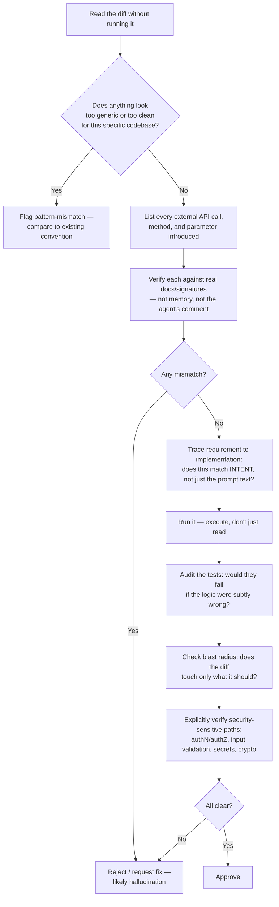

# How to Review Code Written by AI Agents

> By the end of this article you'll have a repeatable review protocol for AI-authored diffs — one that catches the specific ways agents fail (plausible-but-wrong patterns, hallucinated APIs, subtle logic gaps, over-confident comments) instead of just re-running your old human-code checklist against a new kind of author.

## The Problem

You open a pull request. The diff is 40 lines, touches one file, has a clean commit message, includes a docstring, and passes CI. Every instinct you've built over a decade of code review says: *this is a safe, small, well-tested change — skim it and approve.*

That instinct was calibrated on human authors. It assumes a specific chain of trust: a person read the ticket, understood the codebase's history, wrote the code with some model of *why* the existing system looks the way it does, and would feel embarrassed submitting something they didn't believe was correct. Reviewers exploit that chain constantly — a clean diff from a teammate with strong git history is a weak but real signal of correctness, because their incentives and their understanding are aligned with getting it right.

An AI agent has none of that chain. It has no embarrassment, no long-term reputation at stake, no persistent memory of why a `TODO` from eighteen months ago says what it says, and no innate distinction between "I know this API" and "this API sounds like something that should exist." It optimizes for producing text that looks like a correct answer to the prompt it was given — which, most of the time, *is* correct, because most coding tasks have been solved a thousand times in the training data. But when it's wrong, it's wrong in a different shape than a human is wrong, and that shape defeats the pattern-matching reviewers rely on.

This is the actual problem: **the signals you use to decide how hard to look are no longer correlated with risk.** A clean-looking, fluently-commented, test-passing AI diff can be confidently, silently wrong in ways a messy human diff rarely is. Reviewing AI-generated code isn't "code review, but faster." It's code review aimed at a different failure distribution.

## Why This Problem Is Difficult

Three properties of agent-generated code make this genuinely harder than it looks, not just unfamiliar.

**Fluency is decoupled from correctness.** A large language model is trained to produce the *next plausible token*, and plausible code reads exactly like correct code — same idioms, same naming conventions, same docstring style — whether or not it's right. A human who doesn't know an API tends to write code that *looks* uncertain: a comment asking "is this the right method?", an inconsistent naming pattern, a half-finished error branch. An agent that doesn't "know" an API in the sense of having ever verified it against documentation will write the wrong call with the exact same confidence and formatting as the right one. There is no visual tell.

**The failure mode is invented, not corrupted.** Reviewing human code, you're mostly looking for mistakes — a typo, a forgotten edge case, a misunderstanding of a requirement. Reviewing agent code, you're sometimes looking for *inventions* — a method that doesn't exist on that class, a parameter that belongs to a different library's version of that function, a behavior the agent extrapolated from a similar-looking pattern it saw during training. That's a categorically different search: "is this true?" instead of "is this careless?"

**Volume changes the economics of attention.** When one engineer produces a PR a day, you can afford to read every line closely. When an agent (or a team of engineers each running several agents) produces ten PRs an hour, line-by-line scrutiny of everything doesn't scale, and reviewers under time pressure default back to the old heuristics — diff size, test presence, CI status — that are exactly the heuristics agent-generated code is best at gaming without meaning to.

## A Simple Mental Model

Picture a brilliant intern who has read every textbook, every Stack Overflow answer, and every open-source repository ever published — but who has never once run a program, never been paged at 3 a.m. for a production incident, and pathologically never says "I'm not sure." Ask this intern for code and you'll get something fluent, well-formatted, and grammatically confident. Most of the time it will also be correct, because most requests match something in that enormous reading list closely enough. But the intern cannot distinguish "I've seen this exact pattern verified many times" from "this pattern sounds right by analogy to something else I've seen" — and will present both with identical confidence.

The mental model breaks in one important place: a real intern eventually learns your codebase's specific conventions and remembers being corrected. An agent, unless it's been given persistent memory or fine-tuned on your repo specifically, starts every session close to zero on that front — see [How AI Coding Agents Understand an Entire Codebase](403-ai-agents-understand-codebase.md) for how context windows and retrieval try to compensate, and why that compensation is partial.

## Before We Continue

This article assumes you're already comfortable with the agent loop — goal, context, reasoning, tool call, observation, next action — and with the basic shape of a coding agent's architecture (context assembly, tool execution, diff application, test running). If any of that is unfamiliar, start with [AI Coding Agents Explained](401-ai-coding-agents-explained.md) and [The Architecture of an AI Coding Agent](407-architecture-of-ai-coding-agent.md) first. This article is specifically about the review step *after* the agent has produced a diff — not about how the agent produced it, and not about automated testing or evaluation harnesses, which are covered in [Testing AI Agents Like Software](429-testing-ai-agents-like-software.md).

## The Core Idea: A Different Failure Taxonomy

Human code review checklists implicitly assume the author understood the requirement and made a mistake in execution: off-by-one errors, forgotten null checks, inconsistent naming, missed edge cases from fatigue or oversight. Those mistakes still happen with agents — but on top of them sits a second layer of failure modes that are specific to how a language model generates code.

| Failure mode | What it looks like in a diff | Why it's more likely from an agent |
|---|---|---|
| **Plausible-but-wrong pattern** | Code that's idiomatic and clean, but implements a *generic* solution to a *specific* problem this codebase already solves differently | The agent pattern-matched to the most common solution shape in its training data, not to this repo's existing convention (which it may not have retrieved into context) |
| **Hallucinated API** | A method, parameter, or return shape that doesn't exist, or existed in a different library/version | The model generates the *most statistically likely* API surface for "a function that does X," which is frequently close to real but not exact |
| **Subtle logic gap** | Code that handles the stated case correctly but silently mishandles an adjacent case (empty input, concurrent access, the last page of a paginated result) | The agent optimized for the literal prompt/ticket text, not the implicit intent a human author would have inferred from context, prior incidents, or a conversation with the requester |
| **Over-confident comment or docstring** | A comment asserting a property ("thread-safe," "idempotent," "validates all inputs") that the code next to it does not actually guarantee | Comments are generated from the same fluency-over-verification process as the code; the model narrates what *should* be true of code like this, not what it proved about *this* code |
| **Security regression via statistical copy-paste** | A reintroduced SQL string concatenation, a skipped auth check, a disabled certificate check "to make the test pass" | Training data contains enormous amounts of insecure code alongside secure code, and the agent has no innate preference for the secure version unless the prompt, linting, or fine-tuning pushes it there |
| **Self-serving tests** | New tests that pass, but only because they assert against the agent's own (wrong) implementation rather than against the actual requirement | The agent that wrote the code often also writes the test, in the same session, against the same misunderstanding — there's no independent check |
| **Unrequested scope creep** | A diff that quietly reformats unrelated code, renames a variable three files away, or "improves" something nobody asked to change | Agents optimizing for a broad instruction ("fix the bug and clean up nearby code") don't have a human's social instinct to keep diffs minimal and reviewable |

Reviewing AI-generated code means explicitly budgeting attention for this second layer, not just the first.

## How It Actually Works: A Review Protocol

The core shift is this: **stop using diff size, formatting quality, and CI status as proxies for correctness, and verify claims directly.** A practical protocol, in order:



Walking through the non-obvious steps:

**1. Read before you run — but don't stop at reading.** Reading first lets you form a hypothesis about what the code is *trying* to do and spot pattern-mismatches against the rest of the codebase. But an agent's code reading well is not evidence it runs correctly — the two properties are more independent here than with human code, so reading is step one of many, never the whole review.

**2. Verify every introduced API call against ground truth, not against your memory of it.** This is the single highest-leverage habit change. If the agent calls a library function you use rarely, open the actual signature — the installed version's docs, the type stubs, or the source — before approving. Don't trust the agent's own comment describing what the call does; that comment was generated by the same process that might have hallucinated the call.

**3. Trace intent, not just the literal instruction.** Ask: does this diff solve the problem the ticket *meant*, or the problem the ticket's words could be parsed as meaning? Agents are extremely good at the second and only as good as their context at the first. This is where the reviewer's domain knowledge — the thing an agent structurally lacks — earns its keep.

**4. Always execute.** A passing test suite tells you the code satisfies the tests that exist, which for AI-generated code is a weaker signal than usual, because the tests may have been written by the same agent against the same misunderstanding (the "self-serving tests" failure mode above). Run the change against a real or realistic scenario the agent didn't necessarily write a test for.

**5. Interrogate the tests as a first-class review target, not a checkbox.** Read the assertions, not just the pass/fail. Would this test fail if someone reintroduced the exact bug it claims to guard against? A test that only checks a happy path, or that asserts on an implementation detail rather than an observable behavior, gives false confidence.

**6. Check the blast radius.** Diff the file list against the stated task. An agent instructed to "fix the null pointer in the export handler" that also reformats three unrelated files is exhibiting unrequested scope creep — each of those extra changes needs its own review attention, and bundling makes that easy to miss.

**7. Verify security-sensitive paths explicitly, every time, regardless of diff size.** Don't let "it's a small change" lower your guard here — see [Security Considerations](#security-considerations) below.

**8. Ask the agent to justify the change, and treat a weak answer as a signal.** If your workflow supports it, prompting the agent (or asking in the PR description) "explain why you chose this approach over the existing pattern in `X`" often surfaces a hallucinated justification or reveals the agent never retrieved the relevant context. This doesn't replace verification — an agent can generate a fluent justification for a wrong answer just as easily as fluent wrong code — but a justification that's internally inconsistent, or that cites a nonexistent constraint, is a fast way to catch a shallow understanding before you spend time verifying line by line.

## Let's Walk Through Some Examples

### Example 1 — the hallucinated parameter

An agent is asked to add a timeout to an outbound HTTP call in a Python service. It produces:

```python
import requests

def fetch_upstream_status(url: str) -> dict:
    response = requests.get(url, timeout_seconds=10)
    response.raise_for_status()
    return response.json()
```

This reads perfectly. It's idiomatic, the intent is obvious from the name, and a reviewer skimming for "did they add a timeout?" sees one and moves on. The problem: `requests.get()` has no `timeout_seconds` parameter. The real keyword argument is `timeout`. This isn't a rare or obscure mistake — it's the classic hallucination shape, where the model produces the *semantically correct* parameter under a *plausible but wrong* name, likely blended from another library's convention. Depending on how `requests` handles unexpected keyword arguments, this either raises a `TypeError` immediately (caught the moment it runs) or, in some wrapped client configurations, gets silently swallowed — which is the dangerous case, because the call now has *no* timeout at all, the opposite of what the diff claims to add. The review catch here is mechanical: open the actual `requests.get` signature before approving any diff that introduces or modifies a call to a library function you didn't write yourself in this session.

### Example 2 — the subtle logic gap in pagination

An agent is asked to merge two pages of paginated results from an internal API into a single deduplicated list. It produces (Go):

```go
func mergePages(pages [][]Item) []Item {
	seen := make(map[string]bool)
	var merged []Item

	for _, page := range pages {
		for i := 0; i < len(page)-1; i++ { // off-by-one: drops the last item of every page
			item := page[i]
			if !seen[item.ID] {
				seen[item.ID] = true
				merged = append(merged, item)
			}
		}
	}
	return merged
}
```

This compiles, runs, and — critically — *passes a naive test* that only checks the first item of a two-item page. The `len(page)-1` bound is a real off-by-one, but it's the specific *shape* of AI-generated off-by-one errors that matters here: it doesn't look like a typo (`<=` vs `<`), it looks like a deliberate, confident boundary condition, because the model generated a loop bound that's syntactically identical to a correct pattern it has seen many times for a *different* problem (e.g., comparing adjacent elements, which legitimately stops at `len-1`). A reviewer pattern-matching "loop bound looks normal" will not catch this; a reviewer who mentally executes the loop against a two-item page will catch it in seconds. This is exactly why step 4 (always execute) and step 5 (interrogate the tests) matter more here than a syntax-level read.

### Example 3 — the over-confident comment

```go
// safeCounter increments the shared request counter.
// Safe for concurrent use by multiple goroutines.
func (s *Stats) safeCounter() {
	s.requests = s.requests + 1
}
```

The comment makes a specific, checkable claim — "safe for concurrent use" — and the code directly contradicts it: there's no mutex, no atomic operation, nothing making this safe under concurrent access. A human engineer writing this would either know it's unsafe and not claim otherwise, or would have added the synchronization the comment describes. An agent generates the comment from the same distribution that produces comments on *correct* concurrent-safe counters elsewhere in its training data — the words "safe for concurrent use" are a common comment on a common pattern (`sync/atomic.AddInt64`, or a mutex-guarded increment), and the model attached that familiar phrase to a superficially similar but actually unsynchronized function. Treat any comment making a strong guarantee — thread-safety, idempotency, "validates all inputs," "cannot fail" — as a claim to verify against the code, not as documentation to trust.

## Under the Hood: Why These Patterns Happen

It's worth understanding the mechanism, because it tells you exactly where to concentrate review effort.

A code-generating LLM is fundamentally predicting the next most likely token given everything before it — the prompt, the retrieved context, and the tokens it has already generated. When you ask it to call a well-documented, heavily-represented API (say, a core `requests` or `os` function), the training signal for the *exact* correct usage is enormous and consistent, so the model's output converges tightly on the real signature. When you ask it to do something rarer — a less common parameter combination, a newer or smaller library, an internal API specific to your company — the training signal thins out, and the model's next-token prediction starts drawing on *nearby* patterns from more common APIs. The output still looks confident, because confidence in an LLM's output isn't a calibrated measure of "how sure am I this is true" — it's closer to "how statistically typical is this continuation," and typical-looking text is generated with the same fluency whether or not it's factually accurate.

This connects directly to two other topics in this pillar. [Context Windows Explained](412-context-windows-explained.md) covers why an agent may never have "seen" your specific internal API in the first place — if the relevant type definitions or documentation weren't retrieved into context, the model is generating blind, filling the gap with the closest thing it has actually seen. And [Why AI Agents Fail](428-why-ai-agents-fail.md) covers the compounding version of this problem — a hallucinated fact, once accepted, becomes context for the next reasoning step, and errors compound across a longer agentic run in ways that make late-stage output look even more confident, not less.

The practical takeaway: **the model's fluency signal and its correctness signal are the same signal for common code, and diverge for uncommon code.** Concentrate your closest review attention exactly where the agent is working with your codebase's specific conventions, your internal APIs, and your business logic — the places where training data thins out the fastest.

## Implementation: A Review Checklist You Can Actually Use

A checklist earns its place only if reviewers will actually run it under time pressure. Keep it short enough to fit in a PR template comment, and make each item a specific action, not a vague reminder.

```markdown
## AI-Authored Diff Review Checklist

- [ ] Every new/changed external API call verified against real docs or type stubs (not the agent's comment)
- [ ] At least one edge case (empty, boundary, concurrent, last-page) traced by hand, not just read
- [ ] Diff scope matches the stated task — no unrequested refactors, renames, or reformatting bundled in
- [ ] New tests assert observable behavior, not implementation details; at least one would fail if the
      described bug were reintroduced
- [ ] Any comment/docstring making a guarantee (thread-safe, idempotent, validates input, cannot fail)
      checked against the code it describes
- [ ] Security-sensitive paths (auth, input validation, secrets, crypto, deserialization) reviewed
      explicitly, regardless of diff size
- [ ] Change executed locally or in CI against a realistic input, not approved on read-through alone
```

For teams with many agent-authored diffs per day, a lightweight automated pre-check reduces how much of the checklist a human has to do manually. The following sketch flags calls to functions that don't exist in the installed version of a module — a mechanical, low-cost first pass for the hallucinated-API failure mode (it will not catch every case, especially dynamically-constructed calls, and it is not a substitute for steps 2 and 5 of the protocol above — it's a cheap filter that runs before a human ever opens the diff):

```python
import ast
import importlib
import sys

def find_unresolved_calls(file_path: str) -> list[str]:
    """Flag calls of the form module.method(...) where `method` does not exist
    on the currently-installed `module`. Best-effort static check, not a proof."""
    with open(file_path, "r", encoding="utf-8") as f:
        tree = ast.parse(f.read(), filename=file_path)

    imported_modules: dict[str, str] = {}
    for node in ast.walk(tree):
        if isinstance(node, ast.Import):
            for alias in node.names:
                imported_modules[alias.asname or alias.name] = alias.name

    warnings = []
    for node in ast.walk(tree):
        if isinstance(node, ast.Call) and isinstance(node.func, ast.Attribute):
            if isinstance(node.func.value, ast.Name):
                local_name = node.func.value.id
                if local_name in imported_modules:
                    module_name = imported_modules[local_name]
                    try:
                        module = importlib.import_module(module_name)
                    except ImportError:
                        continue
                    method_name = node.func.attr
                    if not hasattr(module, method_name):
                        warnings.append(
                            f"{file_path}:{node.lineno} — "
                            f"'{module_name}.{method_name}' not found on installed module "
                            f"(possible hallucinated API)"
                        )
    return warnings

if __name__ == "__main__":
    for path in sys.argv[1:]:
        for w in find_unresolved_calls(path):
            print(w)
```

This only catches top-level `module.method()` calls resolvable via static import analysis — it won't catch a hallucinated *parameter* (Example 1 above passes this check cleanly, since `requests.get` does exist), a hallucinated method on an object returned by a call, or anything behind indirection. That gap is exactly why this is a pre-filter, not a replacement for a human verifying signatures during review.

## What Can Go Wrong: Reviewer Anti-Patterns

- **Rubber-stamping small diffs.** A one-line change from an agent carries the same hallucination risk as a fifty-line one if that one line calls an API you haven't verified. Diff size correlates with *review time budget*, not with *risk*, once the author is an agent.
- **Trusting green CI as proof of correctness.** CI proves the code satisfies the tests that exist. If the same agent wrote both the code and the tests in one pass against the same misread requirement, green CI is confirming a shared misunderstanding, not correctness.
- **Assuming a fluent explanation means understanding.** Asking an agent "why did you do it this way?" and getting a coherent-sounding answer is not verification — the agent can generate an equally fluent justification for a wrong decision. Use it as a way to surface obviously broken reasoning, not as evidence of correctness.
- **Reviewing style instead of substance because style is what's easy to see.** Formatting, naming, and comment quality from a good coding agent are often *better* than the median human's — which makes it tempting to focus review effort there, exactly where it's least needed.
- **Skipping the security pass because "it's just a refactor."** Statistical copy-paste from training data doesn't respect your intent to keep a change low-risk; a "just a refactor" prompt can still result in a dropped auth check if the agent pattern-matched to a simpler version of the function it saw elsewhere.

## Security Considerations

Apply the standard chain deliberately, because AI-authored diffs change several links in it:

- **Asset**: the data, credentials, or system access the changed code touches — this doesn't change because the author is an agent.
- **Threat**: an attacker exploiting a control that the agent removed, weakened, or never added, without anyone noticing because the diff looked like a normal refactor or bug fix.
- **Attack**: exploiting the specific gap — e.g., a re-introduced string-concatenated SQL query, a disabled TLS verification flag left in "temporarily" during debugging that an agent then propagated into a "cleanup" commit, or a rate limiter quietly dropped while "simplifying" a request handler.
- **Vulnerability**: the underlying reason this is possible — training data contains a huge amount of insecure code alongside secure code, and an agent has no innate preference for the secure version unless something in its prompt, system instructions, linting, or fine-tuning actively steers it there.
- **Exploit**: what the attacker actually does once the control is gone — data exfiltration, injection, privilege escalation, denial of service, depending on what was weakened.
- **Impact**: breach scope, from a single leaked record to full data exfiltration, depending on the asset.
- **Mitigation**: treat every security-sensitive code path (authentication, authorization, input validation, cryptography, deserialization, anything touching secrets) as requiring explicit manual verification on *every* AI-authored diff that touches it, regardless of how small or "obviously fine" the change looks — plus static analysis / SAST tooling in CI configured to fail the build on known-insecure patterns, so the check doesn't depend entirely on a human noticing.
- **Residual risk**: an agent, like a human, can still introduce a genuinely novel vulnerability that no static rule or existing pattern catches. Defense in depth — least privilege on what the agent's own execution environment can touch, mandatory human review on security-sensitive paths, and monitoring in production — remains necessary because no review step is guaranteed to catch everything.

For a deeper treatment of the agent-security surface itself (tool permissions, prompt injection, credential exposure during execution), see [MCP Security: What Happens When an AI Agent Gets Access to Your APIs?](419-mcp-security-agent-access.md) — that article covers what the agent can do while working; this one covers what you verify after it's done.

## Common Misconceptions

**Misconception:** If the code compiles, runs, and passes tests, it's probably fine.
**Reality:** Compiling and running only prove the code is syntactically valid and doesn't crash on the paths exercised. Passing tests only prove it satisfies the assertions that exist. None of that proves the code does what the business actually needed, especially when the same process that wrote the code also wrote the tests against the same misunderstanding.

**Misconception:** A confident, well-formatted comment or docstring is documentation you can trust.
**Reality:** Comments generated alongside hallucinated or subtly wrong code carry the exact same unwarranted confidence as the code itself. Treat any comment making a specific guarantee as a claim to verify, not a fact to accept.

**Misconception:** Reviewing AI code is just reviewing code faster, since the agent already "did the thinking."
**Reality:** The agent did *generation*, not verification. Review effort doesn't shrink — it shifts from "did the author make a careless mistake" toward "did the author's claims about this API, this edge case, and this comment actually hold up," which for unfamiliar APIs and codebase-specific logic often takes *more* deliberate effort, not less.

**Misconception:** Smaller diffs from agents are inherently lower risk, so they need a lighter review pass.
**Reality:** Diff size correlates with reviewer time budget and historically has correlated with human-error risk, but it doesn't correlate with hallucination risk. A one-line change that introduces a hallucinated API call or a security-relevant behavior change carries full risk regardless of its size.

## Real-World Architecture

Most engineering organizations are converging on a few structural patterns for this, rather than leaving it purely to individual reviewer judgment:

- **Provenance labeling.** Marking a PR or commit as agent-authored (via a bot account, a label, or a commit trailer) so reviewers and tooling can apply a different review policy than for human-authored changes — for example, requiring an explicit security-path checklist item before merge, or routing it through an additional automated static-analysis gate that human-authored PRs skip.
- **Mandatory execution gates.** CI pipelines that refuse to allow merge on "review approved" alone and require a passing run against a realistic scenario, not just unit tests the same session may have written.
- **Static analysis and type checking as a first-pass filter.** Type checkers (mypy, TypeScript's compiler, Go's compiler itself), linters, and SAST tools catch a meaningful share of hallucinated-API and known-insecure-pattern failures mechanically, before a human's attention is needed — cheap enough to run on every diff, human-authored or not, but disproportionately valuable on agent-authored diffs given the failure taxonomy above.
- **Risk-tiered review depth**, rather than uniform review depth. Changes touching authentication, payments, data export, or cryptography get the full protocol above regardless of diff size or apparent simplicity; low-risk, well-covered internal tooling changes can tolerate a lighter pass. This mirrors how mature engineering orgs already tier human-authored review by blast radius — the difference with agent-authored code is that the tiering has to be enforced structurally (via required reviewers or automated gates on sensitive paths), because the "this looks simple" signal is less trustworthy as a self-selection mechanism when the author has no sense of its own uncertainty.

> **Verification Note**
> Specific vendor or platform features for labeling AI-authored contributions, or built-in review-gate support for agent-generated diffs, change quickly and vary by tool and version. Verify current capabilities against your CI/CD platform's and code-hosting provider's own documentation before designing a process around a specific feature name.

## Expert Insight

Senior engineers who've spent real time reviewing agent-authored diffs converge on a similar recalibration: review budget shifts from *time-per-line* to *time-per-claim*. A line of code that calls a well-known standard-library function you've verified a hundred times needs almost no attention. A line that calls an internal API, a rarely-used library feature, or asserts a property in a comment needs full attention, independent of how many lines surround it. The practical consequence is that review time stops scaling linearly with diff size and starts scaling with the number of unverified claims in the diff — which means a reviewer's first pass should be a quick inventory: *how many things in this diff am I about to trust without checking?*

There's also a real risk of review fatigue specific to this workflow: when the volume of agent-generated PRs is high and most of them are genuinely fine, reviewers' pattern-matching instincts — the exact instincts this article opened by warning about — reassert themselves under fatigue, because vigilance is expensive to sustain and most instances don't punish complacency immediately. Teams that handle this well tend to lean on the structural gates above (mandatory execution, static analysis, risk-tiered required reviewers on sensitive paths) precisely so correctness doesn't depend entirely on a tired human's discipline holding for the thousandth diff in a row.

## Try It Yourself

**Goal**: Practice catching a hallucinated API and a subtle logic gap in the same review pass, under realistic time pressure.

**Starting point**: Take the pagination-merge function from Example 2 above (or a similar function from your own codebase). Ask an AI coding agent — using whatever agent or assistant you have available — to "add support for merging three pages instead of two, and add a test."

**Task**: Review the resulting diff using the eight-step protocol in this article. Specifically:
1. Trace the loop bounds by hand against a concrete three-page input with duplicate IDs across pages.
2. Check whether the new test would actually fail if the off-by-one bug from the original were still present.
3. Check any new comment the agent added for a claim you can verify against the code.

**Expected result**: In most cases, the agent either preserves the original off-by-one bug (if it pattern-matches the existing loop structure) or introduces a new boundary issue specific to the three-page case, and the test it writes is likely to check the happy path without probing the boundary.

**What you learned**: That "the agent added a test" and "the test would catch the bug" are different claims, and that verifying the second one takes deliberate, specific attention — it does not fall out of reading the diff.

## Pause and Think

If an agent's diff passes every automated test, reads clearly, and matches the coding style of the rest of the file — is it safe to merge without further verification?

### Answer

No, and the reason is the core point of this article: passing tests, clear style, and matching conventions are all signals a fluent language model reproduces just as reliably whether the underlying logic is correct or not. None of those signals independently verify the two things that actually matter — that every API call and claim in the diff is factually true of your dependencies at their installed versions, and that the implementation matches the requirement's actual intent, not just its literal wording. A diff can score perfectly on every heuristic reviewers traditionally rely on and still contain a hallucinated parameter, a boundary bug, or an over-confident comment describing a guarantee the code doesn't provide. The fluency of the diff tells you the agent is good at writing code that *looks* like a correct answer to this kind of question — it tells you nothing about whether this specific answer is correct.

## Key Takeaways

- AI-generated code fails differently than human-generated code: plausible-but-wrong patterns, hallucinated APIs, subtle logic gaps, and over-confident comments sit on top of the ordinary human mistake categories, not instead of them.
- The core review shift is from trusting proxies (diff size, formatting, CI status) to verifying claims directly — every introduced API call, every strong comment, every implicit assumption about edge cases.
- Fluency and correctness are the same signal for common, well-represented code and diverge for your codebase's specific conventions and internal APIs — concentrate review attention where training data thins out.
- Always execute the change; never approve on read-through alone, and never treat a passing test suite as proof when the same session may have written both the code and the test.
- What transfers unchanged from human code review: understanding the actual requirement, verifying security-sensitive paths explicitly, checking blast radius, and the general discipline of reading code you didn't write skeptically.
- What's different: the specific things you're skeptical *of* — treat every unfamiliar API call and every confident claim in a comment as unverified until you've checked it against ground truth, not against how plausible it sounds.
- Structural gates (provenance labeling, mandatory execution, static analysis, risk-tiered required review) scale this discipline across a team better than relying on individual reviewer vigilance alone, especially as agent-authored diff volume grows.

## What to Learn Next

This article covered the review methodology for a single diff. Two natural next steps: how the review *process itself* is likely to keep changing as agent-authored volume grows — covered in [AI Coding Agents and the Future of Code Review](631-future-of-code-review.md) — and how to apply this same skepticism specifically to security-sensitive changes, with a deeper threat-modeling lens, in [AI Agents for Security Code Review](635-ai-agents-security-code-review.md).
