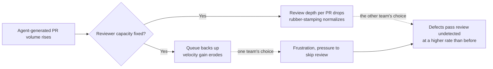

# AI Coding Agents: Productivity vs Software Quality

> By the end of this article you'll be able to name the specific mechanisms that make AI-accelerated development trade velocity for maintainability, measure that trade in leading and lagging indicators instead of vibes, and put guardrails in place before the tradeoff tips into a quality collapse you only notice after it's expensive.

## The Problem

A team adopts an AI coding agent for day-to-day feature work. Three months in, someone pulls up the numbers for the engineering all-hands: pull requests merged per week is up 3x. Average time from ticket to merged PR is down by more than half. The slide gets applause.

Nobody puts up the slide for change failure rate, because nobody built that slide. Six months later, the on-call rotation is worse than it was a year ago — not dramatically, not in any single incident anyone would flag as "the AI's fault," but the trend line on rollbacks, hotfixes, and "wait, why does this endpoint do that" Slack threads is quietly climbing. By the time someone connects the dots, there isn't one bad PR to point at. There are hundreds of individually reasonable ones.

This is the actual shape of the productivity-vs-quality tension with AI coding agents, and it's worth being precise about what it isn't. It isn't "AI writes buggy code" — plenty of AI-generated code is syntactically correct, passes its tests, and does exactly what the prompt asked for. It isn't "developers are lazy now" — the same senior engineers who used to catch these problems by instinct are still on the team. What changed is more structural: the thing that used to gate how much code entered a codebase — how fast a human could type and think it through — got cheap, and everything downstream of that gate (review, testing, architectural coherence) didn't get cheaper at the same rate. This article is about the specific mechanisms that produce that gap, and the practices that keep it from becoming a crisis.

## Why This Tension Is Hard to See Early

If the erosion were sudden and dramatic, teams would catch it immediately and the whole topic would be uninteresting. It's hard precisely because of *how* it's slow, and there are three concrete reasons for that.

**Velocity metrics are leading indicators; quality metrics are lagging ones.** Pull requests merged, lines shipped, features delivered — you can measure these the same day they happen. Defect density, change failure rate, and mean time to recovery only reveal themselves after enough time has passed for something to actually go wrong, and even then the incident review rarely traces cleanly back to "which change introduced this," because by the time it surfaces, dozens of other changes have landed on top of it. The metric that looks great is instant. The metric that would tell you the truth arrives late and blurred.

**Goodhart's Law is doing real work here.** Once "AI adoption" or "PRs shipped per engineer" becomes something leadership tracks and rewards, it stops being a neutral measurement and starts being a target people (and the agents acting on their behalf) optimize directly — often at the expense of whatever the metric was originally a *proxy* for. "PRs merged" was always meant to be a proxy for "value delivered safely." An AI agent can inflate the proxy — more PRs, smaller and more numerous — without moving the actual target at all, and in the worst case while actively working against it, because splitting one coherent change into five "quick" agent-generated PRs looks like more throughput on the dashboard while making each individual diff harder to reason about in isolation.

**Each individual diff can be locally correct while the system degrades globally.** This is the mechanism worth sitting with the longest, because it's the one that makes per-PR code review an incomplete defense by itself. A reviewer approving a single PR is answering the question "is this diff correct and reasonable, given what I can see." Nobody is answering the question "does the sum of the last two hundred individually-reasonable diffs still add up to a coherent system" — that's not a question any single review is positioned to ask, and it's exactly the question that determines whether the codebase is getting easier or harder to work in six months from now.

## A Simple Mental Model

Think of an engineering team's health as a car's dashboard. The speedometer — how fast you're going — is easy to read, updates instantly, and is the number everyone glances at first. The oil pressure and engine temperature gauges update slowly, and a driver who never checks them can drive for a surprisingly long time at a dangerously depleted oil level before the engine actually seizes. Nothing about a healthy-looking speedometer tells you anything about oil pressure — they're not even measuring related things, except that driving faster, for longer, uses up whatever margin the oil pressure gauge was quietly reporting on.

AI coding agents are a much more powerful engine. They let a team go faster than it ever could before. That's genuinely good — more speed is not the problem. The problem is a team that only watches the speedometer, because the AI agent made the speedometer move so satisfyingly that nobody thought to keep an eye on the gauges that were always the actual constraint.

Where the analogy breaks down, stated plainly: an engine's oil pressure degrades roughly in proportion to how hard you drive it — a fairly predictable, monotonic relationship. Software quality doesn't degrade that cleanly. It's possible to go very fast with AI-generated code for a long stretch and see almost no quality cost, if the work is well-specified, well-tested, and well-bounded — and it's possible to see serious quality cost from a much smaller amount of AI-generated code if it lands in a poorly-bounded, under-tested, high-coupling part of the system. Speed isn't the direct cause of quality erosion. Speed without correspondingly scaled verification is.

## Before We Continue

This article assumes you're already comfortable with the mechanics of how an agent actually generates and commits code — the read-modify-test-commit loop from *How AI Agents Read, Modify, Test, and Commit Code*, and the case for why a human still needs to be in that loop from *Why AI-Generated Code Still Needs Senior Engineers*. It also assumes you're familiar with the general shape of an agentic task from *Agentic Software Engineering: From Prompt to Production*. What follows doesn't re-explain the agent loop — it looks at what happens to a codebase and a team's metrics when that loop runs at volume, for months, across many independent tasks.

If you've read *What Happens to Software Architecture When Code Generation Becomes Cheap?*, you've already seen the economic argument for why verification, not generation, becomes the bottleneck. This article builds on that but asks a narrower, more operational question: what specifically accumulates, how do you actually see it happening in your own metrics before it becomes an incident, and what do you do about it day to day.

## The Core Idea: Two Measurement Horizons, One Team

The productivity-vs-quality tension isn't a contradiction to be resolved once — it's a permanent property of the system that has to be actively managed, because the two things you're trying to optimize sit on genuinely different measurement horizons.

**Throughput metrics** — how much gets shipped, how fast — respond almost immediately to an AI coding agent, because agents attack exactly the stage of the pipeline (typing, boilerplate, routine implementation) that used to be the visible bottleneck.

**Stability metrics** — how often something breaks, how long it takes to recover, how well the system holds together as it grows — respond to something else entirely: whether verification, architecture, and review capacity scaled to match the new volume of change. AI agents don't move these metrics on their own, in either direction. They move only if the team deliberately invests in the practices that hold them steady under higher volume — and they degrade by default if the team doesn't, because more code moving through the same unscaled verification capacity is a recipe for more of it slipping through unverified, not less.

The DORA research program (originating from the *Accelerate* research by Nicole Forsgren, Jez Humble, and Gene Kim, and continued as Google Cloud's DORA program) names exactly this split with its four key metrics: **deployment frequency** and **lead time for changes** measure throughput; **change failure rate** and **time to restore service** measure stability. The research's central finding — that elite-performing teams improve *both* pairs together, rather than trading one for the other — is the whole point of this article's practices section. Throughput and stability aren't opposed by nature. They become opposed specifically when throughput accelerates and nothing scales the practices that stability depends on.

> **Verification Note**
> The DORA four-key-metrics framework and its origin in the *Accelerate* research program are well-established and safe to cite generally. Any specific numeric benchmark (e.g., what counts as "elite" deployment frequency in a given year's State of DevOps report) is time-sensitive and should be checked against the current DORA report rather than assumed from this description.

## How It Actually Works: The Mechanisms

This is the part that matters most, because "AI code has more debt" is a claim that's easy to assert and hard to make useful without naming *what* accumulates and *why*.

### Mechanism 1 — Statistical Pattern Reproduction, Not Design Judgment

A coding agent built on a large language model isn't reasoning from your system's specific constraints by default — it's producing the statistically most plausible continuation given its context and training. Most of the time that's a feature: the "plausible" solution to "parse this JSON and validate the fields" really is the ordinary, boring, correct way to do it, and boring-and-correct is exactly what you want for routine work. But "statistically plausible" and "consistent with what your codebase already does" are not the same property, and the gap between them is where a specific, nameable kind of debt accumulates.

Ask an agent to implement the same kind of thing — a paginated list endpoint, a retry wrapper, an input validator — in three separate tasks, weeks apart, without deliberately re-supplying the existing pattern each time, and you can get three subtly different but each individually "correct" implementations: different pagination styles, different retry backoff shapes, different validation error formats. None of them is wrong in isolation. Together, they're inconsistency debt — a codebase where "how do we do X here" no longer has one answer, which is exactly the kind of ambiguity that makes the *next* task (agent- or human-driven) more likely to add a fourth variant instead of reusing one of the first three.

This is a different failure from the single-agent architectural drift covered in *Why AI-Generated Code Still Needs Senior Engineers* (an agent losing track of layering *within* one long task). This is convention drift *across* many independent, individually well-scoped tasks — a volume effect, not a context-window effect, and it shows up even when every single task was executed carefully.

### Mechanism 2 — Local Correctness, Global Blindness

An agent's working context for a given task is bounded — by the context window, by what tools it was given, by what the task description pointed it at (see *Context Windows Explained* and *RAG vs. Long Context for a Codebase* for the mechanics of that boundary). It optimizes hard for making the code in front of it correct against the tests and constraints it can see. It has no comparable pressure to ask "does this increase or decrease the average coupling of this module," "does this raise the cyclomatic complexity of a function that was already at the edge of readable," or "is this the third slightly-different way we've solved this exact problem this month" — because none of those questions are visible from inside a single bounded task, and nothing in the task told it to care.

A human engineer with years of tenure asks those questions anyway, out of habit, even when nobody explicitly assigned them — that's a large part of what "senior engineering judgment" actually consists of day to day. An agent doesn't have tenure. It has whatever context you handed it for this one task, and no standing incentive to optimize for a system-level property that isn't checked by an automated gate.

### Mechanism 3 — Review Capacity Doesn't Scale With Generation Speed

This is a volume argument, not a competence argument, and it's worth stating in numbers to make it concrete. If a team's realistic reviewer capacity is, say, 15 thorough PR reviews per engineer per week, and AI agents raise the number of PRs entering the queue from 20 to 70 a week without a corresponding increase in review capacity, one of two things happens: PRs queue for days (which erodes the velocity gain the agent was supposed to deliver), or review depth per PR drops to keep the queue moving (which erodes the one safety mechanism the process was relying on). In practice, most teams under this pressure drift toward the second option without ever deciding to, because "keep the queue moving" feels like the responsible choice in the moment — it just quietly converts "human-reviewed" into "human-glanced-at" for a growing share of what merges.



Neither branch is a hypothetical failure mode — they're the two rational-seeming responses to a fixed constraint under new pressure, and both end in the same place: more unverified change reaching production per unit of reviewer time than before AI agents raised the volume.

### Mechanism 4 — The Friction Signal That Used to Force Cleanup Is Gone

Before agents, duplicating a piece of business logic across nine call sites was self-limiting: eventually, the pain of maintaining nine copies by hand became visible enough that someone consolidated it, because *not* consolidating cost real, felt typing time. Cheap generation removes that specific pain signal without removing the underlying risk — inconsistency across those nine copies is exactly as dangerous as it always was, but nothing forces anyone to notice, because generating a tenth copy is now just as easy as reusing the first nine. This mechanism is covered in more economic depth in *What Happens to Software Architecture When Code Generation Becomes Cheap?* — the short version for this article is that the removal of the friction signal is one more reason inconsistency debt (Mechanism 1) tends to compound rather than self-correct once agents are doing a meaningful share of the writing.

### Mechanism 5 — Metric Distortion Rewards the Wrong Half of the Tradeoff

Put the first four mechanisms together and you get a codebase that's quietly accumulating inconsistency, coupling, and unreviewed risk — while every dashboard leadership actually looks at (PRs merged, features shipped, "percentage of code AI-assisted") keeps climbing. That's not a coincidence; it's Goodhart's Law operating exactly as it always does: a proxy metric that's cheap to move and visible immediately will get optimized preferentially over a real outcome that's expensive to measure and arrives late, unless someone deliberately builds the measurement for the real outcome and puts it in front of the same audience.

## Let's Walk Through an Example

Consider a mid-sized team's DORA-style dashboard, tracked quarterly, before and after adopting an AI coding agent for routine feature work. The numbers below are illustrative — built to show the *shape* of the mechanism, not sourced from any specific published study — and are exactly the kind of divergence the mechanisms above predict.

| Metric | Before AI agents | Two quarters after adoption | What's actually happening |
|---|---|---|---|
| Deployment frequency | ~3/week | ~9/week | Throughput metric — moves immediately, as expected (Mechanism 3's upstream cause) |
| Lead time for changes | ~4 days | ~1.5 days | Same — the stage AI agents directly accelerate |
| Change failure rate | ~8% | ~14% | Stability metric — climbing as review depth drops and inconsistency compounds (Mechanisms 3, 1) |
| Mean time to restore | ~2 hours | ~3.5 hours | Climbing — larger volume of unfamiliar, inconsistently-patterned code makes root-causing an incident slower (Mechanism 2) |
| Code duplication (static analysis) | baseline | +22% | Direct evidence of Mechanism 1 — convention drift across independent tasks |
| PR review time (median, self-reported) | ~35 min | ~12 min | Evidence of Mechanism 3's second branch — depth dropping to keep the queue moving |

Read only the first two rows, and this team looks like a clear AI-adoption success story. Read all six, and the picture is a team that traded stability for throughput without deciding to — exactly the pattern the DORA research warns is the wrong shape of improvement, and exactly the pattern this article's mechanisms predict by default, absent deliberate intervention.

## Under the Hood: Why Per-PR Review Can't Catch This

It's worth being explicit about *why* a diligent, competent human reviewer — reading every line, thoughtfully — still misses the pattern shown above, because it's not a review-skill problem.

Coupling and duplication are properties of the *system* — they can only be evaluated by comparing a change against what already exists elsewhere in the codebase or module — not properties of a diff in isolation. Cyclomatic complexity is different in an important way: the complexity of a single function is fully computable from the diff itself, and a per-function complexity linter can and should catch it at review time. What per-PR review still can't see is the *trend* — whether the codebase's average or aggregate complexity is climbing release over release — and it can't see duplication or rising coupling at all from one diff alone, because those require knowing what already exists elsewhere in the system. A reviewer looking at a 40-line PR that adds a fourth slightly-different retry wrapper can correctly conclude "this 40 lines is fine — it does what it says, it's tested, it's readable, and its complexity is within bounds" while having no way to see, from that PR alone, that it's the fourth implementation of the same underlying idea. Seeing *that* requires a system-wide view — a static analysis tool that tracks duplication and complexity *trends* over time, not a person reading one diff in isolation.

This is the same insight *What Happens to Software Architecture When Code Generation Becomes Cheap?* makes about verification debt, applied specifically to the review step: the unit of analysis that per-PR review is built around (one diff, one point in time) is structurally the wrong unit for catching an emergent, cross-diff property. You need instrumentation that operates at the codebase level and the trend level, because no individual reviewer decision is wrong — the aggregate outcome is wrong anyway.

## Implementation: A Balanced Guardrail Strategy

The practices below are organized around one principle: make the lagging, hard-to-see half of the tradeoff as visible and as fast-feedback as the leading, easy-to-see half already is.

### 1. Put stability metrics on the same dashboard as velocity metrics — same cadence, same audience

If deployment frequency gets a slide at the engineering all-hands, change failure rate, MTTR, and a code-health trend (duplication percentage, average cyclomatic complexity, or an equivalent static-analysis composite) belong on the same slide, updated on the same cadence, reviewed by the same people. This is the direct countermeasure to Mechanism 5: a metric nobody with influence looks at doesn't change anyone's behavior, no matter how well-intentioned the practice around it is.

### 2. Gate on code-health trend, not just test pass/fail

A CI gate that only checks "do the tests pass" is blind to Mechanism 1 and Mechanism 2 by construction — duplicated logic and rising coupling can both pass every test. A trend-based gate — fail the build (or flag for mandatory review) if a change measurably worsens duplication or complexity beyond a set threshold, rather than only checking absolute correctness — catches exactly the pattern the DORA-metric table above shows compounding quietly. The sketch below illustrates the idea using a duplication-percentage check in a CI step; treat it as a teaching example of the *pattern*, not a production tool — most teams reach for an established static-analysis or code-health platform rather than hand-rolling this metric.

```yaml
# .ci/code-health-gate.yml
# Fails the pipeline if this PR's change measurably worsens
# duplication beyond the team's agreed tolerance, independent
# of whether the diff's own tests pass.

steps:
  - name: Compute duplication delta
    id: compute
    run: |
      BASE_DUP=$(code-health-cli duplication --ref=origin/main)
      HEAD_DUP=$(code-health-cli duplication --ref=HEAD)
      DELTA=$(python3 -c "print(round($HEAD_DUP - $BASE_DUP, 2))")
      echo "duplication_delta=$DELTA" >> "$GITHUB_OUTPUT"

  - name: Enforce tolerance
    run: |
      if (( $(echo "${{ steps.compute.outputs.duplication_delta }} > 1.5" | bc -l) )); then
        echo "Duplication increased by more than 1.5% in this change."
        echo "This is allowed for a deliberate refactor, but requires"
        echo "an explicit 'accepted-duplication' label plus a human"
        echo "reviewer sign-off — it should never merge silently."
        exit 1
      fi
```

The exit condition here isn't "duplication may never increase" — sometimes a small, deliberate duplication is the right call, and a rigid zero-tolerance gate just teaches people to route around it. The point is that a *measurable* regression in a system-level property requires an *explicit* human decision, instead of sailing through unnoticed because every individual diff's own tests were green.

### 3. Feed the agent your conventions, every time, not once

Mechanism 1's root cause is that an agent has no standing memory of "how we already do this" unless the task context supplies it. The practical fix is boring and effective: maintain a small, current reference of the codebase's established patterns (the actual pagination helper, the actual retry wrapper, the actual validation error shape) and make supplying it part of how every relevant task is framed — whether that's a style guide referenced in the task description, a small set of canonical example files the agent is pointed at, or a linter rule that fails a PR introducing a new pattern where an established one already covers the case. This doesn't require new tooling most teams don't already have; it requires treating "does this reuse or reinvent an existing pattern" as a checked property, not an assumed one.

### 4. Size review capacity to the volume you actually want reviewed carefully

Mechanism 3 is a capacity-planning problem, and the fix is a capacity-planning decision: cap the agent's ticket-pull rate (or the number of agent-authored PRs entering the queue per day) to a number the team's reviewers can genuinely review at the depth that mattered *before* agents existed — not the number the agent is capable of producing. Raising review capacity itself (more reviewers, or automating the parts of review a fitness function or contract test can absorb, as covered in the architecture-as-control-plane pattern in *What Happens to Software Architecture When Code Generation Becomes Cheap?*) is the other side of the same lever, and usually the more durable fix, because it scales the constraint instead of just throttling around it.

### 5. Use progressive delivery to bound the cost of what slips through anyway

No gate is perfect, and Mechanism 3's second branch (rubber-stamping) will happen at some rate no matter how well the first four practices are followed. Canary releases, feature flags, and staged rollout — already standard risk-management tools, not new inventions for the AI era — decouple "this merged" from "this is fully trusted in production," which directly targets the MTTR side of the metric table above: catching a regression at 5% of traffic with an automated rollback trigger is a fundamentally cheaper failure than catching it at 100% of traffic three weeks later because a batch job finally choked on it.

## What Can Go Wrong?

- **Vanity velocity metrics become the whole story.** A dashboard that only shows deployment frequency and PRs-per-week, with no stability counterpart, actively hides the exact pattern this article describes — it isn't neutral, it's a lie by omission that leadership will keep rewarding until an incident forces the correction.
- **Rubber-stamp review normalizes without a decision.** Nobody chose to lower review quality; it drifted there because keeping the queue moving felt responsible each individual day. This is the single most common way the mechanisms above actually manifest in a real team, and it's rarely visible until median review time or defect escape rate is explicitly tracked.
- **A code-health gate gets added, then quietly disabled under deadline pressure.** A gate that can be bypassed with a one-off exception, repeatedly, without anyone tracking how often the exception gets used, is a gate in name only. Track exception frequency as its own signal.
- **Teams throttle generation instead of scaling verification.** Slowing the agent down to match an unscaled review process wastes the actual gain without fixing the underlying capacity mismatch — the fix is raising verification throughput, not artificially capping the one stage that got faster (this is the same lever named in *What Happens to Software Architecture When Code Generation Becomes Cheap?*, restated here because it's the single most common wrong instinct when a team first notices this tension).
- **Convention drift gets misdiagnosed as "the agent is inconsistent," and the fix applied is a better prompt instead of a codified pattern.** A one-off prompt tweak doesn't survive the next independent task or the next engineer who forgets to include it. A linter rule or a referenced canonical example does.

## Security Considerations

The mechanisms above apply to security posture with one important asymmetry: a quality regression that ships unnoticed is a latent cost that surfaces on its own schedule (an outage, a confusing bug report); a security regression that ships unnoticed is a latent cost that an adversary is actively looking for, on their schedule, not yours.

- **Statistical pattern reproduction (Mechanism 1) reproduces insecure patterns exactly as readily as it reproduces inconsistent-but-harmless ones.** An agent generating the "statistically plausible" way to build a SQL query, handle a session token, or validate an upload isn't distinguishing "common because it's correct" from "common because a lot of code in the training distribution got this wrong" — it's producing what's typical, and typical code on the public internet includes a meaningful amount of insecure code. *AI Agents for Security Code Review* covers the mechanics of catching this at the review layer; the point here is that it's the same underlying mechanism as the quality drift described above, just with a sharper failure mode.
- **Review-capacity pressure (Mechanism 3) is exactly the condition an attacker benefits from.** A reviewer skimming a large queue of plausible-looking diffs is measurably less likely to catch a subtly introduced auth bypass or injection point than one reviewing at pre-AI depth — and this is true whether the subtle change came from an honest mistake, a compromised dependency, or (in the indirect-prompt-injection case covered in *MCP Security*) a maliciously crafted input the agent processed. High volume and shallow review is a favorable environment for exactly the kind of small, damaging change that's easy to hide inside a large, mostly-correct diff.
- **Security-sensitive code paths deserve a stricter version of the review-capacity fix in practice 4 above** — not a general cap on volume, but a specific rule that anything touching authentication, authorization, cryptography, or data access always gets full-depth human review regardless of queue pressure, with no "it's probably fine, CI is green" exception. Treat this the same way *AI Agents for Refactoring Legacy Systems* treats security-sensitive files during agentic refactors: a separate, non-negotiable review class, not a diff like any other.

## Common Misconceptions

**Misconception:** "Slower velocity means better quality, so the fix is to make the agent do less."
**Reality:** The mechanisms above aren't caused by speed itself — they're caused by speed without correspondingly scaled verification, convention-sharing, and review capacity. A team that scales those three things alongside agent adoption can sustain high velocity *and* stable-or-improving change failure rate; the DORA research's core finding is precisely that these aren't opposed by nature.

**Misconception:** "If tests are passing and code review approved it, quality is fine."
**Reality:** Tests and per-PR review verify diff-local correctness. Duplication, coupling, and cross-task convention drift are system-level properties that no individual diff's tests or review can see, by construction — you need trend-level instrumentation to catch them at all.

**Misconception:** "Tracking DORA's stability metrics is enough on its own."
**Reality:** Change failure rate and MTTR are necessary but not sufficient here — they catch problems that have already reached production. Code-health trend metrics (duplication, complexity, convention consistency) are the earlier warning that lets a team intervene before the stability metrics move, which is the whole point of catching this before it becomes an incident rather than after.

**Misconception:** "This is a new problem AI agents invented."
**Reality:** The tension between throughput and stability, and the risk of optimizing a visible proxy metric at the expense of a real outcome, predates AI coding agents by decades — it's the same story DORA's research told about human-only teams under delivery pressure. AI agents don't invent the tension; they compress the timescale on which an unmanaged version of it does damage, because the volume of change moving through an unscaled process is simply larger and faster than it used to be.

## Real-World Architecture

None of the countermeasures described here are speculative or AI-specific inventions — they're established practices whose value proposition becomes sharper once generation volume rises:

- **The DORA four-key-metrics framework** (deployment frequency, lead time for changes, change failure rate, time to restore service) has been the standard, research-backed way to talk about the throughput/stability tradeoff in software delivery for years, independent of AI. Extending that dashboard with a code-health trend metric is a natural, low-friction addition to a framework teams may already be tracking.
- **Static-analysis platforms that track duplication, complexity, and maintainability trends over time** (as distinct from one-off linting on a single diff) are an established category of tooling, used well before AI-generated code made the trend-tracking angle more urgent.
- **Architecture fitness functions and contract tests**, covered in depth in *What Happens to Software Architecture When Code Generation Becomes Cheap?*, are the general control-plane pattern this article's code-health gate is a specific instance of — the broader idea is converting a convention the team cares about into something CI checks automatically, rather than something a reviewer is trusted to remember.
- **Progressive delivery (canaries, feature flags, staged rollout)** is standard practice at organizations operating at scale, for reasons that predate AI coding agents entirely — it's the general mechanism by which a team decouples "merged" from "fully trusted," which is exactly the decoupling this article's MTTR discussion depends on.

> **Verification Note**
> Any specific organization's published defect rates, DORA-metric benchmarks, or AI-adoption percentages should be sourced to that organization's own engineering blog or a specific dated DORA/State of DevOps report rather than assumed from this article — the mechanisms described here are general and well-supported, but specific numbers age quickly and vary by methodology.

## Expert Insight

The engineering leaders who navigate this well tend to share one habit: they treat "how fast are we shipping" and "how much of what we shipped do we actually trust" as two separate questions that get asked in the same meeting, on the same cadence, by the same people — not as a throughput report followed, eventually and separately, by an incident postmortem. The moment those two questions get asked by different audiences on different schedules, the throughput number wins the room by default, because it's the one that's ready first.

The other pattern worth naming: the fix is almost never "review more carefully." Review depth is a finite, human resource that doesn't scale with agent throughput no matter how disciplined reviewers try to be — asking people to simply be more careful under rising volume is asking them to solve a capacity problem with willpower, which fails quietly and predictably. The durable fix is always some combination of automating what can be automated (fitness functions, contract tests, trend gates) and deliberately bounding what can't be (queue caps, mandatory review classes for security-sensitive paths) — converting a review-capacity problem into an engineering-design problem, which is the one kind of problem this discipline has always been good at solving.

## Try It Yourself

**Goal:** Get a real, measured answer — for your own codebase — to whether AI-assisted throughput gains have come with a stability cost, instead of relying on impression.

**Starting Point:** A repository with at least six months of commit history that includes a mix of AI-assisted and non-AI-assisted changes (most real repositories at this point qualify).

**Task:**
1. Using your CI history or issue tracker, compute (or estimate) change failure rate and rough time-to-restore for the three months before heavier AI-agent adoption and the three months after.
2. Run a static-analysis or duplication-detection tool against the same two windows and compute the delta in duplication percentage and average function complexity.
3. Pull ten recent AI-assisted PRs at random and check, for each, whether it introduces a new variant of something that already had an established pattern elsewhere in the codebase (a new pagination style, a new error-handling shape, a new retry approach) — count how many do.
4. Compare all three results against each other.

**Expected Result:** If the mechanisms in this article are operating in your codebase, you'll typically see some combination of: a rising duplication or complexity trend, a change failure rate that hasn't fallen even as deployment frequency rose, and a nontrivial fraction of the ten sampled PRs quietly reinventing something that already existed.

**What You Learned:** Whether your team's productivity gain from AI agents is a genuine improvement or a throughput number bought against unmeasured stability cost — and, if it's the latter, exactly which of the five mechanisms in this article is the biggest contributor, which tells you which practice to invest in first.

## Pause and Think

If deployment frequency and lead time for changes both improve while change failure rate and mean time to restore stay exactly flat — not worse, just unchanged — has the team actually gotten more productive, or just faster at shipping the same amount of unverified risk more often?

### Answer

Flat stability metrics alongside improved throughput is actually the good outcome, not a hidden problem — it means the team scaled verification, convention-sharing, and review capacity well enough to absorb the extra volume without the two stability metrics degrading, which is exactly the DORA research's definition of moving in the right direction on both axes at once. The trap this question is designed to expose is different: a team that sees flat stability metrics and concludes "we're fine, no need to invest further" is treating a result that took deliberate investment to sustain as if it happens automatically. Flat-and-good is not the same as free-and-automatic — it's evidence the guardrails are working, which is itself the argument for keeping and scaling them as agent-driven volume keeps rising, not a signal that they can be relaxed.

## Key Takeaways

- The productivity/quality tension with AI coding agents is a measurement-horizon problem: throughput metrics are leading and cheap to see; stability and code-health metrics are lagging and easy to ignore until they cause an incident.
- Five concrete mechanisms drive the quality side of the tradeoff: statistical pattern reproduction causing convention drift across independent tasks, an agent's local-context blindness to system-level properties, fixed review capacity under rising PR volume, the loss of the "pain signal" that used to force cleanup, and Goodhart's Law rewarding visible proxy metrics over the real outcome they were supposed to represent.
- Per-PR code review, however careful, structurally cannot catch emergent, cross-diff properties like duplication and coupling trends — those require codebase-level, trend-based instrumentation, not better individual reviews.
- The fix is a balanced measurement and guardrail strategy: put stability and code-health metrics on the same dashboard as velocity metrics, gate CI on trend regressions (not just test pass/fail), feed agents your actual conventions every time, size review capacity deliberately, and use progressive delivery to bound the cost of whatever still slips through.
- None of the countermeasures are AI-specific inventions — DORA's four-key framework, static-analysis trend tracking, architecture fitness functions, and progressive delivery all predate coding agents. What's new is how urgently they matter once generation volume rises faster than verification capacity does by default.
- Throughput and stability are not inherently opposed — high-performing teams historically improve both together. They only trade off against each other when one side is deliberately measured and rewarded and the other isn't.

## What to Learn Next

*AI Coding Agents and the Future of Code Review* picks up the review-capacity mechanism from this article directly and works through how review itself has to change shape — not just scale up — once it's structurally the slowest stage in the pipeline. *The New Software Engineering Skill: Managing AI Agents* covers the complementary day-to-day skill this article's guardrails depend on: scoping tasks and choosing a verification strategy proportional to blast radius, which is the practical judgment call behind every "how much review does this actually need" decision described here.
