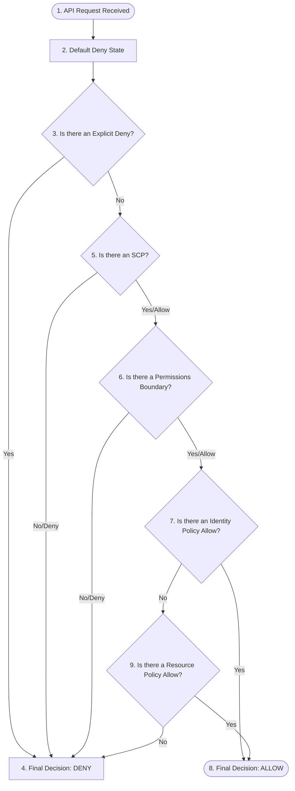

# AWS Cloud Security and IAM: Designing Principle of Least Privilege, Roles, and Resource Policies

> Learn the evaluation logic of AWS IAM policies, design cryptographically secure resource-level bounds, and implement temporary credential architectures for containers and workloads.

---

## What We Are Going to Learn

In this deep-dive guide, we will step inside the security architecture of **Amazon Web Services (AWS) Identity and Access Management (IAM)**.

Specifically, we will cover:
1. **The Principle of Least Privilege** and why hardcoded static access keys are a major architectural risk.
2. **The exact IAM Evaluation Logic** and how AWS resolves conflicting Identity, Resource, and Boundary policies.
3. **The Confused Deputy Problem** and how to use cryptographically secure `ExternalId` checks to mitigate cross-account vulnerabilities.
4. **Designing hardened IAM Policy JSON definitions** for S3 and KMS resources using explicit condition blocks.

---

## The Problem: The Overly Permissive Wildcard Fallacy

When developing cloud-native applications, engineers need their services to interact with cloud infrastructure (e.g., a microservice downloading images from an S3 bucket or decrypting database keys using KMS).

In the rush of development, engineers frequently apply the **Overly Permissive Wildcard** pattern:

```json
{
  "Version": "2012-10-17",
  "Statement": [
    {
      "Effect": "Allow",
      "Action": "*",
      "Resource": "*"
    }
  ]
}
```

This represents an immense, fatal security vulnerability:
* **The "Star-Star-Star" (`*:*:*`) Risk:** If an attacker discovers a Server-Side Request Forgery (SSRF) or a Remote Code Execution (RCE) bug inside your microservice, they can query the local Instance Metadata Service (IMDS) to extract the temporary security credentials of that instance. Because the policy has wildcards, the attacker gains full administrative access to your *entire* AWS account, enabling them to spawn ransom-mining instances, delete databases, or hold your company host.
* **The Static Access Key Leak:** Many teams generate static IAM User **Access Keys** (`AKIA...`) and hardcode them inside `.env` files, config scripts, or commit them to private Git repositories. If that repository is leaked, botnets scrap the keys within seconds and compromise the account.

---

## Why the Problem Is Hard: The Complex IAM Policy Evaluation Engine

Designing secure IAM permissions is hard because AWS evaluates multiple policy types simultaneously:

```
  [ Identity Policy ] + [ Resource Policy ] + [ Boundary Policy ] + [ Organizations SCP ]
                                        ↓
                         [ AWS IAM Evaluation Engine ]
```

AWS must reconcile permissions scattered across different logical components. If a policy is configured incorrectly, it can block access to legitimate services or leave silent, backdoor access tunnels open for attackers.

---

## A Simple Mental Model: The Corporate Security Badge

Think of AWS IAM like security access inside a high-security research facility:

```
                            RESEARCH FACILITY (AWS Cloud Account)
                                              |
               =============================================================
               |                                                           |
         [ Identity Policies ]                                    [ Resource Policies ]
               |                                                           |
   The permissions printed on YOUR badge.                       The lock on the physical Door.
   "You are authorized to open file cabinets."                  "Only people from Department 402,
                                                                wearing a yellow hardhat,
                                                                can open this safe."
```

* **Authentication:** Checking your badge photo (proving you are who you say you are).
* **Identity Policy:** What *you* are allowed to do.
* **Resource Policy (The Door Lock):** What is allowed to touch *the resource*, regardless of who the caller is.
* **Service Control Policy (SCP):** The building's master circuit-breaker. If the building power is cut (SCP Deny), no keycard can open any door, even if the individual badge says "Allow."

---

## Under the Hood: AWS IAM Policy Evaluation Logic

When an API call is made to an AWS resource, the IAM engine follows a strict, deterministic evaluation flow.



### The Immutable Laws of IAM Evaluation
1. **Default Deny:** All requests are denied by default.
2. **Explicit Deny Overrides All:** If any policy containing a `"Deny"` matches the request context, the request is immediately denied, regardless of how many other `"Allow"` statements exist.
3. **Union of Allows:** If there is no explicit deny, the request must have at least one explicit `"Allow"` in either an identity policy or a resource policy to succeed.

---

## Hands-On JSON: Hardening an S3 and KMS Policy

Let's walk through an insecure, overly permissive configuration and rewrite it into a hardened, least-privilege production-grade policy.

### The Insecure Vulnerable Approach
This policy allows the microservice to perform any action on any S3 bucket or KMS key in the entire account.

```json
{
  "Version": "2012-10-17",
  "Statement": [
    {
      "Effect": "Allow",
      "Action": [
        "s3:*",
        "kms:*"
      ],
      "Resource": "*"
    }
  ]
}
```

---

### The Hardened Least-Privilege Approach
This hardened policy implements strict defensive constraints:
1. **Explicit Actions:** Replaces wildcards (`s3:*`) with only the specific read/write operations required (`GetObject`, `PutObject`).
2. **Resource Scoping:** Restricts S3 actions to a single designated bucket (`secure-invoice-data-2026`) and its paths.
3. **KMS Key Scope:** Limits key decryption to the specific Key ARN used for decrypting those invoice files.
4. **Condition Blocks:** Enforces that all connections **must use HTTPS/TLS** (`aws:SecureTransport`) and must transit within your private VPC endpoints.

```json
{
  "Version": "2012-10-17",
  "Statement": [
    {
      "Sid": "SecureS3ReadWriteAccess",
      "Effect": "Allow",
      "Action": [
        "s3:GetObject",
        "s3:PutObject"
      ],
      "Resource": "arn:aws:s3:::secure-invoice-data-2026/invoices/*"
    },
    {
      "Sid": "EnforceTLSTransmissionOnly",
      "Effect": "Deny",
      "Action": "s3:*",
      "Resource": "arn:aws:s3:::secure-invoice-data-2026/*",
      "Condition": {
        "Bool": {
          "aws:SecureTransport": "false"
        }
      }
    },
    {
      "Sid": "KMSDecryptInvoiceAccess",
      "Effect": "Allow",
      "Action": [
        "kms:Decrypt",
        "kms:GenerateDataKey"
      ],
      "Resource": "arn:aws:kms:us-east-1:123456789012:key/a1b2c3d4-e5f6-7a8b-9c0d-1e2f3a4b5c6d",
      "Condition": {
        "StringEquals": {
          "kms:ViaService": "s3.us-east-1.amazonaws.com"
        }
      }
    }
  ]
}
```

---

## Security Analysis: The Confused Deputy Problem and Cross-Account Trust

Workloads frequently need to grant access to third-party SaaS services (e.g., a multi-tenant cloud auditing tool) to read your AWS logs.

### The Attack (The Confused Deputy)
If you configure an IAM **Role Trust Policy** that blindly trusts the SaaS provider's AWS account ID, you create a major vulnerability:

```
  Attacker ---> Registers on SaaS App ---> Inputs Your Role ARN ---> SaaS App assumes role!
```

1. The SaaS provider uses a single, shared IAM Role to assume roles in all customer accounts.
2. An attacker registers a free account with the SaaS provider.
3. The attacker inputs *your* AWS Role ARN into their SaaS dashboard.
4. The SaaS provider (the "Confused Deputy"), acting on the attacker's request, calls `AssumeRole` on your account. Because your trust policy merely checks if the SaaS provider's AWS account is the caller, it permits the request, allowing the attacker to read your private logs through the SaaS console.

### The Architectural Fix (`ExternalId`)
To prevent this, you **must enforce a cryptographically secure, unique identifier** for the cross-account trust mapping using `sts:ExternalId`:

```json
{
  "Version": "2012-10-17",
  "Statement": [
    {
      "Effect": "Allow",
      "Principal": {
        "AWS": "arn:aws:iam::888888888888:root" 
      },
      "Action": "sts:AssumeRole",
      "Condition": {
        "StringEquals": {
          "sts:ExternalId": "unique-customer-uuid-generated-by-saas-55412"
        }
      }
    }
  ]
}
```

When the SaaS provider attempts to assume the role, they must pass this unique secret `ExternalId` token. Since the attacker does not know your unique `ExternalId` mapping, the assumption fails.

---

## Common Misconceptions

### Misconception 1: "EC2 Instance Profiles pass static access keys to instances."
**Reality:** Instance Profiles use the **AWS Security Token Service (STS)** under the hood. STS generates **short-lived temporary credentials** (valid for a few hours) and streams them dynamically to the instance metadata endpoint (`http://169.254.169.254`). No static access keys are ever saved on disk or passed across networks.

### Misconception 2: "If I delete my AWS root password, my account is safe."
**Reality:** Deleting the root user password is vital, but if you have active root **access keys** configured in your AWS dashboard, your account remains extremely vulnerable. Root access keys bypass all IAM policy boundaries and SCPs, and should be completely deleted from the account.

---

## Pause and Think

> **Critical Question:** If an Organization Service Control Policy (SCP) Denies `s3:*` actions, but an IAM Role's Identity Policy explicitly Allows `s3:GetObject` on a bucket, can the role read files?

### Answer
**No.** 

According to the **Immutable Laws of IAM Evaluation**, an explicit Deny in *any* policy boundary (including SCPs) overrides all Allows. The SCP's Deny acts as a master block, neutralizing the identity policy's Allow.

---

## Key Takeaways

* **Avoid static access keys in production;** use STS Temporary Credentials via Instance Profiles or EKS Roles for Service Accounts (IRSA).
* **IAM evaluation follows a strict sequence:** Default Deny -> Explicit Deny check -> Evaluation of SCPs, Boundaries, and Identity/Resource Allows.
* **Enforce HTTPS/TLS encryption** on all resource storage requests using policy condition blocks.
* **Mitigate the Confused Deputy problem** in cross-account role assumptions using unique `sts:ExternalId` keys.

---

## What to Learn Next

To expand your cloud security architecture expertise, explore:
* **Designing AWS Service Control Policies (SCPs) to lock down multi-account landing zones.**
* **Implementing EKS OIDC federation for container-level workload identity.**
* **Configuring AWS KMS Key Policies for envelope-encryption key rotation.**
