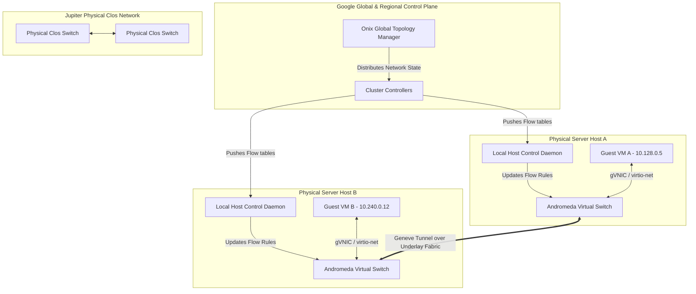

# GCP Network Architecture: Andromeda Software-Defined Networks, BGP, and Global VPC Routing

> Unpack the architectural and logical primitives of Google Cloud's virtual network substrate. Learn how Andromeda decouples control from physical host data planes, trace packet path encapsulation on hypervisor virtual switches, examine global VPC fiber routing, and analyze dynamic BGP peering via Cloud Router.

---

## What We Are Going to Learn

In this deep-dive guide, we will examine the architectural mechanics of Google Cloud Platform's (GCP) global networking infrastructure.

Specifically, we will cover:
1. **The Physical Datacenter Bottleneck:** Analyzing why traditional box-by-box hardware switching imposes critical limits on scalability, latency, and operational flexibility in multi-tenant environments.
2. **The Andromeda Software-Defined Network:** Deep-diving into Google Cloud's SDN architecture and learning how decoupling the Control Plane from the Data Plane creates a globally orchestratable network.
3. **Host-Level Packet Processing:** Inspecting packet encapsulation (Geneve overlay) and kernel-bypass virtual switches on physical hypervisors to achieve microsecond-level host-to-host speeds.
4. **Global VPC Architecture:** Exploring how GCP VPCs achieve native global routing across continents using Google’s private dark fiber backbone without intermediate transit gateways.
5. **Dynamic Hybrid Routing:** Examining how BGP route propagation works under the hood with Cloud Router, clarifying its control-plane-only architecture.
6. **Expert Performance Insights:** Assessing the operational cost of VPC Flow Logs and contrasting the latency, transit path, and egress economics of Premium vs. Standard Network Tiers.

---

## The Problem: Monolithic Box-by-Box Routing and the Hardware Bottleneck

In traditional enterprise physical datacenters, networking is tightly coupled with physical hardware. Routers, firewalls, and switches (from vendors like Cisco, Arista, or Juniper) maintain their own localized configurations and routing logic. 

```
TRADITIONAL HARDWARE-CENTRIC ROUTING
┌────────────────────────────────────────────────────────┐
│ [ Physical Server A ]                                  │
└───────────┬────────────────────────────────────────────┘
            │ 10.0.1.10
            ▼
┌────────────────────────────────────────────────────────┐
│ [ Top-of-Rack (ToR) Switch ]                           │ ◄── Localized MAC Address Table
└───────────┬────────────────────────────────────────────┘
            │ VLAN Tagged / Trunk Interface
            ▼
┌────────────────────────────────────────────────────────┐
│ [ Aggregation Layer Switch / Router ]                  │ ◄── Local Forwarding Information Base (FIB)
└───────────┬────────────────────────────────────────────┘
            │ OSPF / BGP Hop-by-Hop Routing
            ▼
┌────────────────────────────────────────────────────────┐
│ [ Core Layer Router ]                                  │ ◄── Ternary Content-Addressable Memory (TCAM) Limits
└────────────────────────────────────────────────────────┘
```

This hardware-centric model breaks down under the scale, density, and agility of cloud-native architectures due to several systemic bottlenecks:

* **Ternary Content-Addressable Memory (TCAM) Exhaustion:** Physical switch ASICs use high-speed TCAM tables to match packet headers against access control lists (ACLs) and routing tables. TCAM is extremely expensive, power-hungry, and physically limited. A hardware switch can typically store between $10,000$ and $100,000$ IP prefixes and MAC addresses. In a public cloud where millions of transient virtual machines, containers, and serverless runtimes are spun up and down every hour, storing these addresses directly in physical switch tables is mathematically impossible.
* **Convergence Latency Jitter:** Physical network routers distribute routing information using hop-by-hop protocols like OSPF, IS-IS, or external BGP. When a server goes offline or a link fails, these protocols must re-advertise state updates sequentially from node to node. This convergence process takes from several hundred milliseconds to tens of seconds. In a highly elastic cloud, waiting seconds for convergence during VM instantiation or migration results in unacceptable application downtime and packet drops.
* **Localized State Fragmentation:** In a traditional physical network, changing a policy, applying a firewall rule, or provisioning a new segment requires updating the physical configurations of dozens of distinct switches and routers box-by-box. This manual or semi-automated scripting of static configurations introduces severe risks of configuration drift, security blind spots, and localized "blast radius" outages.

---

## Why the Problem Is Hard: The Resource and Control Paradox

Virtualizing a network at Google Cloud's scale requires resolving a fundamental engineering paradox: **How do you provide complete software-defined isolation and infinite virtual networks on a single shared physical infrastructure without introducing massive packet serialization latency, CPU utilization overhead, or global routing state synchronization delays?**

1. **The Performance Constraint (The "Virtualization Tax"):** Wrapping virtual guest packets inside virtual networks (overlay networks) historically required the host CPU hypervisor to run software bridges (like traditional Linux bridges or basic Open vSwitch setups). This software packet processing forces a CPU interrupt and context switch for almost every packet, consuming up to $30\%$ of host CPU cores just to process networking I/O. For modern 100 Gbps to 200 Gbps physical links, pure software routing on the host CPU cannot keep pace with the wire rate.
2. **The Global Consistency Problem:** To support global VPCs, a change in VM placement in Council Bluffs, Iowa, must be immediately understood by virtual switch hypervisors in St. Ghislain, Belgium, and Changhua County, Taiwan. Standard database synchronization is too slow, and standard hardware routing protocols cannot scale to support millions of endpoints globally. If routing data is synchronized asynchronously, temporary routing loops can cause traffic to bounce across continents indefinitely.

---

## A Simple Mental Model: The Smart Package Label and the Passive Conveyor Belt

To understand how Google Cloud's network handles global scale, think of a modern automated logistics system:

```
TRADITIONAL ROUTING: "The Sorter-by-Sorter Warehouse"
┌──────────────────────────────────────────────────────────────────┐
│ Box (Packet) ──► [Sorter 1] ──► [Sorter 2] ──► [Sorter 3] ──► Dst │
└──────────────────────────────────────────────────────────────────┘
(At every junction, workers must stop the box, open its manifest, 
 cross-reference a massive paper ledger, and place it on a new belt)

ANDROMEDA SOFTWARE-DEFINED ROUTING: "The Smart-Label Conveyor"
┌──────────────────────────────────────────────────────────────────┐
│ Box ──► [On-Host vSwitch: Slaps Outer GPS Tag] ──► [Passive Belt]│
└──────────────────────────────────────────────────────────────────┘
                                                            │
                                                            ▼ (Google Fiber)
                                                   Directly to Target Host
```

* **Traditional Box-by-Box Routing** is like a shipping warehouse where postal workers at *every crossroads switch* must halt your package, read your detailed commercial invoice, search a massive local lookup book to find where the destination country is, apply a new stamp, and push it to the next sorter.
* **Andromeda Software-Defined Routing** is like printing a single **Smart Routing Label** at the sender's front door (the host hypervisor). This label contains the absolute GPS coordinates of the destination container and the precise transit corridor it must take. Once the label is applied, the package travels along entirely passive, high-speed conveyor belts (Google’s flat physical **Jupiter Clos Network**) that never open the box, never consult local directories, and never slow down. The physical switches are dumb, fast, and passive; the hypervisor virtual switch is smart.

---

## The Andromeda Solution: Google Cloud's Software-Defined Network (SDN)

Andromeda is Google Cloud’s hierarchical Software-Defined Networking platform. It separates the **Control Plane** (the brain making routing and security decisions) from the **Data Plane** (the muscle encapsulating and forwarding packets on the physical wires).



### 1. The Global Control Plane (Onix and Cluster Controllers)
Andromeda does not rely on switches running local routing protocols to learn network topology. Instead, a logically centralized, globally distributed state engine called **Onix** acts as the network's brain:

* **Onix** maintains the absolute topology of all virtual networks, subnets, firewall rules, VM placements, and logical routes.
* When a user performs an action (e.g., creating a new VM, deleting a firewall rule, or instantiating a VPN), Onix processes the state change and computes the logical difference.
* **Cluster Controllers** translate these high-level logical state differences into highly optimized, localized host-forwarding rule sets (flow tables).
* These flow tables are pushed directly down to the **Local Host Control Daemons** running on each physical hypervisor server.

---

### 2. The Physical Underlay Plane: The Jupiter Fabric
The physical network inside Google's datacenters is called **Jupiter**.
* Jupiter is a flat, non-blocking L3 **Clos Network** (spine-and-leaf topology) made from massive arrays of low-cost, commodity merchant-silicon switches running a minimal custom operating system.
* Jupiter does not know anything about customer VPCs, internal IPs, or security group policies. It only routes standard, encapsulated IP packets from one physical host hypervisor IP to another at extreme throughput (bisection bandwidths exceeding $1.3$ Petabits per second per datacenter cluster).
* This flat network design prevents localized hotspots and ensures that any host can communicate with any other host in the cluster with uniform, sub-microsecond latency.

---

## Under the Hood: Hovering Over the Host Hypervisor's Virtual Switch

To achieve high-speed network performance, Andromeda moves the logic of network routing, firewalls, and virtualization overlays directly onto the physical server host.

### 1. Bypassing the Kernel: Bouncing Off the Host Stack
In traditional virtualization, when a guest VM sends a packet, the packet must pass through multiple kernel boundaries:

$$\text{Guest User-Space} \longrightarrow \text{Guest Kernel} \longrightarrow \text{Host Kernel Bridge} \longrightarrow \text{Host Network Driver} \longrightarrow \text{Physical NIC}$$

This path triggers constant physical CPU interrupts and copy operations, killing network throughput and spiking latency. Andromeda avoids this overhead using a combination of **Kernel-Bypass** and hardware-accelerated drivers:

* **gVNIC (Google Virtual NIC):** A custom-designed virtual network interface driver optimized specifically for Google's infrastructure. gVNIC manages transmit and receive queues directly in user-space, optimizing CPU cache lines and minimizing memory copies.
* **User-Space Andromeda vSwitch:** The virtual switch daemon runs entirely in host user-space, bypassing the host Linux kernel network stack. Using DPDK (Data Plane Development Kit) or custom shared-memory ring buffers, Andromeda polls the virtual interfaces of the guests and the physical NIC directly. Packets are pulled, processed, encapsulated, and transmitted without the CPU ever switching to kernel mode.
* **Hardware Offloading (ASIC/IPU):** Google's modern physical hypervisors utilize custom-built hardware accelerators (Infrastructure Processing Units, or IPUs). The IPU offloads the Andromeda vSwitch flow matching, cryptographic operations, and encapsulation parsing directly into specialized host silicon, freeing up the main host CPU cores entirely for customer workloads.

---

### 2. Packet Encapsulation: The Geneve Overlay Network
To transport private multi-tenant VPC packets across the flat, single-tenant Jupiter underlay fabric, Andromeda encapsulates the guest packet inside an outer IP packet. Andromeda uses a customized version of the **Geneve (Generic Network Virtualization Encapsulation)** protocol.

Let's look at the exact wire-format of an Andromeda packet traveling across the physical Jupiter backbone:

```
+─────────────────────────────────────────────────────────────────────────────────────────────+
|                                    ANDROMEDA ENCAPSULATED WIRE PACKET                        |
+─────────────────────────────────────────────────────────────────────────────────────────────+
|  OUTER IP HEADER  | UDP HEADER |   GENEVE OVERLAY HEADER   |  INNER IP HEADER   | TCP/UDP | |
|   Src: Host A IP  | Src: Hash  |  VNI / VPC Tenant ID (24b)|   Src: Guest VM A  | HEADER  |P|
|   (192.168.1.15)  | Dst: 6081  |  Policy / Security Tags   |   (10.128.0.5)     | (Port   |L|
|  Dst: Host B IP   |            |  Andromeda Flow Context   |  Dst: Guest VM B   |  443)   |D|
|   (192.168.4.92)  |            |                           |   (10.240.0.12)    |         | |
+─────────────────────────────────────────────────────────────────────────────────────────────+
```

* **Outer IP Header:** Used by physical Jupiter switches to route the packet between physical hosts. The physical network only sees Host-A IP and Host-B IP.
* **UDP Header:** Destined to UDP Port $6081$ (Geneve). The Source Port is dynamically computed as a hash of the *inner* packet headers (IPs, Ports, Protocol). This is a critical architectural trick: physical Clos switches use ECMP (Equal-Cost Multi-Path) hashing on the outer IP and UDP ports to distribute traffic. By hashing the inner packet headers into the outer UDP Source Port, Andromeda forces different guest connections to distribute perfectly across thousands of redundant physical fiber paths, avoiding packet serialization bottlenecks.
* **Geneve Overlay Header:** Contains a 24-bit Virtual Network Identifier (VNI) representing the user's specific VPC. It also embeds custom metadata, including:
  * Security group tags (to enforce firewall rules on the destination host).
  * Source routing constraints.
  * Virtual routing tables.
* **Inner IP & Payload:** The untouched, raw packet emitted by Guest VM A.

---

### 3. Step-by-Step Packet Transmission Lifecycle
When VM A in `us-east1` sends a TCP packet to VM B in `europe-west3`:

```
┌──────────┐  1. Raw Packet  ┌──────────────┐  2. Rules & Encapsulation  ┌──────────────┐
│ Guest VM │ ──────────────► │ Andromeda    │ ─────────────────────────► │ Physical NIC │
│  Kernel  │                 │ vSwitch (DP) │                            │  (Host A)    │
└──────────┘                 └──────────────┘                            └──────┬───────┘
                                     ▲                                          │
                                     │                                          │ 3. Encapsulated
                                     │ 2a. Cache Miss Query                     │    Wire Packet
                                     ▼                                          ▼
                             ┌──────────────┐                            ┌──────────────┐
                             │ Host Control │                            │ Jupiter Fiber│
                             │ Daemon (CP)  │                            │ Underlay     │
                             └──────────────┘                            └──────────────┘
```

1. **Guest Emission:** Guest VM A writes a packet to its virtual interface (`gVNIC`).
2. **vSwitch Interception:** The user-space Andromeda vSwitch intercepts the raw frame.
3. **Flow Lookup:** The vSwitch checks its highly optimized, thread-local flow cache:
   * **Cache Hit:** If there is an existing entry, Andromeda immediately identifies that Guest VM B (10.240.0.12) is co-located on physical Host B (192.168.4.92). It skips further processing.
   * **Cache Miss:** If no entry exists, the data plane pauses the packet and queries the local host control daemon. The control daemon queries the Cluster Controller, retrieves the target host IP, validates security policies, and installs a persistent flow rule into the vSwitch's fast path.
4. **Overlay Encapsulation:** The vSwitch wraps the guest packet in the Geneve header, injecting the VPC's Tenant ID (VNI) and source security tags.
5. **Physical Output:** The packet is sent to Host A's physical interface, exiting over the 100 Gbps fiber network.
6. **Transit:** Jupiter Clos switches forward the packet based solely on the host-to-host outer IP header.
7. **Ingress Decapsulation:** Host B's physical NIC receives the packet. Host B's Andromeda vSwitch strips the Geneve header, parses the VNI, validates the source security tags against Host B's firewall rules, and writes the decapsulated inner packet directly into Guest VM B's memory buffer.

---

## Global VPCs: Native Global Routing Over Google's Private Fiber Backbone

In Google Cloud, Virtual Private Clouds (VPCs) are natively **global resources**. This means a single VPC name space can contain subnets in Oregon, Frankfurt, Tokyo, and Sydney.

```
GOOGLE GLOBAL VPC ARCHITECTURE
┌────────────────────────────────────────────────────────────────────────────────┐
│                           SINGLE GLOBAL VPC ("production")                     │
├───────────────────────┬────────────────────────┬───────────────────────────────┤
│ Subnet us-east1       │ Subnet europe-west3    │ Subnet asia-east1             │
│ (10.128.0.0/20)       │ (10.142.0.0/20)        │ (10.146.0.0/20)               │
└──────────┬────────────┴───────────┬────────────┴───────────┬───────────────────┘
           │                        │                        │
           ▼                        ▼                        ▼
┌────────────────────────────────────────────────────────────────────────────────┐
│              GOOGLE'S GLOBAL PRIVATE FIBER BACKBONE & TRANSIT SYSTEM           │
└────────────────────────────────────────────────────────────────────────────────┘
```

Unlike traditional cloud networking (where VPCs are strictly regional and require complex Transit Gateways, VPNs, or VPC peering tunnels to bridge geographic regions), Andromeda makes cross-continental routing look like a single flat local network.

### How Google Achieves Global VPC Routing
1. **Google's Private Dark Fiber Backbone:** Google owns millions of miles of private fiber-optic cabling, including massive undersea cables (like Curie, Dunant, Grace Hopper, and Equiano). Traffic between regions never travels over the public internet. It traverses Google’s private global network.
2. **Single Global Control Plane Database:** Because Onix tracks the state of the entire global network, the Cluster Controller in `europe-west3` knows exactly which physical host in `asia-east1` is running a targeted VM.
3. **No Intermediate Gateway Hops:** When a VM in us-east1 pings a VM in asia-east1, Host A's virtual switch encapsulates the packet with the destination physical host IP in Taiwan. The packet enters the Google fiber network and is routed directly to Taiwan without passing through regional virtual routers, transit gateways, or virtual appliances. The routing latency is mathematically limited only by the speed of light through glass fibers:

$$\text{Latency} \approx \frac{\text{Distance}}{200,000 \text{ km/s}}$$

This eliminates the cost, complexity, and single-point-of-failure risks associated with cloud transit routers and regional VPN connectors.

---

## Dynamic Hybrid Interconnect: BGP and Cloud Router

To securely extend your physical corporate datacenter into Google Cloud, companies utilize **Dedicated Interconnect** or **Partner Interconnect**. Dynamic routing across these hybrid pipelines is managed by the **Cloud Router**.

### The Core Conception: Cloud Router Is Not in the Data Plane
A common architectural misconception is that Cloud Router acts as a physical router that inspects and forwards the bytes flowing between on-premises datacenters and your cloud VMs.

**Google Cloud Router operates strictly in the Control Plane.**

```
 CONTROL & ROUTING PLANE (BGP Routing and Flow compilation)
 ┌─────────────────┐             ┌──────────────┐             ┌─────────────────────┐
 │  On-Premises    │  BGP Peering│ Cloud Router │ Route Sync  │  Andromeda Global   │
 │ Physical Router │◄───────────►│ (Control VM) │────────────►│    Control Plane    │
 └─────────────────┘             └──────────────┘             └─────────────────────┘
                                                                         │
                                                                         │ Compiles &
                                                                         │ Distributes
                                                                         ▼
 DATA PLANE (Direct Hardware Encapsulation)                   ┌─────────────────────┐
 ┌─────────────────┐       Encapsulated IP Traffic            │ Andromeda On-Host   │
 │   On-Premises   │◄========================================►│ Virtual Switch      │
 │  Border Gateway │       (Over Interconnect / VPN)          │ (Hypervisor vSwitch)│
 └─────────────────┘                                          └─────────────────────┘
```

1. **The Peering Session:** Cloud Router is a highly available, software-defined virtual machine appliance running a BGP (Border Gateway Protocol) routing daemon. It establishes a BGP peering session over your VLAN attachment with your on-premises edge router.
2. **The Route Advertisement:** Your physical on-premises router advertises its local IP ranges (e.g., `192.168.10.0/24`) to the Cloud Router over BGP.
3. **Andromeda Flow Compilation:** Instead of installing these routes into a physical hardware routing table on the Cloud Router itself:
   * Cloud Router takes these BGP advertisements and sends them to the **Andromeda Global Control Plane**.
   * Andromeda compiles these on-premises routes directly into flow rule updates: *"For any packet destined to `192.168.10.0/24`, encapsulate with VNI X and forward to the physical Google Interconnect Border Gateway."*
   * Andromeda distributes these updated flow tables to the virtual switches on **every hypervisor host currently running your VMs**.
4. **Data Plane Execution:** When a guest VM sends a packet to `192.168.10.25`, the on-host Andromeda vSwitch intercepts the packet, immediately encapsulates it with the Interconnect Border Gateway IP, and drops it directly onto the physical network wire. The packet bypasses the Cloud Router entirely. If the Cloud Router VM crashes or reboots, **active data traffic continues to flow uninterrupted** because the on-host vSwitch flow tables remain intact.

---

## Hands-On Walkthrough: Creating a Global VPC and Configuring BGP Dynamic Peering

Let's build a global GCP networking environment. We will provision a global VPC, configure two subnets in different regions, verify their connection, and configure a Cloud Router BGP peering session.

```
                           GOOGLE CLOUD GLOBAL VPC BLUEPRINT
 ┌────────────────────────────────────────────────────────────────────────────────────────┐
 │                                   VPC: global-prod-vpc                                 │
 │                                                                                        │
 │     Subnet A: us-east1                                 Subnet B: europe-west3          │
 │     Range: 10.128.0.0/20                               Range: 10.142.0.0/20            │
 │                                                                                        │
 │   ┌───────────────────────┐                          ┌───────────────────────┐         │
 │   │ Cloud Router:         │                          │ Cloud Router:         │         │
 │   │ us-east1-router       │                          │ europe-west3-router   │         │
 │   │ BGP ASN: 64513        │                          │ BGP ASN: 64513        │         │
 │   └───────────────────────┘                          └───────────────────────┘         │
 └────────────────────────────────────────────────────────────────────────────────────────┘
```

---

### Step 1: Deploying the Global Network Infrastructure using Terraform

Create a file named `main.tf` containing the following configuration to deploy the global VPC and regional subnets:

```hcl
# Configure the Google Cloud Provider
provider "google" {
  project = "serenya-enterprise-prod"
  region  = "us-east1"
}

# Create a Custom-Mode Global VPC (Auto-subnets disabled)
resource "google_compute_network" "global_vpc" {
  name                    = "global-prod-vpc"
  auto_create_subnetworks = false
  routing_mode            = "GLOBAL" # Enables dynamic global routing over BGP
  description             = "Serenya Global Production Software-Defined Network Substrate"
}

# Subnet A: us-east1 (South Carolina)
resource "google_compute_subnetwork" "subnet_us_east1" {
  name                     = "subnet-us-east1"
  ip_cidr_range            = "10.128.0.0/20"
  region                   = "us-east1"
  network                  = google_compute_network.global_vpc.id
  private_ip_google_access = true

  log_config {
    aggregation_interval = "INTERVAL_5_SEC"
    flow_sampling        = 0.5 # Sample 50% of packets
    metadata             = "INCLUDE_ALL_METADATA"
  }
}

# Subnet B: europe-west3 (Frankfurt)
resource "google_compute_subnetwork" "subnet_europe_west3" {
  name                     = "subnet-europe-west3"
  ip_cidr_range            = "10.142.0.0/20"
  region                   = "europe-west3"
  network                  = google_compute_network.global_vpc.id
  private_ip_google_access = true
}

# Allow Internal VPC Traffic (Subnet to Subnet)
resource "google_compute_firewall" "allow_internal" {
  name    = "allow-internal-vpc-mesh"
  network = google_compute_network.global_vpc.name

  allow {
    protocol = "tcp"
  }
  allow {
    protocol = "udp"
  }
  allow {
    protocol = "icmp"
  }

  source_ranges = ["10.128.0.0/20", "10.142.0.0/20"]
}
```

---

### Step 2: Creating the Cloud Router and BGP Peering via gcloud

In cloud deployments where you bridge to on-premises resources (or test simulating a customer's router), run the following `gcloud` commands to establish your Cloud Router and configure a logical BGP interface:

```bash
# 1. Create a Cloud Router in us-east1 with a custom Autonomous System Number (ASN)
gcloud compute routers create us-east1-hybrid-router \
    --network=global-prod-vpc \
    --region=us-east1 \
    --asn=64513 \
    --description="Serenya Core Control-Plane Hybrid BGP Router"

# 2. Add a virtual tunnel interface to the Cloud Router (acting as the endpoint for your Interconnect or VPN)
gcloud compute routers add-interface us-east1-hybrid-router \
    --interface-name=bgp-vlan-attachment-01 \
    --vpn-tunnel=vpn-us-east1-to-onprem \
    --ip-address=169.254.1.1 \
    --mask-length=30 \
    --region=us-east1

# 3. Establish the BGP peering neighbor (your physical on-premises datacenter router)
gcloud compute routers add-bgp-peer us-east1-hybrid-router \
    --peer-name=onprem-core-neighbor \
    --interface=bgp-vlan-attachment-01 \
    --peer-ip-address=169.254.1.2 \
    --peer-asn=65001 \
    --advertised-route-priority=100 \
    --region=us-east1
```

---

### Step 3: Verifying BGP Routing Tables and Andromeda Updates

To verify that BGP has successfully updated Andromeda's control plane and active route tables, execute the following dynamic diagnostics:

```bash
# Verify the BGP Session State and established peering details
gcloud compute routers get-status us-east1-hybrid-router \
    --region=us-east1 \
    --format="yaml(bgpPeerStatus)"
```

**Expected Command Output:**
```yaml
bgpPeerStatus:
- name: onprem-core-neighbor
  peerIp: 169.254.1.2
  state: ESTABLISHED          # Indicates BGP TCP Handshake and Route Exchange is complete
  uptime: 14h22m
  numLearnedRoutes: 12        # Dynamic prefixes successfully passed into Onix Control Plane
```

```bash
# Inspect the active global routing table of the VPC to ensure routes are populated
gcloud compute networks subnets list-usable \
    --network=global-prod-vpc
```

---

## Expert Insights: Flow Logs Performance Costs and Premium vs. Standard Tiers

For senior network architects operating high-throughput workloads, two critical network design configurations radically impact performance, overhead costs, and transit paths: **VPC Flow Logs sampling overhead** and **Network Tier selection**.

### 1. VPC Flow Logs Performance & Sampling Mechanics
VPC Flow Logs sample and record TCP/UDP network packet flows directly on-host. In traditional operating systems, capturing network flows requires inserting software taps (like `libpcap` or kernel-level netfilters). This kernel interception incurs a **10% to 25% throughput penalty** on host networking interfaces.

To bypass this bottleneck, Andromeda implements log sampling **directly in the fast-path on-host vSwitch**:

* **Sampling in Hardware/vSwitch Fast-Path:** When a packet matches an established flow, the vSwitch registers packet counters directly in a dedicated shared-memory metadata cache inside the DPDK/IPU pipeline. This metadata polling introduces **near-zero latency overhead ($< 1\%$ physical CPU penalty)**.
* **The Logging Cost Trap:** While the performance tax of capturing logs is trivial, the operational cost trap is **storage and log ingestion billing**. Storing every single flow record at $100\%$ sampling frequency in a petabyte-scale deployment can quickly become the single largest expense on a cloud bill.
* **Mitigation Strategy:** Set the `sample_rate` parameter dynamically. For non-production or development subnets, use a $1\%$ to $5\%$ sample rate (`sample_rate = 0.01` or `0.05`). Limit metadata capturing using filters:

```hcl
# Optimized Production VPC Flow Logs Configuration
resource "google_compute_subnetwork" "optimized_subnet" {
  name          = "secure-prod-subnet"
  ip_cidr_range = "10.150.0.0/20"
  region        = "us-east1"
  network       = google_compute_network.global_vpc.id

  log_config {
    aggregation_interval = "INTERVAL_15_MIN" # Reduces write frequency
    flow_sampling        = 0.1                 # Samples only 10% of flows
    metadata             = "INCLUDE_ALL_METADATA"
    filter_expr          = "dst_port == 443 || dst_port == 22" # Filter traffic to minimize volume
  }
}
```

---

### 2. Network Tiers: Premium vs. Standard (The Cold Potato Paradox)
Google Cloud is the only major provider with two distinct global network tiers. Choosing a network tier controls the physical routing path of your user traffic across the globe.

```
 PREMIUM TIER: User -> Google Backbone Edge (London) -> Undersea Fiber -> VM (Oregon)
 [User (London)] ───► [GCP Cold-Potato Edge] ═════════════════════════► [VM (Oregon)]
                             ▲                     (Google Private Fiber)
                             │
                      Enters Google Network instantly in London

 STANDARD TIER: User -> Public Internet -> Google Backbone Edge (Oregon) -> VM (Oregon)
 [User (London)] ───► [Public ISP Hop 1] ───► [Public ISP Hop 2] ───► [VM (Oregon)]
                                                                           ▲
                                                                           │
                                                    Enters Google Network here
```

#### Premium Tier ("Cold Potato Routing")
* **Traffic Entry/Exit Vector:** Traffic enters the Google physical network at the point of presence (PoP) **closest to the user**. If a user in London connects to a VM in Oregon, the packet enters a Google edge router in London, crosses the Atlantic via Google's private transoceanic fiber, and reaches Oregon entirely inside Google-owned silicon.
* **Architectural Trade-offs:** Highest performance, minimum latency, near-zero jitter, and complete isolation from public internet routing shifts. It supports Global VPC load balancing (a single IP routing users dynamically to the nearest regional instance).

#### Standard Tier ("Hot Potato Routing")
* **Traffic Entry/Exit Vector:** Traffic enters the Google network **closest to the target VM**. The packet travels over the public public-transit internet from London across various commercial ISPs, only crossing into the Google backbone once it reaches the US West Coast edge routers.
* **Architectural Trade-offs:** Lower egress price point, but subject to public internet routing instability, packet loss, BGP flapping, and higher average latency. Standard tier also forces you to use regional public IPs, losing global load balancing.

---

## Architectural Comparison Matrix: Cloud Networking Substrates

| Feature Component | Google Cloud Andromeda | AWS EC2 Virtualization (Nitro Net) | Azure Virtual Network (vNet) |
| :--- | :--- | :--- | :--- |
| **VPC Resource Scope** | **Global** (Subnets in any region within one logical VPC network) | **Regional** (VPCs are strictly bound to one physical AWS region) | **Regional** (vNets are strictly bound to one physical Azure region) |
| **Cross-Region Interconnect** | Native global underlay routing via flat physical Clos fabric | Requires VPC Peering, Transit Gateway, or AWS Cloud WAN | Requires vNet Peering or Azure Virtual WAN |
| **On-Host Network Driver** | `gVNIC` (Optimized user-space ring buffers) | `ENA` (Elastic Network Adapter) / SR-IOV | `Mellanox NetVSC` / Accelerated Networking |
| **Encapsulation Protocol** | Custom **Geneve** with explicit SDN metadata | **Geneve** (Overlay used inside transit gateway / VPC networks) | **VXLAN** / NVGRE (Virtual Extensible LAN) |
| **External BGP Peering** | **Cloud Router** (Control plane VM; completely out of the data path) | **Virtual Private Gateway (VGW)** or Transit Gateway (Virtual routing node) | **VPN Gateway** or ExpressRoute Gateway (Virtual routing node) |
| **Egress Path Tiers** | Choice of **Premium** (Cold Potato) or **Standard** (Hot Potato) | Standard Public Internet Routing | Routing Preference (Cold Potato vs. Hot Potato) |

---

## Lesson Summary

1. **Monolithic hardware routing** cannot scale to modern hyper-elastic cloud networks due to physical TCAM size constraints and long dynamic BGP routing convergence delays.
2. **Andromeda** solves this by decoupling the Control Plane (Onix and Cluster Controllers) from the physical underlay clos fabric (Jupiter Clos Network) and the virtualized overlay.
3. **The host hypervisor** acts as the smart routing boundary, running a user-space, kernel-bypass vSwitch utilizing gVNIC and Geneve encapsulation to achieve wire-rate throughput.
4. **Global VPCs** are achieved natively in Google Cloud because Andromeda programs destination physical host mappings globally across all datacenters, allowing transatlantic packets to travel over Google's private dark fiber backbone without intermediate software router gateway hops.
5. **Cloud Router operates exclusively on the Control Plane**. It establishes dynamic BGP sessions with your on-premises routers but compiles routes directly into on-host vSwitch flow tables, ensuring data traffic continues to flow even during control-plane outages.
