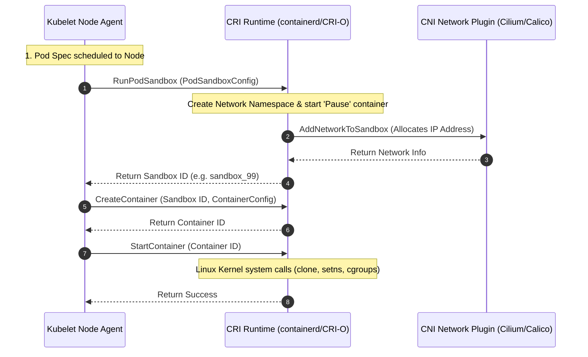

# Kubernetes Internals: How the Kubelet Talks to the Container Runtime Interface (CRI)

> Step inside the worker node architecture of Kubernetes to analyze how the Kubelet agent orchestrates pods, interacts with container runtimes using gRPC, and enforces Pod Security Standards (PSS).

---

## What We Are Going to Learn

In this deep-dive system internals guide, we will move past basic `kubectl` commands to understand the system-level execution model of a Kubernetes worker node.

Specifically, we will cover:
1. **The Architecture of a Kubelet Node**, explaining how control loops preserve the "Desired State".
2. **The Container Runtime Interface (CRI)** and why Kubernetes deprecated direct Docker execution.
3. **The gRPC Protocol Flow** between Kubelet, CRI-O, or containerd runtime engines.
4. **How the Kubelet configures Linux sandboxes** (Pause containers) to set up namespaces and networking for your application containers.

---

## The Problem: The Legacy "Hardcoded Docker" Bottleneck

In early versions of Kubernetes, the **Kubelet** (the agent running on every worker node) was hardcoded to talk directly to the **Docker Daemon** using a custom internal module called the "Dockershim".

```
  [ Kubelet ] ---> [ Dockershim (Hardcoded) ] ---> [ Docker Daemon ] ---> [ Libcontainer ]
```

### The Architectural Flaws
1. **High Overhead:** Docker was designed as a complete user-oriented platform, containing volume managers, network bridges, swarm orchestration, and CLI tools. Kubernetes only needed a tiny fraction of these capabilities (creating and running container processes).
2. **Vendor Lock-In:** As other container runtimes (like CoreOS rkt or Hyper.sh) emerged, Kubernetes engineers had to write separate, hardcoded shims inside the core Kubernetes codebase for each runtime, making the Kubelet code bloated and impossible to maintain.

---

## Why the Problem Is Hard: The Standardization Challenge

To resolve this lock-in, the Kubernetes community decided to decouple the Kubelet entirely from specific runtimes. They designed the **Container Runtime Interface (CRI)**—a highly standardized, pluggable API interface.

However, designing a generic container API is incredibly hard because different operating systems and isolation engines have totally different lifecycles:
* How do we define a standard interface that works for standard Linux containers, Windows containers, and hypervisor-based containers (like Kata Containers)?
* How do we handle network and storage allocations across different providers without hardcoding vendor logic into the node agent?

---

## A Simple Mental Model: The Architect and the General Contractor

Think of Kubernetes orchestration like constructing a commercial building:

```
                            THE BUILD SITE (The Worker Node)
                                           |
                =======================================================
                |                                                     |
         [ The Kubelet ]                                     [ The CRI Runtime ]
                |                                                     |
   Acts as the Chief Architect.                        Acts as the General Contractor.
   He holds the blueprint (Pod Spec).                  He speaks the local building codes.
   He continuously monitors the site.                  He physically pours the concrete,
   If a wall collapses, he commands                    installs the pipes (Namespaces),
   the contractor to rebuild it.                       and puts up the drywall (Containers).
```

* **Kubelet** does the high-level planning, health checking, and spec monitoring.
* **CRI Runtime (containerd / CRI-O)** does the heavy lifting, executing OS system calls to create containers.

---

## Under the Hood: The CRI gRPC Communication Flow

The Container Runtime Interface is defined as a set of **gRPC Protobuf services** exposing two main APIs:
* **RuntimeService:** Handles pod creation, deletion, sandboxing, and container lifecycles.
* **ImageService:** Handles pulling, listing, and deleting container images.



### The Secrets of the "Pause" Container
When you deploy a Pod containing 3 different containers (e.g., your App, a Log Sidecar, and an Envoy Proxy), how do they share the exact same IP address and localhost network space?

1. The CRI runtime first spins up a hidden, tiny container called the **Pause Container** (using the `pause` image).
2. The runtime configures the Linux Network and IPC namespaces explicitly for this Pause container.
3. The CNI (Container Network Interface) plugin binds the network interface and IP address directly to the Pause container's namespace.
4. When the actual application, sidecar, and proxy containers are spawned, the CRI runtime executes the `setns` system call, **joining them directly to the Pause container's namespaces**. 

The pause container acts as the permanent, neutral anchor holding the pod's shared resources alive, even if your application containers crash and restart.

---

## Code Example: Simulating a CRI gRPC Client in Python

Below is a Python simulation demonstrating how the Kubelet uses gRPC-style structured payloads to command a CRI runtime to spawn a new container sandbox.

```python
import uuid
import json
from typing import Dict, Any

class MockCRIRuntime:
    """Simulates a containerd or CRI-O Container Runtime Interface daemon."""
    def __init__(self):
        self.active_sandboxes: Dict[str, dict] = {}
        self.active_containers: Dict[str, dict] = {}

    def RunPodSandbox(self, name: str, namespace: str) -> str:
        """gRPC call: Creates the shared namespaces and starts the Pause anchor container."""
        sandbox_id = f"sb-{uuid.uuid4().hex[:12]}"
        
        # In a real environment, the CRI would trigger CNI network allocations here
        self.active_sandboxes[sandbox_id] = {
            "name": name,
            "namespace": namespace,
            "status": "Ready",
            "ip_address": "10.244.5.101",
            "containers": []
        }
        print(f"[CRI-gRPC] RunPodSandbox: Created Pod Sandbox {sandbox_id} with IP 10.244.5.101")
        return sandbox_id

    def CreateContainer(self, sandbox_id: str, container_name: str, image: str) -> str:
        """gRPC call: Sets up the container filesystem and associates with the sandbox namespaces."""
        if sandbox_id not in self.active_sandboxes:
            raise KeyError("Specified Pod Sandbox does not exist!")

        container_id = f"ct-{uuid.uuid4().hex[:12]}"
        self.active_containers[container_id] = {
            "name": container_name,
            "image": image,
            "sandbox_id": sandbox_id,
            "status": "Created"
        }
        self.active_sandboxes[sandbox_id]["containers"].append(container_id)
        print(f"[CRI-gRPC] CreateContainer: Created Container {container_id} using image '{image}' linked to Sandbox {sandbox_id}")
        return container_id

    def StartContainer(self, container_id: str):
        """gRPC call: Invokes the Linux Kernel clone/setns system calls to start the process."""
        if container_id not in self.active_containers:
            raise KeyError("Container does not exist!")
            
        self.active_containers[container_id]["status"] = "Running"
        print(f"[CRI-gRPC] StartContainer: Successfully started Container {container_id}. Process running.")


if __name__ == "__main__":
    print("[*] Simulating Kubelet-to-CRI gRPC Pod Lifecycle...")
    kubelet_agent = MockCRIRuntime()

    # 1. Kubelet receives a Pod Spec scheduled to this worker node.
    # It first commands the CRI to create the Pod Sandbox (Namespaces)
    pod_name = "payment-gateway"
    namespace = "production"
    
    sandbox_id = kubelet_agent.RunPodSandbox(pod_name, namespace)

    # 2. Once the Sandbox is running, Kubelet creates the application container inside that sandbox
    app_image = "gcr.io/company/payment-api:v1.1"
    container_id = kubelet_agent.CreateContainer(sandbox_id, "payment-api", app_image)

    # 3. Finally, Kubelet instructs the CRI to start the execution
    kubelet_agent.StartContainer(container_id)

    print("\n--- Worker Node Active State ---")
    print(json.dumps(kubelet_agent.active_sandboxes, indent=2))
```

---

## Common Misconceptions

### Misconception 1: "Kubernetes uses Docker inside worker nodes."
**Reality:** Kubernetes **no longer supports Docker** on worker nodes. Dockershim was completely removed in Kubernetes v1.24 (released in 2022). Modern Kubernetes clusters use lightweight, dedicated CRI runtimes like **containerd** or **CRI-O**. These runtimes run container processes directly using the OCI (Open Container Initiative) standard runner (`runc`), completely bypassing the bulky Docker daemon.

### Misconception 2: "The Kubelet schedules pods across the cluster."
**Reality:** The Kubelet has **no scheduling logic**. It is blind to the rest of the cluster. Scheduling is the sole responsibility of the **kube-scheduler** running on the Control Plane. The scheduler selects which worker node is best suited to host a Pod, writes that node assignment into the Pod's configuration in `etcd`, and the Kubelet on that specific node merely observes the assignment via watch-loops, executing the local CRI commands.

---

## Pause and Think

> **Critical Question:** If a containerized application crashes with an Out-of-Memory (OOM) error, does the Kubelet execute a gRPC call to delete the container, or does the Linux kernel handle it?

### Answer
The **Linux Kernel** handles the termination. 

When a container group exceeds its `cgroups` memory limit, the host kernel's OOM-Killer instantly sends a `SIGKILL` signal to terminate the container process. The Kubelet's internal **SyncLoop** constantly polls the CRI status. It detects that the container has exited, reads the exit code (`137` indicating OOM), logs the event to Kubernetes, and commands the CRI to restart the container according to the Pod's restart policy.

---

## Key Takeaways

* **The Container Runtime Interface (CRI)** decouples the node agent (Kubelet) from specific runtime engines.
* **containerd and CRI-O** are the standardized, high-performance engines of modern Kubernetes nodes.
* **The Pause Container** acts as the network and namespace anchor for all other containers inside a Pod.
* Kubelet communicates with the CRI over **local Unix sockets using high-efficiency gRPC**.

---

## What to Learn Next

To expand your Kubernetes and systems orchestration engineering expertise, explore:
* **The Container Network Interface (CNI) protocol and how eBPF routing optimizes pod-to-pod latency.**
* **Implementing Pod Security Standards (Privileged vs. Baseline vs. Restricted).**
* **The Open Container Initiative (OCI) image storage spec and OCI runtime spec.**
