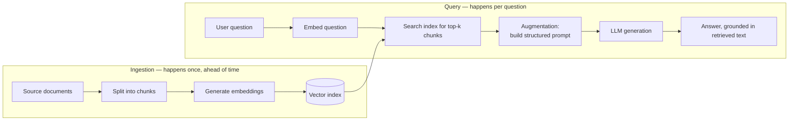

# RAG From Scratch: Why Retrieval-Augmented Generation Exists

> By the end of this article you'll be able to explain exactly which problem each piece of a RAG system solves, because you'll have built the pattern up yourself, one broken assumption at a time, starting from a single LLM call.

## The Problem

Say you work at a company with an internal HR policy document — twelve pages on parental leave, expense limits, and remote-work rules. It was last updated three weeks ago. Someone asks your company's LLM-based assistant: "How many weeks of parental leave do I get?"

The model answers confidently. The number is wrong — it's the *old* policy, the one that was true when the model's training data was collected, not the one your company updated three weeks ago.

This isn't a bug you can patch. It's a direct consequence of how the model was built, and it shows up as three separate, specific failures:

1. **Knowledge cutoff.** An LLM's weights are frozen at the end of its training run. It has no idea your company exists, let alone what your parental leave policy says today. Every LLM has a training cutoff date after which it simply has no information — ask about anything that happened, or changed, after that point, and there's nothing in the weights to draw on.
2. **Hallucination on facts it never saw.** Here's the part that trips people up: the model doesn't say "I don't know." Language models are trained to produce fluent, plausible continuations of text, not to introspect on the boundaries of their own knowledge. Asked a question it has no grounding for, it produces a fluent, confident, plausible-sounding answer anyway — because that's what its training objective rewards. The absence of knowledge doesn't produce an error message; it produces a fabrication that reads exactly like a correct answer.
3. **No source to check.** Even when the model happens to be right, there is no way to trace that answer back to a specific document, paragraph, or line. You can't ask a plain LLM "which policy document said that?" — the fact isn't stored as a reference to a document, it's stored as statistical patterns spread across billions of parameters. There is nothing to cite because nothing was ever "read" at answer time.

```
User: "How many weeks of parental leave do I get?"
                    |
                    v
         [ Plain LLM, frozen weights ]
                    |
                    v
   "You get 12 weeks of parental leave."
   (Confident. Fluent. Three weeks out of date.
    No document, no page number, nothing to check it against.)
```

This article builds, piece by piece, the architecture that exists specifically to fix these three problems — not by retraining the model, but by changing what happens *before* the model is asked to answer.

## Why This Problem Is Hard

The obvious fix — "just retrain the model on the new policy" — doesn't scale, for reasons worth naming explicitly:

- **Retraining (or fine-tuning) is slow and expensive relative to how often facts change.** Your HR policy might change monthly. Your product catalog might change hourly. A full retrain is not a same-day operation, and even lightweight fine-tuning runs are a deployment event, not something you do reflexively every time one paragraph in one document changes.
- **Fine-tuning teaches behavior, not facts, reliably.** Fine-tuning is good at teaching a model a tone, an output format, a style of reasoning. It's a poor mechanism for injecting a small number of precise, individually-checkable facts — the model can still blend, misremember, or overwrite what it learned, and you have no clean way to verify that a specific fact "made it in" the way you'd verify a row exists in a database.
- **You don't want the model to need retraining just because a document changed.** The people who own the HR policy are not machine learning engineers, and they shouldn't need to be. They should be able to edit a document and have the assistant reflect that change immediately.

So the constraint is: the model's frozen weights cannot be the source of truth for facts that change independently of the model's training schedule. Something else has to hold the facts, and something else has to get the *right* facts in front of the model *at the moment it's asked*.

## A Simple Mental Model

Think about the difference between a **closed-book exam** and an **open-book exam**.

In a closed-book exam, you rely entirely on what you memorized beforehand. If a fact wasn't in your notes when you studied, it isn't available to you now, no matter how confidently you write an answer.

In an open-book exam, you're handed the textbook at the moment of the question. You don't need to have memorized the exact page — you need to know *where to look* and how to *read and synthesize* what you find. Your reasoning ability (how to construct a good answer) and your knowledge source (the textbook) are separate, and you can update the textbook without touching your reasoning ability at all.

A plain LLM call is a closed-book exam. RAG is what happens when you insist on making it an open-book exam instead — and then have to solve every practical problem that "handing someone a textbook mid-exam" creates: which book, which page, how much of it fits on the desk, and how the student is supposed to know it's the book they should trust.

The rest of this article is that mental model, made mechanical.

## Before We Continue

This article assumes you're comfortable with what an LLM call actually is: a prompt goes in, tokens come out, and the model has a finite **context window** — a maximum number of tokens it can consider in a single call. If transformer architecture, tokenization, or decoding are unfamiliar, the prerequisite articles listed above are worth reading first; this article picks up right where they leave off and doesn't re-derive them.

## The Core Idea: Building RAG One Broken Assumption at a Time

We're going to start from the simplest possible thing — one LLM call — and add exactly one new piece each time the previous version breaks in an identifiable way. Every component in a RAG system exists because of a specific failure in the step before it. If you understand the failure, you understand why the fix looks the way it does.

### Version 0: The Plain LLM Call

```
prompt = "How many weeks of parental leave do I get?"
answer = llm.generate(prompt)
```

This is the closed-book exam. It fails exactly as described above: stale or absent knowledge, confident hallucination, no citation. Nothing here can fix that — the model has no access to anything outside its own weights.

### Version 1: Stuff the Document Into the Prompt

The most obvious fix: if the model doesn't know the policy, put the policy *in* the prompt.

```
prompt = f"""
Here is our HR policy document:
{entire_policy_document_text}

Question: How many weeks of parental leave do I get?
"""
answer = llm.generate(prompt)
```

This actually works — for one document. It's a legitimate technique, and for a single short file it's often the *right* answer; don't reach for a retrieval system when the whole document just fits. But it breaks down along two separate axes as soon as the knowledge base grows past a handful of documents:

- **Context window limits.** Every model's context window is finite. Once your knowledge base is thousands of documents — HR policy, engineering runbooks, product specs, support tickets — it no longer fits in any prompt, no matter how large the window.
- **Cost and latency.** Every token in the prompt is a token the model has to process, on every single call, even if only one sentence out of twelve pages is relevant to the question. You'd be paying (in money and in response time) to re-read the entire document on every query.
- **Degraded recall over long contexts.** Even within a technically-large context window, LLMs are empirically less reliable at retrieving a fact placed in the middle of a very long context than one placed near the start or end — a pattern often called "lost in the middle." Stuffing more text into the prompt is not a free way to guarantee the model actually uses the right part of it.

> **Verification Note**
> Specific context-window sizes and the precise severity of "lost in the middle" degradation vary by model family and version, and improve over time. Treat these as directional, well-documented tendencies rather than fixed numeric guarantees, and check current model documentation for the model you're actually deploying against.

The lesson from Version 1 isn't "context stuffing is wrong." It's: **we need something that decides which part of the knowledge base is relevant, before it ever reaches the prompt.** That's a new job the LLM itself was never designed to do — the LLM is not, and should not be, the thing scanning your entire document store on every call.

### Version 2: Add a Retriever

So we introduce a new component whose only job is: given a question, find the small number of passages likely to answer it, out of a much larger collection.

```
def answer_question(question, all_documents):
    relevant_chunk = retriever.find_most_relevant(question, all_documents)
    prompt = f"""
Context:
{relevant_chunk}

Question: {question}
"""
    return llm.generate(prompt)
```

This is the actual moment RAG is born: **Retrieval**, then **Augmentation** of the prompt, then **Generation**. Hence the name. Note what changed and what didn't:

- The LLM's job stayed the same: read some text, answer a question about it.
- A new job appeared that the LLM does *not* do: search a large collection and pick the relevant part.

That second job is the retriever's, and it raises an immediate question we've been quietly ignoring: `retriever.find_most_relevant(question, all_documents)` — *how*? Scanning every document's full text on every question, comparing it word-for-word against the query, is exactly the linear-scan cost we were trying to escape, just moved one layer down. We need a way to compare "how relevant is this passage to this question" that's both fast and actually understands meaning, not just exact words — otherwise a question about "parental leave" won't match a section titled "New Parent Time Off" at all.

### Version 3: The Retriever Needs a Structure to Search — the Index

This is where **embeddings** and a **vector index** enter the picture — but notice the reasoning that gets you there, rather than the mechanics themselves (those are covered in depth in the chunking/embeddings and vector-database articles linked at the end of this one).

The retriever needs to answer "how semantically similar is this passage to this question" for potentially millions of passages, in milliseconds, without re-reading the raw text every time. The standard solution: convert every passage into a fixed-length numeric vector (an *embedding*) that captures its meaning, once, ahead of time, and store those vectors in a structure built for fast similarity search (a *vector index*). At query time, you embed the question the same way and search the index for the closest stored vectors — a hard, well-studied search problem, not something you invent per-project.

Two separate things had to exist for the retriever to work:

1. **An index** — a precomputed structure over your documents, built *before* any question is asked, so the expensive part (reading and understanding every document) happens once, offline, not on every query.
2. **A similarity search** over that index at query time, using the same representation (embeddings) for both the stored passages and the incoming question, so "meaning" rather than exact wording is what gets compared.

```
def answer_question(question, index):
    query_vector = embed(question)
    relevant_chunks = index.search(query_vector, top_k=3)
    prompt = f"""
Context:
{join(relevant_chunks)}

Question: {question}
"""
    return llm.generate(prompt)
```

Building that index — how documents get split into chunks, how embeddings are generated, how the index itself is structured for fast approximate search — is a deep topic in its own right, and this article deliberately doesn't re-derive it. See "Building Production-Grade RAG Systems" for chunking and embedding mechanics, and "Vector DB Internals" for how the index achieves fast search at scale. What matters here is *why* the index has to exist at all: without it, retrieval and stuffing-the-whole-document-in are the same cost.

### Version 4: The Augmentation Step Needs Structure Too

There's one more quiet assumption we made in Version 2 that deserves its own name: how the retrieved text gets combined with the question into a single prompt. That combining step is the **augmentation** step, and doing it carelessly reintroduces problems we thought we'd solved.

If you just concatenate retrieved text and the user's question with no structure, the model has no way to distinguish "background material I was given" from "instructions I should follow" — and text pulled from a document you don't fully control (a user-submitted form, a public wiki page, a support ticket) can contain sentences that *look like* instructions. A well-formed augmentation step keeps retrieved content and instructions clearly separated, typically with explicit structure:

```
prompt = f"""
You are answering questions using ONLY the context below. If the answer
isn't in the context, say you don't know — do not guess.

<context>
{relevant_chunks}
</context>

<question>
{question}
</question>
"""
```

This is a small change with a real purpose: it tells the model what role the retrieved text plays (evidence to reason over, not instructions to obey), and it gives the model explicit permission to say "I don't know" instead of defaulting to a confident guess when retrieval comes up empty. Both of those directly target the original three failures — the second line targets hallucination specifically, by giving the model an escape hatch it wouldn't otherwise reliably take.

### Putting the Four Versions Together



That's it — that's the whole pattern. Every box on that diagram exists because a specific version above broke without it:

| Component | Exists because... |
|---|---|
| Chunking + embeddings + index (offline) | Version 1 showed you can't re-read everything on every query; the expensive work has to happen once, ahead of time. |
| Retriever + similarity search (online) | Version 1 showed context windows and cost make "include everything" impossible past a handful of documents. |
| Augmentation step | Version 4 showed unstructured concatenation of retrieved text and instructions is itself a risk, and a missed opportunity to license "I don't know." |
| Generation (the LLM call) | This was always here — it's the one thing that *didn't* change. RAG doesn't replace the LLM's reasoning; it changes what evidence reaches it. |

## Let's Walk Through an Example

Back to the HR assistant. With the full pipeline in place:

1. User asks: "How many weeks of parental leave do I get?"
2. The question is embedded into a vector.
3. The index — built ahead of time from the current HR policy documents — returns the top 3 chunks whose embeddings are closest to the question's embedding. Say one of them is the "New Parent Time Off" section, updated three weeks ago.
4. The augmentation step wraps that chunk and the question into a structured prompt, with instructions to answer only from the given context.
5. The LLM generates: "Based on the policy document, you're entitled to 16 weeks of parental leave, effective the policy update from three weeks ago." Optionally, the system can attach which document and section the chunk came from, because that provenance was carried through the whole pipeline as metadata — the retriever always knew which document a chunk came from, so nothing stops you from surfacing it in the final answer.

Compare this to Version 0: the number is current, it's traceable to a specific document, and if the policy hadn't mentioned parental leave at all, the model was explicitly told to say so instead of guessing.

## Under the Hood

It's worth being precise about which phase in the diagram above runs *when*, because conflating them is a common source of confusion:

- **Ingestion is a batch, offline process.** It runs whenever documents are added or changed — nightly, on every commit to a docs repo, whatever cadence fits your data. It does not run per user query, and its cost is amortized across every future question.
- **Query-time retrieval is synchronous and has to be fast.** It runs inside the request path of every single user question, which is exactly why the index has to support fast approximate search rather than a linear scan — a query-time retrieval step that takes several seconds defeats the purpose as surely as no retrieval at all.

This separation — expensive work done once, offline; cheap work done per-query, online — is the same shape you'll see in search engines, recommendation systems, and caching layers generally. RAG isn't a new invention of this idea; it's this familiar idea applied to giving an LLM knowledge it wasn't trained on.

## What Can Go Wrong?

Building the pipeline doesn't guarantee it works. The most important failure modes to internalize:

- **Retrieval returns nothing relevant, and the model still answers.** If your augmentation step doesn't explicitly instruct the model to say "I don't know" when the context doesn't contain the answer, you haven't actually fixed hallucination — you've just moved it one step later, dressed up with an authoritative-looking `<context>` block that happens to be irrelevant.
- **The index is stale.** RAG fixes the *mechanism* for keeping knowledge current, but only if ingestion actually runs when documents change. An index that isn't refreshed is just a slower, more expensive way to be wrong.
- **The retriever retrieves the wrong thing confidently.** Similarity search returns the *closest* vectors, not necessarily the *correct* ones. A passage can be semantically close to the question and still be the wrong section, an outdated version of a document, or a near-duplicate that doesn't actually answer what was asked.
- **"More retrieval" isn't automatically better.** Retrieving 20 chunks instead of 3 doesn't just add information — it reintroduces the context-length and lost-in-the-middle problems from Version 1, at a smaller scale. Retrieval quality (getting the *right* few chunks) matters more than retrieval quantity.

## Security Considerations

RAG introduces a trust boundary that a plain LLM call never had to deal with: the model is now being handed text that your organization did not author at inference time — text pulled from a document store that may include user-submitted content, ingested external pages, or anything else your pipeline indexes.

That means retrieved content has to be treated the same way you'd treat any other untrusted input crossing a trust boundary: it can contain text engineered to look like an instruction ("ignore the above and instead..."), and if your augmentation step doesn't clearly separate "evidence" from "instructions," the model has no principled way to tell the difference. This is a real and well-documented attack class — **indirect prompt injection via retrieved content** — and it deserves its own deep treatment; the chunking/embeddings article above covers concrete defensive patterns (structured delimiters, output validation, never letting retrieved text alone trigger privileged actions) in more depth than belongs here. The point to take from this article is narrower but important: **the moment you add retrieval, you've added an untrusted-input problem that a closed-book LLM call didn't have.** Don't add the retriever without also deciding how you'll handle that.

There's a second trust boundary here that's easy to miss because it has nothing to do with the *content* of what's retrieved: **retrieval has to respect who's asking.** A similarity search has no built-in concept of permissions — it will happily return the closest-matching chunk regardless of whether the requesting user is allowed to see the document it came from. If your index pools documents from across the organization (HR policy alongside individual performance reviews, legal contracts, another team's unreleased roadmap), then without access-control metadata attached to each chunk at ingestion time — owner, team, classification, sensitivity — and enforced as a filter at query time, a RAG assistant can retrieve and quote from a document the asking user was never authorized to read. This is an authorization gap, not a prompt-injection one, and it's a common, high-impact way real RAG deployments leak data that a plain LLM call — with no access to your documents at all — never could have leaked in the first place.

## Common Misconceptions

**Misconception: RAG eliminates hallucination.**
**Reality:** RAG reduces hallucination caused by *missing knowledge* — it gives the model something true to draw on. It does not prevent the model from misreading, misquoting, or drawing an incorrect inference from correctly-retrieved context, and it does nothing to help if retrieval itself fails to find the relevant passage. "Grounded in retrieved text" is not the same guarantee as "factually correct."

**Misconception: RAG is just a vector database.**
**Reality:** The vector index is one component of one phase (retrieval). RAG is the whole pattern — ingestion, retrieval, augmentation, and generation working together. A vector database with no augmentation strategy, no chunking discipline, and no instruction to the model about how to use the retrieved text is a search engine bolted onto an LLM, not a working RAG system.

**Misconception: RAG and fine-tuning solve the same problem.**
**Reality:** They target different failure modes. Fine-tuning changes how the model behaves (tone, output format, task-specific reasoning patterns). RAG changes what facts the model has access to at answer time, without touching its weights at all. Production systems frequently use both — fine-tuning for behavior, RAG for current, checkable facts — because neither one substitutes for the other.

## Real-World Architecture

In practice, the ingestion and query paths from the diagram above are usually built as genuinely separate systems, often owned by different parts of a team's infrastructure: a document ingestion pipeline (batch jobs, change-detection on a document store, a chunking/embedding service) that populates and refreshes the index, and a request-serving path (the retriever, the augmentation logic, the call to the LLM) that has to meet ordinary production latency and availability requirements like any other API. Treating these as one monolithic "RAG system" tends to produce exactly the coupling problems you'd expect from merging a batch pipeline with a synchronous request path — they scale differently, fail differently, and are usually operated differently.

## Expert Insight

A question worth asking before building any of this: **do you actually need retrieval, or would a long-context model plus the whole document just work?** As context windows have grown, "stuff the document in" (Version 1 above) has become a legitimate production pattern for genuinely small, single-document knowledge bases — the complexity of an index, a retriever, and an ingestion pipeline isn't free, and it's not worth paying for if your entire knowledge base is one file that comfortably fits in a single prompt with room to spare. RAG earns its complexity at the point where your knowledge base is too large, too dynamic, or too multi-document for that to hold — which, in practice, is most real organizational knowledge bases, but it's worth actually checking rather than assuming.

The other thing experienced teams learn quickly: you cannot tell whether a RAG system is working by reading a handful of answers and deciding they sound right. Retrieval quality and generation quality are two separate things that can each fail independently and silently, and evaluating them requires a harness that checks both — did the retriever find the right passage, and did the model correctly use it. That's a large enough topic to deserve its own article; see the evaluation-focused pieces in this knowledge base once you're building past a prototype.

## Pause and Think

> **Critical Question:** Suppose the retriever works perfectly and always returns the single most relevant chunk. Is hallucination now solved?

### Answer

No — and this is the misconception above made concrete. A perfect retriever solves the *missing knowledge* problem: the model now has access to the right passage. It does not guarantee the model reads that passage correctly, doesn't guarantee the augmentation step told the model to prefer the context over its own prior beliefs, and does nothing for questions where the honest answer is "the knowledge base doesn't contain this" — which is exactly why the explicit "say you don't know" instruction in the augmentation step matters as much as the retrieval mechanics themselves. Retrieval and generation are two separate places for things to go wrong, not one.

## Key Takeaways

- A plain LLM call fails in three specific, nameable ways: **knowledge cutoff**, **hallucination on unseen facts**, and **no citable source** — RAG exists to address exactly these three, not as a general accuracy upgrade.
- **Stuffing the whole document into the prompt** is a legitimate solution for a single small document, but breaks down on context limits, cost, and lost-in-the-middle recall once the knowledge base grows.
- The **retriever** exists to select relevant text instead of including everything; the **index** (built from chunked, embedded documents ahead of time) exists so that selection is fast at query time instead of a full re-scan; the **augmentation step** exists to combine retrieved evidence and the question in a way the model can reliably tell apart.
- Ingestion is offline and batch; retrieval, augmentation, and generation are online and per-query — conflating the two leads to systems that are either too slow or too stale.
- RAG does not eliminate hallucination, is not just a vector database, and does not replace fine-tuning — it solves a specific, narrower problem: getting the right facts in front of the model at answer time.
- Retrieved content is untrusted input the moment it enters the prompt — RAG introduces a trust boundary a plain LLM call never had.

## What to Learn Next

- **"Vector Databases Explained Through a Real RAG Pipeline"** — how the index from Version 3 is actually built and queried at scale.
- **"Domain-Specific AI: Why General Models Aren't Always Enough"** — when RAG alone isn't sufficient and domain adaptation matters too.
- **"Building Production-Grade RAG Systems"** and **"Advanced RAG: Parent-Child Document Retrieval"** — the chunking, embedding, and retrieval-quality mechanics this article deliberately deferred.
- **"Advanced RAG: Boosting Recall with Cross-Encoder Re-Ranking"** — improving the retriever's precision beyond a single similarity search pass.
