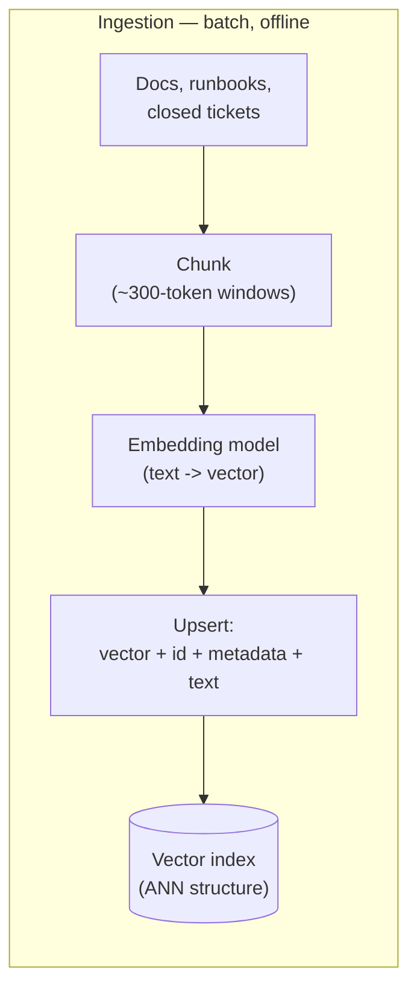
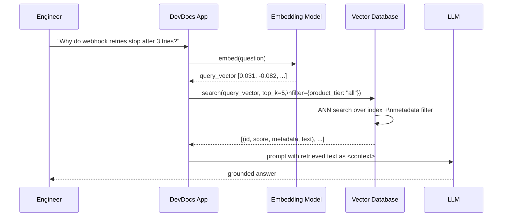

# Vector Databases Explained Through a Real RAG Pipeline

> By the end of this article you'll be able to explain, mechanically, what a vector database actually does when a RAG pipeline calls it — what it stores, how it searches, and why that search looks nothing like a relational query — by walking through one concrete pipeline end-to-end.

## The Problem

Picture a support-engineering team at a mid-sized SaaS company. They've built an internal assistant — call it DevDocs — that's supposed to answer engineer questions like "why would a webhook delivery retry silently stop after three attempts?" by searching 40,000 chunks of product documentation, runbooks, and closed support tickets.

The first prototype uses the database the team already trusts: Postgres. Someone writes the obvious query:

```sql
SELECT id, content
FROM doc_chunks
WHERE content ILIKE '%webhook retry%'
LIMIT 5;
```

It half-works. It finds chunks that literally contain the words "webhook" and "retry" near each other. It completely misses the runbook paragraph that explains the answer using the phrase "delivery attempts are capped and further callbacks are suppressed" — which is exactly the right answer, worded differently. No amount of `ILIKE` cleverness fixes this, because `ILIKE` (and its more capable cousin, Postgres full-text search via `tsvector`/`tsquery`, ranked with `ts_rank`/`ts_rank_cd` — a token-frequency-and-proximity score, not the BM25 algorithm used by dedicated search engines like Elasticsearch/OpenSearch or by Postgres extensions that add BM25 specifically) matches *tokens*, not *meaning*. The words "retry" and "attempts" are, to a keyword index, as unrelated as "retry" and "banana."

This is the exact gap a **vector database** is built to close: given a query, find the passages that are *semantically* close to it, even when they don't share a single word. But "semantically close" has to become something a machine can actually compute — a number, or rather, a distance between numbers. That's what this article makes mechanical: what a vector database stores, how it turns "closeness in meaning" into "closeness in a coordinate space," and what happens, step by step, when DevDocs asks it a question.

## Why This Problem Is Hard

Three things make this a genuinely different engineering problem from "add another index to Postgres":

1. **The data being searched isn't rows with a small number of columns — it's high-dimensional vectors.** An embedding model (see the prerequisite article on chunking and embeddings) turns each chunk of text into a list of a few hundred to a few thousand floating-point numbers — a point in a space with that many dimensions. A B-tree index is built around the idea that values in one column can be sorted along one axis. There is no single sensible sort order across 1,536 axes at once.
2. **"Nearest" is a geometric question, not an equality question.** A relational index answers "which rows have `customer_id = 42`?" or "which rows have `created_at` between these two timestamps?" — exact or range matches on ordered scalars. A vector search asks "which of these million points is closest, by some distance metric, to this other point?" — a fundamentally different computation, and one that gets more expensive, not less, as dimensionality grows.
3. **Computing the exact answer doesn't scale, so the whole field is built around a controlled trade-off.** Comparing a query vector against every stored vector (brute-force, exact nearest neighbor) is simple and always correct, but it's a linear scan of the whole dataset on every single query. At real production scale — hundreds of thousands to billions of vectors, sub-100-millisecond latency budgets — that linear scan is the bottleneck. Vector databases exist specifically to trade a small, controllable amount of accuracy for a large, necessary amount of speed. That trade-off — **Approximate Nearest Neighbor (ANN)** search — is the mechanical core of everything a vector database does.

## A Simple Mental Model

Think about the difference between a **phone book** and a **map**.

A phone book (a keyword or relational index) is organized around exact, sortable keys: names in alphabetical order, phone numbers in numeric order. You can find "Smith, J." instantly, because the book is sorted by exactly that key. But if you don't know the exact name and only know "someone who lives near the old train station," the phone book is useless — nothing about alphabetical order tells you who lives near what.

A map (a vector index) is organized around *position*. If you know your current coordinates, you can find the nearest coffee shop without knowing its name at all — you're searching by proximity in space, not by matching a label. Embeddings turn "meaning" into coordinates, and a vector database is the thing that organizes those coordinates so you can ask "what's nearby?" without measuring the distance to every single point on Earth.

The mental model has a limit worth naming up front: a map's distances are objective physical facts. An embedding's "distance" is only as meaningful as the embedding model that produced it — two chunks can sit close together in vector space because they're genuinely about the same topic, or because they happen to share superficial statistical patterns the model latched onto. The geometry is real; whether the geometry tracks the meaning you care about depends entirely on the embedding model, a point worth remembering once we get to failure modes.

## Before We Continue

This article assumes you've read the chunking/embeddings and RAG-from-scratch articles listed above: you should already be comfortable with what an embedding is (a fixed-length vector representing a chunk of text), why RAG chunks and embeds documents ahead of time, and where "search the index" sits in the retrieve-then-generate pipeline. This article picks up exactly at the point those articles deferred: what actually happens inside "the index" when it's asked to find the nearest vectors, and what a production vector database has to do beyond just running that search.

## The Core Idea: Three Jobs, One Component

Strip away vendor branding and a vector database does exactly three mechanical jobs:

1. **Store** each vector alongside a reference to what it represents — an ID, the original text (or a pointer to where it lives), and structured metadata (source document, section, product version, access tier, timestamp).
2. **Index** those vectors into a data structure built for fast approximate similarity search, so that finding the nearest neighbors doesn't require comparing against every stored vector.
3. **Serve** a similarity query: given a query vector (and optionally a metadata filter), return the top-*k* closest stored vectors, ranked by a distance metric, along with their IDs, metadata, and (usually) their scores.

Every vendor product — Pinecone, Qdrant, Weaviate, Milvus — and every "vector search bolted onto an existing database" — pgvector on Postgres, vector search extensions on Elasticsearch/OpenSearch — is a different implementation of exactly those three jobs. The rest of this article walks through what each job actually does inside one concrete pipeline.

## How It Actually Works: The DevDocs Pipeline, End to End

### Ingestion: Building the Index Before Anyone Asks a Question

This phase runs offline, in batch, whenever documentation changes — not per query.



For every chunk, three things get written into the vector database in one call, usually called an **upsert** (insert-or-update, keyed by ID):

```python
vector_db.upsert(
    id="runbook-42-chunk-7",
    vector=[0.0142, -0.0891, 0.0367, ...],   # e.g. 1536 floats from the embedding model
    metadata={
        "source": "webhook-retry-runbook.md",
        "section": "Delivery Suppression",
        "product_tier": "all",
        "last_updated": "2026-08-03",
    },
    text="Delivery attempts are capped at three retries. After the third failed "
         "attempt, further callbacks for that event are suppressed and the event "
         "is marked dead-lettered.",
)
```

Three things are worth noticing here, because each one is a real design decision, not an implementation detail:

- **The vector is opaque.** The database has no idea what "webhook" or "retry" means. It only ever sees an array of floats. All of the "understanding" happened upstream, in the embedding model, before this call was made. This is the single most important fact to internalize: *a vector database does not understand text — it only ever compares numbers.*
- **Metadata travels with the vector, not separately.** This matters enormously at query time (below) — filtering by `product_tier` or `last_updated` has to happen *together* with the similarity search, not as a separate step afterward, or you get the "filtered search" failure mode covered under "What Can Go Wrong."
- **The original text usually rides along too**, either stored directly in the vector database's payload (as shown here) or referenced by ID into a separate document store. Either way, *something* has to map "the nearest vector we found" back to "the actual text to hand the LLM" — the vector alone is useless to a human or an LLM without it.

As each vector is written, the database also updates its **index** — the structure that will let a future query find this vector quickly without comparing against all 40,000 others. Building that structure is genuinely expensive work, which is exactly why it happens once, ahead of time, rather than per query.

> **How the index itself works** — HNSW's layered graph, IVF's clustering approach, and the recall/speed/memory trade-offs of each — is a deep topic addressed in full in "Vector DB Internals: Hierarchical Navigable Small World (HNSW) Graphs." This article treats the index as a pluggable strategy: whatever algorithm sits inside it, the contract it fulfills — approximate top-*k* nearest neighbor, fast, at scale — stays the same, and that contract is what the rest of this pipeline depends on.

### Query: What Happens the Moment an Engineer Asks a Question

This phase is synchronous, runs inside the request path, and has a real latency budget.



The query call is the mirror image of the upsert:

```python
results = vector_db.search(
    vector=embed("Why do webhook retries stop after 3 tries?"),
    top_k=5,
    filter={"product_tier": {"$in": ["all", "enterprise"]}},
)

for r in results:
    print(r.id, r.score, r.metadata["source"])
```

Every vector database's search call is answering one specific geometric question: **of everything stored, which vectors are closest to this query vector, by whichever distance metric the index was built for** — commonly cosine similarity, Euclidean (L2) distance, or dot product? That is the entire mechanical operation. Everything else — filters, hybrid re-ranking, metadata joins — is scaffolding around that one operation.

### Contrast: The Same Question, Asked of a Relational Index

It's worth being explicit about why a B-tree can't do this job, because the contrast is the fastest way to understand what's actually novel about a vector index.

| | Relational / keyword index (B-tree, hash, BM25) | Vector index (ANN: HNSW, IVF, ...) |
|---|---|---|
| **What it's built over** | Scalars with a total order (numbers, dates) or discrete tokens | Points in a high-dimensional continuous space |
| **What a query asks** | "Rows where `x = 42`" or "rows where `a ≤ x ≤ b`" — exact/range match | "Points closest to this point, by distance" — proximity match |
| **Answer guarantee** | Exact, always | Approximate — a tunable probability of finding the true nearest neighbors |
| **Cost driver** | Comparisons ~ `O(log n)` for a well-balanced tree (hash indexes: ~`O(1)`) | Sub-linear and tunable — e.g. roughly `O(log n)` graph hops for HNSW, or cost proportional to clusters probed for IVF — *if* the index's approximation holds; exact/brute-force search is `O(n)` |
| **What "relevance" means** | Equality or ordering on a defined key | Geometric closeness of two vectors — meaningless without an embedding model that produced them |

This is why `WHERE content ILIKE '%webhook retry%'` and `vector_db.search(embed(question))` are not two flavors of the same operation — they are different operations, answering different questions, over differently-shaped data. A production RAG system frequently needs both: exact filters on structured metadata (product tier, date range, document ID) *and* approximate similarity search on the unstructured text — which is exactly why the query above combines a `filter` with a `search`, and it's the reason **hybrid search** (combining vector similarity with BM25 keyword ranking via something like Reciprocal Rank Fusion — covered in depth in the chunking/embeddings article) exists at all: neither index alone answers every question a real system needs answered.

## Under the Hood: What "Filter + Search" Actually Does

Combining a metadata filter with an ANN search sounds simple in the API call above, but it hides a genuinely important mechanical decision: **when** does the filter get applied?

- **Pre-filtering** — restrict the candidate set to only vectors matching the metadata filter, *then* run ANN search over that restricted set. This guarantees the filter is respected, but if the ANN index wasn't built with filtering in mind, this can degrade into something close to a brute-force scan over the filtered subset, defeating the purpose of the index.
- **Post-filtering** — run ANN search first to get the top-*k* nearest neighbors globally, *then* discard any that don't match the metadata filter. This is fast, but it has a sharp failure mode: if the filter is selective (say, only 2% of chunks are `product_tier: enterprise`) and none of the globally-nearest *k* vectors happen to satisfy it, you get back fewer results than asked for — or none at all — even though matching vectors exist somewhere in the dataset.

Different vector databases handle this trade-off differently, and some implement filter-aware ANN search that partially avoids the dilemma by pushing filter predicates down into the graph or cluster traversal itself.

> **Verification Note**
> How a specific vector database implements filtered search — pre-filter, post-filter, or a filter-aware hybrid — is a product-specific and actively-evolving implementation detail. Confirm the current behavior against your chosen vendor's documentation before assuming filtered queries return complete results, especially with highly selective filters.

Two more mechanical details worth naming, because they distinguish "a vector database" from "a library that computes cosine similarity":

- **Durability.** Vectors and metadata are as much production data as any row in Postgres — if the process crashes mid-write, you need the same guarantee any database gives you: writes that were acknowledged actually survive. Most vector databases achieve this the same way relational databases do — some form of write-ahead logging or append-only segment files, with periodic compaction and background index maintenance — rather than inventing a fundamentally new durability model. If you've read the WAL/replication article on Postgres internals, the shape of the problem (and the shape of the fix) will look familiar.
- **Index maintenance under updates.** Deleting or updating a vector isn't always an immediate, in-place graph edit — many ANN index structures are far more efficient to *build* than to *mutate* incrementally, so vector databases commonly handle deletes with a tombstone-and-compact pattern (mark deleted, physically remove and rebalance during periodic background maintenance) rather than a synchronous structural edit on every delete.

## Implementation: The Same Pipeline, on Postgres With pgvector

To make the relational-vs-vector contrast completely concrete — not an abstraction, but the same database engine running both — here's the DevDocs schema using `pgvector`, a real Postgres extension that adds a vector column type and ANN index types directly into the relational engine.

```sql
-- Enable the extension once per database
CREATE EXTENSION IF NOT EXISTS vector;

CREATE TABLE doc_chunks (
    id           bigserial PRIMARY KEY,
    source       text NOT NULL,
    product_tier text NOT NULL,
    last_updated date NOT NULL,
    content      text NOT NULL,
    embedding    vector(1536)          -- fixed-length vector column
);

-- An ANN index over the vector column, using cosine distance
CREATE INDEX doc_chunks_embedding_hnsw
    ON doc_chunks
    USING hnsw (embedding vector_cosine_ops)
    WITH (m = 16, ef_construction = 64);
```

And the query — note that the metadata filter is an ordinary `WHERE` clause, while the similarity ranking uses pgvector's cosine-distance operator (`<=>`) instead of `=` or `<`:

```sql
SELECT id, source, content,
       1 - (embedding <=> :query_vector) AS similarity
FROM doc_chunks
WHERE product_tier IN ('all', 'enterprise')
ORDER BY embedding <=> :query_vector
LIMIT 5;
```

This is the same "combine an exact filter with an approximate similarity search" operation described above, expressed in SQL instead of a vendor SDK — which is exactly the point: pgvector doesn't invent a new database, it adds a new column type and a new index type onto a relational engine that already knows how to do everything else (transactions, joins, exact filters, durability). It's a genuinely useful illustration of where the boundary between "relational" and "vector" search actually sits: at the column type and the index, not at the whole system.

> **Verification Note**
> pgvector's exact operators (`<->` for L2, `<=>` for cosine, `<#>` for negative inner product), supported index types (`ivfflat`, `hnsw`), and their tuning parameters (`m`, `ef_construction`, `lists`, `probes`) have changed across pgvector releases and continue to evolve. Confirm the syntax and parameter names against the version of pgvector you're actually running before deploying this.

## What Can Go Wrong?

- **Embedding-model version mismatch.** If the index was built with embeddings from model version A, and a later query embeds the question with model version B, the two vectors live in geometrically different (even if similarly-shaped) spaces. The search doesn't error out — it silently returns nonsense-close results, because nothing checks that "closeness" means the same thing on both sides. Re-embedding the entire corpus is mandatory whenever the embedding model changes, not optional.
- **Filtered search returning too few (or zero) results**, as described above — a highly selective metadata filter combined with post-filtering ANN search can silently starve a query of results that do exist in the dataset.
- **A stale index.** Just like the RAG pipeline as a whole, a vector database's usefulness depends entirely on ingestion actually running when source documents change. A vector database with a perfect index over three-month-old documentation is a fast, precise way to retrieve the wrong answer.
- **Mistaking "approximate" for "wrong."** ANN indexes are tuned for a recall target (say, 95% — meaning 95% of queries return the true top-*k* results, and 5% return a slightly different, still-close set) rather than 100%. That's a deliberate trade for speed, not a bug — but it does mean a single query occasionally missing the single best chunk is expected behavior, not a sign the system is broken.
- **Treating the vector database as the whole retrieval quality story.** A perfectly-tuned ANN index returning irrelevant vectors *fast* is not progress — if the embedding model itself doesn't place semantically related chunks near each other, no amount of indexing sophistication fixes that. The index's job is speed; whether "nearby" means "relevant" is entirely the embedding model's responsibility.

## Security Considerations

A vector database inherits every ordinary data-governance obligation of any datastore holding sensitive content, and adds a couple of its own:

- **The stored text and metadata are still sensitive data.** If DevDocs indexes closed support tickets containing customer names or account details, that's exactly as sensitive sitting in a `metadata` JSON blob or a `text` payload field inside a vector database as it would be in a Postgres column — access control, encryption at rest, and audit logging obligations don't relax just because the surrounding system is new. Multi-tenant deployments need the same collection/namespace-level isolation any multi-tenant relational schema needs.
- **Embeddings are not automatically anonymous.** A vector is a lossy, compressed representation of the text that produced it — but "lossy" is not the same as "irreversible." Published research on embedding inversion has shown that meaningful fragments of the original text can sometimes be reconstructed from an embedding vector alone, depending on the embedding model and the attack's access level. Don't assume that storing "just the embedding" without the raw text sidesteps data-protection obligations.

  > **Verification Note**
  > The practicality and scope of embedding-inversion attacks are an active research area and vary significantly by embedding model, vector dimensionality, and attacker access. Treat this as a reason to apply the same data classification and access controls to embeddings as to the source text, not as a specific, quantified threat level — verify against current research and your embedding provider's guidance before making a risk decision.

- **Retrieved content is still untrusted input the moment it reaches the LLM** — this is the trust boundary the RAG-from-scratch article covers in depth, and it applies identically regardless of which vector database returned the chunk. The vector database is a new place attacker-controlled or unreviewed text can enter your corpus (a support ticket, a public wiki page, a user-submitted form); it does not change the fact that content crossing that boundary needs the same indirect-prompt-injection defenses covered there.

## Common Misconceptions

**Misconception: A vector database replaces the need for a relational database.**
**Reality:** Vector databases are optimized for one operation — approximate similarity search over high-dimensional vectors — and are often genuinely poor at what relational databases are built for: multi-row ACID transactions, complex joins across normalized tables, and exact-match lookups by primary key at high write throughput. Production RAG systems almost always run both: a relational (or document) store for structured operational data and transactional integrity, and a vector index — standalone or, as pgvector shows, layered directly onto the relational engine — for semantic search.

**Misconception: ANN search finds "the most relevant" result.**
**Reality:** ANN search finds the vectors geometrically closest to the query vector, according to whatever distance metric and embedding model produced both. "Closest in embedding space" and "most relevant to what the user actually meant" are correlated by design, not identical by guarantee — an embedding model's blind spots become the vector database's blind spots, and no amount of indexing sophistication changes what the embedding model chose to consider "similar."

**Misconception: A vector database "understands" the text it stores.**
**Reality:** As emphasized above, the database never sees text — only the floating-point vectors an upstream embedding model produced. All semantic understanding happened before the vector reached the database; the database's entire contribution is storing those numbers efficiently and finding nearby ones quickly.

## Real-World Architecture

Three broad deployment patterns show up repeatedly in practice, each with real operational trade-offs:

- **A dedicated, standalone vector database** (a managed service or a self-hosted cluster) — chosen when vector search needs to scale independently of the relational workload, when the team wants purpose-built ANN tuning knobs and multi-tenant collection isolation out of the box, or when the corpus is large enough (many millions to billions of vectors) that a general-purpose relational engine's vector extension isn't the right tool.
- **A vector extension layered onto an existing relational database** (pgvector on Postgres, and equivalents on other engines) — chosen when the corpus is small-to-moderate, the team already operates that relational database reliably, and avoiding a second system to run, back up, and secure outweighs the ceiling on scale and ANN feature depth a dedicated vector database offers.
- **An embedded, in-process vector search library** with no server component at all — chosen for a single-process application, a local prototype, or an edge deployment where running a separate database service isn't practical.

Most cloud providers now offer a managed vector search product alongside their general-purpose database and AI services.

> **Verification Note**
> Specific managed vector-search product names, feature sets, and pricing change frequently across cloud providers. Verify current offerings and capabilities against each provider's own architecture center or documentation rather than assuming a specific product exists or behaves a particular way.

Regardless of which pattern is chosen, the ingestion and query paths from the diagrams above are usually operated as genuinely separate systems within the architecture — a batch document-processing pipeline that owns chunking, embedding, and index refresh, and a request-serving path that owns the low-latency search call — because, as with the RAG pipeline as a whole, they scale and fail independently, and coupling them tends to produce a system that's both too slow online and too rigid to update offline.

## Expert Insight

Two things experienced teams learn the hard way about running a vector database in production:

**Recall isn't something you set once and trust forever.** ANN indexes expose tuning knobs — `ef_search` in HNSW, `nprobe` in IVF-style indexes — that trade query latency for recall. Teams that never revisit these numbers after initial setup are flying blind: the right way to validate them isn't reading documentation once, it's periodically running a sample of production queries through both the ANN index and an exact brute-force search, and measuring how often they agree. If recall silently drops after a dataset grows tenfold, the fix is usually re-tuning those parameters or reconsidering the index type, not adding more compute and hoping.

**Embedding-model changes are a migration, not a config flag.** It's tempting to treat swapping to a "better" embedding model as a drop-in upgrade — update one config value, redeploy. It isn't. Every vector already stored was produced by the old model, and mixing old and new embeddings in the same index silently corrupts every distance comparison between them (nothing errors; the numbers are just wrong relative to each other). The only correct migration path is: re-embed the entire corpus with the new model, build a new index, and cut over — treated with the same seriousness as a schema migration on a production relational database, because that's functionally what it is.

## Pause and Think

> **Critical Question:** Your ANN index is tuned for 95% recall, and a user reports that DevDocs failed to find an obviously-relevant runbook for their exact question. Is this evidence the vector database is broken?

### Answer

Not necessarily — and working through why is the point of this whole article. There are at least three independent places this could have failed, only one of which is the ANN index's approximate nature: (1) the embedding model may have placed the query and the relevant chunk further apart in vector space than intuition suggests, meaning even an exact, 100%-recall search wouldn't have surfaced it; (2) a metadata filter (product tier, date range) may have excluded the correct chunk before similarity ranking ever ran; (3) the chunk may genuinely be one of the ~5% the ANN index's tuned recall target allows to be missed. Debugging this requires isolating which layer failed — rerun the same query with filters removed, then with exact brute-force search instead of the ANN index — rather than assuming "vector search missed it" means the vector database is misconfigured.

## Key Takeaways

- A vector database mechanically does three things: **store** vectors with metadata and a reference to source text, **index** them for fast approximate similarity search, and **serve** top-*k* nearest-neighbor queries, optionally combined with exact metadata filters.
- **ANN search trades a small, tunable amount of accuracy for the speed a linear scan can't provide at scale** — approximate is the deliberate design, not a limitation to work around.
- A vector index and a relational (B-tree/hash) or keyword (BM25) index answer fundamentally different questions — geometric proximity versus exact/range match on ordered scalars — which is why production systems commonly need both, and why hybrid search exists.
- **Combining a metadata filter with a similarity search is a real mechanical decision** (pre-filter vs. post-filter), with a genuine failure mode — over-filtering starving an ANN query of results — that's easy to miss until it happens in production.
- The vector database never understands text — it only ever compares the numbers an upstream embedding model produced, which is why embedding-model version mismatches silently corrupt search quality rather than throwing an error.
- Stored embeddings and metadata carry the same data-governance obligations as any sensitive datastore, plus embedding-inversion research is a reason not to treat "just the vector, not the text" as automatically safe.

## What to Learn Next

- **"Vector DB Internals: Hierarchical Navigable Small World (HNSW) Graphs"** — the graph structure and search algorithm this article deliberately treated as a pluggable black box.
- **"Advanced RAG: Boosting Recall with Cross-Encoder Re-Ranking"** — improving result quality after the vector database returns its top-*k* candidates.
- **"Advanced RAG: Parent-Child Document Retrieval for Context Integrity"** — a retrieval-structure pattern that changes what gets stored and returned, on top of the same vector database mechanics covered here.
- **"Domain-Specific AI: Why General Models Aren't Always Enough"** — when the embedding model itself, not just the index, needs to be adapted to your domain.
- **"Evaluating RAG/Agents: Automated Metrics using RAGAS and LLM-as-a-Judge"** — how to systematically measure whether retrieval quality (not just the index's recall) is actually good enough.
