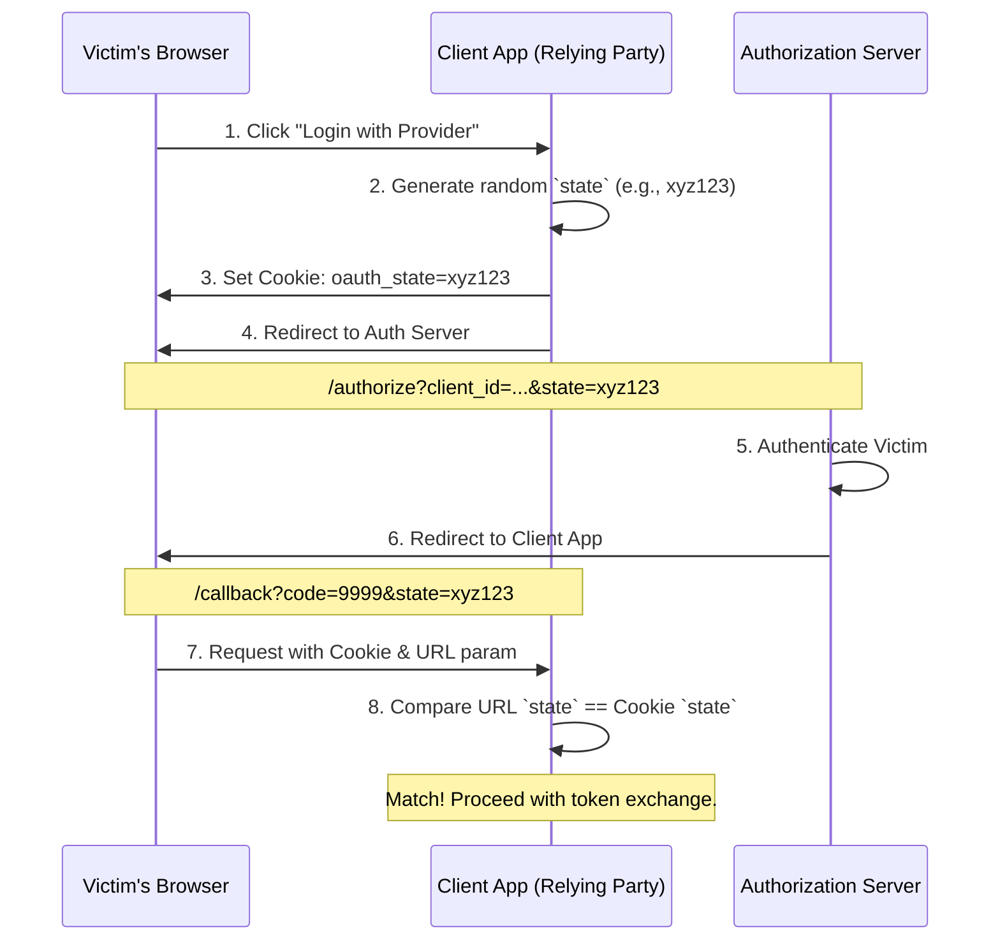

# OAuth 2.0 Security: Defeating Cross-Site Request Forgery with the `state` Parameter

## The Problem: Cross-Site Request Forgery (CSRF) in OAuth 2.0

When a user initiates an OAuth 2.0 Authorization Code flow, the relying party (client application) redirects the user to the authorization server (e.g., Google, GitHub). Upon successful authentication, the authorization server redirects the user back to the client application with an authorization code. 

Without explicit defensive mechanisms, this flow is vulnerable to a specific type of Cross-Site Request Forgery (CSRF) often called a "login CSRF" or an "account hijacking" attack via OAuth.

Consider this attack sequence:

1. **Attacker Authentication:** The attacker logs into the client application using their own credentials and initiates the OAuth 2.0 flow with a third-party provider.
2. **Intercepting the Code:** The authorization server redirects the attacker back to the client app with a valid authorization code. The attacker *intercepts* this HTTP redirect and prevents it from reaching the client app.
3. **Crafting the Trap:** The attacker now possesses a valid URL containing their authorization code: `https://client.app/callback?code=ATTACKER_CODE`.
4. **Springing the Trap:** The attacker tricks a victim (who is already logged into the client app) into clicking this URL or embeds it in an `iframe` on a malicious site.
5. **The Compromise:** The victim's browser sends the request to the client app. The client app extracts the `code`, exchanges it for an access token, and links the attacker's third-party account to the *victim's* session. 

If the client application uses this OAuth linkage for future logins or data synchronization, the attacker now has persistent access to the victim's account or can view data the victim imports from the third-party provider.

## The Mental Model: The `state` Parameter as an Unforgeable Token

To prevent this, the client application must ensure that the authorization response it receives corresponds to an authorization request *initiated by the same user session*. 

The `state` parameter serves this exact purpose. It acts as an anti-CSRF token specifically designed for the OAuth flow.



## Implementation Deep Dive

The defense relies on binding the `state` parameter to the user's current session.

### 1. Generating the State

The `state` value must be cryptographically secure and unguessable. A UUID (v4) or a random 32-byte string encoded in Base64 or Hex is sufficient.

```python
import os
import binascii

# Generate a cryptographically secure random state
state_token = binascii.hexlify(os.urandom(32)).decode()
```

### 2. Binding State to the Session

Before redirecting the user to the authorization server, the client app must store this state securely. The most common and effective method is setting an HTTP-only, secure, SameSite cookie.

```http
HTTP/1.1 302 Found
Location: https://auth.provider.com/authorize?response_type=code&client_id=CLIENT_ID&redirect_uri=CALLBACK_URL&state=xyz123
Set-Cookie: oauth_state=xyz123; HttpOnly; Secure; SameSite=Lax; Max-Age=300
```

*Note: The cookie should have a short lifespan (e.g., 5 minutes) as the OAuth flow should complete quickly.*

### 3. Validating the State

When the authorization server redirects back to the client's callback URL, it includes the exact `state` parameter that was sent in the initial request.

```http
GET /callback?code=AUTH_CODE_HERE&state=xyz123 HTTP/1.1
Host: client.app.com
Cookie: oauth_state=xyz123
```

The client application must strictly validate this:

```python
def handle_oauth_callback(request):
    url_state = request.query_params.get('state')
    cookie_state = request.cookies.get('oauth_state')
    
    if not url_state or not cookie_state:
        raise SecurityException("Missing state parameter or cookie.")
        
    if not constant_time_compare(url_state, cookie_state):
        raise SecurityException("CSRF attack detected! State mismatch.")
        
    # Clear the state cookie to prevent replay attacks
    clear_cookie('oauth_state')
    
    # Proceed to exchange the code for tokens...
```

**Crucial detail:** Always use a constant-time string comparison function (like `secrets.compare_digest` in Python) to prevent timing attacks that could allow an attacker to guess the state character by character.

## Beyond Basic CSRF: Encoded State

The `state` parameter isn't just for CSRF protection; it can also maintain application state between the request and the callback (e.g., remembering which page the user was on before clicking "login").

However, never store plain text data in the state parameter if it dictates application logic, as attackers can manipulate it. Instead, encode the application state alongside the CSRF token, and ideally, sign or encrypt the entire payload:

```json
// Example of a decoded, structured state object (this should be signed/encrypted before sending)
{
  "csrf_token": "a1b2c3d4e5f6...",
  "return_to_url": "/dashboard/reports"
}
```

By strictly enforcing the `state` parameter and securely binding it to the user's browser session, developers effectively neutralize login CSRF attacks, ensuring that an attacker cannot force a victim to consume a maliciously obtained authorization code.