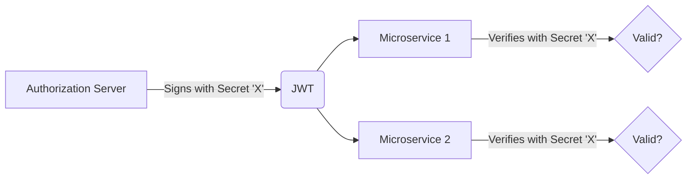
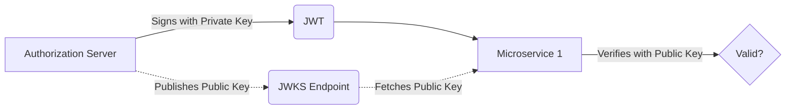

# JWT Cryptography: Why Asymmetric RS256 is Safer than Symmetric HS256 for Microservices

## The Problem: The Shared Secret Bottleneck in HS256

JSON Web Tokens (JWTs) are the standard bearer tokens in modern web architectures. When signing a JWT to guarantee its integrity, developers must choose an algorithm. The two most common are HS256 (HMAC with SHA-256) and RS256 (RSA Signature with SHA-256).

HS256 is a **symmetric** algorithm. This means the *exact same secret key* is used to both create (sign) the token and verify it.



In a monolithic application, this is fine. The server that generates the token is the same server that consumes it. But in a distributed microservices architecture, HS256 introduces critical security vulnerabilities:

1. **Secret Distribution:** You must distribute the single symmetric key to every microservice that needs to validate a JWT.
2. **Expanded Attack Surface:** If any *single* microservice is compromised, the attacker extracts the symmetric key. 
3. **Catastrophic Failure:** With the symmetric key, the attacker can now forge perfectly valid JWTs for *any* user, granting themselves admin privileges across the entire system.

## The Mental Model: RS256 and the Power of Asymmetry

RS256 solves this by using **asymmetric** cryptography. It utilizes a key pair:
*   A **Private Key**: Kept strictly secret by the Authorization Server, used *only* to sign the JWT.
*   A **Public Key**: Shared freely with all microservices, used *only* to verify the JWT's signature.



If an attacker compromises Microservice 1, they only obtain the Public Key. They can verify tokens, but they mathematically cannot forge new ones. The Authorization Server remains the sole source of truth for identity.

## Implementation Deep Dive: RS256 and JWKS

Switching to RS256 requires infrastructure for key management, primarily the JSON Web Key Set (JWKS).

### 1. The JWKS Endpoint

The Authorization Server exposes an unauthenticated HTTP endpoint (usually `/.well-known/jwks.json`) that hosts the public keys.

```json
// Example JWKS response
{
  "keys": [
    {
      "kty": "RSA",
      "alg": "RS256",
      "use": "sig",
      "kid": "key-id-2023-10-27",
      "n": "vX1...[truncated base64url modulus]...",
      "e": "AQAB"
    }
  ]
}
```
*   `kty` (Key Type): Identifies the cryptographic algorithm family (RSA).
*   `kid` (Key ID): A unique identifier for this specific key.
*   `n` (Modulus) and `e` (Exponent): The actual cryptographic components of the public key.

### 2. Token Generation (Authorization Server)

When the Auth Server creates a JWT, it signs it with the Private Key and embeds the corresponding `kid` in the JWT header.

```json
// JWT Header
{
  "alg": "RS256",
  "typ": "JWT",
  "kid": "key-id-2023-10-27"
}
```

### 3. Token Verification (Microservices)

When a microservice receives the JWT, it follows this secure execution path:

1.  Decode the JWT Header to extract the `kid` and verify the `alg` is strictly `RS256`.
2.  Check its local cache for a public key matching that `kid`.
3.  If not found, fetch the latest keys from the JWKS endpoint.
4.  Use the retrieved public key to verify the JWT's cryptographic signature.

```python
# Conceptual Python Verification (using PyJWT)
import jwt
from jwt import PyJWKClient

# Initialize the JWKS client (handles caching and fetching)
jwks_client = PyJWKClient('https://auth.internal.corp/.well-known/jwks.json')

def verify_token(token_string):
    try:
        # Fetch the key using the 'kid' from the token header
        signing_key = jwks_client.get_signing_key_from_jwt(token_string)
        
        # Verify the token. 
        # CRITICAL: Enforce algorithms=['RS256'] to prevent algorithm confusion attacks!
        payload = jwt.decode(
            token_string, 
            signing_key.key, 
            algorithms=['RS256'],
            audience='my-microservice'
        )
        return payload
    except jwt.InvalidTokenError as e:
        raise SecurityException("Invalid token")
```

## Security Imperatives

When adopting RS256, you must mitigate the **Algorithm Confusion Attack**. Historically, some JWT libraries allowed attackers to modify the header of a JWT from `alg: RS256` to `alg: HS256`. The attacker would then sign the JWT using the *public key* (which they possess) acting as an HMAC symmetric secret. If the receiving microservice naively trusts the `alg` header and uses the public key for HMAC verification, the forged token succeeds.

**Defense:** As shown in the code block above, *always* hardcode the expected algorithm (`algorithms=['RS256']`) during the verification step. Never trust the `alg` header blindly.

By enforcing RS256 and utilizing JWKS, microservices architectures maintain decentralized, high-performance validation while preserving strict zero-trust boundaries around token generation.