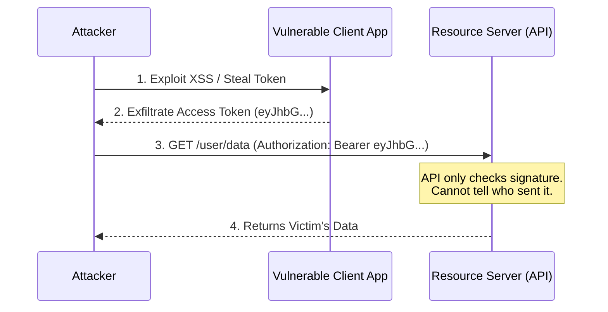

# OAuth 2.0 DPoP: Preventing Token Theft with Demonstrating Proof of Possession

## The Problem: The Vulnerability of Bearer Tokens

The standard OAuth 2.0 framework relies heavily on **Bearer Tokens**. A bearer token is like cash or a hotel room keycard: whoever holds it can use it. 

If an attacker steals an OAuth Access Token—whether through Cross-Site Scripting (XSS), a man-in-the-middle attack, extracting it from browser local storage, or finding it logged in an insecure proxy—they can replay that token against the Resource Server (API) to access the victim's data. 



The API has no cryptographic way to verify that the entity presenting the token is the exact same entity to whom the token was originally issued. We need a way to bind the token to the specific client.

## The Mental Model: The Passport vs. The Cash

If a bearer token is like cash, **DPoP (Demonstrating Proof of Possession)** turns the token into a passport. 

To use a passport, you can't just hand it to customs; your physical face must match the photograph inside. DPoP ensures that the client presenting the Access Token to the API also possesses a specific private cryptographic key. The Authorization Server "prints the photo" (the public key hash) inside the token, and the API checks the "face" (verifies a signature from the private key) on every request.

## Implementation Deep Dive: How DPoP Works

DPoP operates by creating a tight cryptographic binding between a client-generated key pair and the Access Token.

### 1. Client Generates a Key Pair
When the client application boots up, it generates an ephemeral RSA or Elliptic Curve (EC) key pair in memory (or ideally, in a secure enclave like WebCrypto API).

### 2. Requesting the Token (The DPoP Proof)
When the client requests an Access Token from the Authorization Server (e.g., exchanging an authorization code), it includes an HTTP header called `DPoP`.

This header contains a specialized JWT called the **DPoP Proof**. 
Crucially, the client signs this DPoP Proof with its newly generated **Private Key**. The payload includes the public key (in a JWK format).

```http
POST /token HTTP/1.1
Host: auth.example.com
DPoP: eyJ0eXAiOiJkcG9wK2p3dCIsImFsZyI6IkVTMjU2IiwiandrIjp7Imt0eSI6...
Content-Type: application/x-www-form-urlencoded

grant_type=authorization_code&code=SPLIT_CODE_HERE...
```

### 3. The Authorization Server Binds the Token
The Authorization Server validates the DPoP Proof signature. If valid, it generates the Access Token. 

Instead of a standard token, the Auth Server computes the hash (thumbprint) of the client's Public Key (from the `jwk` in the proof) and embeds it inside the Access Token under the `cnf.jkt` claim.

```json
// The resulting Access Token Payload
{
  "sub": "user_123",
  "aud": "https://api.example.com",
  "exp": 1699999999,
  "cnf": {
    "jkt": "0ZcOCORZNYy-DWpqq30jZyJGHTN0d2HglBV3uiguA4I" // Hash of Client's Public Key
  }
}
```

### 4. Calling the API (Demonstrating Possession)
Now, the client wants to fetch data from the API. It cannot just send the Access Token. It must generate a *new* DPoP Proof for this specific HTTP request, signing it with its Private Key. 

The API request must include both the Access Token (now a `DPoP` token, not a `Bearer` token) and the new DPoP Proof.

```http
GET /user/data HTTP/1.1
Host: api.example.com
Authorization: DPoP eyJhbGciOiJSUzI1... [The Access Token]
DPoP: eyJ0eXAiOiJkcG9wK2p3dCIs... [The New Proof for this specific request]
```

### 5. API Verification
The Resource Server (API) receives the request and performs a rigorous validation:
1.  **Validate Access Token:** Check the standard JWT signature, expiration, and audience.
2.  **Extract Expected Key:** Read the `cnf.jkt` (Public Key Thumbprint) from the Access Token.
3.  **Validate DPoP Proof:** Check the signature of the DPoP header using the public key provided within it. 
4.  **The Critical Link:** Hash the public key found in the DPoP header. Does it exactly match the `cnf.jkt` thumbprint inside the Access Token?
5.  **Replay Protection:** Ensure the DPoP proof is tied to the correct HTTP method (`GET`) and URL (`/user/data`), preventing an attacker from reusing a stolen proof on a different endpoint.

## Security Posture and Conclusion

If an attacker steals the Access Token via XSS, it is useless to them. When they try to use it, the API demands a DPoP Proof signed by the private key. Because the private key is held securely in the legitimate client's memory (and cannot be extracted by the XSS), the attacker cannot generate valid proofs.

DPoP provides a robust, application-layer defense against token exfiltration, elevating OAuth 2.0 security in high-risk environments like Single Page Applications (SPAs) and financial APIs without requiring complex mutual TLS (mTLS) infrastructure.