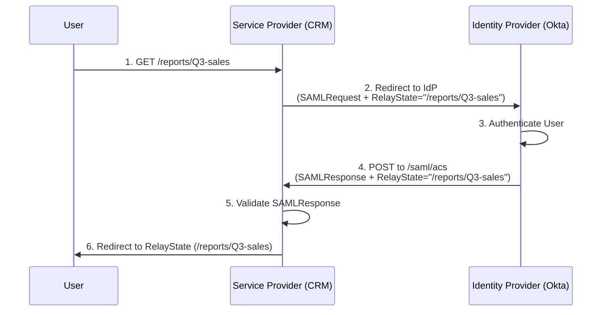

# SAML Security: Auditing `RelayState` Parameters to Prevent Open Redirect Attacks

## The Problem: The "Where Was I?" Dilemma in SSO

In an enterprise Single Sign-On (SSO) environment using SAML 2.0, the authentication flow requires bouncing the user between two distinct domains: the Service Provider (SP, the application the user wants to access) and the Identity Provider (IdP, e.g., Okta, Ping).

When a user attempts to access a specific deep link (e.g., `https://crm.company.com/reports/Q3-sales`), the SP intercepts the unauthenticated request and redirects the user to the IdP. 

After the user successfully authenticates, the IdP sends them back to the SP's standard Assertion Consumer Service (ACS) URL (e.g., `https://crm.company.com/saml/acs`). 

**The dilemma:** How does the SP remember to send the user to `/reports/Q3-sales` instead of just dumping them on the homepage?

The SAML specification solves this using the `RelayState` parameter. The SP sends the `RelayState` to the IdP, and the IdP echoes it back untouched along with the SAML Assertion.



**The Vulnerability:** If the SP blindly trusts the `RelayState` parameter returned by the IdP and issues an HTTP 302 Redirect to whatever URL it contains, it creates a critical **Open Redirect** vulnerability.

## The Mental Model: The Unverified Taxi Driver

Think of the `RelayState` as a sticky note you give to a taxi driver (the IdP). 
1. You hand the driver a note saying "Take this person to Building 4."
2. The driver takes the person to headquarters to get their security badge.
3. The driver returns the person to you, handing back the sticky note: "Here is the person, and here is your note: 'Take them to Building 4'."

An Open Redirect occurs when an attacker swaps the sticky note. 

An attacker crafts a malicious link targeting your SP's login initiation endpoint, but they inject their own `RelayState`: `https://crm.company.com/login?RelayState=https://evil-phishing.com/login`.

The SP blindly passes `https://evil-phishing.com/login` to the IdP. The IdP returns it. The SP validates the user's identity, logs them in, and then *redirects the user to the attacker's domain*. Because the user just authenticated with the legitimate SP, they implicitly trust the next page they see, making them highly susceptible to credential harvesting or malware payloads.

## Implementation Deep Dive: Securing `RelayState`

To prevent Open Redirects via SAML `RelayState`, security engineers must implement strict validation on the Service Provider side before issuing the final redirect.

### 1. The Ideal Defense: Opaque References (State Pattern)

The most secure approach is to never pass actual URLs in the `RelayState`. Instead, treat `RelayState` as an opaque key (like an OAuth `state` parameter).

1.  When the user requests `/reports/Q3`, the SP generates a random ID (e.g., `req-8f72a`).
2.  The SP stores the mapping `req-8f72a -> /reports/Q3` in the user's local session or a distributed cache (like Redis).
3.  The SP sends `RelayState=req-8f72a` to the IdP.
4.  When the IdP returns `req-8f72a`, the SP looks it up in the cache. 
5.  If found, redirect to the cached URL. If not found, redirect to the homepage.

```python
# Secure SP implementation using Opaque References
def initiate_sso(request):
    target_url = request.path
    opaque_id = generate_secure_uuid()
    
    # Store in session (server-side)
    request.session['relay_state_map'] = {opaque_id: target_url}
    
    redirect_to_idp(relay_state=opaque_id)

def handle_acs(request):
    # ... validate SAML response ...
    
    returned_relay_state = request.POST.get('RelayState')
    mapped_url = request.session.get('relay_state_map', {}).get(returned_relay_state)
    
    if mapped_url:
        return HttpResponseRedirect(mapped_url)
    else:
        return HttpResponseRedirect('/dashboard') # Safe default fallback
```

### 2. The Acceptable Defense: Strict URL Validation (Allowlisting)

If architectural constraints require passing actual URLs in the `RelayState`, you must aggressively validate the URL upon return.

**Do not use regex for URL validation.** URL parsing is notoriously complex and prone to bypasses (e.g., `https://trusted.com.evil.com` or `https://trusted.com\@evil.com`).

Instead, use the language's built-in URL parsing library to extract the hostname and validate it against a strict allowlist.

```java
// Acceptable SP implementation using URL Validation (Java)
public void handleSAMLResponse(HttpServletRequest request, HttpServletResponse response) {
    String relayState = request.getParameter("RelayState");
    String safeRedirectUrl = "/default-home";

    if (relayState != null && !relayState.isEmpty()) {
        try {
            URI uri = new URI(relayState);
            
            // 1. Force Relative Paths (Safest URL-based approach)
            if (!uri.isAbsolute() && relayState.startsWith("/")) {
                safeRedirectUrl = relayState; 
            } 
            // 2. OR Strict Hostname Allowlist (If absolute URLs are required)
            else if ("crm.company.com".equals(uri.getHost()) || "api.company.com".equals(uri.getHost())) {
                safeRedirectUrl = relayState;
            } else {
                 log.warn("Blocked Open Redirect attempt via RelayState: " + relayState);
            }
        } catch (URISyntaxException e) {
            log.error("Malformed RelayState parameter", e);
        }
    }
    
    response.sendRedirect(safeRedirectUrl);
}
```

By ensuring the `RelayState` is either an opaque session reference or a strictly parsed and validated local path, security teams can eliminate the risk of SSO infrastructure being weaponized for phishing campaigns.