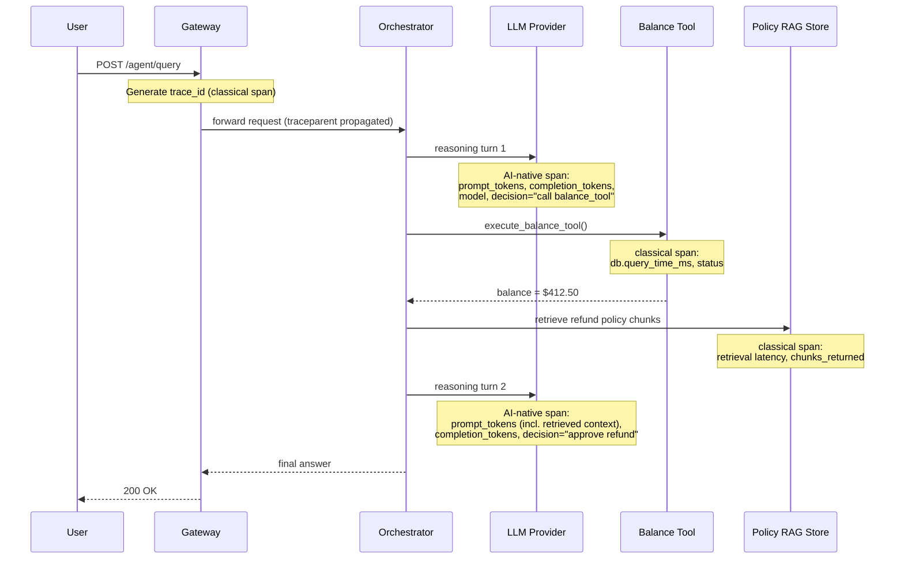

# Observability 2.0 Explained: From Logs and Metrics to AI-Native Telemetry

> By the end of this article you'll understand exactly what breaks when you point a classical logs/metrics/traces stack at an AI-driven system, and what has to be added — not replaced — to make that system debuggable again.

## The Problem

Picture an on-call engineer at 2 a.m. Their dashboard is green. CPU is at 40%. Memory is fine. Every HTTP endpoint is returning `200 OK`. p99 latency looks normal. By every signal their observability stack was built to show them, the system is healthy.

And yet the support queue is filling up, because the AI assistant their company shipped last quarter just told a customer to void a valid insurance claim, based on a policy clause that doesn't exist.

Nothing in the infrastructure failed. The web server didn't crash. The database didn't time out. The load balancer didn't drop a single connection. The failure happened somewhere that CPU counters and HTTP status codes have never been able to see: inside a reasoning process, where a model read some retrieved text, misweighted it against its own prior knowledge, and generated a confident, fluent, wrong answer.

This is the gap that "Observability 2.0" exists to close. It isn't a rebrand of the same three pillars with an AI label stuck on top. It's a recognition that a whole new *category* of failure exists in production systems now — one that traditional observability was never designed to detect, because traditional observability was built for deterministic code.

**A note on terminology, because this term is overloaded in the industry:** Charity Majors and Honeycomb popularized "Observability 2.0" to mean something specific and *not* AI-related — moving away from the fragmented "three pillars" (separate logging, metrics, and tracing tools, each a different source of truth) toward a single source of truth built from arbitrarily-wide structured events, from which logs, metrics, and traces can all be derived. That is a tooling-architecture argument that applies to any system, AI or not. This article uses the same phrase for a different, AI-specific axis: what has to be added on top of the three pillars — wide-events or not — to make AI-driven decision-making debuggable. Both usages share the underlying claim that "logs, metrics, and traces alone are no longer sufficient," but for different reasons. If you encounter the term elsewhere, check which sense is meant.

## Why This Problem Is Difficult

Classical observability — logs, metrics, and traces — was designed around a specific assumption that held for essentially all of software's history until very recently: **given the same input and the same code path, you get the same output.** A function either throws an exception or it doesn't. A query either returns rows or it doesn't. If something goes wrong, the wrongness is visible somewhere as an error, a stack trace, a non-2xx status, a spike in a latency histogram. The system's *correctness* and the system's *health* were, for practical purposes, the same signal.

An LLM call breaks that assumption in three specific ways:

1. **The output can be "successful" and still be wrong.** The HTTP call to the model provider returns `200 OK`. The JSON is well-formed. Every infrastructure-layer signal says the request worked — and the content of the response can still be a hallucinated fact, a broken piece of reasoning, or an answer to a question nobody asked. Correctness has moved from "did the code path complete" to "was the content right," and nothing in a metrics pipeline was built to evaluate content.
2. **The same input can legitimately produce different outputs.** Re-run an identical prompt against the same model and you can get a different response — by design, not by bug. Sampling temperature and decoding strategy are the obvious sources, but non-deterministic execution in the serving stack matters just as much — floating-point non-associativity under batched GPU inference, and expert-routing decisions in mixture-of-experts models, can both change the output even at temperature 0, where a classical mental model would expect a pure function. All of this introduces variability that a classical system would treat as a logic error (same input, different output — file a bug) but that in an AI system is completely normal. This means "reproduce the failure" — the first move in any traditional incident investigation — doesn't reliably work anymore.
3. **Cost and latency are now functions of the *content*, not just the *code path*.** A traditional endpoint's latency is mostly a function of which branch executed and how much I/O it did. An LLM call's latency and cost are functions of how many tokens were in the prompt, how many were generated, which tools got invoked, and how many reasoning steps an agent decided to take on its own — decisions the calling code doesn't control and can't predict in advance. Two requests hitting the exact same endpoint with the exact same route can differ in cost by an order of magnitude or more depending on what the model decided to do — the exact multiple is workload-specific, not a fixed constant.

Put together: the classical stack answers "is the system running?" The new failure mode lives entirely inside "is the system *thinking correctly*?" — and that question needs different instruments.

## A Simple Mental Model

Think of classical observability as the instrument panel in the cockpit of a plane with a human pilot: airspeed, altitude, fuel, engine temperature. Those gauges tell you everything about whether the *aircraft* is functioning. They tell you nothing about whether the *pilot* is making good decisions. A plane can have perfect gauges across the board and still be flown into a mountain, because the gauges were never designed to measure judgment.

Observability 2.0 is the addition of a second panel: a flight-data recorder for the reasoning itself — what the pilot (the model) was told, what it considered, what it decided, and why. You still need the engine gauges; a model call still runs on a server that can run out of memory or time out. But you now also need to record the "thinking," because a plane can crash with every engine gauge reading green.

Where this analogy has a limit: a human pilot's reasoning is opaque and unrecordable by nature — you can only infer it from the black box's flight data after the fact. A model's reasoning, by contrast, can often be captured directly, because the model literally emits its intermediate steps as text or structured tool calls if you choose to record them. Observability 2.0 isn't inferring the model's judgment indirectly; it's instrumenting the thing that produced the judgment, in a way a human cockpit never allowed.

## Before We Continue

This article assumes you're already comfortable with:

- **Container orchestration fundamentals** — what a service, a pod, and horizontal scaling mean in a Kubernetes-style environment.
- **Distributed tracing basics** — trace IDs, span IDs, parent/child spans, and context propagation across service boundaries. If any of that is unfamiliar, the "Distributed Tracing" article in this series covers it from scratch before this one builds on it.
- **What an LLM call looks like from the outside** — a prompt goes in, tokens come back, and there's a provider (or self-hosted engine) doing the generation in between.
- **The basic shape of an AI agent loop** — a system that can call tools, observe results, and decide on a next step, rather than a single request/response call to a model.

If any of these are new, the "AI Infrastructure Explained" and "LLM Engineering Explained" articles referenced under `related:` are the natural on-ramp.

## The Core Idea: Three Pillars, Then a Fourth Layer

Let's establish exactly what the classical three pillars give you, because Observability 2.0 doesn't discard any of it — it builds a new layer *on top*.

### The Three Classical Pillars

| Pillar | What it answers | What it's made of |
|---|---|---|
| **Logs** | "What exactly happened, in detail, at this point in time?" | Discrete, timestamped, often unstructured or semi-structured event records |
| **Metrics** | "How is the system behaving in aggregate, over time?" | Numeric time series — counters, gauges, histograms — cheap to store and query at scale |
| **Traces** | "What was the path of *this specific request* through a distributed system, and where did the time go?" | A tree of spans, correlated by a trace ID, propagated across service boundaries |

Each pillar trades detail for scale in a different way. Logs give you maximum detail about one event but are expensive to search across millions of them. Metrics give you cheap aggregation across everything but throw away per-request detail the moment they're recorded (a p99 latency number can't tell you *which* request was slow, only that some request was). Traces sit in between: enough per-request detail to follow a single request's journey, correlated so you can jump from the aggregate metric that alerted you down to the specific trace that explains it.

This three-way split is exactly what the classical model needs, because a classical failure is a *structural* one: a slow downstream call, a failing dependency, a resource exhausted somewhere in the call graph. Following the request's structural path is enough to find it.

### Why a Fourth Layer Is Necessary, Not Optional

An AI-driven request has a structural path too — it still goes through a gateway, hits a service, maybe calls a database. Classical tracing still finds structural problems in that path just fine. What it cannot see is what happens *inside* the LLM call and the agent's reasoning loop, because that's not structural — it's semantic and probabilistic.

Observability 2.0, concretely, is the addition of a telemetry layer for that inside-the-call content, riding on top of (not replacing) the existing three pillars:

- **Token-level telemetry** — prompt tokens, completion tokens, cache hits/misses, per-token or per-request cost, broken out by model, by tenant, and (ideally) by the specific prompt template or feature that generated the call. This is the metrics pillar extended with a new unit of measurement: not "requests per second," but "tokens per request" and "dollars per token," because those are now the quantities that actually drive cost and latency.
- **Decision-level tracing** — recording *what the model decided*, not just how long the call took: which tool it chose to invoke and why (if the model exposes reasoning), what the retrieved context looked like, what the final generated content was, and how many reasoning/tool-call iterations an autonomous agent took before it stopped. This is the traces pillar extended with a new span type: a "cognitive" span that carries semantic content, not just timing and status.
- **Non-deterministic-behavior tracking** — because identical inputs can produce different outputs, you need telemetry that captures *output variance across repeated calls*, not just latency variance. This has no clean classical analogue; it's closer to a running eval than a traditional metric, which is why AI observability and AI evaluation are closely related disciplines (covered in depth in the evaluation article in this series) rather than the same thing.

None of this is a new set of pillars replacing logs/metrics/traces. It's better described as **AI-native telemetry**: a layer of semantic, content-aware, cost-aware, decision-aware data that attaches to the same trace and span structure the classical pillars already use — because the request still has a structural path, it just now also has a *cognitive* path riding alongside it.

## How It Actually Works: One Trace, Two Kinds of Spans

The cleanest way to see this is a single trace that mixes both worlds. Consider an agent handling "What's my account balance, and can I get a same-day refund?"

Notice what's happening structurally: this is an ordinary OpenTelemetry-style trace, with a trace ID and parent/child spans, exactly like the distributed tracing you'd build for any microservice request. Nothing about the propagation mechanism changes.

What changes is the **content of specific spans**. The two spans wrapping the LLM calls carry attributes that a classical HTTP span never needed: token counts split into prompt versus completion, the model identifier, and — critically — a record of *what the model decided*, not just how long it took to decide it. The tool-execution and retrieval spans, by contrast, are almost exactly what you'd instrument for any database call or search query — because those parts of the system are still deterministic, and classical tracing already handles deterministic work correctly.

This is the core mechanical insight of Observability 2.0: **you are not building a parallel tracing system for AI.** You are extending the existing trace with a new, richer attribute set on the spans that wrap non-deterministic, content-bearing operations, while leaving the spans around deterministic operations alone.

## Let's Walk Through an Example: What Each Layer Would Have Told You

Go back to the 2 a.m. incident from the introduction — the agent that hallucinated a policy clause and told a customer to void a valid claim.

- **Metrics** told the on-call engineer: nothing was wrong. Every counter and histogram was in its normal range, because request volume, latency, and error rate were all unaffected — this was a content failure, not an infrastructure failure.
- **Classical traces** would show a completed request, a healthy retrieval-store call, a healthy LLM-provider call, and a `200` all the way through. Structurally, correct. Substantively, useless for this bug.
- **Token-level telemetry** would show something worth investigating on its own: the completion cost for this request was 4x the median for this endpoint, because the model burned an unusually large number of tokens on a long, meandering justification before landing on its answer. That's a signal — an anomaly in token usage per request is often the first hint that something in the retrieval or reasoning step went sideways, well before a human notices the output was wrong.
- **Decision-level tracing** is what would actually solve the case: replaying the trace shows the exact context the model was given at generation time — and reveals that the retrieved "policy chunk" for this query didn't actually contain the clause the model referenced. The model didn't retrieve a wrong document and misread it; it fabricated language that isn't in any document at all, while the retrieval step itself worked correctly. That distinction — retrieval failure versus generation failure — is invisible to every other layer, and it changes what team fixes the bug (search/retrieval versus prompting/grounding).

This is the concrete value Observability 2.0 adds: not a replacement diagnosis path, but the *only* diagnosis path capable of distinguishing "the retrieval was wrong" from "the model made something up despite correct retrieval" from "the model reasoned correctly about wrong retrieved data." Those are three different bugs with three different fixes, and classical telemetry cannot tell them apart because it never looks at content.

## Under the Hood: What You're Actually Instrumenting

Three concrete additions sit underneath the phrase "AI-native telemetry":

**1. Semantic span attributes on LLM calls.** Beyond the standard span timing and status, an LLM-call span records structured attributes: model name and version, prompt token count, completion token count, whether a prompt-cache was hit (which changes both cost and latency meaningfully), and often a truncated or redacted version of the prompt/completion content itself for debugging (with the security caveat below). The OpenTelemetry community has been converging on semantic conventions for exactly this — standardized attribute names for GenAI spans — so that different tools and vendors can interoperate rather than every team inventing its own attribute schema.

> **Verification Note**
> OpenTelemetry's GenAI semantic conventions were still evolving as of this writing; specific attribute names and stability guarantees should be checked against the current OpenTelemetry specification before building instrumentation that depends on them long-term.

**2. Cost and token metrics as a first-class metric type.** Where a classical metrics pipeline tracks request count, error rate, and latency percentiles, an AI-native pipeline adds token throughput and cost as time series in their own right — broken down by tenant, by model, and by feature — because in an AI system, cost is a variable operational signal (it can spike from a change in user behavior or a prompt regression) rather than a roughly fixed number you compute once from your infrastructure bill.

**3. Decision/reasoning capture as structured events, not free-text logs.** Rather than dumping a model's raw output into an unstructured log line, mature instrumentation attaches structured events to the relevant span: which tool was selected, what arguments were passed, what the tool returned, and (for multi-step agents) how many iterations of this loop ran before the agent decided it was done. This is what lets you query "how many requests took more than 3 reasoning iterations" the same way you'd query "how many requests had latency over 2 seconds" — turning agent behavior into the same kind of aggregatable signal that classical metrics already gave you for infrastructure behavior.

## What Can Go Wrong?

Adding a new telemetry layer on top of a working tracing system introduces its own failure modes if done carelessly:

- **Span payload bloat.** Prompts and completions, especially with retrieved context injected in, can be large — sometimes tens of thousands of tokens. Attaching full prompt/completion text directly as span attributes on every request can blow past exporter payload limits, dramatically increase storage cost, and slow down the tracing backend itself. This is the same class of problem classical tracing already has with verbose spans, just larger in scale.
- **Sampling that throws away the wrong requests.** Classical tracing commonly samples — trace only 1% of requests to control cost. Applied naively to AI telemetry, this means you have a 99% chance of missing the exact request a user complained about, because you can't reliably "re-run" a non-deterministic call to reproduce it after the fact the way you can replay a deterministic HTTP request. Tail-based or error-biased sampling, which decides whether to keep a trace *after* seeing how it turned out, matters more here than in classical systems.
- **Treating token counts as a proxy for correctness.** A token-count anomaly is a good *signal to investigate*, not a diagnosis. High completion length can mean a model is reasoning at length correctly, or that it's stuck in a loop, or that it's hallucinating an elaborate but wrong justification — the metric alone can't distinguish those, which is exactly why decision-level tracing has to sit alongside it.
- **Silent cost explosions from agent loops.** An autonomous agent that decides to retry a failing tool call, or re-plan after an unexpected result, can multiply token spend per user request in a way a fixed-code-path system never could. Without per-request cost telemetry, this shows up first as a finance surprise at the end of the month, not as an alert.

## Security Considerations

AI-native telemetry directly touches the same sensitive content the application itself handles, which raises the stakes on how you instrument it:

- **Prompts and completions are user data, and they end up in your observability backend.** A support ticket, a medical question, an account number typed into a chat box — all of it can flow straight into a trace attribute or a log line if instrumentation captures raw content by default. Treat your tracing/observability backend as being in scope for the same data-classification and access-control policies as your production database, not as a lower-stakes internal tool.
- **Don't log raw prompts and completions directly into span attributes at full fidelity.** The pattern used in mature systems is to store the trace/span ID as the correlation key, and store the actual prompt/completion content in a separate, access-controlled store (object storage with its own retention and access policy) — retrievable *by* that ID when someone needs to debug, but not sitting in the general-purpose tracing UI that every engineer with dashboard access can browse.
- **Tool-call arguments can carry secrets or PII just as easily as the prompt.** An agent's tool-call span might include a customer's account number, a database query with literal parameters, or an API key passed as a tool argument. Whatever redaction and access-control discipline you apply to prompts needs to apply to tool-call payloads too — they are, mechanically, just as much "data flowing through the trace" as the prompt is.
- **Telemetry itself becomes a new avenue for prompt injection to matter.** If retrieved documents or user-supplied text are captured verbatim into spans that later get rendered in a dashboard or fed into another system (for example, an automated triage tool that reads traces), untrusted content in that captured text is now reaching a second system with different trust assumptions than the original agent had. Treat captured AI telemetry as untrusted input wherever it's consumed downstream, the same way you'd treat any other data that originated from outside the trust boundary.

## Common Misconceptions

**Misconception:** "Observability 2.0 is just adding LLM logging on top of what we already have."
**Reality:** Logging raw prompts and completions to a log aggregator is a starting point, not the destination. Without token-level metrics you can aggregate and alert on, and without decision-level structure you can query the way you query a metric, you have a pile of unstructured text that's expensive to search and impossible to build dashboards or SLOs from. The value of Observability 2.0 comes from making cognitive behavior *aggregatable and queryable*, not just *recorded*.

**Misconception:** "If token usage and latency both look normal, the model's output is probably fine."
**Reality:** A model can generate a short, fast, cheap, completely wrong answer. Token and latency telemetry are useful anomaly detectors, not correctness checks — they narrow down where to look, they don't replace evaluation. This is exactly why AI observability and AI evaluation (running structured correctness checks against outputs) are complementary disciplines rather than substitutes for each other.

**Misconception:** "Because model behavior is non-deterministic, tracing doesn't really help — you can't reproduce the bug anyway."
**Reality:** You don't need to reproduce a non-deterministic call to learn from a captured trace of it. The trace of the *original* failing request — exact prompt, exact retrieved context, exact model decision — is itself the evidence, whether or not re-running it produces the same output. Non-determinism is an argument for capturing more context per request up front, not an argument that tracing is pointless.

**Misconception:** "This only matters for consumer-facing chatbots."
**Reality:** Any system where an LLM makes a decision that affects behavior — routing, summarization feeding into another automated step, an agent calling internal tools, a background pipeline classifying documents — has the same blind spot. The 2 a.m. incident in this article's introduction wasn't a chat UI bug; it was a backend agent's tool-selection and grounding failure. Anywhere a model's output changes what the system *does*, not just what a user *reads*, is a candidate for this kind of telemetry.

## Real-World Architecture

Across the vendors and open-source projects building in this space, the same shape recurs, which suggests it reflects the actual structure of the problem rather than one company's specific product design:

- **OpenTelemetry as the common substrate.** Rather than a separate protocol for "AI observability," the emerging pattern is extending the existing OpenTelemetry trace/span/metric model with GenAI-specific semantic conventions, so that AI telemetry rides on the same collectors, exporters, and backends teams already run for classical tracing. This mirrors exactly how the field converged on OpenTelemetry itself for classical distributed tracing, as covered in the tracing article referenced under prerequisites.
- **LLM-specific observability platforms** layer decision-level tracing, prompt/completion capture (with configurable redaction), and cost dashboards on top of that substrate — effectively the "cognitive span" concept in this article, productized.
- **Cloud provider AI platforms** (the general pattern behind major cloud vendors' managed LLM and agent-hosting services) increasingly expose token usage, cost attribution, and request tracing as built-in platform features rather than something a team bolts on afterward, following the same trend that happened with classical APM becoming a default cloud platform feature.

> **Verification Note**
> Specific product names, feature sets, and semantic-convention stability for any named observability vendor or cloud AI platform change quickly in this space. Confirm current capabilities against that provider's own documentation before making an architecture decision that depends on specifics.

## Expert Insight

The mistake experienced teams make first isn't under-instrumenting — it's **instrumenting AI calls exactly like they instrument everything else**, treating an LLM span as just another slightly-slower RPC. That gets you latency and error-rate numbers that look complete on a dashboard while telling you nothing about the failure mode that actually matters in production: the model being confidently, fluently, silently wrong. Teams that get this right treat the LLM call as a fundamentally different kind of span from day one — one where "success" (a 200 with valid JSON) and "correctness" (the content was right) are two separate questions that need two separate signals, and where the second question usually needs its evaluation system, not just its tracing system, wired into the loop.

The second thing worth knowing: **decision-level tracing and evaluation are closely coupled disciplines, and teams that build them in isolation end up rebuilding one to talk to the other.** A trace that captures what context the model saw and what it decided is exactly the input an automated evaluator needs to score that response after the fact — and an evaluation pipeline that flags a bad response is far more useful when it can hand you the trace ID and jump straight to the exact context and decision that produced it. Treating these as one connected system, rather than a tracing project and a separate evaluation project that happen to both mention LLMs, is what turns "we have AI observability" into "we can actually find and fix AI bugs in production."

## Try It Yourself

**Goal:** Feel the difference between a classical trace and an AI-native trace on the same request, without needing a production-scale system.

**Starting Point:** Any small script that calls an LLM API (hosted or local) wrapped in a basic OpenTelemetry setup — the console exporter is enough; you don't need a full tracing backend for this exercise.

**Task:**
1. Instrument a single LLM call as an ordinary span: start time, end time, status. Run it and look at what the span tells you.
2. Add token-level attributes to that same span: prompt tokens, completion tokens, model name. Re-run and note what new questions you can now answer that you couldn't before (for example: cost per call, tokens per second).
3. Add a structured event to the span recording the model's actual decision in a multi-step scenario (for instance, have the model choose between two hypothetical "tools" in its text output, and record which one it picked and why, as a span event rather than a plain log line).
4. Now imagine — or actually build — a second script that queries: "show me every trace where completion tokens were more than 2x the median for this prompt template." Notice this query is only possible because of step 2, and would be meaningless with only step 1's data.

**Expected Result:** The plain span from step 1 tells you the call succeeded and how long it took — and nothing else. The enriched span from steps 2–3 lets you ask questions about *what happened* and *why it cost what it cost*, not just *whether it worked*.

**What You Learned:** AI-native telemetry isn't a different tracing system — it's the same span, carrying attributes that make content and decisions queryable the way latency and status already were.

## Pause and Think

If an LLM call can legitimately produce different outputs for the identical input, does that mean distributed tracing — which assumes you can follow *a* request through the system — stops being useful for AI-driven requests?

### Answer

No — but it changes what the trace is *for*. In a classical system, a trace's value partly comes from the assumption that you can use it to understand a *class* of requests, because the same input reliably takes the same path. With a non-deterministic model call, each trace becomes more valuable as a record of *that specific request's* exact context and decision, since you can't lean on "this represents what always happens with this input." The trace's job shifts from "represents the general case" toward "is the only complete record of this specific case" — which is exactly why capturing full context per request (within sensible redaction and sampling limits) matters more here than in classical tracing, not less. The mechanism — trace IDs, spans, parent/child structure — doesn't need to change at all; what changes is how much weight you put on any single captured trace being representative of the next one.

## Key Takeaways

- Classical observability (logs, metrics, traces) was built on the assumption that a request's correctness and its infrastructure health are the same signal. AI-driven systems break that assumption: a request can be perfectly healthy (200 OK, normal latency) and still be wrong, because the failure lives inside content and reasoning, not the call graph.
- Observability 2.0 is not a fourth pillar replacing the first three — it's AI-native telemetry riding on the same trace/span structure: token-level metrics (cost, prompt/completion counts, cache hits), decision-level tracing (what the model chose and why), and non-determinism-aware signals that a fixed-code-path system never needed.
- A single agent request produces one trace with two kinds of spans: classical spans around deterministic work (tool execution, retrieval, database calls) and AI-native spans around the LLM call itself, carrying semantic attributes instead of just timing and status.
- Token and cost anomalies are strong signals to investigate, not correctness verdicts — distinguishing "retrieval was wrong" from "the model fabricated content despite correct retrieval" requires decision-level tracing, and confirming the output was actually wrong requires evaluation, a closely related but distinct discipline.
- Because prompts, completions, and tool arguments carry the same sensitive data the application does, AI-native telemetry needs the same data-classification, redaction, and access-control discipline as production data — not a lighter standard because it's "just observability."

## What to Learn Next

The natural next step is going one level deeper into LLM-specific tracing mechanics — how to actually structure spans for prompts, tool calls, and multi-turn agent loops in a production system, and how that connects to running automated evaluations against captured traces. See "Observability for LLM Applications: Tracing Prompts, Tokens, and Failures" for that build-out, and "AI Evaluation Explained: How Do You Know a Model Actually Works?" for the evaluation half of the picture this article kept separate on purpose.
