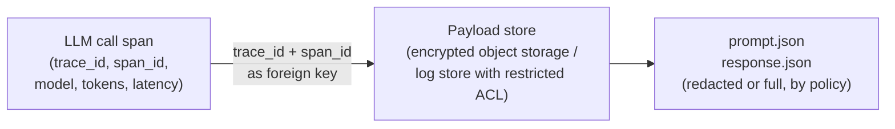
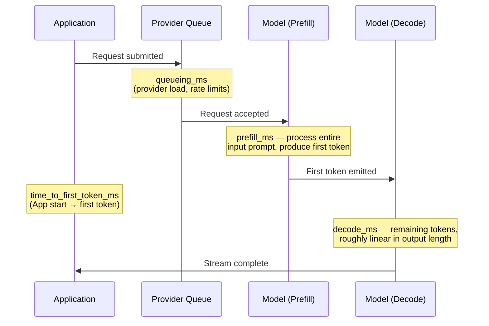
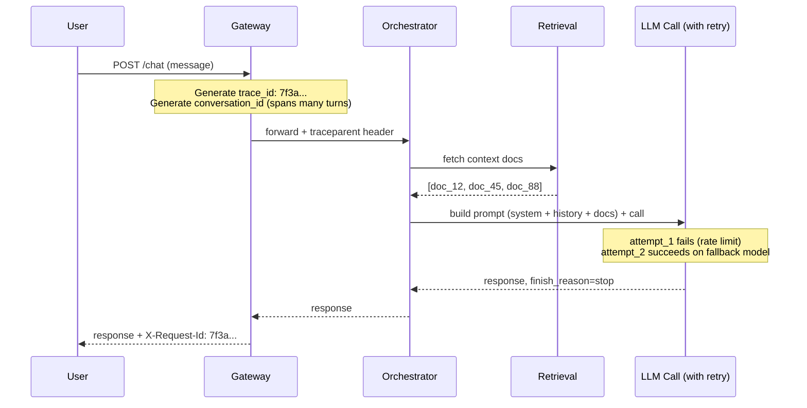

# Observability for LLM Applications: Tracing Prompts, Tokens, and Failures

> By the end of this article you'll know exactly what to capture at every LLM call — prompt, tokens, latency, retries, and fallbacks — and how to walk backward from "a user says the bot gave a wrong answer" to the one API call that caused it.

## The Problem

Your on-call phone buzzes. A support ticket says: "The assistant told a customer their refund was approved. It wasn't. Legal wants to know why."

You open your dashboards. Every panel is green. p99 latency is fine. Error rate is 0.1%. The `/chat` endpoint returned `200 OK` for that request, same as it does for 999,900 other requests today. Nothing alerted. Nothing is "down."

And that's exactly the problem. The system didn't crash. It didn't 500. It *worked*, in every sense your existing dashboards measure — and it still produced a wrong, possibly harmful answer. Traditional web observability was built to answer "is the service up and fast?" It has nothing to say about "was the answer correct, and why did the model say that?"

This is the gap LLM observability fills. It isn't a rebrand of APM with an "AI" label slapped on. It's a different question, aimed at a different failure surface: not the network and the process, but the *content* that flowed through them — the prompt, the tokens, the model's reasoning path, and every retry along the way.

## Why This Is a Different Problem Than Normal APM

A traditional backend call is deterministic and cheap to describe: same input, same code path, roughly the same output every time. You can characterize its health with four numbers — latency, throughput, error rate, saturation (the classic "four golden signals"). If a request is slow, you know the exact line of code or query that's slow, and it will be slow again if you retry it.

An LLM call breaks every one of those assumptions:

| Property | Normal API call | LLM call |
|---|---|---|
| Determinism | Same input → same output | Same input can produce a different output every time (temperature, sampling, model updates) |
| Cost | Roughly fixed per request (compute) | Scales with *how much text* went in and came out — a "successful" call can be 50x more expensive than another |
| Failure mode | Usually a hard error (exception, non-2xx) | Often *no error at all* — a fluent, confident, wrong answer looks identical in your logs to a correct one |
| Retry semantics | Retrying is usually safe/idempotent | Retrying calls the model again, at full price, and may return a *different* answer than the first attempt |
| What "slow" means | One number: total latency | Split concerns: queueing, time-to-first-token, and per-token generation rate all behave differently |
| Root cause | A stack trace or a slow query plan | A specific prompt, a specific set of retrieved documents, a specific model version, a specific decoding parameter |

None of this means throw away your existing APM. It means an LLM call needs its own layer of instrumentation stacked on top of standard tracing, one that treats the *content* of the call — not just its shape — as first-class telemetry.

> **Before We Continue**
>
> This article assumes you're comfortable with distributed tracing fundamentals — traces, spans, parent/child relationships, context propagation via something like the W3C `traceparent` header — and with the basic vocabulary of LLM applications: prompts, tokens, temperature, context windows, and tool/function calling. If any of that is shaky, the prerequisites above cover it. This article also focuses specifically on the *LLM call layer* — what to instrument around a single model invocation and its retries. It deliberately doesn't re-cover agent-level cognitive tracing (multi-step reasoning loops, tool-selection spans) — that's the companion article on agent observability, cross-referenced below. And it stops short of *judging whether an answer was good* — that's evaluation, covered in the next articles in this series. Tracing tells you what happened; evaluation tells you whether it should have.

## A Simple Mental Model

Think of a courtroom stenographer. A stenographer doesn't just record that "a conversation happened between 2:03 and 2:11 PM" — that's what a latency metric gives you. A stenographer records *every word*, in order, with a timestamp, so that months later, when someone disputes what was said, you can pull the exact transcript and settle it.

Standard APM tracing is the courtroom clock: it tells you a hearing happened and how long it took. LLM observability is the stenographer's transcript: it's the thing you actually need when someone asks "what exactly did the model say, and why."

The catch, and it's an important one: unlike a court transcript, an LLM transcript can't always be replayed to get the same result back. Rerunning the same prompt through the same model isn't guaranteed to reproduce the same output — sampling, model updates, and even provider-side load balancing across replicas can change the answer. So the transcript itself — not "the ability to re-ask the question" — has to be the record of truth.

## The Core Idea: Four Things to Instrument

Everything in this article reduces to four categories of instrumentation layered on top of a normal trace:

1. **Full prompt/response capture** — what actually went in and came out, handled separately from your metrics pipeline because of size and sensitivity.
2. **Token-level cost and latency attribution** — turning token counts into dollars and turning "it was slow" into "it was slow *where*."
3. **Retry and fallback tracing** — making every attempt visible instead of hiding failed attempts inside a single successful-looking span.
4. **End-to-end correlation** — the thread that lets you go from a user's complaint to the exact call that caused it.

We'll take each in turn, mechanism by mechanism.

## 1. Full Prompt/Response Capture

### The naive approach, and why it breaks

The first instinct is to treat the prompt like any other span attribute:

```python
with tracer.start_as_current_span("llm_call") as span:
    span.set_attribute("prompt", full_prompt_text)
    response = call_model(full_prompt_text)
    span.set_attribute("response", response.text)
```

This works in a demo and fails in production for three concrete reasons:

- **Size limits.** Most tracing backends cap attribute value size (often in the low kilobytes) and will silently truncate or drop the span if you exceed it. A RAG prompt with several retrieved documents stitched in easily blows past that.
- **Cardinality and indexing cost.** Tracing backends index attributes to make them searchable. Free-text prompts are high-cardinality by nature — indexing every unique prompt string is expensive and mostly useless (you rarely search *by* prompt text; you search *for* it once you already have a trace ID).
- **Sensitivity.** Prompts and responses routinely contain the exact things you don't want sitting in a general-purpose observability tool that half your engineering org can query: customer PII, health or financial details, internal system prompts, sometimes secrets a user pasted in by mistake.

### The mechanism that actually works: separate the pointer from the payload

The pattern used in practice is to keep the **trace** as the skeleton (timing, status, structural metadata) and store the **payload** — the actual prompt and response text — in a separate, access-controlled store, linked by the trace and span ID:



Concretely: the span carries `trace_id`, `span_id`, and *metadata* (model name, token counts, status, latency). A separate write — a structured log line or an object-storage `PUT` — carries the actual prompt and response text, tagged with that same `trace_id`/`span_id`. Your trace viewer (Jaeger, Honeycomb, whatever) shows you the shape of the call; a link or a sidecar query pulls the actual content from the restricted store when someone with the right access needs it.

Some tracing systems support this natively as **span events** with a payload-size ceiling, or as structured, opt-in content attributes (OpenTelemetry's evolving spec has used different shapes for this over time — earlier `gen_ai.content.prompt` / `gen_ai.content.completion` events, then `gen_ai.prompt` / `gen_ai.completion` span attributes, most recently `gen_ai.input.messages` / `gen_ai.output.messages`) that are only populated when content capture is explicitly enabled — the OpenTelemetry community's semantic conventions for generative AI take this "opt-in, separate from the always-on metadata" approach consistently across all of those revisions, precisely because unconditional content capture is the wrong default.

> **Verification Note**
>
> OpenTelemetry's semantic conventions for generative AI systems are still evolving and remain marked "Development" (experimental) as of this writing, and several attribute names have already been renamed since earlier versions of the spec — including two used in this article's own code samples: `gen_ai.system` was renamed to `gen_ai.provider.name` (semantic-conventions v1.37+), and the older `prompt_tokens`/`completion_tokens` became `input_tokens`/`output_tokens`. The finish-reason attribute is also plural and array-typed — `gen_ai.response.finish_reasons` (e.g. `["stop"]`), not a singular `finish_reason` string — since a single model response can carry more than one generation/choice, each with its own stop reason. Check the current OpenTelemetry semantic-conventions specification (now maintained in the `semantic-conventions-genai` repository) for the exact, current attribute names before you standardize on them — don't hard-code names from a blog post, an older SDK version, or this article without checking.

### What actually goes in the metadata layer

Regardless of which specific attribute names you land on, the metadata that belongs on the span itself (cheap, structured, safe to index) looks like this:

```python
span.set_attribute("gen_ai.provider.name", "openai")   # or anthropic, vertex_ai, etc. (this attribute was named gen_ai.system before semconv v1.37)
span.set_attribute("gen_ai.request.model", "gpt-4o-mini")
span.set_attribute("gen_ai.request.temperature", 0.2)
span.set_attribute("gen_ai.request.max_tokens", 800)
span.set_attribute("gen_ai.response.model", response.model)      # actual model that served it
span.set_attribute("gen_ai.response.finish_reasons", [response.finish_reason])  # array, e.g. ["stop"], ["length"], ["content_filter"], ["tool_calls"]
span.set_attribute("gen_ai.usage.input_tokens", response.usage.input_tokens)
span.set_attribute("gen_ai.usage.output_tokens", response.usage.output_tokens)
```

Notice `finish_reasons` sits right there next to latency and tokens. This one field is doing enormous diagnostic work: `length` means the model got cut off mid-thought (your `max_tokens` was too low — a *product* bug, not an infra bug), `content_filter` means a safety system intervened, `stop` means it finished normally. None of that is visible from an HTTP status code. It's the single highest-value field most teams forget to capture.

## 2. Token-Level Cost and Latency Attribution

### Cost: turn usage into dollars, at the point of measurement

Once `input_tokens` and `output_tokens` are on the span, cost attribution is a multiplication — but where you do that multiplication and what you tag it with matters:

```python
PRICE_PER_MILLION = {
    # $ per 1M tokens — keep this table centrally maintained, not hard-coded per call site
    "gpt-4o-mini": {"input": 0.15, "output": 0.60},
}

def attribute_cost(span, model: str, input_tokens: int, output_tokens: int, tenant_id: str):
    rates = PRICE_PER_MILLION[model]
    cost_usd = (input_tokens / 1_000_000) * rates["input"] \
             + (output_tokens / 1_000_000) * rates["output"]
    span.set_attribute("gen_ai.usage.cost_usd", round(cost_usd, 6))
    span.set_attribute("tenant.id", tenant_id)   # the dimension you'll roll this up by
```

> **Verification Note**
>
> Per-token prices above are illustrative placeholders, not current published rates for any provider or model — pricing changes frequently and varies by provider, region, and contract. Pull live rates from your provider's current pricing page or billing API before wiring real cost attribution, and re-verify periodically, since these numbers go stale fast.

Two mechanism-level details that matter more than the arithmetic:

- **Use provider-reported usage, not your own tokenizer's estimate, whenever the API returns it.** Client-side token counting (e.g., running a local BPE tokenizer against the prompt to estimate cost before the call) is useful for *pre-flight* budget checks, but it can drift from what you're actually billed for — tokenizer versions differ, and some providers count a few structural tokens (system-role wrapping, tool schemas) that a naive local count misses. Attribute actual cost from the response's usage object.
- **Some providers discount repeated or cached prompt prefixes.** If your platform sits on one of those, a formula that just multiplies *total* input tokens by the full input rate will overstate cost for high-cache-hit workloads (e.g., a long, mostly-static system prompt reused across many calls). If the response exposes a cached-token count, attribute it separately so your cost dashboard reflects what you're actually paying, not a worst-case estimate.
- **Tag cost with the dimension you'll actually report on** — tenant, customer, feature, environment. Cost with no tenant dimension is a total; cost *attribution* means you can answer "which customer's usage pattern is driving our margin down" without re-deriving it from raw logs later.

### Latency: split it, don't just time it

"The LLM call took 4.2 seconds" tells you almost nothing actionable. Split it into the parts that actually have different causes:



- **Time-to-first-token (TTFT)** is dominated by prompt processing (prefill) and any provider-side queueing — it tells you whether your *input* is too large or the provider is under load.
- **Decode time** (first token → last token) scales roughly with how many tokens you asked the model to generate — it tells you whether your `max_tokens` or output-shape expectations are the bottleneck, not the network.

For streaming responses, emit a span event at first-token time (`span.add_event("first_token_received")`) so TTFT and decode time show up as two separately queryable durations instead of one blended number. This is the difference between a dashboard that says "latency is bad" and one that tells an engineer, at 2 a.m., whether to look at the retrieval step feeding a bloated prompt or at an unbounded `max_tokens` setting generating a novel nobody asked for.

## 3. Retry and Fallback Tracing

### The naive approach hides the truth

```python
# Don't do this
def call_with_retry(prompt):
    for attempt in range(3):
        try:
            return call_model(prompt)
        except RateLimitError:
            time.sleep(2 ** attempt)
    raise
```

Wrapped in a single span, this looks — from the trace viewer — like one call that took a while and then succeeded. What actually happened was: attempt 1 failed with a rate limit, attempt 2 failed with a rate limit, attempt 3 succeeded. Rate-limit rejections themselves are typically *not* billed by major providers — the request is rejected before generation starts, so no output tokens are produced — but that's specific to this failure mode: a retry triggered by a timeout or a mid-stream provider error can still leave you having paid for tokens the model already generated before the connection died. Either way you have three distinct latencies and a genuine signal that you're being throttled — all invisible because they were collapsed into one green span. Don't assume "retried" and "billed again" are the same fact; check what actually happened on each attempt.

### Make every attempt a first-class span

```python
def call_with_retry(tracer, prompt, models_in_priority_order):
    with tracer.start_as_current_span("llm_call_with_retry") as parent:
        parent.set_attribute("gen_ai.retry.max_attempts", 3)
        last_error = None

        for attempt_num, model in enumerate(models_in_priority_order, start=1):
            with tracer.start_as_current_span(f"attempt_{attempt_num}") as attempt_span:
                attempt_span.set_attribute("gen_ai.request.model", model)
                attempt_span.set_attribute("gen_ai.retry.attempt_number", attempt_num)
                try:
                    response = call_model(model, prompt)
                    attempt_span.set_attribute("gen_ai.response.finish_reasons", [response.finish_reason])
                    parent.set_attribute("gen_ai.retry.succeeded_on_attempt", attempt_num)
                    parent.set_attribute("gen_ai.response.model", model)  # which model actually answered
                    return response
                except (RateLimitError, ProviderOutageError) as e:
                    attempt_span.set_attribute("error.type", type(e).__name__)
                    attempt_span.record_exception(e)
                    last_error = e
                    continue

        parent.set_attribute("gen_ai.retry.all_attempts_failed", True)
        raise last_error
```

```text
[Parent span: llm_call_with_retry] — total 3.4s, succeeded_on_attempt=3
 │
 ├── Span: attempt_1  { model: gpt-4o, error: RateLimitError }         0.4s
 ├── Span: attempt_2  { model: gpt-4o, error: RateLimitError }         0.6s
 └── Span: attempt_3  { model: gpt-4o-mini, finish_reasons: [stop] }   2.4s ✓
```

Two design choices here are doing the real work:

- **`models_in_priority_order` treats fallback as a special case of retry, not a separate mechanism.** Falling back from a primary model to a cheaper or less-loaded backup model is architecturally the same problem as retrying the same model — you just changed what "the next attempt" means. Instrumenting them the same way means one code path, and it makes "how often do we silently fall back to the weaker model" a queryable metric instead of an invisible behavior.
- **The parent span records *which* model actually answered** (`gen_ai.response.model`), separately from which model was originally requested. If your fallback chain quietly served every response from a smaller, cheaper model for six hours because the primary was degraded, that's a quality regression your users would feel — and without this attribute, your dashboards would show "100% success rate" the entire time.

> **Expert Insight**
>
> Retries on LLM calls aren't free the way a retried idempotent `GET` is free — and the exceptions matter as much as the rule. A rejected-before-generation failure (a 429 rate limit, most providers' documented behavior) typically costs nothing extra, since no tokens were generated. But a timeout or a connection drop mid-stream can leave you having paid for tokens the model already produced before you gave up and retried — and if the first attempt didn't error at all but just returned a low-quality answer (no exception, no retry triggered), you've paid for a bad answer and shipped it regardless. This is why retry logic in LLM systems is usually keyed off transport/provider-level failures (rate limits, timeouts, 5xx) rather than "the answer looked wrong" — judging answer quality well enough to trigger a retry is an evaluation problem, not a tracing problem, and belongs in the layer covered by the next article in this series. Verify your specific provider's billing behavior on failed/aborted requests rather than assuming either "always billed" or "never billed."

## 4. End-to-End Correlation: From User Complaint to Root Cause

This is the payoff for everything above. Here's the mechanism, concretely, for the scenario at the start of this article.

### Step 1 — every user-facing surface carries a correlation ID

The chat UI, the API response, or a support ticket needs *something* that maps 1:1 back to a trace. The cheapest approach: generate the trace ID at the edge (API gateway or orchestrator entry point) and echo it back to the client — as a response header (`X-Request-Id`), or silently attached to a "Report a problem" button in the UI so a user complaint carries it without them ever seeing it.



### Step 2 — the complaint arrives with (or is matched to) that ID

Support gets: "Customer says the bot approved their refund. Request ID 7f3a..." (or, if the UI didn't surface it, on-call matches by `user_id` + approximate timestamp — which is why tagging spans with `user.id` and `conversation.id`, not just technical IDs, matters).

### Step 3 — pull the trace, walk down to the LLM span, pull the linked payload

The trace shows the full shape: retrieval happened, which documents came back, that the first model attempt was rate-limited and a fallback model answered. The linked payload store (Step 1 in the prompt-capture section) gives you the *exact* system prompt, the *exact* retrieved documents that were stitched into context, the *exact* user message, and the *exact* model response — including `finish_reason`, which tells you immediately whether the model was cut off mid-answer or genuinely asserted something false.

Often the answer is now obvious: `doc_88` was a stale or wrong document that the retrieval step should never have surfaced, and the model faithfully summarized bad context — a retrieval bug wearing an LLM costume. Just as often, it's the reverse: the retrieved context was fine and the model still asserted something the context didn't support (a real hallucination, wrong model behavior). **The trace can't tell you which of those it was on its own — that's an evaluation judgment — but it can hand you the exact inputs needed to make that judgment in seconds instead of hours.**

### Step 4 — reconstruct the conversation, not just the turn

A `trace_id` typically covers one request/turn. A bad answer is frequently caused by something said *three turns earlier* that poisoned the model's context (a wrong fact the model picked up mid-conversation and kept repeating). This is why a separate `conversation_id`, threaded across every turn's trace, is a distinct and necessary correlation dimension — tag every span with it, and build tooling that can list "all traces for `conversation_id: X`, in order" as a first-class query, not an afterthought.

## What Can Go Wrong

- **The trace you need was never sampled.** Head-based sampling (e.g., "keep 1% of traces, decided at request start") applied uniformly will, by construction, mostly discard the rare complaint-worthy interaction and keep the boring, successful ones. LLM pipelines commonly need either a much higher (or 100%) sampling rate specifically for LLM-call spans, or tail-based/error-biased sampling that decides *after* seeing the outcome — retry occurred, `finish_reason != stop`, latency was an outlier, user later flagged the response — rather than flipping a coin up front.
- **PII or secrets in the payload store.** Users paste things into chat that they shouldn't (account numbers, credentials, health details). If the "secure object storage" from earlier is only secure in name — same broad engineering-org access as your general log aggregator — you've built a compliance problem, not a debugging tool.
- **Payloads too large for spans, silently dropped.** If you skip the separate-payload-store step and just cram content into span attributes, most tracing backends will truncate or reject the span past a size ceiling — and the failure is silent unless you're watching your collector's own error logs.
- **Cost estimated client-side and never reconciled against the bill.** Self-computed token counts drift from what you're actually billed for (tokenizer version skew, uncounted structural tokens). Reconcile periodically against the provider's actual invoice or usage API, or your cost dashboards quietly become fiction.
- **Retries treated as free.** As covered above — a silent retry loop is a silent 2-3x cost multiplier during exactly the moments (provider degradation) when you're least likely to be watching closely.

## Security Considerations

Everything about prompt/response capture is, from a security standpoint, "you just built a new store of sensitive data — treat it like one":

- **Data classification.** Raw prompts and responses inherit whatever sensitivity the underlying conversation has — regulated health or financial data included. The payload store needs the same access controls, encryption at rest, and audit logging you'd apply to the production database holding that data — not the looser access model teams often default to for "internal engineering tools" like log aggregators.
- **Least privilege on the trace/payload link.** The trace itself (timings, model names, token counts) is safe for broad engineering access. The linked payload is not. Keep them in genuinely separate stores with separate access policies, so a support engineer debugging latency doesn't incidentally get read access to every customer's raw conversation.
- **Retention limits and erasure.** Many privacy regimes give users a right to have their data deleted. An immutable, append-only trace/log store is in direct tension with that if raw user content lives inside it indefinitely. Set explicit, short retention windows on the payload store, and make sure a user-deletion workflow can actually reach data captured for observability purposes — not just the primary database.
- **Stored prompt-injection payloads are still live ammunition.** A captured, malicious prompt sitting in your trace store is inert on its own — but if any downstream tooling (an LLM-powered log summarizer, an automated triage assistant reading traces to draft incident summaries) later reads that stored content back into another model, you've recreated the indirect prompt-injection problem one hop downstream, inside your own observability stack. Treat captured model inputs/outputs as untrusted data anywhere they're re-consumed by automation, the same way you'd treat any other user-controlled text.

> **Verification Note**
>
> Specific regulatory obligations around retaining or deleting AI interaction logs vary by jurisdiction and by the type of data involved, and this is a genuinely unsettled, fast-moving area of compliance guidance. Treat the retention/erasure point above as a design consideration to raise with your privacy and legal function, not as a compliance checklist — don't take this article as legal advice.

## Common Misconceptions

**Misconception:** "We have OpenTelemetry traces on our API, so we have LLM observability."
**Reality:** Standard HTTP/service tracing tells you the `/chat` endpoint responded in 800ms with a 200. It tells you nothing about which model answered, how many tokens it cost, whether it was a retry or a fallback, or what the model actually said. LLM observability is a layer you add deliberately on top of standard tracing — it doesn't come free with it.

**Misconception:** "If we log the trace ID, we can always reproduce the bug by resending the same prompt."
**Reality:** LLM calls are frequently non-deterministic (sampling temperature above zero, provider-side load balancing across model replicas, model version updates that happen without your involvement). The captured transcript — not the ability to replay the request — is your source of truth. Don't design your debugging workflow around "just re-run it."

**Misconception:** "More logging is always better — capture everything, always."
**Reality:** Capturing every raw prompt and response, always, unconditionally, is how you end up with a compliance incident, a blown tracing-backend budget, or both. Deliberate, policy-driven capture (what gets stored, for how long, who can read it, and under what sampling rule) is the actual engineering work here — not "log more."

## Real-World Architecture

Put together, a production LLM observability pipeline typically looks like this:

```text
┌─────────────────────────────────────────────────────────────────┐
│  Application (orchestrator, retrieval, LLM call wrapper)        │
│  - Emits spans with gen_ai.* metadata attributes                │
│  - Emits payload write (prompt/response) to secure content store│
│    keyed by trace_id/span_id, gated by capture policy           │
└───────────────┬───────────────────────────┬──────────────────────┘
                │ spans (OTLP)              │ payloads
                ▼                            ▼
   ┌─────────────────────────┐   ┌───────────────────────────────┐
   │ Tracing backend          │   │ Access-controlled content     │
   │ (Jaeger / Honeycomb /    │   │ store (encrypted object       │
   │ Tempo, etc.)             │   │ storage, short retention,      │
   │ - latency, cost, tokens  │   │ separate ACL from tracing UI)  │
   │ - retry/fallback spans   │   └───────────────────────────────┘
   └─────────────────────────┘
                │
                ▼
   Dashboards / alerts on: cost per tenant, TTFT vs. decode time,
   fallback rate, retry rate, finish_reason distribution
```

The dashboards that come out of this are qualitatively different from a standard APM dashboard: cost per tenant per day, the rate at which requests fall back to a secondary model, the distribution of `finish_reason` values (a rising share of `length` is a silent product bug), and retry rate as a leading indicator of provider degradation — none of which exist until you deliberately instrument for them.

## Try It Yourself

**Goal:** Build a minimal instrumented LLM call wrapper that demonstrates the four mechanisms above without needing real model access.

**Starting Point:** A Python function `fake_llm_call(model, prompt)` that you write to simulate a model call — have it randomly raise a `RateLimitError` about a third of the time, and otherwise return an object with `.text`, `.finish_reason`, and `.usage.input_tokens` / `.usage.output_tokens` (make up plausible numbers based on `len(prompt)`).

**Task:**
1. Wrap it with the retry/fallback pattern shown in this article, falling back from `"primary-model"` to `"backup-model"` after two failed attempts.
2. Attach `gen_ai.*` metadata attributes to each attempt span.
3. Write the full prompt and response to a local JSON file named `<trace_id>_<span_id>.json` instead of putting it on the span — simulating the separate payload store.
4. Compute and attribute a cost using a fake pricing table for both models.
5. Print the resulting span tree (parent + attempt spans) with their attributes, in the ASCII-tree style shown earlier in this article.

**Expected Result:** A printed span tree that clearly shows which attempts failed, which model ultimately answered, the token counts and computed cost, and a separate JSON file per span holding the actual prompt/response text — proving the metadata/payload split works end to end.

**What You Learned:** That "instrumenting an LLM call" isn't one line of logging — it's a small, deliberate architecture decision repeated at every call site: what's structured metadata, what's payload, what's an attempt, and what ties it all back to one user-visible request.

## Pause and Think

Your retry wrapper falls back from a large primary model to a smaller, cheaper backup model whenever the primary is rate-limited. Your dashboards show 100% success rate and stable latency all week. Is your system actually healthy?

### Answer

Not necessarily. "Success" here only measures that *some* model returned *some* response without a transport-level error — it says nothing about whether the backup model's answers are as good as the primary's. If the primary model has been rate-limited 40% of the time this week (a fact your retry/fallback spans would show, via `gen_ai.response.model` and `gen_ai.retry.succeeded_on_attempt`), a meaningful fraction of your users have silently been served by a weaker model, with no visible signal in latency or error-rate dashboards. This is exactly why tracing (what happened) and evaluation (was it good) are separate concerns that both need to exist — tracing surfaces that the fallback rate is 40%; only an evaluation layer can tell you whether that 40% of answers were measurably worse.

## Key Takeaways

- Standard APM answers "is it up and fast?" LLM observability answers "what did the model actually say, and why" — a fundamentally different, content-level question that standard metrics can't reach.
- Split prompt/response capture from span metadata: metadata (model, tokens, latency, finish reason) stays on the span; raw content goes to a separate, access-controlled store linked by trace/span ID.
- Attribute cost and latency at the token level using provider-reported usage, split latency into time-to-first-token vs. decode time, and tag both with the dimension (tenant, feature) you'll actually report on.
- Give every retry and every fallback its own span with an attempt number and the model it used — a collapsed retry loop hides exactly the signal (throttling, degraded fallback rate) you need most.
- Correlation is the payoff: a trace/request ID surfaced to the user-facing layer, plus a conversation ID spanning multiple turns, is what turns "a user says it was wrong" into "here is the exact prompt, context, and model call that produced it" in minutes.
- Full-content capture is a new sensitive-data store, not a logging convenience — treat its access control, retention, and downstream reuse with the same care you'd apply to the production database it's shadowing.

## What to Learn Next

Tracing gets you to the exact prompt and response that caused a complaint. It cannot tell you, on its own, whether an answer was *correct* — or catch the much larger number of subtly-wrong answers nobody complained about. That's the next layer: **AI Evaluation Explained: How Do You Know a Model Actually Works?**, followed by building an actual evaluation harness that runs continuously, not just when a support ticket forces you to look.
