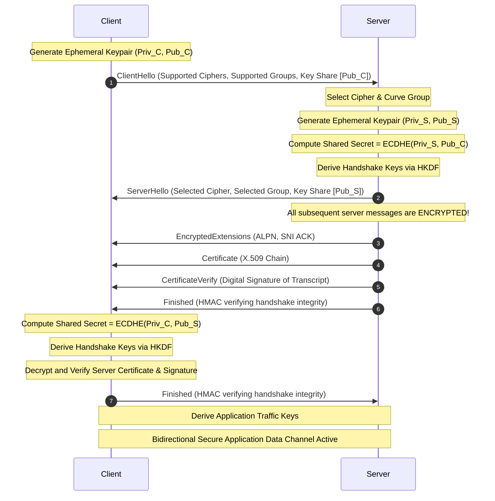

# Deep Dive into TLS 1.3: Cryptographic Handshake, Key Schedule, and HKDF Derivation

> Unpack the low-level wire formats, ephemeral key exchange mechanisms, and cryptographic secret derivation tree that make TLS 1.3 both faster and fundamentally more secure than its predecessors.

---

## What We Are Going to Learn

In this deep-dive guide, we will transition from a basic conceptual understanding of HTTPS to a rigorous, byte-level architectural model of the **Transport Layer Security (TLS) 1.3** protocol. 

Specifically, we will cover:
1. **The Core architectural changes** between TLS 1.2 and TLS 1.3.
2. **The 1-RTT Handshake Protocol** broken down step-by-step with raw packet structure explanations.
3. **The Cryptographic Key Schedule** and how the HMAC-based Extract-and-Expand Key Derivation Function (**HKDF**) acts as the engine of secure traffic generation.
4. **Low-level secure coding patterns** and defensive controls for engineering secure connections, including mitigations for the security risks of **0-RTT Early Data**.

---

## The Problem: The Latency and Cryptographic Bloat of Legacy Protocols

Before TLS 1.3 was ratified as RFC 8446 in August 2018, secure internet communication relied on TLS 1.2 (RFC 5246). While TLS 1.2 was a massive improvement over older SSL protocols, it suffered from two critical architectural flaws that modern engineering could no longer tolerate:

### 1. High Connection Latency (The 2-RTT Tax)
Under TLS 1.2, establishing an encrypted session required a multi-step negotiation before any application data (like an HTTP GET) could be sent. The TCP connection itself required 1 Round-Trip Time (RTT). Then, the TLS 1.2 handshake required **two additional round trips** (2 RTT) to negotiate ciphers, exchange keys, authenticate the server, and verify handshake integrity.

```
Client                                      Server
  |                                           |
  |------------ 1. TCP SYN ------------------>|  ---\
  |<----------- 2. TCP SYN-ACK ---------------|     +-- TCP Handshake (1 RTT)
  |------------ 3. TCP ACK ------------------>|  ---/
  |                                           |
  |------------ 4. ClientHello -------------->|  ---\
  |<----------- 5. ServerHello ---------------|     |
  |             6. Certificate                |     +-- TLS 1.2 Handshake Round 1 (1 RTT)
  |             7. ServerKeyExchange          |     |
  |             8. ServerHelloDone            |  ---/
  |                                           |
  |------------ 9. ClientKeyExchange -------->|  ---\
  |            10. [ChangeCipherSpec]         |     |
  |            11. Finished                   |     +-- TLS 1.2 Handshake Round 2 (2 RTT)
  |<---------- 12. [ChangeCipherSpec] --------|     |
  |            13. Finished                   |  ---/
  |                                           |
  |============ 14. Application Data ========>|  (Actual HTTP/API Request begins)
```

For mobile networks, high-latency cloud architectures, or globally distributed microservices, this "handshake tax" was an severe performance bottleneck.

### 2. An Overwhelming Attack Surface (Cryptographic Bloat)
TLS 1.2 supported dozens of outdated, insecure, and complex cryptographic algorithms. It allowed renegotiation, static RSA key exchange (which lacks forward secrecy), obsolete stream ciphers like RC4, and CBC-mode block ciphers vulnerable to padding oracle attacks (such as POODLE and Lucky Thirteen). 

Additionally, the negotiation was too permissive: clients and servers could negotiate combinations of algorithms that compromised the entire connection's integrity.

---

## Why the Problem Is Hard: Balancing Speed with Ultimate Security

Making the protocol faster by cutting out a round trip (reducing from 2-RTT to 1-RTT) seems straightforward conceptually: **just send the cryptographic key material in the very first message.** 

However, doing this securely introduces complex engineering and cryptographic challenges:
* **How can the client send key material before knowing which cipher suite the server supports?** If the client guesses incorrectly, the handshake fails, causing *more* latency.
* **How do we protect the handshake messages from eavesdropping?** If we reduce handshakes to 1 RTT, more of the negotiation must occur in the clear or be encrypted with keys that are still in the process of being negotiated.
* **How do we preserve Forward Secrecy?** Forward secrecy guarantees that if a server's long-term private key is compromised in the future, past recorded sessions cannot be decrypted. We cannot use static keys for encryption.

---

## A Simple Mental Model: The Pre-Packaged Key Box

To understand how TLS 1.3 solves this, imagine a physical security scenario:

Instead of Alice sending a greeting to Bob, asking Bob what lock types he supports, waiting for Bob to reply, and then sending him a compatible padlock (the TLS 1.2 approach), **Alice sends Bob her greeting along with a pre-packaged box of keys for the locks she thinks Bob is most likely to use.**

```
               Alice                                   Bob
                 |                                      |
                 |--- "Hello! Here are my locks, and ---|
                 |    here is an open padlock using     |
                 |    a standard X25519 key..."         |
                 |                                      |
                 |<-- "Hello! Let's use X25519. --------|
                 |    Here is my half of the lock,      |
                 |    and our secure channel is now     |
                 |    active!"                          |
```

Because modern cryptography has coalesced around a very small number of highly optimized elliptic curve algorithms (like X25519 and P-256), Alice can make an extremely accurate guess. In over 99% of modern connections, this guess is correct, reducing the negotiation to a single round trip.

---

## Under the Hood: The TLS 1.3 1-RTT Handshake Architecture

Let's inspect the actual sequence of messages in a standard TLS 1.3 handshake. 



### Deep-Dive Analysis of the Sequence

#### 1. The ClientHello
The client initiates the handshake by sending a `ClientHello` record. This record must be backward-compatible with TLS 1.2 so that older network equipment does not drop the packets.
* **Legacy Fields:** It contains a legacy protocol version field (`0x0303` representing TLS 1.2) and a dummy session ID.
* **`supported_versions` Extension:** This is where the client actually declares TLS 1.3 support (`0x0304`). A TLS 1.3-compliant server will ignore the legacy version field and look here.
* **`supported_groups` Extension:** Lists the elliptic curve groups the client supports (e.g., `x25519`, `secp256r1`).
* **`key_share` Extension:** This is the magic of TLS 1.3. The client does not wait for the server. It generates an ephemeral (temporary) private/public keypair for its preferred curves and **sends the public key shares directly inside this extension**.

#### 2. The ServerHello & Key Derivation
The server reads the `ClientHello`. It selects a mutually supported cipher suite and elliptic curve group. 
* It generates its own ephemeral keypair.
* It sends back its public key share inside its own `key_share` extension in the `ServerHello`.
* **Instant Cryptographic Calculation:** Because both parties now have each other's public shares, both can immediately calculate the Diffie-Hellman shared secret:
  $$\text{shared\_secret} = \text{ECDHE}(\text{private\_key}, \text{peer\_public\_key})$$
* All subsequent handshake messages sent by the server are **fully encrypted** using keys derived from this shared secret.

#### 3. EncryptedExtensions
The server sends configuration options that do not affect the cryptographic key exchange, such as Application-Layer Protocol Negotiation (ALPN) representing the application protocol (e.g., `h2` or `grpc`). Because it is sent *after* the key share, it is fully encrypted on the wire, hiding client and server configuration details from passive network observers.

#### 4. Certificate & CertificateVerify
* **Certificate:** The server sends its X.509 digital certificate chain to prove its identity.
* **CertificateVerify:** In TLS 1.2, authenticating the server was a source of massive complexity. In TLS 1.3, the server takes a cryptographic hash of the **entire handshake transcript up to this point**, signs this hash using its private key (associated with the certificate), and sends this signature. This mathematically proves that the server owns the certificate and that the handshake has not been tampered with by a man-in-the-middle.

#### 5. Server Finished
The server sends a `Finished` message containing an HMAC (Hash-based Message Authentication Code) calculated over the entire handshake transcript. This locks down the handshake, proving that both parties have an identical view of the negotiation.

#### 6. Client Finished
The client decrypts and verifies the server's certificate, verifies the transcript signature (`CertificateVerify`), and validates the server's `Finished` message. It then sends its own `Finished` message to finalize the bidirectional cryptographic lock.

---

## The Cryptographic Engine: The TLS 1.3 Key Schedule (HKDF)

In TLS 1.3, secrets are not derived via ad-hoc hashing. Instead, the protocol enforces a strict, hierarchical key schedule built entirely on the **HMAC-based Extract-and-Expand Key Derivation Function (HKDF)** defined in **RFC 5869**.

### The Math Behind HKDF
HKDF operates in two distinct phases:

1. **Extract**: Extracts a pseudorandom key (`PRK`) of fixed length from an input key source (which might have low entropy, like a Diffie-Hellman shared secret) using a salt.
   $$\text{PRK} = \text{HMAC-Hash}(\text{salt}, \text{InputKeyMaterial})$$

2. **Expand**: Expands the pseudorandom key `PRK` into an arbitrary number of high-entropy cryptographically strong output keys (`OKM`) using an informational string and counter.
   $$\text{T}(0) = \text{empty string}$$
   $$\text{T}(1) = \text{HMAC-Hash}(\text{PRK}, \text{T}(0) \mathbin{\Vert} \text{info} \mathbin{\Vert} \text{0x01})$$
   $$\text{T}(2) = \text{HMAC-Hash}(\text{PRK}, \text{T}(1) \mathbin{\Vert} \text{info} \mathbin{\Vert} \text{0x02})$$
   $$\text{OKM} = \text{T}(1) \mathbin{\Vert} \text{T}(2) \mathbin{\Vert} \dots$$

### The Secret Derivation Tree
The TLS 1.3 key schedule steps through multiple "secrets" corresponding to different phases of the connection:

```
                  PSKs (Pre-Shared Keys)
                    |
                    v
             [ HKDF-Extract ] <--- Salt = 0
                    |
                    v
               Early Secret (Used for 0-RTT Early Data)
                    |
                    +------> Derive Client Early Traffic Secret
                    |
                    v (Derive Handshake Secret)
             [ HKDF-Extract ] <--- Input = Ephemeral DH Shared Secret (ECDHE)
                    |
                    v
              Handshake Secret
                    |
                    +------> Derive Client Handshake Traffic Secret
                    +------> Derive Server Handshake Traffic Secret
                    |
                    v (Derive Master Secret)
             [ HKDF-Extract ] <--- Salt = 0, Input = 0
                    |
                    v
               Master Secret
                    |
                    +------> Derive Client Application Traffic Secret
                    +------> Derive Server Application Traffic Secret
                    +------> Derive Resumption Master Secret
```

### Step-by-Step Derivation Breakdown

1. **Early Secret**: Initialized from a Pre-Shared Key (PSK) if using session resumption. If doing a cold handshake, it is initialized to a string of zeros.
2. **Handshake Secret**: This is the first secret generated with the actual dynamic key exchange. It takes the `Early Secret` as a salt and the ephemeral Diffie-Hellman shared secret (`ECDHE`) as the input key material.
3. **Handshake Traffic Keys**: From the `Handshake Secret`, the system derives the keys used to encrypt the rest of the handshake (the certificate, verification, and finished messages).
4. **Master Secret**: Once the handshake completes, the `Handshake Secret` is combined with zero-filled inputs to extract the `Master Secret`.
5. **Application Traffic Secrets**: From the `Master Secret`, the protocol derives the actual keys used to encrypt user data: `client_application_traffic_secret` and `server_application_traffic_secret`.

---

## Wire Format: Structuring TLS 1.3 Records

To understand how this operates at the software level, let's examine the C-style representation of the TLS Record Layer.

```cpp
#include <stdint.h>

// TLS Content Types (RFC 8446 Section 5.1)
typedef enum {
    INVALID            = 0,
    CHANGE_CIPHER_SPEC = 20,
    ALERT              = 21,
    HANDSHAKE          = 22,
    APPLICATION_DATA   = 23,
    HEARTBEAT          = 24
} ContentType;

// Raw wire format of a TLS Plaintext record (unencrypted/pre-handshake)
typedef struct {
    uint8_t  type;             // Maps to ContentType
    uint16_t legacy_version;   // Always 0x0303 (for TLS 1.2 backward compatibility)
    uint16_t length;           // Length of the fragment in bytes
    uint8_t  fragment[16384];  // The raw payload
} TLSPlaintext;

// Raw wire format of an Encrypted TLS record (Ciphertext)
typedef struct {
    uint8_t  type;             // Always set to APPLICATION_DATA (23) to hide actual type
    uint16_t legacy_version;   // Always 0x0303
    uint16_t length;           // Length of encrypted payload + MAC tag + padding
    uint8_t  encrypted_record[16384 + 256];
} TLSCiphertext;
```

### The Obfuscation Trick of TLS 1.3
Notice that in `TLSCiphertext`, the `type` field is **always** set to `23` (`APPLICATION_DATA`). 
An attacker monitoring the network cannot tell if a packet is a handshake message, an alert, or actual web data. The real content type is appended to the plaintext payload *before* encryption, and is only revealed after decryption.

---

## Code Example: Ephemeral Key Exchange & Shared Secret Derivation

Below is a complete, runnable C implementation using modern **OpenSSL 3.x APIs** demonstrating how a client and server generate ephemeral X25519 key shares and calculate their mutual cryptographic shared secret.

```c
#include <stdio.h>
#include <stdlib.h>
#include <string.h>
#include <openssl/evp.h>
#include <openssl/pem.h>
#include <openssl/err.h>

// Helper to print hex buffers
void print_hex(const char *label, const unsigned char *buf, size_t len) {
    printf("%s: ", label);
    for (size_t i = 0; i < len; i++) {
        printf("%02X", buf[i]);
    }
    printf("\n");
}

// Generates an ephemeral EVP_PKEY using OpenSSL 3.x
EVP_PKEY* generate_x25519_key() {
    EVP_PKEY_CTX *pctx = EVP_PKEY_CTX_new_id(EVP_PKEY_X25519, NULL);
    if (!pctx) return NULL;

    EVP_PKEY *key = NULL;
    if (EVP_PKEY_keygen_init(pctx) <= 0 || EVP_PKEY_keygen(pctx, &key) <= 0) {
        EVP_PKEY_CTX_free(pctx);
        return NULL;
    }

    EVP_PKEY_CTX_free(pctx);
    return key;
}

// Computes the shared secret using Elliptic Curve Diffie-Hellman (ECDH)
unsigned char* compute_shared_secret(EVP_PKEY *my_private_key, EVP_PKEY *peer_public_key, size_t *out_len) {
    EVP_PKEY_CTX *ctx = EVP_PKEY_CTX_new(my_private_key, NULL);
    if (!ctx) return NULL;

    if (EVP_PKEY_derive_init(ctx) <= 0 || EVP_PKEY_derive_set_peer(ctx, peer_public_key) <= 0) {
        EVP_PKEY_CTX_free(ctx);
        return NULL;
    }

    // Determine the buffer length needed
    if (EVP_PKEY_derive(ctx, NULL, out_len) <= 0) {
        EVP_PKEY_CTX_free(ctx);
        return NULL;
    }

    unsigned char *secret = malloc(*out_len);
    if (!secret) {
        EVP_PKEY_CTX_free(ctx);
        return NULL;
    }

    if (EVP_PKEY_derive(ctx, secret, out_len) <= 0) {
        free(secret);
        EVP_PKEY_CTX_free(ctx);
        return NULL;
    }

    EVP_PKEY_CTX_free(ctx);
    return secret;
}

int main() {
    printf("[*] Starting TLS 1.3 Ephemeral Key Exchange Simulation...\n");

    // 1. Client generates ephemeral X25519 key pair
    EVP_PKEY *client_key = generate_x25519_key();
    
    // 2. Server generates ephemeral X25519 key pair
    EVP_PKEY *server_key = generate_x25519_key();

    if (!client_key || !server_key) {
        fprintf(stderr, "[!] Error generating keys\n");
        return 1;
    }

    // Extract raw public keys to show "wire representation"
    size_t client_pub_len = 0, server_pub_len = 0;
    EVP_PKEY_get_octet_string_param(client_key, "pub", NULL, 0, &client_pub_len);
    EVP_PKEY_get_octet_string_param(server_key, "pub", NULL, 0, &server_pub_len);

    unsigned char *client_pub = malloc(client_pub_len);
    unsigned char *server_pub = malloc(server_pub_len);

    EVP_PKEY_get_octet_string_param(client_key, "pub", client_pub, client_pub_len, &client_pub_len);
    EVP_PKEY_get_octet_string_param(server_key, "pub", server_pub, server_pub_len, &server_pub_len);

    print_hex("[Wire] Client Public Key Share Sent in ClientHello", client_pub, client_pub_len);
    print_hex("[Wire] Server Public Key Share Sent in ServerHello", server_pub, server_pub_len);

    // 3. Client computes shared secret using Server's public key
    size_t client_secret_len = 0;
    unsigned char *client_shared_secret = compute_shared_secret(client_key, server_key, &client_secret_len);

    // 4. Server computes shared secret using Client's public key
    size_t server_secret_len = 0;
    unsigned char *server_shared_secret = compute_shared_secret(server_key, client_key, &server_secret_len);

    printf("\n--- Cryptographic Verification ---\n");
    print_hex("[Client Computed] Shared Secret", client_shared_secret, client_secret_len);
    print_hex("[Server Computed] Shared Secret", server_shared_secret, server_secret_len);

    // Ensure they match
    if (client_secret_len == server_secret_len && 
        memcmp(client_shared_secret, server_shared_secret, client_secret_len) == 0) {
        printf("[✓] Success! Both parties derived an identical shared secret.\n");
    } else {
        printf("[X] Error! Shared secrets do not match.\n");
    }

    // Cleanup
    free(client_pub);
    free(server_pub);
    free(client_shared_secret);
    free(server_shared_secret);
    EVP_PKEY_free(client_key);
    EVP_PKEY_free(server_key);

    return 0;
}
```

### Compiling and Running this Code
Save this code to `ecdh_simulation.c` and compile it against OpenSSL 3.x using GCC:
```bash
gcc -o ecdh_simulation ecdh_simulation.c -lcrypto
./ecdh_simulation
```

---

## Security Analysis: The 0-RTT Replay Attack Vulnerability

TLS 1.3 supports a feature called **0-RTT Early Data**. 

If a client has previously connected to a server, they can store a "Session Ticket" containing a Pre-Shared Key (PSK). On a subsequent connection, the client can send encrypted application data (like an HTTP request) in their very first packet alongside the `ClientHello`, reducing connection latency to **zero additional round trips**.

```
Client                                      Server
  |                                           |
  |-- ClientHello + EarlyData (HTTP POST) --->|  (Sent instantly!)
  |                                           |
```

### The Attack Flow (Replay Attack)
Because 0-RTT data is sent before the Server has responded with its own ephemeral random share, **0-RTT data lacks replay protection**. 

An attacker positioned on the network can record the raw TCP packet containing the client's `ClientHello` and the 0-RTT early data payload, and replay it to the server multiple times.

```
Attacker                                    Server
  |                                           |
  |--- Replayed ClientHello + HTTP POST ----->|  (Processed by server again!)
  |--- Replayed ClientHello + HTTP POST ----->|  (Processed third time!)
```

If the request is non-idempotent (e.g., `POST /api/v1/transfer-funds` or `POST /api/v1/purchase-item`), the server could execute the transaction multiple times, leading to financial loss or database corruption.

### Defense-in-Depth Mitigations
1. **Never allow non-idempotent HTTP methods in 0-RTT:** Implement strict rules at your API Gateway or TLS terminator (such as NGINX or Envoy) to **reject 0-RTT early data** for `POST`, `PUT`, `DELETE`, and `PATCH` requests. Only allow safe, idempotent methods like `GET` with no side-effects.
2. **Use Single-Use Session Tickets:** Enable TLS ticket tracking on your servers. Once a session ticket is used for 0-RTT, it must be instantly invalidated and blacklisted to prevent replay.

---

## Common Misconceptions

### Misconception 1: "TLS 1.3 is less secure because it allows 0-RTT"
**Reality:** 0-RTT is entirely optional. It must be explicitly configured by both client and server. If configured incorrectly, it can introduce replay vulnerabilities, but the core 1-RTT handshake remains bulletproof.

### Misconception 2: "Diffie-Hellman is insecure against Quantum Computers, so TLS 1.3 is already obsolete"
**Reality:** While standard elliptic curve DH (X25519) is vulnerable to future quantum computers running Shor's algorithm, TLS 1.3's architecture was designed with modular extensions. Modern systems are already beginning to deploy **Hybrid Post-Quantum Cryptography** (like ML-KEM combined with X25519) within the standard TLS 1.3 extension headers without modifying the base protocol.

---

## Expert Insight: SNI Encryption and the Fight Against Censorship

In TLS 1.3, the server's certificate is encrypted. However, there is still one piece of plaintext identity leaked in the very first `ClientHello` packet: the **Server Name Indication (SNI)**. 

The SNI extension contains the hostname of the server the client wants to connect to (e.g., `Host: secure.bank.com`). Because this is sent *before* encryption keys are established, passive eavesdroppers, ISPs, or censors can read the domain name and block the connection.

To solve this, advanced security teams are driving the adoption of **Encrypted Client Hello (ECH)** (formerly known as ESNI). 

Under ECH, the client retrieves the server's public key from a trusted DNS record (secured by DNS-over-HTTPS) and uses it to **encrypt the entire ClientHello payload**, leaving only a non-sensitive "outer" dummy hostname visible to passive observers. This closes the last major plaintext privacy hole in the TLS architecture.

---

## Pause and Think

> **Critical Question:** Why must the server sign the handshake transcript in `CertificateVerify` using its private key instead of simply encrypting a random number to prove its identity?

### Answer
If the server merely decrypted or encrypted a random number sent by the client, it would be vulnerable to a **man-in-the-middle replay attack**. 

An attacker could forward the server's cryptographic response to a different client. By signing the **entire accumulated transcript** of the current handshake (including the client's unique random bytes, the selected ciphers, and the server's unique random bytes), the server mathematically links its signature to this *one specific connection instance*, preventing anyone from intercepting and replaying the authentication in a different session.

---

## Key Takeaways

* **TLS 1.3 reduces handshake latency to 1 RTT** by sending elliptic curve key shares (`key_share` extension) directly inside the `ClientHello`.
* **Static RSA key exchange is removed**, making Forward Secrecy mandatory for all connections.
* **HKDF (HMAC-Based Key Derivation)** is the cryptographic engine of the protocol, structuring secret derivation into discrete Early, Handshake, and Master phases.
* **0-RTT Early Data** allows instant data transmission but **is vulnerable to replay attacks** and must be restricted to idempotent, read-only requests.

---

## What to Learn Next

To deepen your security and networking engineering expertise, explore:
* **The TLS 1.3 PSK (Pre-Shared Key) session resumption mechanism.**
* **Configuring and securing NGINX or Envoy for secure TLS termination.**
* **The mechanics of X.509 Certificate Revocation Lists (CRL) and Online Certificate Status Protocol (OCSP) stapling.**
