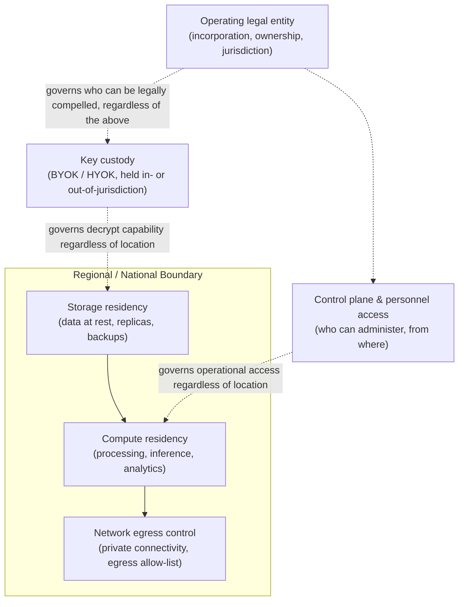

# Data Sovereignty and Geopatriation: Engineering for Regional Data Boundaries

> By the end of this article you'll understand why "our data center is in Germany" is not the same claim as "our data is sovereign to Germany," what specific architectural layers you have to control to close that gap, and why the newest wave of this problem — geopatriation — is really asking you to engineer compute and administrative access back within a border, not just bytes at rest.

## The Problem

A SaaS company stores its European customers' data in a data center physically located in Frankfurt. Encrypted at rest, encrypted in transit, backed by a well-known hyperscaler's EU region. Ask their compliance team "is this data sovereign to the EU?" and you'll often get a confident "yes" — followed, if you push, by an uncomfortable pause.

Here's the question that produces the pause: **who can be legally compelled to hand that data over, and under whose law?**

If the company operating that Frankfurt data center is a subsidiary of a US corporation, US law — specifically the CLOUD Act — can reach data under that company's "possession, custody, or control" regardless of which country the servers physically sit in. A German court order protects the data from some threats. It does nothing about a US legal process served on the US parent, because the parent can be compelled to produce data its foreign subsidiary controls, wherever that subsidiary chose to rack its servers.

This is not a hypothetical edge case dreamed up by compliance lawyers. It's the exact reasoning that led the EU's top court to strike down the EU-US Privacy Shield framework in 2020, on the grounds that US surveillance law gave US authorities reach into EU personal data that EU law couldn't meaningfully constrain — even when that data was processed by a company with EU operations.

> **Verification Note**
> The specific legal mechanics here (the CLOUD Act's exact reach, the current status of EU-US data transfer frameworks post-Privacy Shield, and any successor framework's legal standing) are genuinely time-sensitive and actively litigated. Treat the *shape* of the problem described here — jurisdiction over the operating entity can reach data regardless of physical location — as the stable engineering lesson, and verify the current legal specifics against current regulatory guidance before using them in a compliance decision.

Data residency — "where are the bytes physically located" — turns out to be necessary but nowhere near sufficient. Data sovereignty is a bigger, harder problem: *whose law governs this data, and who can actually be forced to act on it, regardless of where it sits?*

And a further complication has emerged more recently, with its own name: **geopatriation** — the trend, among both governments and large enterprises, of deliberately bringing data *and the compute that processes it* back within national or regional boundaries, along with the operational control over who can access it. Geopatriation is a reaction to exactly this gap: residency controls alone kept proving insufficient once organizations realized that a foreign-controlled operator, foreign-held encryption keys, or a foreign support team with break-glass access could still put supposedly "sovereign" data within reach of a foreign legal order, a foreign sanctions regime, or a foreign intelligence service.

## Why This Problem Is Hard

The hard part isn't storing data in the right country. Cloud providers solved "pick a region" a long time ago. The hard part is that **sovereignty is a property of an entire chain of custody, and every link in that chain can quietly reintroduce foreign jurisdiction** even when the storage layer looks perfectly compliant:

```
┌───────────────────────────────────────────────────────────┐
│  Where is the data physically stored?        (residency)  │  ← easy to control
├───────────────────────────────────────────────────────────┤
│  Where does the data get processed/computed? (compute)     │  ← often overlooked
├───────────────────────────────────────────────────────────┤
│  Who holds the encryption keys, and where?    (key custody) │  ← easy to overlook
├───────────────────────────────────────────────────────────┤
│  Who can administer/access it operationally?  (control plane)│ ← hardest to control
├───────────────────────────────────────────────────────────┤
│  What legal entity operates the infrastructure, and under   │
│  whose jurisdiction is that entity incorporated?  (legal)   │  ← the layer residency
└───────────────────────────────────────────────────────────┘    controls don't touch
```

Every layer below the top one can undo the guarantee the top layer appears to provide. Realistic ways this actually breaks in production:

- Storage is pinned to an EU region, but the application's crash-reporting and telemetry pipeline ships logs — sometimes containing fragments of user data — to a global observability backend hosted outside the region.
- The database lives in-region, but a global support rotation means an engineer in another country routinely has break-glass administrative access to production, including the ability to query customer data during an incident.
- Data at rest is encrypted, but the encryption keys are managed by the cloud provider's global KMS, and the provider — as a company — is subject to a legal order in its home jurisdiction requiring it to assist in decrypting data it holds the keys for, regardless of where the ciphertext sits.
- Inference for an AI feature is architected to call a foundation model API, and that API endpoint — even though the web app is deployed regionally — happens to route requests to a foreign-hosted model, sending regional user data across the border on every single inference call.

None of these are storage-layer failures. They're control-plane, key-custody, and processing-layer failures wearing a storage-layer disguise. This is exactly why "we deployed to the EU region" is such a common, and commonly wrong, answer to "is this sovereign?"

## A Simple Mental Model

Think about a foreign embassy. It sits on the physical soil of the host country — you can walk up to the gate, the building has a street address in that country, local utilities run to it. And yet the embassy operates under the sending country's jurisdiction, not the host country's: host-country police generally can't enter without permission, and the staff largely answer to their home government's law, not the ground they're standing on.

Data sovereignty works in the mirror-image direction of that analogy: an organization wants the opposite of an embassy. It wants its data's *physical* location and its *legal and operational* control to be the *same* jurisdiction — no foreign "embassy" of control sitting inside its regional boundary. A data center that's physically in-region but operationally controlled by a foreign entity's staff, keys, and legal obligations is exactly an embassy: geography says one thing, jurisdiction says another.

**Where the analogy breaks down:** an embassy's jurisdictional split is a deliberate, negotiated, visible legal arrangement (a treaty) that both governments know about and account for. The jurisdictional split created by a foreign-operated data center is usually *invisible* until a legal order, an audit, or an incident forces someone to trace the actual chain of custody — which is precisely why so many organizations discover their sovereignty gap only when it's tested for the first time, under pressure, in production.

## Before We Continue

This article assumes familiarity with:

- **Confidential computing and TEEs at a conceptual level** — the idea that hardware can isolate data from even a privileged operator. Sovereignty engineering leans heavily on this same trust-minimization idea, applied to a jurisdictional boundary instead of a hypervisor boundary.
- **Envelope encryption and key management** (KEKs, DEKs, KMS) — sovereignty controls frequently come down to *who holds the key*, so you should already be comfortable with the idea that "encrypted" and "inaccessible to the key holder's jurisdiction" are different claims.
- **Basic multi-region cloud architecture** — regions, availability zones, IAM/organization policies that can restrict where resources are created, and how replication typically works across regions.
- **A general sense of what GDPR-style regulation requires** — you don't need to be a lawyer, but you should know that regulations like the EU's GDPR impose real, binding constraints on cross-border transfer of personal data, and that "we encrypted it" is not, by itself, a sufficient legal answer to those constraints.

If any of this is shaky, the high-level flow will still make sense, but "How It Actually Works" will move quickly through material that assumes it.

## The Core Idea

It helps to pull apart three terms that get used almost interchangeably in casual conversation, but mean genuinely different things to an architect:

| Term | What it actually means | The question it answers |
|---|---|---|
| **Data residency** | The physical/geographic location where data is stored (and, more subtly, processed) | *Where are the bytes?* |
| **Data localization** | A legal *requirement*, usually statutory, that certain categories of data must be stored (and sometimes processed) within a specific country's borders | *What does the law mandate about where the bytes must be?* |
| **Data sovereignty** | Which jurisdiction's laws actually govern the data, and who can be legally compelled to act on it — a function of the operating entity's jurisdiction, key custody, and control-plane access, not just physical location | *Whose law actually reaches this data, and through what chain of custody?* |

**Data residency is a technical fact. Data localization is a legal obligation. Data sovereignty is the actual security and legal property everyone is really trying to achieve — and it's the hardest of the three, because it depends on facts about corporate structure, key custody, and personnel access that live outside the infrastructure diagram entirely.**

**Geopatriation** is the newest layer on top of all three: it's the deliberate, often government-driven or government-incentivized movement of data *and the compute infrastructure that processes it* — plus, where possible, the corporate and operational control over that infrastructure — back within a nation's or region's boundaries. It's broader than data localization law compliance; it's a strategic posture, driven by concerns that go beyond privacy regulation into geopolitical risk: sanctions exposure, foreign intelligence access, supply-chain dependency on infrastructure a hostile foreign government could compel or coerce, and simple national-industrial-policy interest in not having critical data and AI compute permanently dependent on foreign-controlled hyperscalers.

You can see geopatriation happening as concrete engineering programs, not just policy speeches: sovereign cloud offerings built by (or in partnership with) hyperscalers specifically to keep the *operating entity, staff, and support organization* local, not just the data center; national and EU-level pushes (commonly discussed under initiatives like Gaia-X in Europe) toward federated, locally-governed cloud infrastructure; and enterprise architecture teams re-evaluating whether AI inference for regulated workloads should call a foreign-hosted foundation model API at all, versus hosting an equivalent model within the region.

> **Verification Note**
> Specific sovereign cloud product names, their current certification status (for example regional security qualifications), and specific government initiatives are evolving quickly and vary by provider and by region. Treat named offerings in this article as illustrative examples of a pattern, not as a current, exhaustive, or unchanging market survey — verify current product scope against the vendor's own documentation before relying on it in a design.

## How It Actually Works

Real sovereignty engineering means separately controlling each layer that can reintroduce foreign jurisdiction. Here's what each layer actually requires in practice.

### Layer 1: Storage residency

The easiest layer, and the one most teams solve first. In practice this means:

- Cloud **organization policies** (or the provider's equivalent) that hard-block resource creation outside approved regions — not just a default region setting a developer can override, but a policy enforced at the account/organization level.
- **Replication constraints** — many databases and object stores replicate for durability or read performance by default across regions; sovereignty requires explicitly constraining replica placement to in-region (or in-bloc) locations only, and auditing that this constraint actually holds after every schema/infrastructure change.
- **Backup and disaster-recovery location** — this is where residency controls quietly get undone. A perfectly region-locked primary database with backups replicated to a different country for DR purposes has just moved the sovereignty boundary to wherever the backups live.

### Layer 2: Compute / processing residency

Storing data in-region doesn't guarantee it's *processed* in-region. A request can legitimately read from an in-region database and still ship the payload to an out-of-region service for processing — an analytics pipeline, a fraud-scoring model, a general-purpose LLM API — and that hop is invisible unless someone explicitly audits data flow, not just data storage.

This is the layer where AI workloads most commonly create an accidental sovereignty leak: a regionally-deployed application calling a foundation model's API sends the *user's actual input* — which may contain regulated personal data — to wherever that model is hosted, on every single inference call. If that endpoint is outside the required boundary, you have a live, repeated, per-request cross-border transfer, not a one-time storage decision. Closing this gap generally means one of: hosting an equivalent model in-region, using a provider's region-pinned inference offering, or architecting a data-minimization layer that strips regulated fields before any cross-border call — each with real trade-offs in model quality, latency, and engineering cost.

### Layer 3: Key custody

This is the layer where encryption and sovereignty either reinforce each other or quietly diverge. Recall from envelope encryption: data is encrypted with a data encryption key (DEK), and the DEK is itself wrapped by a key-encryption key (KEK) held in a KMS. **The jurisdiction that controls the KEK effectively controls the data, no matter where the ciphertext sits** — because a legal order compelling the KEK holder to decrypt (or to hand over the key) makes location of the ciphertext irrelevant.

Two patterns address this directly:

- **BYOK (Bring Your Own Key)** — the customer generates and controls the KEK, typically in their own HSM or a KMS instance they administer, while the cloud provider's KMS wraps around it. This raises the bar, but if the provider's KMS infrastructure can still technically access the key material during normal operation, the provider (and its jurisdiction) is still in the trust chain.
- **HYOK (Hold Your Own Key)** — a stronger variant where the key material never leaves infrastructure the customer (or an in-jurisdiction, independently-audited third party) fully controls, and the cloud provider's systems call out to that external key store for every cryptographic operation rather than ever holding the key themselves. This is a much stronger sovereignty claim, at the cost of an availability dependency: if the external key store is unreachable, the provider genuinely cannot decrypt the data — which is the entire point, but is also an operational risk that has to be engineered for deliberately.

### Layer 4: Control-plane and personnel access

This is consistently the hardest layer to close, and the one most "sovereign cloud" marketing quietly underdelivers on. Even with data and keys fully in-region, a global support organization with standing (or break-glass) administrative access to the underlying platform is a control-plane sovereignty gap: an engineer sitting in a different country, employed by a foreign-jurisdiction entity, can still touch the system.

Mature sovereign-cloud designs address this with **in-country personnel restrictions** (only staff who are nationals of, or resident in, the relevant jurisdiction may hold operational access), **access transparency logging** (every administrative access to customer systems is logged and, ideally, exposed to the customer), and — combined with confidential computing — technical enforcement that makes even *authorized* administrative access unable to read plaintext customer data, closing the gap between "we have a policy against looking" and "we are technically unable to look."

### Layer 5: Network egress

Even with every layer above correctly scoped, data can still leak across the boundary in transit if network paths aren't deliberately constrained: DNS resolution routing through a foreign resolver, a third-party SaaS dependency (email delivery, payment processing, customer support tooling) that itself operates outside the region, or a service mesh sidecar with a default-allow egress policy that lets a compromised or misconfigured service call out to any destination. Explicit egress allow-listing, region-scoped private connectivity (so traffic to a cloud provider's own services never transits the public internet or a foreign point of presence), and network policies enforced at the mesh/firewall layer are what make this layer auditable rather than assumed.

### Layer 6: Legal entity structure

Underneath all the technical layers sits the question the CLOUD Act example opened with: **which legal entity operates this infrastructure, and under whose jurisdiction is that entity incorporated?** A wholly-owned foreign subsidiary operating fully in-region infrastructure can still be legally compelled by its parent's home jurisdiction to produce data it "controls," even if it never physically touches it. Real sovereignty architectures — the kind governments actually accept for their most sensitive workloads — often require a genuinely independent local legal entity, sometimes structured as a joint venture with no single foreign parent holding unilateral control, specifically to break this chain.

### Putting the layers together



Notice the dotted lines: key custody, control-plane access, and legal entity structure all reach *across* the physical boundary rather than living inside it. A sovereignty architecture that only draws the solid box — storage, compute, and network, all neatly inside the regional boundary — while leaving the dotted-line layers uncontrolled has built a residency solution and called it a sovereignty solution.

## Let's Walk Through an Example

A healthcare SaaS platform serves hospitals across the EU. Its original architecture: single global region (US), single global KMS, single global support team, a general-purpose LLM API used for a clinical-notes summarization feature.

**The trigger:** a customer hospital's procurement team, following updated national guidance after a wave of sovereignty-focused regulation, asks a very specific question: "If a US court orders your company to produce this data, can you comply, and would you even be able to tell us?" The honest answer, under the original architecture, is yes and no, respectively.

**The redesign, layer by layer:**

1. **Storage residency** — an EU region is provisioned, and an organization policy blocks any resource creation outside it. Backups are constrained to EU regions only.
2. **Compute residency** — the summarization feature is re-architected to call an EU-hosted equivalent model rather than the original global endpoint, closing the per-request cross-border leak that nobody had previously audited for.
3. **Key custody** — the platform moves to an HYOK arrangement, with keys held in an HSM operated by an independent EU entity; the platform's own KMS calls out to it for every decrypt operation and cannot function without that external dependency being reachable.
4. **Control plane** — administrative access to the EU deployment is restricted to EU-resident staff, with every access logged and made available to customers as an access-transparency report.
5. **Network egress** — an explicit egress allow-list replaces the previous default-allow policy; third-party dependencies (email, support tooling) are swapped for EU-based equivalents where the previous vendor had no EU-only option.
6. **Legal entity** — the EU deployment is operated by an independently-incorporated EU subsidiary with its own data processing agreements, rather than being a technical deployment target owned entirely by the US parent.

Notice what didn't change: the application code, the database engine, the general architecture pattern. What changed was *who controls each layer of the chain of custody*, which is exactly the point — sovereignty engineering is much more about ownership, access, and legal structure than about rewriting application logic.

## What Can Go Wrong?

**"Sovereign cloud" can mean "regional data center" and nothing more.** The single most common failure is stopping at Layer 1 (storage residency) and describing the result as "sovereign," when key custody, control-plane access, and the operating entity's jurisdiction were never touched. This isn't necessarily dishonest marketing — it's often a genuine, incremental first step — but treating it as a complete sovereignty solution is the mistake, not the incremental step itself.

**Metadata and telemetry are the classic blind spot.** Logging, crash reporting, usage analytics, and support-ticket systems routinely ship fragments of regulated data to global, non-regional backends, even in architectures where the primary data store is correctly region-locked. An audit that only checks the primary database's region setting will miss this entirely.

**Backups quietly move the boundary.** A region-locked primary with a cross-region (or cross-continent) disaster-recovery backup has, for exactly the data in that backup, moved the sovereignty boundary to wherever the backup lives — often invisibly, since backup configuration is rarely reviewed with the same scrutiny as primary data placement.

**AI inference is a repeated, per-request leak, not a one-time transfer.** Unlike a batch export, a foundation-model API call made on every user interaction is a continuous, ongoing cross-border data flow. Teams that correctly locked down storage residency have shipped AI features that silently reopened the exact problem they'd just closed, because the inference call wasn't reviewed as a data-transfer decision.

**HYOK availability is a real operational trade-off, not a free security upgrade.** If the external key store genuinely cannot be reached, decryption genuinely cannot happen — which is the security property you wanted, but also means an outage in the independent key-custody infrastructure becomes an outage in your primary system. This has to be engineered and tested deliberately, not discovered during an incident.

**Sovereignty can conflict with resilience.** Multi-region replication and geographically distributed disaster recovery are standard reliability practices — and they are in direct tension with a strict "never leave this border" requirement. A design that satisfies sovereignty by refusing all cross-border replication has, in exchange, accepted a single-region blast radius for availability. This is a real trade-off to make explicitly, not an oversight to discover during a regional outage.

**Cryptographic sovereignty is its own sub-requirement in some jurisdictions.** Some national regulatory regimes mandate the use of locally-approved or nationally-developed cryptographic algorithms for certain categories of data or systems, independent of where the data is stored. A design that's fully residency- and key-custody-compliant can still fail a cryptographic sovereignty requirement if it relies exclusively on globally standard algorithms where a local mandate exists.

> **Verification Note**
> Which jurisdictions currently mandate specific national cryptographic algorithms, for which data categories, and under which regulatory regime, changes over time and is highly jurisdiction-specific. Verify current requirements against the relevant national regulator's own published standards before treating any specific algorithm mandate as settled fact.

## Security Considerations

| | |
|---|---|
| **Asset** | Regulated/sensitive data, and the organization's legal and regulatory standing that depends on provable sovereignty |
| **Threat** | Foreign legal compulsion (subpoenas, national security orders), foreign intelligence access, sanctions/geopolitical disruption, insider access by out-of-jurisdiction personnel |
| **Attack / Exposure path** | Cross-border replication, foreign-held key custody, foreign-jurisdiction support/control-plane access, uncontrolled network egress, per-request AI inference calls to foreign-hosted models |
| **Vulnerability (without sovereignty engineering)** | Physical residency is controlled, but key custody, control-plane access, and the operating legal entity remain reachable by a foreign jurisdiction |
| **Mitigation** | Layered control: storage + compute residency, HYOK/BYOK key custody, in-jurisdiction control-plane restrictions with access-transparency logging, explicit network egress control, independent local legal entity |
| **Residual risk** | Backup/DR replication trade-offs, metadata/telemetry leakage, third-party SaaS dependencies without regional equivalents, availability risk from external key custody, evolving and sometimes conflicting national requirements |

## Common Misconceptions

**Misconception:** "If the data center is in our country, our data is sovereign."
**Reality:** Physical location is one layer of six. Key custody, control-plane access, network egress, and the operating entity's legal jurisdiction can each independently reintroduce foreign reach, regardless of where the servers sit.

**Misconception:** "Encryption solves sovereignty."
**Reality:** Encryption only helps if the party who can be legally compelled to decrypt is outside the jurisdiction you're trying to exclude. If the key custodian is a foreign entity, a foreign legal order can reach the plaintext through the key, not through the ciphertext's location.

**Misconception:** "Geopatriation is just a stricter version of data localization law compliance."
**Reality:** Data localization is a legal minimum defined by statute. Geopatriation is a broader strategic posture — often exceeding legal minimums — driven by geopolitical risk tolerance, national industrial policy, and a desire to reduce dependency on foreign-controlled infrastructure entirely, not just to satisfy a specific regulation.

**Misconception:** "A sovereign cloud SKU from a major provider automatically closes every layer."
**Reality:** It depends entirely on which layers that specific offering actually addresses — some cover storage and network residency well but leave control-plane access or ultimate corporate ownership structured the same as the provider's standard offering. Read the specific offering's scope; don't assume the word "sovereign" in a product name implies every layer discussed here.

## Real-World Architecture

The pattern repeating across large regulated organizations and government-adjacent programs looks like this: a **regional or sovereign cloud tier**, operated by an independently structured or independently audited local entity, combined with **customer- or third-party-held encryption keys** (BYOK at minimum, HYOK for the highest assurance bar), **confidential computing** to make even authorized infrastructure operators technically unable to read plaintext data, and **explicit network and control-plane restrictions** enforced through policy and audited through access-transparency reporting.

Federated sovereignty frameworks — discussed in Europe under initiatives commonly referred to as Gaia-X — take this further by proposing interoperable standards so that sovereignty guarantees aren't locked to a single vendor's proprietary offering, letting organizations move workloads between compliant providers without re-engineering the sovereignty controls from scratch. Major hyperscalers have, in parallel, built dedicated sovereign-cloud product lines specifically targeting government and regulated-industry customers who need these guarantees contractually and technically, not just as a marketing claim.

The AI angle is the newest and fastest-moving front: as more products route user data through foundation-model inference calls, "where does the model actually run" has become as important a sovereignty question as "where is the database." This is pushing both regional hosting of foundation models and — tying directly back to confidential computing — demand for GPU-level attestation, so an organization can verify not just *where* an inference call was processed, but *whether the infrastructure processing it can prove, cryptographically, that it wasn't tampered with and isn't readable by an unauthorized operator*.

> **Verification Note**
> Specific sovereign cloud products, their exact scope of guarantee, current certifications, and specific national/regional programs (Gaia-X and similar initiatives included) change frequently and vary by provider, region, and time. Verify current specifics against the relevant provider's or program's own current documentation before citing a named offering's guarantees as fact.

## Expert Insight

**Sovereignty is an organizational engineering problem before it's a technical one.** The technical controls in this article — key custody, network egress, confidential computing — are the easy 20%. The hard 80% is process: proving, continuously, that the storage region hasn't drifted, that a new third-party dependency wasn't onboarded without regional review, that a support engineer's access didn't quietly bypass the restriction. Sovereignty that isn't continuously audited degrades silently, the same way any unenforced architectural constraint does.

**There's a real "sovereignty tax," and it should be named explicitly rather than absorbed silently.** Regional-only infrastructure, independent key custody with its own availability dependency, restricted staffing pools, and in-region-only third-party dependencies all cost more and move slower than a fully global architecture. Naming this cost explicitly — as a deliberate trade-off accepted for a specific regulatory or risk reason — is what separates a defensible architecture decision from an unexamined default.

**Test sovereignty the way you'd test a disaster-recovery plan: by actually exercising it.** Simulate the "prove where this specific customer's data has been, every hop, for the last 90 days" request. If your team can't answer it quickly and completely, the sovereignty architecture is theoretical, not operational — the equivalent of a DR plan nobody has actually failed over.

**The AI inference layer deserves the same scrutiny you'd give a new third-party data processor, because that's exactly what it is.** Every foundation-model API call is a data-sharing decision with an external party, made per-request, often by a feature team that never thought of it in those terms. Treat "which model, hosted where, operated by whom" as a sovereignty review question with the same weight as "which country is our database in."

## Pause and Think

> A company deploys its entire application stack — database, compute, network — inside a single EU region, with an EU-based support team. But its encryption keys are managed by the cloud provider's global KMS, and the provider is a US-headquartered company. Is this architecture sovereign to the EU?

### Answer

Not fully. Storage residency, compute residency, and (partially) control-plane access are addressed. But key custody sits with a US-headquartered entity's KMS infrastructure — and under the CLOUD Act reasoning discussed earlier, that entity can, in principle, be legally compelled by US process to assist in producing or decrypting data it controls, including keys, regardless of where the ciphertext physically sits. Closing this specific gap requires moving key custody to a BYOK or HYOK arrangement held by an entity outside that jurisdiction's reach — the same "who holds the key, under whose law" question that recurs throughout this article. Five of the six layers being correct doesn't average out to full sovereignty; a single uncontrolled layer can undo the guarantee the other five were built to provide.

## Key Takeaways

- **Data residency, data localization, and data sovereignty are three different things.** Residency is where the bytes are; localization is a legal mandate about where they must be; sovereignty is the much harder question of whose law actually governs the data and who can be compelled to act on it.
- **Sovereignty depends on six layers, not one**: storage residency, compute/processing residency, key custody, control-plane/personnel access, network egress, and the legal jurisdiction of the operating entity. A gap in any single layer can undo guarantees made by the others.
- **Encryption only helps sovereignty if the key custodian is genuinely outside the jurisdiction you're trying to exclude** — BYOK and, more strongly, HYOK are the patterns that make this concrete.
- **Geopatriation is a broader, more deliberate strategic posture than data localization compliance**: it's the active movement of data, compute, and operational control back within a boundary, often driven by geopolitical risk rather than a single regulation.
- **AI inference is a recurring, easily overlooked sovereignty leak** — a foundation-model API call is a per-request cross-border data transfer if the model isn't hosted within the required boundary, and it deserves the same review as any other third-party data-sharing decision.
- **Sovereignty and resilience can conflict directly** — cross-region replication for disaster recovery and a strict regional boundary pull in opposite directions, and that trade-off should be made explicitly, not discovered during an incident.

## What to Learn Next

The natural next step is going deeper into the hardware mechanism that makes the strongest form of these guarantees possible — how a Trusted Execution Environment actually enforces isolation and produces a verifiable attestation (see *Trusted Execution Environments: How Hardware Enforces Data Privacy*). From there, the key-custody patterns discussed here (BYOK, HYOK, and hardware-backed key isolation) connect directly to hardware security modules and envelope encryption — worth revisiting if the "who holds the key, and can they be compelled" framing in this article wasn't already second nature.
