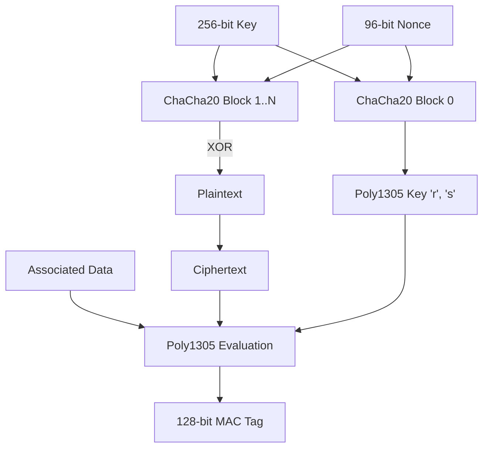

# ChaCha20 Stream Cipher: Quarter Rounds and Poly1305 MAC Verification

## The Problem: Hardware-Dependent Performance

For years, the Advanced Encryption Standard (AES) has been the gold standard for symmetric encryption. However, AES was designed with a specific algebraic structure (Rijndael's finite field operations) that is computationally expensive to execute in pure software. To achieve acceptable performance, CPU vendors introduced hardware extensions like AES-NI.

But what about low-end mobile devices, IoT sensors, or embedded systems lacking dedicated cryptographic hardware? On these devices, AES software implementations are not only slow but notoriously vulnerable to cache-timing side-channel attacks. 

We needed a cipher that is fast in software, inherently resistant to timing attacks, and highly secure. Enter the combination of **ChaCha20** and **Poly1305**.

## The ChaCha20 Stream Cipher: ARX Architecture

ChaCha20, designed by Daniel J. Bernstein (djb), is a stream cipher based on the **ARX** design philosophy:
1. **A**ddition (modular)
2. **R**otation (bitwise)
3. **X**OR (bitwise)

Because it relies exclusively on these three operations—which run in constant time on virtually all CPU architectures—it is naturally immune to timing attacks and blisteringly fast without hardware acceleration.

### The State Matrix

ChaCha20 operates on a 512-bit state, logically represented as a 4x4 matrix of 32-bit words:

```text
[ Constant ] [ Constant ] [ Constant ] [ Constant ]
[ Key      ] [ Key      ] [ Key      ] [ Key      ]
[ Key      ] [ Key      ] [ Key      ] [ Key      ]
[ Counter  ] [ Nonce    ] [ Nonce    ] [ Nonce    ]
```

- **Constants:** 4 words (`"expand 32-byte k"` in ASCII).
- **Key:** 8 words (256-bit key).
- **Counter:** 1 word (32-bit block counter).
- **Nonce:** 3 words (96-bit nonce).

### The Quarter Round

The core engine of ChaCha20 is the "Quarter Round" (QR). It scrambles four words `(a, b, c, d)` through a sequence of ARX operations. 

```c
// C pseudo-code for the ChaCha20 Quarter Round
void QR(uint32_t *a, uint32_t *b, uint32_t *c, uint32_t *d) {
    *a += *b; *d ^= *a; *d = ROTL32(*d, 16);
    *c += *d; *b ^= *c; *b = ROTL32(*b, 12);
    *a += *b; *d ^= *a; *d = ROTL32(*d, 8);
    *c += *d; *b ^= *c; *b = ROTL32(*b, 7);
}
```

A full ChaCha20 block derivation consists of 20 rounds (10 double-rounds). An "odd" round applies QR to the four columns of the matrix. An "even" round applies it to the four diagonals. After 20 rounds, the original state is added to the scrambled state to produce a 512-bit keystream block, which is then XORed with the plaintext.

## Authentication with Poly1305

Encryption alone provides confidentiality, but not **integrity**. Without a Message Authentication Code (MAC), an attacker could flip bits in the ciphertext, altering the decrypted plaintext predictably (malleability). To solve this, ChaCha20 is paired with Poly1305 to form an Authenticated Encryption with Associated Data (AEAD) construction.

### The Poly1305 Mathematics

Poly1305 is a Carter-Wegman MAC. It evaluates a polynomial over a prime field. The prime chosen by djb is $p = 2^{130} - 5$, a prime just larger than 128 bits that allows for highly optimized modulo arithmetic.

Given a 256-bit one-time key (split into two 128-bit halves, $r$ and $s$) and a message divided into 16-byte blocks $m_1, m_2, \dots, m_n$:

1. Each block $m_i$ is appended with a `0x01` byte to make it 17 bytes (for proper padding).
2. The polynomial is evaluated as:
   
$$ MAC = \left( \sum_{i=1}^{n} m_i \cdot r^{n-i+1} \right) \pmod{2^{130} - 5} + s \pmod{2^{128}} $$

### AEAD Construction (RFC 8439)

In the standard AEAD construction (ChaCha20-Poly1305):
1. **Key Generation:** A 256-bit key and 96-bit nonce are used to initialize ChaCha20. 
2. **MAC Key Extraction:** The first 256 bits of the ChaCha20 keystream (with counter `0`) are reserved as the Poly1305 key ($r$ and $s$).
3. **Encryption:** The plaintext is encrypted using ChaCha20 starting with counter `1`.
4. **Authentication:** The Additional Authenticated Data (AAD) and the Ciphertext are fed into Poly1305 to generate a 128-bit authentication tag.



## Conclusion

ChaCha20-Poly1305 has become a pillar of modern cryptography, heavily utilized in TLS 1.3, WireGuard, and SSH. By sidestepping the need for specialized hardware while offering extreme performance and side-channel immunity, it provides a crucial safety net for the embedded web and ensures that high-grade cryptography remains democratic and accessible across all device tiers.
