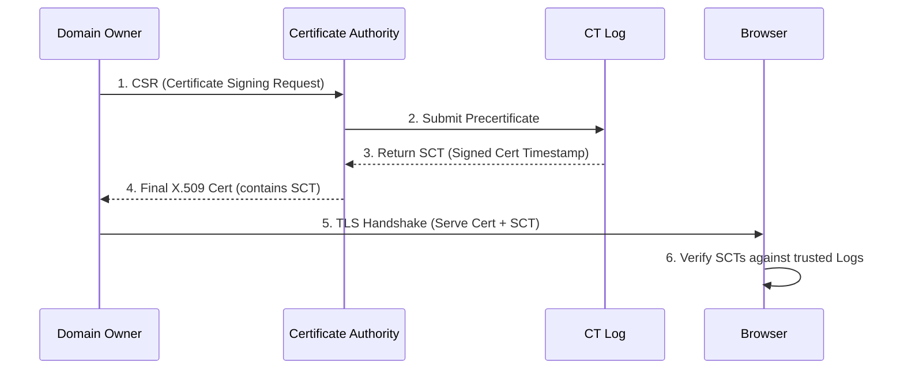

# Certificate Transparency (CT) Logs: Preventing Rogue CAs from Issuing Fake Certs

## The Problem: The Implicit Trust Model of X.509

The Web PKI ecosystem is built on the X.509 standard, where browsers and operating systems maintain a trust store of hundreds of Root Certificate Authorities (CAs). The fundamental flaw in this architecture is that **trust is non-hierarchical and absolute**. 

Any CA in your trust store can issue a valid certificate for *any* domain on the internet. If a minor, geographically isolated CA is compromised by a nation-state attacker (as happened with DigiNotar in 2011), they can quietly issue a fake certificate for `google.com` or `github.com`. This rogue certificate enables undetectable Man-in-the-Middle (MitM) attacks. Domain owners had no systematic way to know if a rogue CA had issued unauthorized certificates in their name.

To solve this, Google proposed **Certificate Transparency (CT)** (RFC 6962).

## What is Certificate Transparency?

Certificate Transparency shifts the PKI model from "blind trust" to "trust but verify." It mandates that every newly issued TLS certificate must be publicly recorded in an append-only, cryptographically verifiable ledger known as a CT Log.

If a certificate is not present in a known CT log, modern browsers (like Chrome and Safari) will outright reject it, throwing a catastrophic error to the user. 

### The Append-Only Merkle Tree

A CT Log is essentially a Merkle Tree. Unlike a standard database where records can be deleted or altered retroactively, an append-only Merkle Tree ensures that once a certificate is logged, it can never be removed without invalidating the entire cryptographic structure.

When a CA intends to issue a certificate, the flow goes as follows:

1. **Precertificate Submission:** The CA creates a "Precertificate" (a cryptographically bound precursor to the real cert) and submits it to one or more CT Logs.
2. **SCT Issuance:** The CT Log returns a Signed Certificate Timestamp (SCT). This is a promise from the log saying, "I have received this cert and will integrate it into the Merkle Tree within X hours (Maximum Merge Delay)."
3. **Certificate Delivery:** The CA embeds this SCT into the final X.509 certificate via a specific X.509v3 extension (OID `1.3.6.1.4.1.11129.2.4.2`).
4. **Client Verification:** When the client (browser) connects to the server, it extracts the SCTs, checks the signatures of the CT Logs, and guarantees transparency compliance.

## Monitors and Auditors

CT Logs do not enforce rules on the certificates themselves; they merely provide an immutable record. The actual policing is done by:

- **Monitors:** Services (run by companies like Cloudflare, Meta, or specialized security firms) that constantly download new entries from CT logs. They look for suspicious issuances, such as a random CA issuing a certificate for `paypal.com`. Domain owners use monitors to receive real-time alerts.
- **Auditors:** Cryptographic watchdogs that ensure the CT logs are behaving honestly. They continuously fetch cryptographic proofs from the logs.

### Merkle Consistency Proofs

How do auditors know a CT log hasn't retroactively deleted a bad certificate? Through **Consistency Proofs**. 

If a log had a root hash $R_n$ for $n$ entries yesterday, and today it has $n + k$ entries with a root hash $R_{n+k}$, the log must provide a mathematically sound proof that the new Merkle tree is purely an extension of the old one, and that the original $n$ elements remain exactly in the same order.

Let $H(x, y)$ be the cryptographic hash of concatenated nodes $x$ and $y$. If we have 3 leaves, the tree root $R_3$ is:
$R_3 = H(H(L_1, L_2), L_3)$

If we append a 4th leaf, the new root $R_4$ is:
$R_4 = H(H(L_1, L_2), H(L_3, L_4))$

The auditor can verify $R_4$ is consistent with $R_3$ simply by being provided $H(L_1, L_2)$, $L_3$, and the new $L_4$. As trees grow to billions of leaves, consistency proofs scale logarithmically $O(\log n)$, making them extremely efficient to verify.

## Conclusion

Certificate Transparency drastically overhauled Web PKI. It did not eliminate CAs or change how cryptographic keys function; instead, it introduced accountability. If a CA is compromised today, the attacker faces a dilemma: either log the rogue certificate (immediately alerting the domain owner and community monitors) or don't log it (rendering it useless in modern browsers). This transparency is why the dark days of undetected CA breaches are largely behind us.
