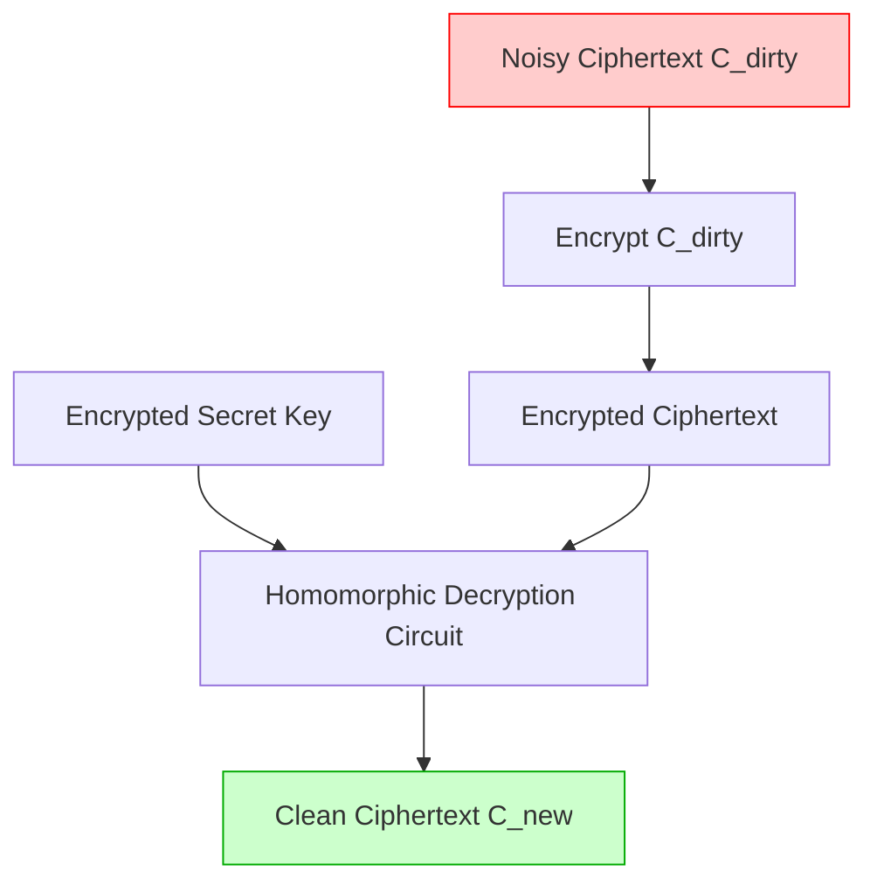

# Fully Homomorphic Encryption (FHE): Bootstrapping and Noise Reduction

## The Problem: The Data Privacy Paradox

For decades, cryptography provided a solid shield for data in transit (TLS) and data at rest (AES/RSA). However, data in use remained a glaring vulnerability. To perform computations on encrypted data—such as querying a database, running a machine learning model, or processing medical records in the cloud—the server historically had to decrypt the data first. 

This creates a paradox: to utilize cloud computing, you must expose your raw data to the cloud provider, risking data breaches and insider threats.

The holy grail of cryptography is **Fully Homomorphic Encryption (FHE)**: a scheme that allows algebraic operations (addition and multiplication) to be performed directly on ciphertext. The result of these operations, once decrypted, perfectly matches the result of the operations performed on the plaintext. 

## The Noise Problem in Lattice-Based Cryptography

Modern FHE schemes (like BGV, BFV, and CKKS) are based on the **Learning With Errors (LWE)** problem, a lattice-based mathematical framework. 

In LWE, encryption involves adding a small amount of random "noise" to the plaintext. Without this noise, the lattice problem simplifies to basic linear algebra and is easily broken. Thus, a ciphertext $C$ essentially looks like:

$$ C \approx \text{Plaintext} + \text{Noise} + \text{Key\_Mask} $$

FHE allows us to add and multiply these ciphertexts:
- **Homomorphic Addition ($C_1 + C_2$):** The noise grows linearly. $Noise_{new} = Noise_1 + Noise_2$.
- **Homomorphic Multiplication ($C_1 \times C_2$):** The noise grows exponentially. $Noise_{new} \approx Noise_1 \times Noise_2$.

### The Decryption Threshold

Here lies the fundamental limitation. The decryption algorithm can only successfully remove the noise and recover the plaintext if the accumulated noise remains below a strict mathematical threshold. 

If you perform too many multiplications, the noise explodes, corrupting the underlying plaintext. A scheme that only supports a limited depth of operations before noise corruption is called **Somewhat Homomorphic Encryption (SHE)**. 

To achieve *Fully* Homomorphic Encryption—allowing infinite computations—we must find a way to reduce the noise without decrypting the data.

## The Breakthrough: Gentry's Bootstrapping

In 2009, Craig Gentry introduced a revolutionary technique called **Bootstrapping**, the exact mechanism needed to cross the gap from SHE to FHE.

Bootstrapping is a conceptually mind-bending process: **homomorphically evaluating the decryption circuit itself.**

### How Bootstrapping Works

Imagine we have a ciphertext $C_{dirty}$ that has undergone multiple operations. Its noise level is dangerously close to the maximum threshold. We cannot perform any more computations on it, but we also cannot decrypt it locally on the server to clean it.

1. **Encrypting the Ciphertext:** The client provides the server with a secondary, encrypted version of their secret decryption key, known as the *Bootstrapping Key* ($EK(sk)$).
2. **Double Encryption:** The server takes the noisy ciphertext $C_{dirty}$ and encrypts it *again* under a fresh public key, creating an "encrypted ciphertext."
3. **Homomorphic Decryption:** The server then runs the standard FHE decryption algorithm as a homomorphic circuit. It takes the "encrypted ciphertext" and the "encrypted secret key" ($EK(sk)$) as inputs. 

Because FHE allows computations on ciphertexts, the server evaluates the decryption mathematical logic *under the veil of encryption*. 

### The Magic of the Reset

The output of this homomorphic decryption circuit is a brand-new ciphertext, $C_{new}$, containing the exact same plaintext as $C_{dirty}$. 

Crucially, the noise level of $C_{new}$ is no longer dependent on the accumulated noise of $C_{dirty}$. Instead, the noise of $C_{new}$ is solely the fixed amount of noise generated by evaluating the decryption circuit itself. As long as evaluating the decryption circuit adds *less* noise than the maximum threshold, we have successfully "reset" or "cleaned" the ciphertext, allowing computations to continue indefinitely.

## The Performance Trade-offs

Bootstrapping is the magic engine of FHE, but it is extraordinarily expensive computationally. Evaluating a cryptographic decryption algorithm homomorphically involves executing tens of thousands of complex polynomial multiplications. 

Early implementations of bootstrapping took up to 30 minutes for a single bit of data. Modern advancements (such as the TFHE scheme) have reduced this to milliseconds, but the overhead remains significant—often $10^4$ to $10^6$ times slower than raw plaintext computation.

## Conclusion

Fully Homomorphic Encryption represents a paradigm shift in how we handle sensitive data. By utilizing Learning With Errors and Gentry's ingenious bootstrapping technique, we can tame the chaotic growth of cryptographic noise. While computational overhead remains the primary barrier to mainstream adoption, the continuous optimization of bootstrapping algorithms is rapidly bringing privacy-preserving cloud computation into the realm of reality.
