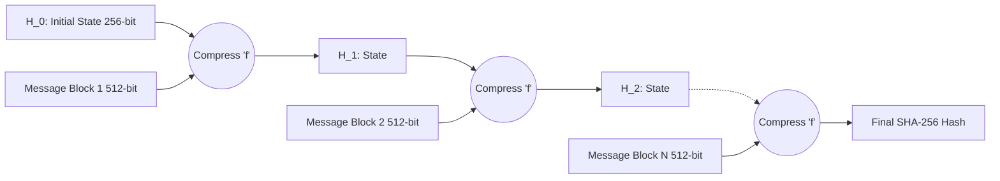

# SHA-256 Internals: The Merkle-Damgård Construction and Message Padding

## The Problem: Hashing Infinite Data to a Finite Space

A cryptographic hash function must possess three core properties: pre-image resistance, second pre-image resistance, and collision resistance. Furthermore, it must be able to take an input of *any* arbitrary length (from a 1-byte password to a 100 GB video file) and compress it into a secure, fixed-length output (e.g., 256 bits).

Processing arbitrary-length data in a single mathematical sweep is impossible. The algorithm must chunk the data, process it sequentially, and carry the mathematical state forward. In SHA-256 (part of the SHA-2 family), this mechanism is driven by the **Merkle-Damgård (MD) Construction** and its underlying Davies-Meyer compression function.

## The Merkle-Damgård Architecture

The MD construction works like a conveyor belt. It processes the message in fixed-size blocks (512 bits for SHA-256).

1. **Initialization:** The algorithm starts with a fixed 256-bit Initial Value (IV), denoted as $H_0$. In SHA-256, these are the fractional parts of the square roots of the first 8 primes.
2. **Compression Loop:** The message is split into 512-bit blocks: $M_1, M_2, \dots, M_n$. 
3. **State Updates:** A compression function $f$ takes the current 256-bit state $H_{i-1}$ and the current 512-bit message block $M_i$, and outputs a new 256-bit state $H_i$.
   $$ H_i = f(H_{i-1}, M_i) $$
4. **Finalization:** The final state $H_n$ is the resulting hash of the entire message.

### The Davies-Meyer Compression Function

Inside the $f$ circle in the diagram above lies the Davies-Meyer structure. It transforms the 512-bit message block into a "key" to encrypt the 256-bit state using a block cipher. 

Specifically, SHA-256 expands the 512-bit message block $M_i$ into sixty-four 32-bit words (the message schedule). It then runs the 256-bit state through 64 rounds of bitwise operations (AND, XOR, ROTR, SHR). To ensure one-wayness (pre-image resistance), the output of this 64-round cipher is added (modulo $2^{32}$) back to the original state $H_{i-1}$.

## The Padding Rule: Getting to 512 Bits

The Merkle-Damgård construction strictly requires the input message to be an exact multiple of 512 bits. Since real-world data rarely aligns perfectly, SHA-256 employs a rigorous padding scheme before the hashing begins.

Assume we are hashing the 3-byte string `"abc"`.
In binary, `"abc"` is 24 bits: `01100001 01100010 01100011`.

The SHA-256 padding rules are applied in three steps:

1. **The '1' Bit:** Append a single `1` bit immediately after the original message.
   - `01100001 01100010 01100011 1`
2. **The '0' Bits:** Append zero or more `0` bits until the length of the padded message is exactly 64 bits short of a 512-bit multiple (i.e., length $\equiv 448 \pmod{512}$).
   - `01100001 01100010 01100011 1000...000` (423 zeros added)
3. **The Message Length:** Append the exact original length of the message (24 bits) as a 64-bit big-endian integer.
   - `00...00011000` (64-bit representation of 24)

The total length is now exactly 512 bits (1 block), ready for the compression function.

### Length Extension Attacks

A fascinating side-effect of the Merkle-Damgård construction is the **Length Extension Attack**. 

If a server computes a MAC as `SHA256(Secret_Key || Message)` and outputs the hash, an attacker who knows the length of the secret key can take the final hash state $H_n$ and feed it directly into a new compression function block. They can append their own malicious data, creating a valid hash for `Secret_Key || Message || Padding || Malicious_Data`, all without ever knowing the Secret_Key!

This occurs because $H_n$ is precisely the state required to start the next block. (This is why HMAC uses a nested hashing structure, mitigating this exact flaw).

## Conclusion

The Merkle-Damgård construction has reliably served cryptography for decades, underlying MD5, SHA-1, and SHA-256. While newer algorithms like SHA-3 have abandoned it in favor of the "Sponge Construction" (to natively defeat length extension attacks), SHA-256's padding mechanics and Davies-Meyer state updates remain a masterclass in deterministic data compression.
