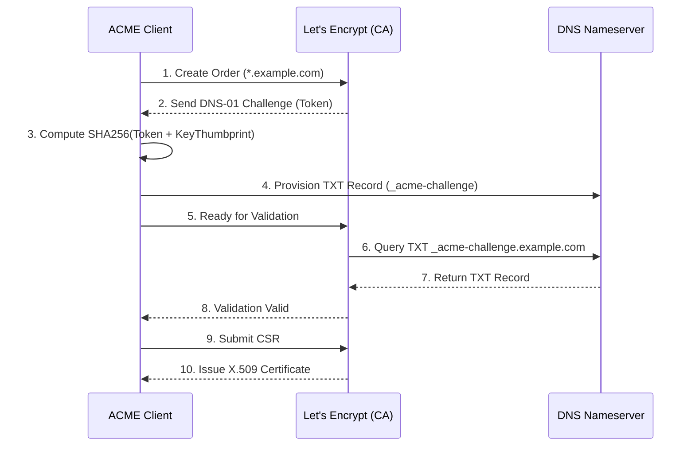

# ACME Protocol: How Let's Encrypt Automates DNS-01 and HTTP-01 Challenges

## The Problem: The Manual PKI Nightmare

Before 2015, securing a website with a TLS/SSL certificate was a manual, expensive, and error-prone process. A system administrator had to generate a private key and a Certificate Signing Request (CSR) on their server, manually upload the CSR to a Certificate Authority (CA) portal, pay a fee, wait for an email to prove domain ownership, download the issued certificate, and carefully configure the web server.

Because this process was so tedious, administrators bought certificates valid for 3 to 5 years. Inevitably, the administrator who configured the certificate would leave the company, the certificate would silently expire, and a catastrophic outage would ensue. 

The launch of **Let's Encrypt** and the **Automated Certificate Management Environment (ACME)** protocol (RFC 8555) solved this by completely eliminating human intervention.

## The ACME Protocol Architecture

ACME allows a software agent (like `certbot`) running on your web server to autonomously communicate with a CA via a JSON-over-HTTPS API. The overarching goal of the protocol is simple: the CA must verify that the machine requesting a certificate for `example.com` actually controls `example.com`.

The ACME lifecycle follows four major steps:
1. Account Creation.
2. Order Creation.
3. Challenge Execution (Domain Validation).
4. CSR Submission and Certificate Issuance.

### Step 1 & 2: The Order

The ACME client generates an account key pair and registers it with the CA. It then submits an "Order" requesting a certificate for a specific identifier (e.g., `example.com`).

The CA responds with a list of "Authorizations" required to fulfill the order. Each authorization contains multiple "Challenges"—cryptographic puzzles the client must solve to prove domain control. The client only needs to complete one challenge per domain.

## Domain Validation: HTTP-01 vs DNS-01

The core of the ACME protocol lies in its challenge mechanisms. The two most prominent are HTTP-01 and DNS-01.

### The HTTP-01 Challenge

The HTTP-01 challenge requires the ACME client to place a specific file on the web server at a specific URL. 

1. **The Challenge Token:** The CA provides a random `token` to the client.
2. **The Key Authorization:** The client computes a thumbprint of its public account key and combines it with the token: `token.account_key_thumbprint`.
3. **Provisioning:** The client places this string in a file on the web server at:
   `http://example.com/.well-known/acme-challenge/<token>`
4. **Validation:** The client notifies the CA that it is ready. The CA makes an outbound HTTP GET request to that exact URL. If the CA successfully downloads the file and the contents match the expected Key Authorization, the CA considers the domain validated.

**Pros/Cons:** HTTP-01 is extremely easy to automate on standard web servers (Apache, Nginx). However, it requires the web server to be reachable on Port 80 from the public internet. It also cannot be used to issue Wildcard certificates (e.g., `*.example.com`).

### The DNS-01 Challenge

If the web server is behind a firewall, or if the user requests a wildcard certificate, HTTP-01 fails. The fallback is the DNS-01 challenge, which proves control over the domain's DNS infrastructure.

1. **The Challenge Token:** The CA provides a random `token`.
2. **The Key Authorization:** The client computes the same Key Authorization string, but then hashes it using SHA-256 and Base64-encodes the result.
3. **Provisioning:** The client communicates with its DNS provider's API (e.g., Route53, Cloudflare) to create a specific TXT record:
   `_acme-challenge.example.com. IN TXT "<Base64_SHA256_Hash>"`
4. **Validation:** The CA performs a DNS lookup for the TXT record. If the hash matches, the domain is validated.

## Step 4: Issuance and Renewal

Once the challenge is validated, the ACME client generates a fresh private key for the TLS certificate, crafts a CSR, signs it with the ACME account key, and sends it to the CA. The CA signs the CSR and returns the final X.509 certificate. 

Because the entire workflow is automated, Let's Encrypt enforces a strict 90-day expiration policy on their certificates. This forces administrators to rely on `cron` jobs or systemd timers to renew certificates automatically (usually at the 60-day mark), ensuring that human forgetfulness never again causes a TLS outage.
