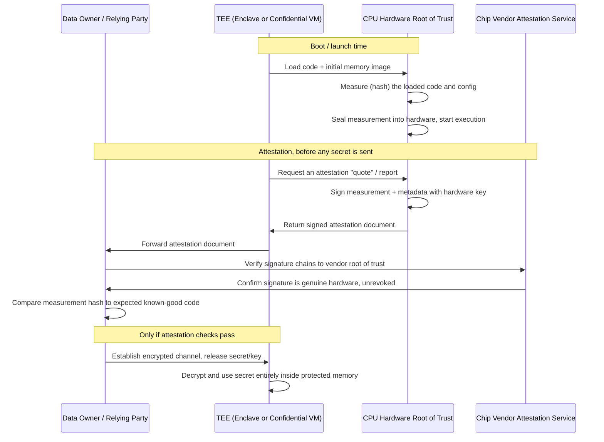

# Confidential Computing Explained: Protecting Data in Use

> By the end of this article you'll understand exactly what gap confidential computing closes, how a trusted execution environment enforces that guarantee in hardware, why remote attestation is the piece that makes the whole thing trustworthy rather than just "trust us," and what an attacker with root or hypervisor access still can't see — and what they still can.

## The Problem

You've encrypted your database at rest. Every disk is AES-256 encrypted, keys rotate through KMS, and an auditor signed off on it. You've also locked down transit: TLS 1.3 everywhere, mutual TLS between services, certificate pinning on mobile clients. Two of the three classic data states are covered.

Then someone asks: "What happens to the data the moment your application actually *uses* it?"

Silence. Because the honest answer is: it sits in system RAM, completely unencrypted, in plaintext, for as long as it's being processed. The database driver decrypts the row before handing it to your code. The ML model decrypts the input tensor before running inference. The payment service decrypts the card number before tokenizing it. At that instant — and it can last milliseconds or minutes — the data is just bytes in memory, exactly as readable as if encryption never existed.

This is the third state of data, and it's the one most security architectures quietly ignore:

| State | Example | Standard protection |
|---|---|---|
| **At rest** | Data on disk, in a database, in object storage | AES-256, disk/volume encryption, KMS-managed keys |
| **In transit** | Data moving over a network | TLS 1.3, mTLS, IPsec |
| **In use** | Data loaded into RAM and being computed on | Historically: nothing. Just plaintext in memory. |

If you've worked with HSMs, you've already seen a narrow version of this problem solved for one specific asset — the private key never leaves the hardware boundary, and the HSM performs the signing operation internally so the key is never exposed in the host's RAM. Confidential computing takes that same idea — *never expose the secret to the surrounding system, even during computation* — and generalizes it from "one key inside a dedicated appliance" to "an entire running application, inside a general-purpose CPU, on a shared cloud server, computing on the plaintext data itself."

## Why This Problem Is Hard

Here's the part that makes this a genuinely hard problem rather than a checkbox: **the operating system, the hypervisor, and the cloud provider's own administrators are, by design, the most privileged entities on the machine.** They are also exactly who confidential computing needs to defend against.

Think about the layers between "my application" and "the physical CPU":

```
┌─────────────────────────────────────────────┐
│  Your Application (the code you wrote)       │
├─────────────────────────────────────────────┤
│  Guest Operating System                      │  ← can read all guest RAM
├─────────────────────────────────────────────┤
│  Hypervisor (KVM, Xen, Hyper-V, ESXi)        │  ← can read all VM RAM on the host
├─────────────────────────────────────────────┤
│  Cloud Provider's Host OS / Management Plane │  ← can read hypervisor + all VM memory
├─────────────────────────────────────────────┤
│  Physical CPU + RAM                          │
└─────────────────────────────────────────────┘
```

Under the traditional trust model, every layer below your application is *implicitly trusted*. Your app trusts the guest OS. The guest OS trusts the hypervisor to give it real, unmolested memory. The hypervisor trusts the cloud provider's infrastructure and staff. This stack of implicit trust is exactly what a normal, well-run cloud is built on — and it's exactly what breaks down the moment any single layer is compromised or coerced.

Realistic scenarios where that "who has root" question stops being academic:

- A misconfigured or compromised hypervisor lets a neighboring tenant on the same physical host dump another VM's memory pages.
- An insider with cloud-provider administrative credentials (or an attacker who stole those credentials) can, in principle, attach a debugger to a running VM or snapshot its memory.
- A regulator, court order, or nation-state legal process compels a cloud provider to hand over data — and if the provider *can* technically access your plaintext, they can be forced to.
- A supply-chain attack plants malware in the hypervisor layer itself, below anything your security team can observe from inside the VM.

None of these require breaking AES. None of them require intercepting a TLS session. They all exploit the same gap: **data in use has no cryptographic protection, only administrative and legal promises.** "We don't look at your data" is a policy. It is not a mathematical guarantee, and it cannot survive a compromised or coerced privileged layer.

This is why confidential computing exists: to replace *"trust us, we won't look"* with *"here is cryptographic proof that even we, the infrastructure owner, cannot look — and here is a signed attestation you can verify before you ever send us your secret."*

## A Simple Mental Model

Picture a bank's night-deposit safe embedded in the outer wall of the branch. A customer drops a locked bag through a slot. The bag goes directly into a vault that only the safe's own internal mechanism can open — not the branch manager, not the janitor with a master key to every other door in the building, not even someone who breaks in and gets root-level access to the alarm system and door locks. The vault has its own lock, built into the wall itself, independent of every other key in the building.

A Trusted Execution Environment (TEE) is that vault, built into the CPU silicon instead of the building. The "outer wall" is the chip package. Everything outside the vault — the OS, the hypervisor, the data center's own admins — is the branch manager and janitor: fully capable of managing the building, utterly unable to open that one specific compartment.

**Where the analogy breaks down:** a physical vault only *stores* things; it doesn't compute on them. A TEE actively *runs code and processes data* inside the isolated boundary, and the interesting engineering problem — which the mental model doesn't capture at all — is proving to a remote party, cryptographically, that the vault really is a vault and not a cardboard box painted to look like one. That proof is called attestation, and it's the part we'll spend the most time on, because it's the part that makes the whole system trustworthy rather than just "trust the vendor's marketing."

## Before We Continue

This article assumes you're comfortable with:

- **Symmetric encryption fundamentals** (AES, keys, ciphertext vs. plaintext) — if AES-GCM's authenticated encryption isn't second nature yet, read that first.
- **Basic virtualization concepts** — what a hypervisor does, what a VM's memory isolation normally looks like, and why a hypervisor is more privileged than any guest VM.
- **TLS at a conceptual level** — you don't need handshake internals here, but you should understand *why* TLS protects data in transit, so you can see clearly why it stops at the network boundary and does nothing once data lands in RAM.
- **The idea of a hardware root of trust** — if you've read about HSMs or the AWS Nitro System, you've already seen a narrower version of "isolate the secret from the surrounding privileged software" in action.

If any of those are shaky, this article will still make sense at a high level, but the "Under the Hood" section will move fast.

## The Core Idea

**Confidential computing is a set of hardware-based techniques that keep data — and the code operating on it — encrypted and isolated in memory even while it is actively being computed on, such that no other software on the same machine (OS, hypervisor, or another VM) and no privileged human operator can read it, and any party can cryptographically verify that this isolation is genuinely in place before trusting the environment with sensitive data.**

Two mechanisms do the actual work, and it's worth separating them cleanly because they solve different halves of the problem:

1. **Hardware-enforced isolation (the TEE)** — a region of memory and execution state that the CPU itself protects, encrypting it in the memory controller and refusing access to anything outside a specific, cryptographically-measured code boundary. This is the "vault."
2. **Remote attestation** — a signed, verifiable statement from the hardware (backed by a manufacturer-issued key, ultimately anchored to something like Intel's or AMD's own root of trust) proving *which exact code* is running inside that vault, before you hand it your secrets. This is the "how do I know it's really a vault" proof.

You need both. A TEE without attestation is a black box you're asked to trust blindly — you have no way to confirm the code inside hasn't been tampered with. Attestation without a real TEE is just a signed lie about software running in ordinary, readable memory. Together, they let two parties who don't trust each other's infrastructure — a bank and a cloud provider, two hospitals pooling data for research, a fintech and its cloud vendor — establish a small, verifiable island of trust inside hardware neither of them has to blindly trust the other to manage.

## How It Actually Works

### The building block: encrypted memory with per-VM (or per-enclave) keys

At the center of every modern TEE implementation is one idea: **the CPU's memory controller encrypts RAM on the fly, using a key that never leaves the CPU package, and different protected contexts get different keys.**

Concretely, when a CPU core writes a cache line back to DRAM, the memory encryption engine — sitting in the path between the CPU cores and the physical DRAM — encrypts it using an AES-based cipher (implementations vary; AES-XTS and AES-GCM-style constructions with integrity protection both appear across vendors) before it ever hits the DIMM. When that data is read back into cache, the engine decrypts it, but only for code executing with the matching key context. The DRAM itself, if you physically pulled it out of the machine or attached a bus-probing device, contains nothing but ciphertext.

Crucially, the *key itself* lives in dedicated hardware registers inside the CPU package — not in system RAM, not accessible to microcode running for other contexts, not readable by any software instruction the OS or hypervisor can issue. The hypervisor can still manage *which physical pages* belong to which VM (it has to, in order to do its job as a hypervisor), but it cannot read the *plaintext contents* of pages it doesn't hold the key for.

> **Verification Note**
> Exact cipher choices, key sizes, and integrity-protection schemes differ by vendor and by generation of silicon (Intel's TME/MKTME/SGX line, AMD's SEV/SEV-ES/SEV-SNP line, Arm's CCA). Treat any specific algorithm name here as illustrative of the general approach, and verify current specifics against the vendor's own architecture documentation before citing them in a security design review.

### Two architectural approaches to "where is the boundary"

Vendors converged on two different shapes for the protected region, and the difference matters for what you can build:

**Process-level enclaves (Intel SGX's original model).** The trusted boundary is a small, deliberately minimal region carved out inside a normal, otherwise-untrusted OS process — a handful of megabytes to a few hundred megabytes historically, though this has grown in later generations. You write your sensitive logic specifically to run inside this enclave: it has its own restricted instruction set for entering and exiting, and code outside the enclave (including the OS) cannot read enclave memory or single-step through enclave execution with a debugger. The trade-off: you generally have to restructure your application to separate "enclave code" (the sensitive sliver) from "host code" (everything else), because the enclave can't make arbitrary system calls — I/O has to be proxied out to the untrusted host and back.

**VM-level (or "confidential VM") isolation (AMD SEV-SNP, Arm CCA, and Intel TDX).** The trusted boundary is an *entire virtual machine* — the whole guest OS and application stack, encrypted and isolated as a unit, with the hypervisor unable to read or tamper with guest memory. You run essentially unmodified applications and operating systems inside it. The trade-off is a coarser boundary: the whole guest OS is inside the trust boundary, so a vulnerability in the guest kernel is now a vulnerability inside your confidential computing base, whereas a process-level enclave keeps the OS entirely outside the boundary by design.

Neither approach is strictly "better" — they answer different questions. Enclaves minimize the trusted code base at the cost of an awkward programming model; confidential VMs maximize compatibility at the cost of a larger trusted surface. A production system choosing between SGX-style enclaves and SEV-SNP/TDX-style confidential VMs is really choosing between "smallest possible attack surface, more engineering effort" and "run what you already have, accept a larger boundary."

### Sequence: from boot to a secret arriving inside the boundary

This is the part that ties isolation and attestation together, and it's the sequence every confidential computing deployment actually walks through, whether it's an enclave or a confidential VM:



Walk through why every step is load-bearing:

1. **Measurement happens before execution, not after.** The CPU computes a cryptographic hash of the exact code and initial memory state that's about to run — this is what "measured boot" means for a TEE. If even one byte of the loaded code changes, the hash changes, and any relying party checking that hash will immediately see it doesn't match the expected value.
2. **The attestation document is signed by a key that never leaves the chip**, ultimately chaining back to a certificate the manufacturer (Intel, AMD, Arm's silicon partners) issued and controls. This is why attestation is a hardware root of trust problem, not a software one — if the signing key could be extracted or forged, the whole scheme collapses, which is exactly why vendors treat these provisioning keys with HSM-grade protection of their own.
3. **The relying party — not the TEE, not the cloud provider — decides whether to trust the result.** They verify the certificate chain up to the vendor's root, check the hardware hasn't been flagged for a known vulnerability (revocation), and compare the measurement hash against the value they computed themselves from the source code they audited. This is the step that turns "trust the cloud provider" into "verify the cryptographic evidence yourself."
4. **Only after that verification succeeds does any secret get released** — typically over a fresh, ephemeral encrypted channel established as part of the same protocol, so the secret is never sent to an unverified environment even transiently.

**Common misconception:** *"Attestation proves the hardware is genuine."* Not quite — it proves that a genuine, unrevoked piece of hardware is running a *specific, measured piece of code*. Genuine hardware running the wrong (or tampered) code will produce a measurement that doesn't match what the relying party expects, and the relying party is supposed to reject it. Attestation is only useful if someone actually checks the measurement against a known-good value — an attestation that's fetched but never verified against anything provides zero security benefit.

## Let's Walk Through an Example

Consider a healthcare analytics company that wants to run a diagnostic model against patient records for multiple hospital systems, none of which are willing to let a third party — or each other — see the raw plaintext data.

**Without confidential computing:** the analytics company would need each hospital to decrypt and send data to a server the analytics company (or their cloud provider) fully controls. Every hospital's compliance team correctly points out that this means trusting the analytics company's employees, the cloud provider's employees, and every layer of software in between, not to look. For regulated health data, that's often a non-starter regardless of contracts and audits.

**With confidential computing:**

1. The analytics company builds their inference pipeline and deploys it inside a confidential VM (or enclave) on a cloud provider's confidential computing instance type.
2. Before any hospital sends data, each hospital's security team independently requests and verifies the attestation document: they check the signature chains to the CPU vendor's root of trust, confirm the hardware isn't on a revocation list, and — critically — compare the reported code measurement against a hash of the exact model and pipeline code they were shown and audited in advance.
3. Only once that verification passes does each hospital establish an encrypted channel *directly into the confidential VM* and send their data. The data is decrypted only inside the protected memory region.
4. The model runs, producing an output (say, a risk score), still entirely inside the protected boundary.
5. The cloud provider's own operators — who have root on the host, control the hypervisor, and could otherwise inspect any ordinary VM's memory — see nothing but encrypted memory pages and an opaque data blob in transit. Even the analytics company, if their own after-the-fact code changes weren't part of the attested measurement, can't retroactively see the raw patient data either.

Notice what changed: trust moved from "we promise not to look" (an organizational and legal claim) to "here is a hardware-signed proof of exactly what code touched your data, verify it yourself before you send anything" (a cryptographic claim). That's the entire value proposition in one sentence.

## Under the Hood

An attacker with root access on the host — or even hypervisor-level access — is the exact threat model confidential computing is built to defeat. It's worth being precise about *why* each of their usual tools stops working, because "hardware isolation" can otherwise sound like hand-waving.

**Memory dumps (`/dev/mem`, hypervisor introspection APIs, cold-boot attacks against DRAM).** These tools read physical memory addresses. Inside a TEE's protected range, what they read back is ciphertext produced by the memory encryption engine, encrypted with a key that lives only in CPU package registers the dump tooling has no instruction to read. The attacker gets bytes; the bytes are meaningless without a key they cannot obtain through software.

**Debugger attachment (`gdb`, hypervisor-level VM introspection, single-stepping).** TEE architectures explicitly disable or restrict standard debug and introspection paths into the protected boundary during normal operation. (Vendors do provide debug modes for development, but those modes deliberately produce an attestation measurement that flags the environment as non-production/debug — so a relying party's verification step should reject secrets being released to a debug-enabled instance.)

**Hypervisor-level manipulation of guest page tables.** In the confidential-VM model, this is precisely the attack SEV-SNP's later generations and Intel TDX were designed to close: earlier VM encryption schemes (like original SEV) encrypted memory contents but didn't cryptographically bind *which physical address* a given ciphertext belonged to, which opened remapping and replay attacks where a hypervisor could swap or replay encrypted pages. Adding integrity protection over both the *content* and its *page-table binding* is what SEV-SNP ("Secure Nested Paging") is specifically named for — it stops a malicious hypervisor from redirecting, splicing, or replaying the guest's encrypted memory.

**Reading the code before it runs.** This one attestation handles, not memory encryption: because the boot-time measurement is taken and signed before the relying party releases any secret, an attacker who modifies the code running inside the TEE (say, by tampering with the boot image at the hypervisor layer) changes the measurement hash. A relying party who actually checks that hash against the expected value detects the tamper and simply never sends the secret — the attack fails not because it was blocked, but because it was caught before anything valuable was exposed.

What none of this defends against — and this matters as much as what it does defend against — is covered in the next section.

## What Can Go Wrong?

Confidential computing has a very specific, narrow guarantee. Overselling it is a real and common failure mode.

**Side-channel attacks remain a live threat class.** TEEs protect the *architectural* view of memory — what an instruction is allowed to read — but they historically have not fully hidden *microarchitectural* signals: cache access timing, power consumption, speculative execution behavior. Researchers have published practical side-channel and speculative-execution attacks against early Intel SGX implementations (extracting keys via cache-timing and transient-execution techniques) that didn't require breaking the memory encryption at all — they inferred secrets from *how* the enclave accessed memory, not from reading its contents directly.

> **Verification Note**
> Specific named vulnerabilities and their current mitigation status (microcode patches, silicon revisions) are actively evolving and vendor-specific. Don't cite a particular CVE or attack name as current without checking the vendor's security advisories and the latest academic literature — this is exactly the kind of narrowly time-sensitive claim this knowledge base flags rather than states as settled fact.

**A TEE only protects what's inside its boundary — not what happens before or after it.** If your application logs decrypted data to a file outside the enclave, writes it to disk, or your code has a bug that leaks it over an unencrypted debug endpoint, confidential computing does nothing to stop that. It is not a substitute for secure coding, input validation, or careful handling of secrets in application logic. It protects data *from the infrastructure*, not from your own application's mistakes.

**Attestation that isn't actually verified is theater.** If a relying party fetches an attestation document but never checks the signature chain, never checks for revocation, and never compares the measurement against a known-good value — just checks "did I get *a* document" — they've gained nothing. This is a genuinely common implementation mistake: attestation infrastructure exists, gets wired up, and the actual verification logic is stubbed out or incomplete.

**Physical attacks with sufficiently sophisticated equipment are a moving target, not a solved problem.** Cold-boot attacks, electromagnetic and power side-channels, and fault-injection attacks against the chip package itself have all been demonstrated in research settings against various TEE implementations over the years. Confidential computing raises the bar for physical attacks enormously compared to plaintext-in-RAM — but "raises the bar" and "physically impossible" are different claims, and vendors' own threat models are explicit that they generally assume the attacker does not have unrestricted physical possession of the chip with lab-grade equipment.

**A compromised or malicious relying party can still misuse legitimately released data.** Attestation proves *which code* is running — it says nothing about whether that code, once trusted and handed real data, is itself well-designed, bug-free, or has innocuous-looking logic that quietly exfiltrates results through a side channel the attestation process was never meant to catch.

## Security Considerations

Mapping this to the standard security chain makes the boundaries of the guarantee explicit:

| | |
|---|---|
| **Asset** | Plaintext data during active computation (and the code/model logic operating on it) |
| **Threat** | Privileged host software (OS, hypervisor), malicious/coerced cloud insiders, co-tenant VMs, physical memory access |
| **Attack** | Memory dumping, hypervisor VM introspection, debugger attachment, page remapping/replay, legal compulsion of the provider |
| **Vulnerability (without CC)** | Data in use exists as plaintext in ordinary, unencrypted, unauthenticated RAM |
| **Mitigation** | Hardware memory encryption + isolation (TEE) bound to a verifiable measurement, released only after remote attestation succeeds |
| **Residual risk** | Microarchitectural side channels, application-level leakage, unverified/rubber-stamped attestation, sophisticated physical attacks, bugs in the trusted code itself |

Two practical rules worth internalizing for any design review touching this space:

- **Never treat "we're using confidential computing" as a substitute for verifying attestation.** The security property comes from the verification step actually running and actually rejecting mismatched measurements — not from the mere existence of TEE hardware in the deployment.
- **Keep the trusted code base as small as practically possible.** Every line of code inside the attested boundary is code a relying party has to audit and trust; this is the enclave-vs-confidential-VM trade-off from earlier restated as a security principle rather than an engineering convenience.

## Common Misconceptions

**Misconception:** "Confidential computing means the cloud provider can never see my data, full stop."
**Reality:** It means the cloud provider's *infrastructure layers* (hypervisor, host OS, most operator tooling) cannot read data inside the attested boundary. It doesn't retroactively protect data that leaves the boundary through logging, application bugs, or a secret that was released before attestation was actually checked.

**Misconception:** "If I run my workload in a TEE, I don't need encryption at rest or in transit anymore."
**Reality:** Confidential computing addresses the third leg of a three-legged stool. Data still has to be encrypted going into the TEE (in transit) and still needs to be encrypted when it's persisted afterward (at rest). It's additive, not a replacement.

**Misconception:** "Attestation is a one-time setup step."
**Reality:** For any workload where the code can be updated, or where you're establishing a new session with a TEE instance, attestation needs to be checked fresh — an old attestation proves what was true when it was generated, not what's true now.

## Real-World Architecture

The clearest production pattern across major cloud providers looks like this: a "confidential" variant of a standard compute offering (a confidential VM instance type, a confidential container runtime, or an enclave-based service) sits alongside the standard offering, backed by AMD SEV-SNP, Intel TDX, or (in narrower cases) SGX-style enclaves, with an attestation verification service provided either by the cloud vendor or the chip vendor directly.

The workloads that actually justify the engineering cost tend to share a pattern: **multiple parties who don't fully trust each other's infrastructure need to jointly compute on sensitive data.** Multi-party analytics across organizational boundaries (the hospital example above), regulated financial data processing where the processor legally cannot retain plaintext access, and confidential AI inference — where a model owner doesn't want their model weights extracted by the infrastructure operator, and the data owner doesn't want their input data read by anyone, including the model owner — are the recurring shapes. The last one is increasingly relevant as more sensitive data gets routed through inference pipelines: an attestable, isolated environment lets a data owner verify what model and what pipeline touched their input before sending it, without asking the AI provider to just promise good behavior.

**A caveat that matters enormously for that last case:** a CPU-based TEE — an SGX enclave, an SEV-SNP or TDX confidential VM — protects computation that happens on the CPU. It does not, by itself, extend to a GPU. Most production ML inference actually runs on a GPU, and the model weights and input data have to leave the CPU TEE's protected memory to reach GPU memory over the PCIe bus. Unless the GPU itself also supports an attestable confidential-computing mode, that hop is unprotected plaintext, exposed to the same hypervisor and host operators the CPU TEE was supposed to keep out. Closing this gap requires GPU-specific confidential computing (for example, NVIDIA's Hopper/Blackwell-generation confidential computing mode, which extends encrypted memory and attestation to the GPU itself) — a CPU TEE and a GPU TEE are two separate hardware trust boundaries that both need to be attested, not one guarantee that automatically covers the other. A "confidential AI inference" design that attests only the CPU side while running the actual model on an unattested GPU has a gap in exactly the place the whole design exists to close.

> **Verification Note**
> Specific cloud provider product names, generally available regions, and which CPU generations back a given confidential-computing offering change frequently. Verify current availability and the exact underlying technology (SEV-SNP vs. TDX vs. a given enclave SDK) against the provider's own architecture documentation before making it a hard dependency in a design. Which GPU generations and cloud offerings support GPU-based confidential computing, and the exact attestation model each uses, is likewise evolving quickly — verify against the GPU vendor's own documentation before relying on it.

## Expert Insight

A few things that only become obvious once you've actually tried to ship on this:

**Performance is not free, and the overhead isn't uniform.** Memory encryption and the additional integrity checks add real latency to memory-bound workloads. Enclave-style models add further overhead at the trusted/untrusted boundary crossing, since I/O has to be proxied. Benchmark your actual workload before committing to an architecture — a memory-bandwidth-heavy analytics job and a compute-bound inference job will see very different overhead profiles.

**The attestation-verification step is where projects actually fail, not the TEE hardware itself.** Getting a signed attestation document is the easy part; building (and maintaining) the verification logic — chasing down current revocation lists, handling vendor certificate rotation, keeping the "known-good measurement" list in sync with every legitimate code update — is where real deployments accumulate operational debt. A stale revocation check is a silent security regression.

**Reproducible builds matter more here than almost anywhere else.** If your build process isn't deterministic, you can't reliably tell a relying party "the measurement should be exactly this hash," because two builds of the "same" source might legitimately produce different binaries. Confidential computing pushes teams toward build reproducibility discipline they might otherwise have deferred indefinitely.

**Don't confuse "confidential computing" with "zero trust in the cloud provider."** You're still trusting the chip vendor's manufacturing process, their key provisioning security, and the correctness of their attestation infrastructure. It shrinks the trusted-party list dramatically — from "the entire cloud provider's staff and software stack" down to "the silicon vendor" — but it doesn't shrink it to zero.

## Pause and Think

> If a hospital's security team receives a valid, correctly-signed attestation document from a TEE — signature checks out, hardware isn't revoked — but they never compare the reported code measurement against a hash of the code they actually audited, have they gained any real security benefit from confidential computing?

### Answer

No. A signed attestation proves the hardware is genuine and running *some* measured, unmodified code — it says nothing about whether that code is the code you intended to trust. Skipping the measurement comparison is equivalent to checking that a document has a valid notary seal without ever reading what the document actually says. The entire security value of attestation lives in that comparison step; everything before it (signature verification, revocation checks) only establishes that the measurement itself is authentic, not that the measured code is the right code.

## Key Takeaways

- **Data in use is the state encryption at rest and in transit never protected**, because the moment data is processed, it exists as plaintext in ordinary RAM.
- **A Trusted Execution Environment (TEE) closes this gap** by encrypting memory with a key that lives only inside the CPU package, isolating a protected execution region from even the most privileged software on the host — OS, hypervisor, and cloud operator included.
- **Remote attestation is what makes the TEE trustworthy to a third party**: a hardware-signed measurement of the exact code running inside the boundary, verified against a known-good hash before any secret is released.
- **Two architectural shapes exist**: process-level enclaves (Intel SGX) minimize the trusted code base at the cost of a restrictive programming model; confidential VMs (AMD SEV-SNP, Intel TDX, Arm CCA) protect a whole guest OS with far better compatibility, at the cost of a larger trusted boundary.
- **The guarantee is narrow and specific**: it defeats memory dumps, hypervisor introspection, and unauthorized code tampering (caught via attestation) — it does not defeat all side-channel attacks, application-level data leakage, or an attestation check that's implemented but never actually enforced.
- **The real value is trust minimization, not trust elimination**: you move from "trust the cloud provider's promises" to "cryptographically verify the hardware and the exact code before sending anything sensitive" — but you still trust the silicon vendor's manufacturing and key-provisioning security.

## What to Learn Next

The natural next step is going deeper into the hardware mechanics themselves — how a specific TEE implementation lays out its memory encryption, its measurement process, and its attestation protocol in detail (see *Trusted Execution Environments: How Hardware Enforces Data Privacy*). From there, data sovereignty and regional data-boundary engineering builds directly on the same trust-minimization ideas, applied to the question of *where* data can legally and technically be processed rather than *who* can see it while it's being processed.
