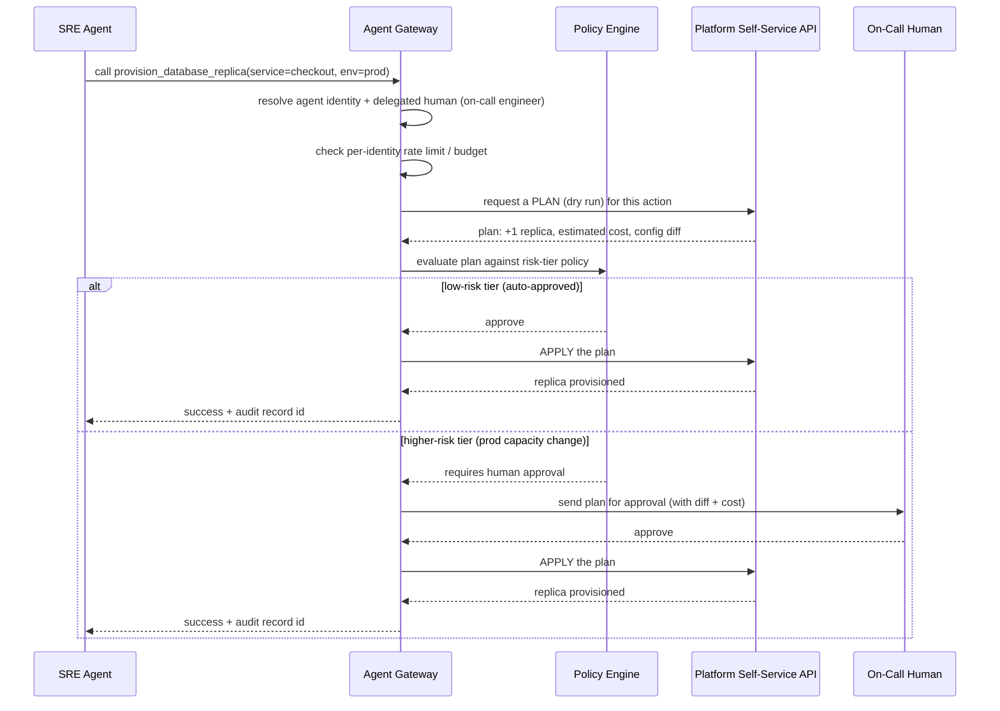

# Platform Engineering 2.0: Building Internal Platforms for AI Agents

> By the end of this article you'll be able to explain, concretely, what breaks when an AI agent becomes a caller of your internal developer platform instead of a human clicking through a portal — and what a platform team actually has to build differently to let that happen safely.

## The Problem

Every internal developer platform ever built shares one quiet assumption: a human is on the other end of the request.

A human reads the Backstage catalog page before clicking "Create Service." A human types a database name into a form, glances at the confirmation screen, and clicks "Provision." A human requesting a production change waits for a Slack approval, because a human is exactly the kind of thing that can wait, get distracted, come back, and read the message when it arrives. The entire self-service model — golden paths, software templates, approval gates — was designed around a caller who reads documentation, exercises judgment on ambiguous cases, and is naturally rate-limited by how fast they can type and how much attention they have.

Now put an AI agent behind the wheel. A coding agent working an incident decides the checkout service needs a read replica and a bumped memory limit. An SRE agent monitoring a queue backlog decides three more worker pods are needed, right now, in production. A "release agent" walks a golden path end to end — scaffold, provision, deploy — for a new microservice, with no human clicking anything in between.

None of this is speculative. It is the direct, obvious next step once agents are trusted to do real engineering work (see the prerequisite article on AI-native software development for how much of the SDLC that already covers) — and the platform is precisely the layer that stands between "the agent decided to do X" and "X actually happened to production infrastructure." If your platform's self-service surface only works through a UI a human reads, an agent calling it either can't use it at all, or — worse — ends up scripting around the UI in ways nobody designed, reviewed, or scoped.

This is the actual shift behind "Platform Engineering 2.0": the platform's customer is no longer only the human developer. It's the human developer *and* every autonomous process acting on their behalf, and those two customers have almost nothing in common in terms of pacing, judgment, and failure modes.

## Why This Problem Is Difficult

Three properties of an autonomous caller break assumptions that were safe to leave implicit when every caller was a person.

**1. Humans are naturally rate-limited; agents are not.** A human can only click "Provision Database" so many times per minute — attention span and typing speed are a free, built-in throttle that every existing IDP's capacity planning quietly leans on. An agent in a reasoning loop can generate hundreds of tool calls in the time it takes a human to read one Slack message. A rate limit that felt generous for a person can be exhausted, or abused, in seconds by a misbehaving agent loop.

**2. Golden paths encode judgment, not just steps.** A Backstage software template's real value isn't the YAML it generates — it's the platform engineer's implicit knowledge, written into a wizard, of *when* a given path applies: "use this template unless you're in the regulated-data zone, in which case ask the compliance team first." A human reads that caveat on the docs page and applies judgment. An agent following the same golden path either needs that judgment made explicit and machine-checkable, or it will guess — and an agent's guess, unlike a human's, doesn't come with a moment of hesitation you can catch in code review before it executes.

**3. Identity and blast radius don't map cleanly onto "who did this."** A human's platform actions are scoped to their SSO session and their own permissions. An agent acting "on behalf of" a human blurs that line: is the agent's access the human's access, delegated? Its own, narrower grant? If an incident-response agent that a junior engineer kicked off ends up with the same production-provisioning rights that engineer has, you've reproduced a classic confused-deputy problem — except the deputy can now act at machine speed, continuously, without needing to be at a keyboard.

Put together: the platform now has a consumer that can act faster than any rate limit assumed, that can't reliably apply the judgment a golden path's documentation assumed, and whose identity and authority are murkier than a logged-in human's. Every guardrail an IDP already has needs to be re-examined against that consumer, not just extended to cover it.

## A Simple Mental Model

Picture a national park built entirely around human visitors: paved roads with speed-limit signs a driver reads and (mostly) obeys, ranger stations where a person can ask "is this trail open today?" and get a judgment call, gates that a ranger opens after checking a paper permit.

Now let self-driving vehicles into the same park. A speed-limit sign painted on a rock works for a human driver who can read it and choose to slow down. It does nothing for a self-driving vehicle unless that limit is also encoded as a machine-readable rule the vehicle's control system actually enforces — a geofenced speed cap, not a suggestion. A ranger's judgment call ("the trail's a bit muddy but should be fine") is exactly the kind of nuanced exception a human visitor can weigh and a self-driving vehicle cannot safely improvise; it needs to be turned into an explicit, coded rule ("close the trail automatically below this moisture sensor threshold") or routed to a human for an explicit decision before the vehicle proceeds.

Platform Engineering 2.0 is that same shift applied to internal platforms. The golden paths and guardrails don't change in *purpose* — they still exist to let people (and now agents) build things quickly and safely without becoming infrastructure experts. What changes is that every rule a human used to interpret with judgment has to become either a hard, machine-enforced constraint, or an explicit stop-and-ask-a-human gate. There's no middle ground where the agent "uses good judgment" the way a person might, because it doesn't have the same kind of judgment, and treating it as if it does is how you get an agent that reads a fuzzy internal wiki page and confidently does the wrong thing at 3 a.m.

Where the analogy strains: a self-driving car in a park is still one vehicle, bounded by physics. An AI agent can spin up an unbounded number of parallel tool calls with no physical equivalent of "there's only one of me on this road" — which is exactly why blast-radius limits matter more here than in the park analogy, not less.

## Before We Continue

This article assumes you're already comfortable with:

- **What an internal developer platform actually is** — software catalogs, golden paths, self-service infrastructure provisioning. If "Backstage," "software template," and "golden path" are new terms, start with the two foundational articles on platform engineering and IDPs in this same folder.
- **What an AI agent is, as distinct from a chatbot or a simple assistant** — specifically, that an agent can plan, choose tools, execute them, and act on the result without a human approving every single step. The prerequisite article on agents vs. assistants covers this distinction in depth; we won't re-derive it here.
- **Basic OAuth/OIDC vocabulary** — access tokens, scopes, client credentials. We'll lean on this when discussing agent identity and delegation.
- **Basic Kubernetes/cloud platform familiarity** — the golden-path examples assume you know what "provisioning a database" or "deploying a service" means operationally, not how Kubernetes scheduling itself works.

We will not re-derive what MCP is, how tool calling works, or how OAuth flows are structured — those are covered in this knowledge base's AI-software-engineering and identity-access material, and we lean on them by name where relevant.

## The Core Idea

An Internal Developer Platform exists to turn "provision me a thing, safely, without me becoming an infrastructure expert" into a self-service action. Platform Engineering 2.0 doesn't change that mission. It changes one load-bearing assumption underneath it: **the caller invoking a golden path is no longer guaranteed to be a human who can be trusted to read, wait, and use judgment.**

That one change forces four concrete shifts, each of which the rest of this article walks through:

- **The API becomes the primary interface, not a backend detail behind a UI.** If a golden path can only be triggered by clicking through a wizard, an agent cannot use it at all. The self-service API has to be complete, schema-validated, and genuinely sufficient on its own — the UI becomes just one more client of it, not the only front door.
- **Golden paths need a machine-readable contract, not just human documentation.** The judgment calls a human applies when picking or configuring a golden path have to be made explicit: as JSON Schema constraints, as policy rules, or as an escalation to a human when the case is genuinely ambiguous.
- **Identity and authorization need a delegation model.** "The agent" and "the human on whose behalf it's acting" are two distinct identities that both need to be provable, both need to be scoped, and both need to show up in the audit trail — not collapsed into one blurry actor.
- **Guardrails need to assume machine-speed, not human-speed, misuse.** Rate limits, approval gates, and blast-radius controls all have to be re-sized for a caller that can act continuously and doesn't get tired, bored, or hesitant.

Everything below is really an answer to: *what does each existing IDP capability need to become, now that its caller might not be a person?*

## How It Actually Works

Start from the architecture most platform teams already have (a software catalog, golden-path templates, a self-service API, an IaC/GitOps backend), and see what has to be added — not replaced — to serve agents as a first-class caller alongside humans.

```
   Human Developer                    AI Agent
   (Backstage UI / CLI)               (planning + tool-calling loop)
          |                                 |
          |  clicks / types                | selects + calls a tool
          v                                 v
   +---------------------------------------------------+
   |            Agent Gateway / Tool Registry            |
   |  - exposes golden paths as schema-validated tools   |
   |  - resolves caller identity + delegation             |
   |  - enforces per-identity rate limits & risk tiers    |
   |  - runs "plan" before allowing "apply"               |
   +---------------------------+-------------------------+
                                |
                                v
   +---------------------------------------------------+
   |         Existing Self-Service Platform API           |
   |   (the same API the Backstage UI already calls)     |
   +---------------------------+-------------------------+
                                |
              +-----------------+------------------+
              v                                      v
   +--------------------+                +----------------------+
   |  Policy Engine      |                |  IaC / GitOps Layer   |
   |  (risk-tier a       |                |  (Crossplane, ArgoCD, |
   |   requested action) |                |   Terraform, etc.)    |
   +--------------------+                +----------------------+
                                |
                                v
                    Cloud / Kubernetes / Infrastructure
```

Two things about this diagram matter more than the specific boxes:

**The bottom half is unchanged.** The self-service API, the policy engine, and the IaC/GitOps backend are the same components a mature IDP already has (see the prerequisite IDP article). Platform Engineering 2.0 is not a rewrite of your platform — it's a new front door and a stricter gate, not a new foundation.

**The new layer is the Agent Gateway / Tool Registry.** This is the component that doesn't exist in a human-only IDP. Its job is to take the same golden paths a human triggers through Backstage and expose them as schema-validated, individually callable *tools* — in practice, this is usually built as an MCP server (see the prerequisite MCP articles) or an equivalent tool-calling interface, wrapping the existing platform API rather than reimplementing it.

### Golden paths as contracts, not wizards

The concrete artifact that changes is the golden path itself. A human-facing software template is, underneath, a form: free-text fields, a "Next" button, maybe some client-side validation. That's not something an agent can reliably use — not because agents can't call APIs, but because a form's validation logic and its implicit business rules usually live in JavaScript and tribal knowledge, not in a contract anything else can inspect.

The fix is to define the golden path once, as a schema, and let both the human UI and the agent tool call the *same* underlying contract:

```json
{
  "name": "provision_postgres_database",
  "description": "Provision a managed PostgreSQL instance following the standard golden path.",
  "inputSchema": {
    "type": "object",
    "properties": {
      "service_name": { "type": "string", "pattern": "^[a-z][a-z0-9-]{2,40}$" },
      "environment": { "type": "string", "enum": ["dev", "staging", "prod"] },
      "storage_gb": { "type": "integer", "minimum": 10, "maximum": 500 },
      "data_classification": {
        "type": "string",
        "enum": ["public", "internal", "regulated"]
      }
    },
    "required": ["service_name", "environment", "storage_gb", "data_classification"]
  }
}
```

Notice what happened to the judgment call from the mental-model section. "Use this golden path unless you're in the regulated-data zone" is no longer a sentence on a wiki page an agent has to interpret — it's the `data_classification` field, which the policy engine downstream can check deterministically: `regulated` always requires a specific compliance-approved storage configuration and a human sign-off, `public`/`internal` can proceed automatically. The ambiguity a human resolved by reading and thinking is now either resolved by the schema, or explicitly routed to a human — never silently guessed by the agent.

## Let's Walk Through an Example

An SRE agent is investigating a production incident: checkout-service is timing out under load, and the agent's diagnosis (based on metrics it queried) is that the database connection pool is exhausted and a read replica would relieve it. This is a good moment to map the agent's behavior onto the standard reasoning loop this knowledge base uses for agents generally — Goal → Context → Reasoning/Planning → Tool Selection → Tool Execution → Observation → Updated State → Next Action — because every box below is one turn of that loop.



Walking through the parts that don't exist in a human-only flow:

- **Identity resolution is two-sided.** The gateway records both *which agent* made the call and *which human's task* it's executing on behalf of (the on-call engineer who invoked the incident-response agent). Neither identity alone tells the whole story — "the agent did it" is meaningless for accountability without knowing whose authority it was acting under, and "the human did it" is misleading if they never reviewed the specific action taken.
- **A plan comes before an apply.** This borrows directly from infrastructure-as-code tooling's plan/apply separation: the platform API can compute and return *what would happen* without doing it, which is what makes an automated risk-tier check possible in the first place. You cannot risk-tier an action you can't see in advance.
- **The risk tier — not the agent — decides whether a human is in the loop.** A low-risk action (a dev-environment resource, a bounded-cost change) can auto-apply. A production capacity change with real cost and blast radius routes to a human, with the *exact* generated plan attached — not a vague description the human has to reconstruct from a Slack message.

## Under the Hood

### Agent identity is not human identity, reused

The single most common shortcut — and the single most common early mistake — is handing an agent process the same long-lived API token or SSO session a human platform engineer already has. This reproduces exactly the static-credential problem that Zero Trust architectures exist to solve (see the prerequisite/related material on workload identity): a credential that's broad, long-lived, and not scoped to a specific task is a standing liability the moment anything goes wrong — a prompt injection, a planning bug, a compromised agent runtime — because there's no way to tell "the agent doing its normal job" apart from "the agent doing something it was never supposed to do," and no cheap way to revoke just the agent's access without also locking out the human.

The pattern that actually holds up is **task-scoped delegation**, built on the same primitives OAuth already gives you:

- The agent authenticates as itself (a distinct client identity, ideally backed by short-lived workload credentials rather than a static secret — SPIFFE/SPIRE-issued identities or an equivalent are a common foundation here).
- Each task the agent performs gets its own narrowly scoped, short-lived token — via a token-exchange or client-credentials-style grant — rather than reusing one broad token across every action the agent ever takes.
- The token (or the request context around it) carries *both* the agent's identity and the human/service on whose behalf the task is running, so the audit trail never has to guess.

> **Verification Note**
> The exact protocol shape for agent-to-platform delegated authorization (which OAuth grant type, which token-exchange profile) is an actively evolving area as of this writing. Verify current best practice against the relevant OAuth/OIDC specifications and your identity provider's own documentation before committing to a specific flow in a design document — don't treat any single vendor's current pattern as a settled standard.

### Guardrails sized for machine speed, not human speed

Every existing IDP guardrail needs a second look through the lens of "what if this caller never gets tired":

- **Rate limits and quotas** need per-identity budgets sized around *acceptable blast radius per unit time*, not around what felt generous for a human clicking a button — a limit of "50 provisioning calls per minute" that would never be hit by a person can be exhausted by a buggy agent loop in seconds.
- **Circuit breakers** should trip on anomalous patterns from a single identity (a sudden burst of near-identical requests, repeated failures followed by retries with slightly different parameters — a classic sign of an agent "trying variations" after a rejected call) rather than only on aggregate system health.
- **Plan-then-apply** should be the default for any action with real cost or production impact, specifically because it gives you a deterministic thing to risk-tier, rate-limit, and audit *before* anything irreversible happens — the same reason Terraform's plan/apply split exists independent of who or what is running it.
- **Tiered approval gates**, using the same risk-tiering logic covered in this knowledge base's AI governance article for model deployments, apply just as directly to infrastructure actions: a low-stakes dev-environment action auto-approves; a production, cost-significant, or data-sensitive action requires a named human approver, with the specific generated plan in front of them — not a summary they have to trust.

## Implementation

Here's a minimal but realistic shape of the policy-gate step from the sequence diagram — the part of the gateway that decides whether a requested action can auto-apply or needs a human. The shape deliberately mirrors a CI/CD governance gate, because it's solving the same structural problem: turn a written policy into something that can actually block an action.

```python
# platform_gate.py
# Requires Python 3.9+ (uses PEP 585 built-in generics like list[str]).
from dataclasses import dataclass

@dataclass
class PlanRequest:
    caller_agent_id: str
    delegated_human_id: str
    action: str
    environment: str          # "dev" | "staging" | "prod"
    data_classification: str  # "public" | "internal" | "regulated"
    estimated_monthly_cost_usd: float


@dataclass
class GateDecision:
    verdict: str              # "auto_approve" | "requires_human_approval" | "blocked"
    reasons: list[str]


def evaluate(plan: PlanRequest) -> GateDecision:
    reasons: list[str] = []

    # Fail closed: an unrecognized environment is never treated as low-risk.
    if plan.environment not in ("dev", "staging", "prod"):
        return GateDecision("blocked", [f"unrecognized environment: {plan.environment!r}"])

    # Fail closed: an unrecognized data classification is never treated as fine
    # (the same principle applied to `environment` above must apply to every
    # enumerated field the gate reasons about, not just the one checked first).
    if plan.data_classification not in ("public", "internal", "regulated"):
        return GateDecision(
            "blocked", [f"unrecognized data_classification: {plan.data_classification!r}"]
        )

    if plan.data_classification == "regulated":
        reasons.append("regulated data classification always requires human sign-off")

    if plan.environment == "prod" and plan.estimated_monthly_cost_usd > 250:
        reasons.append(
            f"prod action estimated at ${plan.estimated_monthly_cost_usd:.2f}/mo "
            "exceeds auto-approve threshold of $250/mo"
        )

    if reasons:
        return GateDecision("requires_human_approval", reasons)

    return GateDecision("auto_approve", ["within dev/staging bounds and cost threshold"])


if __name__ == "__main__":
    example = PlanRequest(
        caller_agent_id="agent:sre-incident-bot",
        delegated_human_id="human:on-call-jane",
        action="provision_database_replica",
        environment="prod",
        data_classification="internal",
        estimated_monthly_cost_usd=340.00,
    )
    decision = evaluate(example)
    print(decision.verdict)
    for r in decision.reasons:
        print(f" - {r}")
```

Two details worth calling out, because they're where real implementations go wrong:

- **The gate records both identities on every decision.** `caller_agent_id` and `delegated_human_id` are both mandatory fields on the request, not optional metadata — because the audit question six months later is never just "what did the agent do," it's "under whose authority."
- **An unrecognized environment fails closed, not open.** The same fail-closed principle used in the AI-governance gate example applies here: a gate that treats "I don't recognize this input" as "must be fine" is not a gate, it's a formality.

## What Can Go Wrong

- **Runaway provisioning loops.** An agent stuck in a retry loop — misinterpreting a rejection as a transient failure and retrying with slight parameter variations — can generate far more infrastructure spend or resource churn in minutes than a human ever could in a full day, precisely because nothing about the loop gets tired or reconsiders.
- **Golden-path guessing.** If a golden path's schema doesn't make a judgment call explicit (as in the `data_classification` example), an agent will make a choice anyway — and unlike a human who might pause and ask a colleague, an agent's incorrect guess proceeds with full confidence unless something downstream catches it.
- **Confused-deputy delegation.** An agent inheriting a human's full session or a static, broadly-scoped service token means any flaw in the agent — a bug, a prompt injection via a poisoned tool response (see the related article on tool poisoning attacks) — can act with the full authority of whoever the agent was "helping," not the narrower authority the specific task actually needed.
- **Shadow tool usage.** If the governed platform's golden paths don't yet cover something an agent needs, the path of least resistance is calling the underlying cloud/Kubernetes API directly, bypassing the gateway, the policy checks, and the audit trail entirely — the same "shadow AI" dynamic covered in this knowledge base's AI governance article, just aimed at infrastructure instead of model deployment.
- **Approval fatigue.** As agent-generated requests scale up in volume, a human approver asked to review dozens of plans a day starts rubber-stamping them without reading the diff — at which point the "human approval gate" exists on paper but provides none of the actual judgment it was designed to add.

## Security Considerations

- **Asset:** the platform's self-service provisioning capability itself, the cloud/Kubernetes credentials it holds, and the audit trail recording who authorized what.
- **Threat:** a compromised or manipulated agent (through a prompt injection delivered via a poisoned tool response, a planning error, or a compromised runtime) issues provisioning or configuration actions its human operator never intended; alternatively, an agent's broad, reused credential is exfiltrated and used directly against the platform API, bypassing the agent entirely.
- **Vulnerability:** long-lived, broadly-scoped credentials issued to an agent process instead of short-lived, task-scoped ones; golden paths with free-text or under-constrained fields that let an agent (or an attacker manipulating one) supply unexpected values; a gateway that doesn't distinguish "agent identity" from "delegated human identity," making it impossible to reason about whose authority was actually exercised; direct cloud/Kubernetes API access left open as a bypass around the gateway.
- **Mitigation:** short-lived, task-scoped tokens issued per action rather than per agent lifetime; strict JSON-Schema validation on every tool input, with no free-text field that maps directly onto an infrastructure parameter without validation; mandatory dual-identity logging (agent + delegated human) on every action; plan-then-apply as a structural requirement for anything with production impact, so a human or policy engine reviews an actual diff rather than a description; closing or tightly monitoring direct infrastructure API paths that route around the governed gateway.
- **Residual risk:** even a well-scoped agent, acting entirely within its granted authority, can still make a wrong call within that authority's bounds — a "cleanup agent" correctly scoped to delete unused resources can still delete the wrong resource if its reasoning about "unused" is flawed. Scoping and gating bound the *blast radius* of a mistake; they don't eliminate the possibility of a mistake within that radius. This is why the AI-governance principle of periodically reviewing the *gate's own coverage*, not just individual incidents, applies here just as much as it does to model deployment gates.

## Common Misconceptions

**Misconception:** Giving the agent the same API token the human developer already has is fine to start — we'll tighten it up later.
**Reality:** "Later" rarely comes, and every day it doesn't is a day a single compromised or malfunctioning agent has the full blast radius of a human platform engineer's credentials, with none of the natural pacing a human provides. Task-scoped delegation is cheap to build in from the start and expensive to retrofit once dozens of agent workflows depend on the broad credential.

**Misconception:** The Backstage UI a human already uses counts as "self-service," so the platform is already agent-ready.
**Reality:** A UI wizard's validation logic, implicit judgment calls, and multi-step flow live in places (client-side JavaScript, a human's ability to read a caveat on the page) an agent cannot reliably access. Being usable by a human through a UI and being callable by a machine through a documented, schema-validated contract are different properties, and only the second one makes a golden path agent-ready.

**Misconception:** Rate limits and quotas tuned for human traffic already protect the platform from a misbehaving agent.
**Reality:** Human traffic is naturally throttled by attention and typing speed in a way that quietly absorbed a lot of "the limit is generous enough" assumptions. An autonomous loop has no equivalent throttle, so a limit that was never tested against a caller that doesn't get tired can be exhausted or abused far faster than anyone planned for.

## Real-World Architecture

The pattern converging across platform teams building for agent consumers, regardless of specific vendor, has the same shape:

- **An MCP server (or equivalent tool-calling interface) sitting in front of the existing self-service API**, exposing golden paths as individually callable, schema-validated tools rather than requiring an agent to somehow drive a UI. This is the same MCP pattern covered in this knowledge base's AI-software-engineering material, applied to platform actions specifically instead of general-purpose developer tools.
- **A policy engine (frequently OPA/Rego, or an internal equivalent) reused across both the AI-governance gate (model deployments) and the platform gate (infrastructure actions)** — the same risk-tiering logic, applied to a different kind of decision, which is a strong signal that "should a human review this before it happens" is a general platform-engineering primitive now, not a bespoke concern per team.
- **Identity built on workload-identity primitives (SPIFFE/SPIRE or a cloud provider's equivalent short-lived credential system) rather than static service-account keys**, specifically so an agent's identity can be issued, scoped, and revoked independently of any human's session.

> **Verification Note**
> Specific product features for agent-facing platform tooling — including Backstage's own roadmap for agent/MCP integrations, and any particular cloud provider's agent-identity or delegated-authorization offerings — are moving quickly as of this writing. Verify current capabilities against the relevant vendor's own documentation (the Backstage project's own docs, or your cloud provider's architecture center) before relying on a specific feature name in a design decision.

## Expert Insight

The trade-off experienced platform teams learn to manage deliberately is **autonomy versus blast radius**, and it fails in the same two directions the AI-governance gate trade-off does. Grant agents the same broad, human-equivalent access "to get things working" and you've built a system where a single bad reasoning step can do human-scale damage at machine speed — which is a strictly worse failure mode than a human making the same mistake, because there's no natural pause where a person might have caught it. Lock every single action behind mandatory human approval, regardless of risk, and you've reproduced the "you build it, you run it" cognitive-overload problem platform engineering was invented to solve in the first place — except now it's a human approver drowning in a queue of agent-generated requests they can't meaningfully review at that volume, which is exactly how approval fatigue turns a real gate into a rubber stamp.

The pattern that holds up in practice is **progressive trust, scoped by golden path, not by agent**: start every new agent-callable golden path in plan-only or dry-run mode, with every action reviewed by a human regardless of apparent risk, and only promote specific, narrow, well-understood paths (a dev-environment scaffold, a bounded-cost resource bump) to auto-apply once the path has a track record and a tight, explicit schema. The trust you extend is a property of the *golden path's* risk profile, not a blanket grant to "this agent is generally trustworthy" — the same way a human platform engineer earns broader production access over time for specific classes of action, not as an unconditional promotion.

## Try It Yourself

**Goal:** Feel the difference between a human-facing golden path and a machine-callable one, and see a risk-tiered gate actually block something.

**Starting Point:** Any toy "provisioning" script you can call locally (even one that just writes a YAML file to disk instead of touching real infrastructure) — the point is the gate logic, not the cloud call underneath it.

**Task:**
1. Write a JSON Schema for your provisioning action's inputs (name, environment, a cost estimate field), the way the `provision_postgres_database` example does above.
2. Adapt the `platform_gate.py` script from the Implementation section to evaluate a request against that schema plus a cost threshold.
3. Call it twice: once with `environment=dev` and a low cost estimate, once with `environment=prod` and a cost estimate above your threshold.
4. Confirm the first call returns `auto_approve` and the second returns `requires_human_approval` — and that changing `environment` to something not in your enum causes the gate to fail closed (`blocked`), not silently pass.

**Expected Result:** Three distinct, correct outcomes from three inputs that differ only in the fields your gate actually inspects — proving to yourself that the risk tier is a function of the request's own declared properties, not something the caller can talk its way around.

**What You Learned:** A gate is only meaningful if it can produce a different, correct answer for different inputs, including inputs it wasn't specifically told to expect — the same fail-closed principle that matters in every governance gate in this knowledge base, applied here to infrastructure instead of model deployment.

## Pause and Think

A platform team builds an MCP tool wrapping their golden path, adds JSON Schema validation on every field, and lets an incident-response agent call it directly in production with no human approval step at all — reasoning that "the schema already prevents bad input, so we don't need a human in the loop."

Has this team built an agent-ready platform?

### Answer

Not quite — and this is a genuinely common gap. Schema validation prevents *malformed* input (a negative storage size, an environment value that isn't in the enum). It does nothing about *well-formed but wrong* input — a syntactically valid request to provision a production read replica for a service that doesn't actually need one, because the agent's diagnosis was mistaken. That's not a validation problem; it's a judgment problem, and judgment is exactly what a risk-tiered approval gate exists to add back in for the cases that matter. A schema and a gate solve different problems: the schema makes sure the request is well-formed enough to reason about at all; the gate decides, based on the *content* of a well-formed request (environment, cost, data classification), whether a human needs to look at it before it takes effect. Skipping the gate because the schema already exists is the infrastructure equivalent of a governance program with a model card but no approval threshold — you've built the artifact, not the control.

## Key Takeaways

- Internal developer platforms were built assuming a human caller who reads, waits, and applies judgment. Once AI agents become first-class callers, every guardrail built on that assumption needs re-examination, not just extension.
- The self-service API — not the UI — has to be the primary, complete interface, because an agent cannot reliably drive a human-facing wizard.
- Golden paths need to become machine-readable contracts (explicit schemas and policy rules) rather than documentation a human interprets — the judgment calls a human applied have to be made explicit or routed to a human, never silently guessed by an agent.
- Agent identity has to be distinct from, and delegated from, human identity: short-lived, task-scoped credentials, with both the agent's identity and the human/service on whose behalf it acts recorded on every action.
- Guardrails — rate limits, circuit breakers, plan-then-apply, tiered approval gates — need to be sized for a caller that doesn't get tired, bored, or hesitant, not for the pacing a human caller naturally provided for free.
- Scoping and gating bound the blast radius of a mistake; they don't eliminate the possibility of a well-scoped agent making a wrong call within its own granted authority. Periodic review of the gate's own coverage matters as much here as it does for AI governance gates.

## What to Learn Next

This article covered the shape of the shift: what changes in an IDP's architecture, identity model, and guardrails once an autonomous agent is a first-class caller alongside humans. Two directions continue directly from here, both already planned in this platform-engineering series:

- **GPU Provisioning for Platform Teams: Scheduling Scarce AI Compute** applies this same self-service-plus-guardrails thinking to the specific, especially blast-radius-sensitive case of GPU capacity — arguably the highest-stakes resource an agent could over-provision.
- **FinOps for AI: Understanding and Controlling LLM Inference Costs** picks up the cost-control thread from the "runaway provisioning" failure mode above and goes deep on measuring and bounding AI-driven spend specifically.

If your interest is specifically in the identity and Zero Trust side of this problem rather than the platform side, the identity-access series' planned articles on AI agent identity and Zero Trust for AI agents go much deeper into the delegation and workload-identity mechanics this article only introduced.
