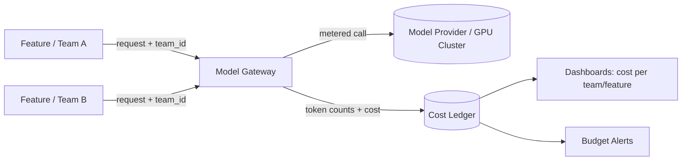
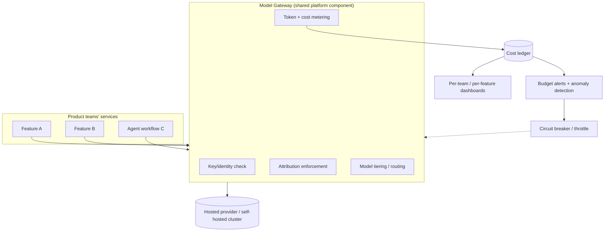

# FinOps for AI: Understanding and Controlling LLM Inference Costs

> By the end of this article you'll be able to explain exactly where a dollar of LLM inference spend goes, build a system that attributes that dollar to the team and feature that spent it, and make the specific architecture changes that bring the bill down without a product owner ever noticing a quality drop.

## The Problem

A mid-sized SaaS company adds an AI assistant to their product. It ships fast, users like it, and for the first month the finance team barely notices the new line item on the cloud invoice — a few thousand dollars, filed under "misc API costs."

In month two, a product manager on a different team ships a feature that uses the same assistant under the hood to auto-summarize support tickets. It's a good feature. It also happens to retry silently on timeout, and — because nobody set a cap — it occasionally lets the model call itself in a short reasoning loop to "double-check" its answer. Nobody sees this happen. There's no dashboard for it. There's no alert. It just runs, ticket after ticket, multiplying token usage by a factor nobody measured.

By month three, the invoice arrives at twelve times what it was in month one. Finance asks engineering what happened. Engineering doesn't actually know — there's no per-feature cost breakdown, no per-team budget, and no alert that fired before the bill did. The honest answer is: something changed, spend followed, and the first time anyone measured it was on an invoice thirty days after the fact.

This is not a hypothetical failure of technology. It's a failure of practice. The infrastructure worked exactly as built. What was missing was the discipline that makes cloud spend visible, attributable, and governable *before* it becomes a surprise — the discipline the cloud industry already has a name for: **FinOps**. This article is about what that discipline looks like once the metered resource is a token or a GPU-second instead of a virtual machine.

## Why This Problem Is Difficult

Traditional cloud FinOps rests on an assumption that quietly breaks for AI workloads: that cost is proportional to *provisioned* resources, and that resources are taggable, stable units — a VM, a disk, a load balancer — that sit still long enough to be labeled and billed to a cost center.

LLM inference violates that assumption in three specific ways:

1. **The billable unit isn't the infrastructure — it's the request's content.** A hosted-model API call doesn't cost a fixed amount per call; it costs an amount proportional to how many tokens went in and how many came out. Two calls to the same endpoint, from the same team, doing the same feature, can cost 50x different amounts depending on how much conversation history, retrieved context, or reasoning the request carried. Standard cloud cost tools that tag *resources* have nothing to attach to here — there's no persistent VM to label, just a stream of variably-sized requests.

2. **Self-hosted inference cost is dominated by idle capacity, not by usage.** If you run your own GPU fleet, you pay for GPU-hours whether the GPU is doing useful work or sitting idle waiting for the next request — and (as covered in *AI Infrastructure Explained*) idle GPU capacity is typically the majority of an AI infrastructure bill, not a rounding error. That means the "cost per feature" question can't be answered by looking at API pricing at all; it depends on cluster utilization, batching efficiency, and scheduling — numbers most product engineers never see and most finance teams don't know how to ask for.

3. **The people who make the cost-relevant decisions rarely see the cost signal.** An engineer deciding whether to include three retrieved documents in a prompt or one, whether to let an agent retry a failed tool call three times or fail fast, or whether a background job re-summarizes an entire conversation history on every turn — each of those decisions has a direct, multiplicative effect on spend. But that engineer is looking at a pull request, not an invoice. By the time the cost shows up, it's aggregated across the whole company, weeks removed from the fifteen small decisions that actually caused it.

Put together: the cost signal is granular, content-dependent, and decided at code-review time, but it's normally observed in aggregate, weeks later, by someone who wasn't in the room. FinOps for AI exists to close that gap.

## A Simple Mental Model

Think of traditional cloud cost like a fixed monthly rent, and LLM inference cost like a taxi meter.

Rent is predictable: you know the apartment, you know the price, and the amount doesn't change based on how you use the rooms. Provisioning a database or a web server fleet has historically felt this way — you pick a size, you pay for that size, and cost forecasting is mostly a matter of counting how many of them you're running.

A taxi meter is different. The price isn't set when you get in the car — it accumulates continuously based on distance and time, and it's directly shaped by decisions made *during* the ride: which route the driver takes, how much traffic you sit in, whether you ask them to wait outside a store. Two riders going to superficially "the same kind of place" can end up with wildly different fares depending on choices made along the way.

LLM inference is a taxi meter, not rent. Every token in the prompt and every token generated is distance on the meter. A long system prompt, a bloated retrieved context, a chatty back-and-forth agent loop — these are the equivalent of sitting in traffic or taking the scenic route, and they show up directly in the fare. FinOps for AI is the practice of putting a meter display where the driver (the engineer writing the prompt or the agent loop) can actually see it while the ride is happening, instead of only at the finance department's front desk a month later.

Where the analogy stops working: a taxi fare is linear and easy to predict per mile. LLM cost is not always linear — batching, caching, and prompt-caching discounts mean the *marginal* cost of one more request can be much lower than the *average* cost of the first one, and self-hosted GPU cost doesn't scale down at all just because traffic is light. Keep that non-linearity in mind; it's the reason "just multiply cost-per-call by call volume" forecasts are so often wrong.

## Before We Continue

This article assumes you're comfortable with:

- **How LLM inference actually spends compute** — prefill vs. decode, the KV cache, and continuous batching. If those terms are new, read *AI Infrastructure Explained: The Stack Behind Every LLM Call* first; this article treats that mechanism as known and focuses on the economics layered on top of it.
- **Prompt and context construction as a cost lever** — *LLM Engineering Explained* already introduced model tiering and "context is the actual cost lever, and it's mostly invisible until you measure it." This article picks up exactly where that left off: it's about building the organizational and platform-level systems that make that invisible cost visible and governable at scale, not re-deriving why context costs money.
- **What an internal platform team actually does** — golden paths, self-service tooling, and treating developers as the platform's customers, as covered in *Platform Engineering Explained: Bridging DevOps and Dev UX*.
- **Basic cloud cost vocabulary** — tagging, cost centers, showback vs. chargeback. If you've worked with any cloud provider's billing console or cost-allocation tags, you have enough background.

## The Core Idea: FinOps Meets a Metered, Elastic Workload

FinOps — as a discipline — is usually described as a loop of three phases: **Inform** (make cost visible and attributable), **Optimize** (find and apply the changes that reduce waste), and **Operate** (build the ongoing governance — budgets, alerts, policies — that keeps costs aligned with business value over time). None of that is new or AI-specific; finance and platform teams have run this loop for compute, storage, and networking for years.

What's new is the resource being metered. AI FinOps applies the same Inform → Optimize → Operate loop to a workload where:

- The "SKU" is a token (for hosted APIs) or a GPU-second (for self-hosted inference), not a VM-hour.
- Usage is driven by application-layer decisions — prompt length, retry logic, agent loop depth — not just infrastructure provisioning choices.
- The people who most need the cost signal (the engineers writing the prompts and orchestration code) are furthest from the systems that traditionally display it (the cloud billing console).

The rest of this article works through each phase concretely: where the cost actually comes from (Inform), what architecture changes reduce it (Optimize), and what allocation, budgeting, and alerting practices keep it under control on an ongoing basis (Operate).

## How It Actually Works: Where LLM Inference Cost Actually Comes From

There are two fundamentally different cost models, depending on whether you're calling a hosted model API or running your own inference cluster. Almost every organization ends up dealing with both.

### Tokens: the unit of hosted-API cost

When you call a hosted model provider, you're billed per token — typically a separate rate for input (prompt) tokens and output (generated) tokens, with output tokens usually priced several times higher than input tokens because generation is the expensive, sequential, memory-bound part of the work (see the decode-phase discussion in *AI Infrastructure Explained*).

A rough cost model for a single request looks like:

```text
request_cost = (input_tokens  × price_per_input_token)
             + (output_tokens × price_per_output_token)
```

Two things make this deceptively easy to underestimate:

- **Input tokens include everything in the context window** — the system prompt, conversation history, retrieved documents, tool schemas, few-shot examples. None of that is "free" just because the user didn't type it themselves.
- **A single user-visible "turn" can be many billed requests.** An agent that calls a tool, reads the result, and calls the model again to decide the next step is paying the full input-token cost *again* on the second call — including everything accumulated so far. A five-step agent loop doesn't cost roughly five times one call; it can cost significantly more, because context grows with every step while being resent in full each time.

> **Verification Note**
> Exact per-token prices, input/output price ratios, and discount structures (prompt caching, batch APIs) vary by provider and change frequently. Treat any specific number here as illustrative; verify current pricing against the provider's own pricing page before using it in a real budget.

### GPU-hours: the unit of self-hosted cost

If you run your own inference cluster (open-weight models on your own or rented GPUs), the billing unit shifts entirely: you pay for GPU-time, not tokens. A GPU costs the same per hour whether it's serving one request or fifty in a batch, and whether it's 95% utilized or sitting mostly idle waiting for traffic.

That means the actual **cost per token** you're achieving is not a fixed number set by a pricing page — it's a derived metric:

```text
effective_cost_per_token = (GPU $/hour) / (tokens produced per hour on that GPU)
```

Everything that raises *tokens produced per hour* — better batching, a model that fits more efficiently in memory, higher GPU utilization — directly lowers your effective cost per token, with no pricing negotiation required. This is why the batching and utilization discussion in *AI Infrastructure Explained* is not just a performance topic; it is the single biggest lever on self-hosted inference economics.

### Batching efficiency: the multiplier that connects the two

Whether you're comparing a hosted-API bill against the alternative of self-hosting, or trying to reduce your existing self-hosted bill, the same variable keeps showing up: how much useful work each GPU is doing per unit of time it's switched on.

| Lever | Effect on cost | Effect on latency | Effect on quality |
|---|---|---|---|
| Larger batch sizes / higher queuing tolerance | Lower cost per token (more output per GPU-hour) | Higher time-to-first-token for individual requests | None, if implemented correctly |
| Smaller, cheaper "tier" model for easy requests | Lower cost per request | Usually lower latency too | Risk of quality drop if routing logic is wrong |
| Full response caching for identical repeated queries | Near-zero marginal cost on cache hits (the model call is skipped entirely) | Near-zero latency on cache hits | None, if cached content is genuinely reusable |
| Provider-level prompt-prefix caching (cached system prompt / tool schema) | Discounted, not free — the cached portion of the input is billed at a reduced rate, and every other input token plus all output tokens are still billed normally | Lower time-to-first-token (less prefill work on the cached prefix); total latency is still dominated by decode, which prefix caching does not skip | None, if cached content is genuinely reusable |
| Trimming unnecessary context (history, retrieved docs) | Lower cost, linear in tokens removed | Lower latency (less to process in prefill) | Risk of quality drop if the wrong content is trimmed |
| Reserved/committed GPU capacity vs. on-demand | Lower $/GPU-hour at the cost of flexibility | No direct effect | None directly, but under-provisioning risk if demand is mis-forecast |

The pattern to notice: cost and latency usually move together (the same decisions that reduce cost also reduce latency), while cost and quality only move together when the optimization is done carefully — which is exactly why cost-aware architecture decisions need to be paired with the evaluation practices this knowledge base covers separately, not applied blindly.

## Let's Walk Through an Example

Say a support-ticket summarization feature makes one call per ticket: a 2,000-token system prompt plus retrieved context, and a 150-token summary as output. At illustrative pricing of $3 per million input tokens and $15 per million output tokens:

```text
input_cost  = 2,000 tokens  × ($3  / 1,000,000) = $0.006
output_cost =   150 tokens  × ($15 / 1,000,000) = $0.00225
total per ticket ≈ $0.00825
```

That looks trivial — well under a cent. Now add the two changes that actually happened in the opening scenario:

1. **Silent retries.** A flaky downstream call causes 15% of requests to retry once. That's not a 15% cost increase in isolation — it's 15% of *all* the input tokens (the full context) being sent again, because most retry logic resends the whole request rather than resuming partway through.
2. **A self-check loop.** The agent now calls the model a second time to "verify" its own summary, which means the second call's input includes the original 2,000-token context *plus* the 150-token draft summary, plus new instructions — call it 2,300 tokens in, 150 out.

```text
per ticket cost (with retries + self-check):
  first call:   $0.00825
  retry (15% of the time): 0.15 × $0.00825           ≈ $0.00124
  self-check call: (2,300 × $3/1e6) + (150 × $15/1e6) ≈ $0.00915
  total ≈ $0.0186 per ticket average
```

That's roughly **2.25x** the original per-ticket cost — and every bit of that multiplier came from application-layer decisions (retry policy, agent loop design) that a pure "which model should we use" conversation would never surface. At 500,000 tickets a month, the difference between $4,125 and $9,300 is exactly the kind of gap that shows up as "why did the bill triple" instead of as a code-review comment three months earlier.

## Cost Allocation: Making Spend Attributable

The first FinOps practice — Inform — is cost allocation: making sure every unit of spend can be traced back to the team, feature, or even individual user that caused it. Two mechanisms make this possible.

**A model gateway as the metering point.** Route every LLM call — regardless of which team or service originates it — through a shared internal gateway, rather than letting teams call provider APIs directly with their own keys. (*LLM Engineering Explained* already introduced model gateways as an orchestration and reliability pattern; cost metering is the same component doing double duty.) The gateway is the one place that reliably sees every request's token counts, so it's the natural place to record them.



**Tagging every call with attribution metadata.** Every request that flows through the gateway should carry a small set of required fields — team ID, feature/product ID, and (where applicable) a user or tenant ID — the same way cloud resource tags attribute a VM's cost to a cost center. Enforce this at the gateway: reject or flag untagged calls rather than letting them fall into an "unattributed" bucket that quietly grows over time.

```python
# Simplified cost-metering middleware around an LLM call.
# In production this sits inside the shared model gateway, not in application code.

from dataclasses import dataclass
from time import time

PRICE_PER_MILLION_INPUT = 3.00   # illustrative — verify against current provider pricing
PRICE_PER_MILLION_OUTPUT = 15.00

@dataclass
class CallAttribution:
    team_id: str
    feature_id: str
    user_id: str | None = None

def record_and_charge(attribution: CallAttribution, input_tokens: int, output_tokens: int, cost_ledger) -> float:
    if not attribution.team_id or not attribution.feature_id:
        # Enforce attribution at the metering boundary — don't let spend go untagged.
        raise ValueError("LLM call missing required cost attribution (team_id/feature_id)")

    cost = (input_tokens / 1_000_000 * PRICE_PER_MILLION_INPUT) \
         + (output_tokens / 1_000_000 * PRICE_PER_MILLION_OUTPUT)

    cost_ledger.write({
        "timestamp": time(),
        "team_id": attribution.team_id,
        "feature_id": attribution.feature_id,
        "user_id": attribution.user_id,
        "input_tokens": input_tokens,
        "output_tokens": output_tokens,
        "cost_usd": cost,
    })
    return cost
```

The important line is the `raise ValueError` — a cost-allocation system that *allows* untagged calls will accumulate an "unattributed" bucket that grows every month and that nobody can act on, because nobody owns it. Rejecting (or at minimum loudly flagging) untagged calls at the point of metering is what keeps the ledger actually useful instead of becoming its own kind of technical debt.

Once every call is tagged and logged, you can compute **unit economics** that mean something to a product owner, not just an aggregate dollar figure: cost per resolved support ticket, cost per active user per month, cost per successfully completed agent task. Raw spend going up is not automatically bad news if the number of tickets resolved went up proportionally more — unit economics is what tells the difference between "we're serving more users" and "we got less efficient."

## Budget Alerts and Anomaly Detection

Allocation tells you where money went after the fact. The Operate phase is about catching a problem while it's still small.

**Per-team, per-feature budgets.** Set a monthly (or daily, for anything experimental) spend threshold per team and per feature, derived from expected traffic × expected cost-per-request — the same exercise as sizing a cloud budget alert, just with tokens as the unit instead of compute-hours.

**Anomaly detection, not just threshold alerts.** A hard monthly budget alert fires too late to help if a bug causes spend to 5x in the first three days of the month. Track a short-window rate (spend per hour, tokens per hour, average tokens-per-request) per team/feature, and alert on deviation from that team's own recent baseline — a sudden change in *average tokens per request* is often the earliest, most specific signal that something changed in the code (a context-trimming step got skipped, a loop stopped terminating), well before the absolute dollar figure looks alarming.

**Circuit breakers, not just alerts.** An alert that pages someone at 3 a.m. is better than nothing, but a gateway that can automatically throttle or pause a feature that blows past N standard deviations of its own historical spend rate is the difference between "we caught it in an hour" and "we caught it in three weeks." This is the same reliability pattern as a rate limiter or a circuit breaker protecting a downstream dependency — here the thing being protected is the budget.

## Cost-Aware Architecture Decisions

Everything above makes cost *visible*. The Optimize phase is choosing what to build differently once it is. In priority order of typical impact:

1. **Model tiering.** Route requests to the smallest/cheapest model that reliably handles them, and only escalate to a larger model when a classifier, confidence score, or explicit fallback rule says the task needs it. This was introduced in *LLM Engineering Explained* as a latency and cost lever together — from a FinOps lens, it's usually the single highest-leverage change available, because it directly reduces the price-per-token side of the cost equation for the majority of "easy" traffic.
2. **Context discipline.** Cap conversation history length (summarize older turns instead of resending them verbatim), limit the number of retrieved documents to what evaluation shows actually improves answers, and audit system prompts periodically for accumulated instructions nobody has re-justified in months. This is the "cost you didn't mean to send" problem from *LLM Engineering Explained*, now treated as an ongoing platform-level audit rather than a one-time fix.
3. **Caching.** Cache responses (or intermediate results) for genuinely repeatable queries, and use provider-level prompt caching for large, stable prefixes (a long system prompt or tool schema that's identical across many calls) where the provider supports it and the discount is real.
4. **Batch/asynchronous APIs for non-interactive work.** Anything that doesn't need an immediate response — bulk summarization, offline classification, nightly report generation — is a candidate for asynchronous batch processing rather than the interactive API path, which is typically the highest-cost path per token precisely because it's optimized for low latency, not maximum throughput.
5. **Right-sizing self-hosted capacity.** Don't run a model on GPU capacity sized for the largest model in your fleet if a smaller, cheaper accelerator class serves it just as well — this is the demand-side half of a conversation whose supply side (scheduling and provisioning scarce GPU capacity) is covered in *GPU Provisioning for Platform Teams*.

None of these are free — model tiering can misroute a hard query to a weak model, context trimming can drop something the model actually needed, caching can serve a stale answer if applied carelessly. Every one of these levers should be validated against your evaluation harness before being trusted in production, not shipped purely because a dashboard showed it would save money.

## What Can Go Wrong?

- **Retries and timeouts double-billing silently.** A request that times out client-side after the provider already started (or finished) generating a response is often still billed — the client's view of "it failed" and the provider's view of "it succeeded and I billed for it" can disagree, and naive retry logic compounds this by resending the same expensive context.
- **Shadow API keys bypassing the gateway.** The moment any team can get a provider API key directly (for a "quick prototype") and call the provider without going through the metered gateway, your cost-allocation system has a blind spot — and blind spots have a habit of becoming permanent once the prototype quietly ships.
- **Runaway agent loops.** Multi-step agentic workflows that retry, self-correct, or recurse without a hard step limit can turn a bounded-cost feature into an unbounded one; a missing max-iteration guard is a cost bug, not just a reliability bug.
- **Misattributed cost on shared infrastructure.** On multi-tenant self-hosted clusters, if utilization and GPU-time aren't tracked per tenant/team at the scheduler level, "cost per team" becomes a rough estimate at best — you can only allocate what you can actually measure.
- **Optimizing the wrong side of a cost/quality trade-off.** Cutting context or downgrading a model tier without evaluation coverage can save money while quietly increasing failure rate — which then shows up as *more* retries, *longer* conversations, or escalations to a human, sometimes costing more overall than the "expensive" version did.

## Security Considerations

Cost governance and security governance share more infrastructure than they get credit for:

- **API keys are simultaneously a cost boundary and a security boundary.** A leaked or overly broad model-provider API key is both a security incident (unauthorized access to a paid service, potential data exposure through prompts) and a direct cost incident (an attacker or a misused key can generate real spend before anyone notices). Scope keys per team/service with least privilege, rotate them, and route usage through the gateway so an anomalous key immediately shows up in the same anomaly-detection pipeline built for cost control.
- **Rate limiting protects both budgets and availability.** A per-team or per-user rate limit that exists "for cost control" is doing double duty as abuse and denial-of-service protection — a compromised account or a scripted abuse pattern hits the same ceiling a runaway feature would.
- **Audit logs are a shared artifact.** The same request log that lets you answer "which feature spent this money" also answers "which identity made this call, with what data, at what time" — a security-incident question. Building one attribution pipeline for both purposes is more reliable than building two that can drift apart.

## Common Misconceptions

**Misconception:** "We picked a cheaper model, so our cost problem is solved."
**Reality:** Model choice sets the price-per-token; it doesn't control how many tokens get sent. A cheaper model with an uncapped context, unbounded retries, or unnecessary agent loops can easily cost more in aggregate than a pricier model called carefully — architecture and governance dominate raw model pricing far more often than teams expect.

**Misconception:** "Our existing cloud FinOps tooling already covers this — it's just another line item on the same bill."
**Reality:** Cloud cost tools built around tagging VMs, disks, and managed services generally can't see *inside* a single API call the way token-level attribution requires, and they have no visibility at all into a self-hosted cluster's GPU-utilization-driven effective cost per token. AI FinOps needs its own metering layer (the gateway), even when the invoice itself still arrives through the same cloud billing account.

**Misconception:** "High GPU utilization numbers on the dashboard mean we're running efficiently."
**Reality:** As covered in *AI Infrastructure Explained*, utilization and cost-efficiency can move in surprising directions depending on batching strategy — a configuration tuned for maximum batch throughput can show excellent utilization while making individual users wait, and a latency-tuned configuration can look responsive while burning far more GPU-hours per unit of useful output. Track cost per token and cost per outcome directly rather than treating utilization percentage as a stand-in for either.

## Real-World Architecture

A typical mature setup layers cost governance the same way it layers reliability and security: at a shared chokepoint, not scattered across application code.



This mirrors the general shape of cloud cost-management reference architectures published by the major cloud providers' architecture centers — a centralized metering/tagging chokepoint feeding a cost ledger, dashboards, and automated budget enforcement — adapted so the metered unit is a token or a GPU-second instead of a compute instance.

## Expert Insight

Platform teams who've run this loop for a while converge on a few hard-earned rules:

**Treat the token/cost budget like an SRE error budget.** An error budget gives a team explicit permission to take risks up to a threshold, and an explicit trigger for tightening up once they cross it. A cost budget can work the same way: a team that's well under budget has real license to experiment with agentic features or larger context windows; a team that's near or over budget should treat further scope growth the way an SRE team treats further feature velocity against a burned error budget — as something that needs a conversation, not a silent override.

**Cost per outcome beats cost per call, every time.** Raw spend numbers invite the wrong optimization — cutting cost per call by degrading quality, which then increases retries, escalations, or user churn, and costs more overall through a different door. Whenever possible, report cost alongside the outcome it bought (cost per resolved ticket, cost per successful task completion), not just cost per API call.

**The earliest, cheapest alert is a change in average tokens-per-request, not a change in dollars.** By the time an anomaly is visible in aggregate spend, it's already been running for a while. A sudden shift in the average size of a team's requests is usually the same signal, days or weeks earlier, before it's accumulated into a number large enough to alarm anyone by itself.

**Nobody optimizes what they can't see, and nobody stays disciplined about what they see only once a month.** The single highest-leverage investment in this whole practice is usually not a clever architecture change — it's making sure the engineer writing a prompt or an agent loop can see its cost impact in the same pull request, the same staging environment, or the same day it ships, rather than in a slide at next quarter's budget review.

## Try It Yourself

**Goal:** Build a small simulation that shows how the cost multipliers in this article compound, without needing a real API key or a GPU cluster.

**Starting Point:** A simple function representing a single LLM call's cost, similar to the `record_and_charge` example above, with fixed illustrative per-token prices.

**Task:**
1. Simulate 1,000 requests, each with a base context of 2,000 input tokens and 150 output tokens.
2. Add a 15% chance per request of a full retry (resending the same input tokens).
3. Add a second "self-check" call for every request, with input tokens equal to the base context plus the first call's output.
4. Compute total cost with and without steps 2 and 3, and express the difference as a percentage increase.
5. Now add a fourth scenario: route 70% of requests to a "small model" priced at a quarter of the input/output rates, keeping the other 30% (flagged as "hard") on the original pricing — and recompute total cost.

**Expected Result:** You should see the retry-and-self-check scenario roughly double or more the baseline cost (matching the worked example earlier in this article), and the model-tiering scenario meaningfully reduce it — demonstrating, numerically, why architecture decisions dominate raw per-token pricing.

**What You Learned:** Cost multipliers from retries and agent loops compound in ways that are easy to miss when reasoning informally about "average cost per call," and cost-saving architecture changes (tiering, caching, trimming) are levers you can actually quantify before shipping them, not just qualitative intuitions.

## Pause and Think

A team migrates a customer-support chatbot from a large, expensive model to a smaller, cheaper one to cut costs. Three months later, per-call cost is down 60% — but the total monthly bill is *higher* than before the migration, and average conversation length has grown from 4 turns to 11. What most likely happened, and was the migration actually a cost win?

### Answer

The smaller model is probably making more mistakes or giving less complete answers, so users have to ask follow-up questions, rephrase, or correct it more often — each additional turn is a new billed request, and the conversation resends its growing history on every turn. The team optimized cost-per-call, which did go down, but the metric that actually matters — cost per *resolved* conversation — went up, because the number of calls needed to reach a resolution grew faster than the per-call savings. This is exactly the "cost per outcome beats cost per call" lesson from the Expert Insight section: any cost-reducing architecture change needs to be checked against an evaluation harness and an outcome-level cost metric, not just the sticker price of the model being called.

## Key Takeaways

- LLM inference cost comes from two different metered units depending on deployment model: **tokens** for hosted APIs (input and output priced separately, output usually pricier), and **GPU-hours** for self-hosted inference, where the *effective* cost per token depends entirely on batching efficiency and utilization.
- The people who most directly control cost — engineers writing prompts, context pipelines, and agent loops — are usually the furthest removed from the systems that traditionally surface cost, which is the structural reason AI spend tends to arrive as a surprise rather than a trend.
- **Cost allocation** requires routing every call through a shared metering point (typically a model gateway) that tags spend by team/feature/user — without that, a cost ledger only ever shows an "unattributed" bucket that grows every month.
- **Budget alerts** should track short-window anomalies (a sudden shift in average tokens-per-request or spend-per-hour) in addition to hard monthly thresholds, because the earliest signal of a runaway cost bug is a change in request shape, not a change in the invoice.
- **Cost-aware architecture decisions** — model tiering, context discipline, caching, batch APIs for non-interactive work, right-sized self-hosted capacity — reliably reduce spend, but every one of them needs evaluation coverage, because cost and quality can trade against each other in ways that show up as *more* calls, not fewer, if done carelessly.
- API keys, rate limits, and audit logs sit at the intersection of cost governance and security governance — building one attribution/enforcement layer for both is more reliable than maintaining two that can drift apart.

## What to Learn Next

This article stayed on the demand side of the cost equation — how spend is generated and governed once traffic exists. The next article in this series, *GPU Provisioning for Platform Teams: Scheduling Scarce AI Compute*, covers the supply side: how a platform team provisions and schedules the GPU capacity this article's cost model depends on, and the trade-offs between reserved capacity, on-demand bursting, and multi-tenant sharing. After that, *Observability for LLM Applications: Tracing Prompts, Tokens, and Failures* covers the tracing and telemetry layer that makes the token-level visibility this article assumes actually possible to build in practice.
