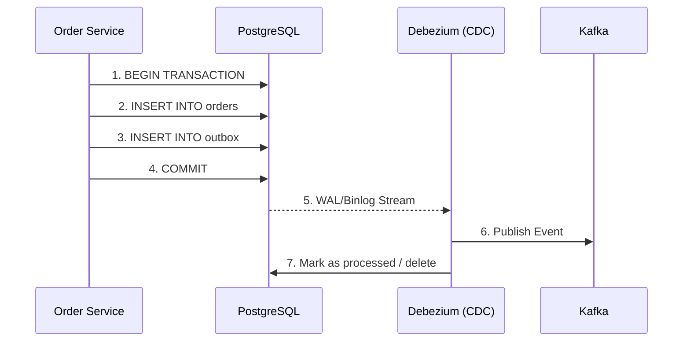

# The Transactional Outbox Pattern: Dual-Writes and CDC with Debezium

## The Problem: The Dual-Write Dilemma
In modern distributed systems, a single user action often requires updating the local database and notifying other services via a message broker (like Kafka or RabbitMQ). For example, when an order is placed, the `OrderService` must save the order to its PostgreSQL database and publish an `OrderCreated` event to Kafka. 

This introduces the **Dual-Write Problem**: 
1. If you write to the database first and then publish to Kafka, the application might crash between the two steps. The database has the order, but downstream services are never notified.
2. If you publish to Kafka first and then write to the database, the database transaction might roll back (e.g., due to a constraint violation), but the event has already been broadcast.

Standard database transactions (ACID) cannot span across a database and a message broker efficiently without relying on Two-Phase Commit (2PC), which is notoriously slow, blocking, and lacks support in many modern message brokers.

## The Mental Model: The Database as the Source of Intent
To solve this, we must align the state change and the intent to communicate into a single atomic operation. Instead of writing to the database and sending a message across the network, we write to the database *twice* in the same transaction: once to store the actual domain data, and once to store the message intent in a dedicated "outbox" table. 

Because both writes target the same database, they are guaranteed to either commit together or roll back together. A separate background process then reads from this outbox table and reliably forwards the messages to the broker.

## The Solution: Transactional Outbox + CDC
The Transactional Outbox pattern guarantees **At-Least-Once** delivery. The architecture looks like this:



### 1. The Outbox Table
Your database needs a simple table designed to hold outgoing messages.
```sql
CREATE TABLE outbox_events (
    id UUID PRIMARY KEY,
    aggregate_type VARCHAR(255) NOT NULL,
    aggregate_id VARCHAR(255) NOT NULL,
    event_type VARCHAR(255) NOT NULL,
    payload JSONB NOT NULL,
    created_at TIMESTAMP DEFAULT CURRENT_TIMESTAMP
);
```
When your application saves an order, it executes:
```sql
BEGIN;
INSERT INTO orders (id, user_id, amount) VALUES ('order-123', 'user-456', 100.00);
INSERT INTO outbox_events (id, aggregate_type, aggregate_id, event_type, payload) 
VALUES ('uuid-1', 'Order', 'order-123', 'OrderCreated', '{"id":"order-123", "amount":100}');
COMMIT;
```

### 2. Change Data Capture (CDC) with Debezium
While you *could* write a polling process (e.g., `SELECT * FROM outbox_events WHERE processed = false`), polling introduces latency and puts unnecessary read pressure on the database.

A more robust solution is **Change Data Capture (CDC)** using a tool like **Debezium**. Debezium acts as a Kafka Connect source connector. Instead of querying the database, it tails the database's transaction log (e.g., Postgres WAL, MySQL Binlog). 

When Debezium detects an `INSERT` in the `outbox_events` table, it instantly captures the row and publishes it directly to a Kafka topic. 

## Architectural Trade-offs and Considerations
- **At-Least-Once Delivery:** Because the CDC process might crash after publishing to Kafka but before recording its internal offset, it might re-publish the same outbox record upon restart. Therefore, **all downstream consumers must be idempotent**. They should track processed message IDs (e.g., the `id` from the outbox table) to safely discard duplicates.
- **Log Archiving:** The outbox table will grow infinitely. You must implement a cleanup strategy. Since Debezium reads the WAL, you can aggressively delete rows from the outbox table shortly after they are inserted, or use table partitioning to drop old records daily.
- **Eventual Consistency:** There is a slight lag (usually milliseconds) between the database commit and the message arriving in Kafka. The system is eventually consistent, which your UX must account for.

By leveraging the Transactional Outbox pattern paired with Debezium, we eliminate the distributed systems nightmare of dual-writes, guaranteeing that every state change in your microservice emits the corresponding event safely and reliably.