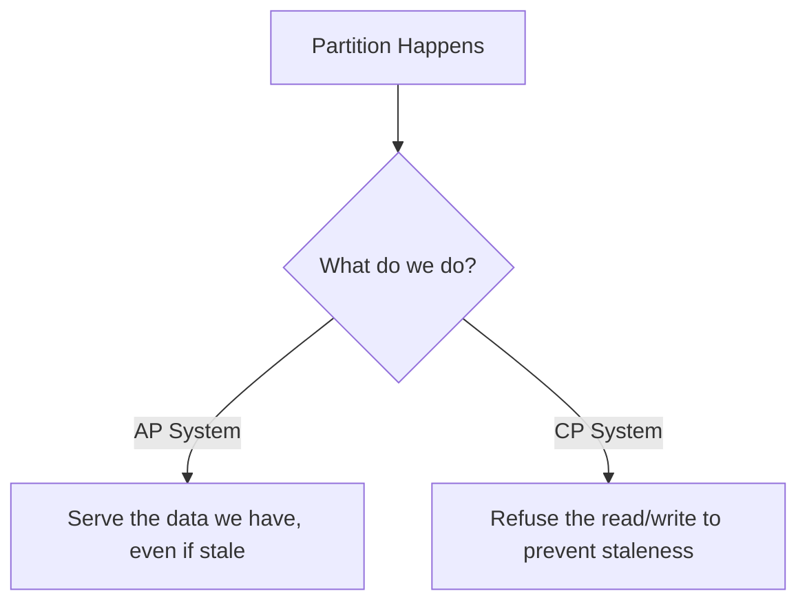

# Demystifying CAP Theorem and PACELC in Distributed Databases

## The Problem: The Fallacy of Perfect Distributed Systems
When engineers first move from single-node relational databases to distributed NoSQL systems (like Cassandra, DynamoDB, or MongoDB), they often expect the same guarantees: perfect consistency and zero downtime. However, the physical realities of networks make this impossible. Network cables get cut, switches fail, and garbage collection pauses stall nodes. 

To design resilient distributed systems, architects must explicitly choose how a system behaves when things go wrong. For decades, the **CAP Theorem** has been the guiding principle for these trade-offs, but in modern system design, CAP alone is insufficient. We must look to **PACELC** to understand how systems behave both during failures *and* during normal operations.

## The Mental Model: CAP Theorem Basics
Proposed by Eric Brewer, the CAP theorem states that a distributed data store can only simultaneously provide two of the following three guarantees:

1.  **Consistency (C):** Every read receives the most recent write or an error. If a write completes, all subsequent reads across all nodes will reflect that write.
2.  **Availability (A):** Every request receives a (non-error) response, without the guarantee that it contains the most recent write. 
3.  **Partition Tolerance (P):** The system continues to operate despite an arbitrary number of messages being dropped or delayed between nodes.

Because network partitions (P) are a physical reality of distributed systems (nodes *will* lose connection to each other), Partition Tolerance is not optional. Therefore, the real choice is between **Consistency and Availability (CP vs. AP)** when a partition occurs.

*   **AP (Available & Partition Tolerant):** A node cut off from the primary cluster will still accept writes and serve reads. Example: Cassandra. Great for highly available systems where eventual consistency is acceptable (e.g., social media timelines).
*   **CP (Consistent & Partition Tolerant):** A disconnected node will reject requests (returning an error) because it cannot verify it has the latest data. Example: MongoDB (by default), HBase. Necessary for financial ledgers.

## The Evolution: The PACELC Theorem
The CAP theorem has a glaring blind spot: it only describes system behavior *during a network partition*. What happens 99.9% of the time when the network is healthy? 

Daniel Abadi proposed the **PACELC Theorem** to complete the picture. It states:
**If there is a Partition (P), how does the system trade off Availability and Consistency (A and C); Else (E), when the network is normal, how does the system trade off Latency and Consistency (L and C)?**

PACELC forces us to acknowledge that achieving perfect consistency during normal operations requires nodes to communicate synchronously before acknowledging a write, which inherently increases latency. 

### Breaking Down PACELC Models
- **PC/EC (Partition: Cons, Else: Cons):** E.g., Google Spanner, HBase. The system strictly enforces consistency. If a partition happens, it stops serving to maintain consistency. During normal operations, it accepts high latency to ensure all replicas are synchronously updated.
- **PA/EL (Partition: Avail, Else: Latency):** E.g., DynamoDB, Cassandra. If a partition happens, they favor availability (AP). When normal, they prioritize low latency by acknowledging writes before all replicas are updated, leading to eventual consistency.
- **PA/EC (Partition: Avail, Else: Cons):** E.g., MongoDB with specific read/write concerns. It prioritizes availability during partitions (if primary is lost, secondary becomes available), but during normal operations, it can be configured to ensure consistent reads at the cost of latency.

## Tunable Consistency: The Modern Standard
Modern databases rarely lock you into a strict AP or CP box. They offer **Tunable Consistency** using Quorums.

In a Cassandra cluster with a Replication Factor of 3 (data is written to 3 nodes), you define the `Write(W)` and `Read(R)` quorum levels. 
- If `W=3` and `R=1`, writes are slow (wait for all 3 nodes), but reads are lightning fast (L).
- If `W=1` and `R=3`, writes are fast, but reads are slow.
- To guarantee Strong Consistency without total synchronous overhead, you ensure `W + R > Replication Factor` (e.g., `W=2, R=2`). 

Understanding CAP and PACELC prevents catastrophic design choices. It shifts the architectural conversation away from "How do we make it perfectly consistent and instantaneous?" to "Given our business requirements, which failure mode and latency profile can our users tolerate?"