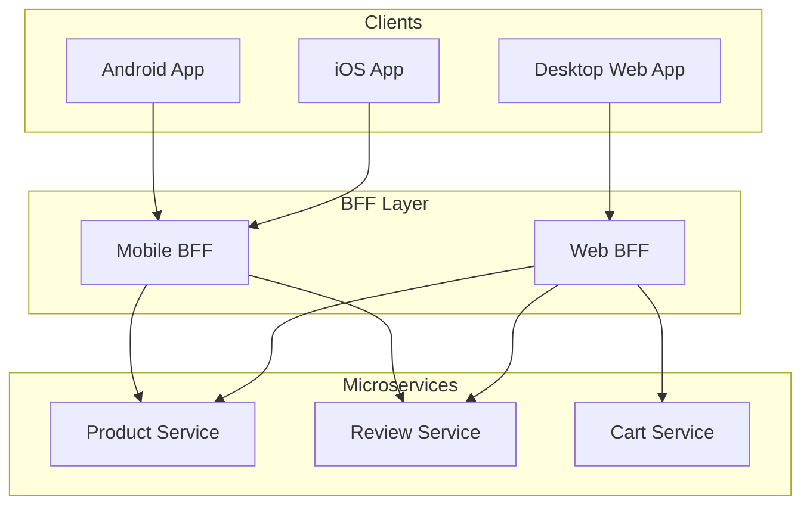

# Backend-For-Frontend (BFF): Tailoring APIs for Mobile vs Web Clients

## The Problem: The "One Size Fits All" API
As a startup scales, they often build a robust suite of domain microservices (e.g., `Users`, `Orders`, `Products`) hidden behind a single General-Purpose API Gateway. This gateway exposes a unified REST or GraphQL API for all clients to consume.

This works initially, but mobile apps and web apps have fundamentally different constraints:
1.  **Over-fetching/Under-fetching:** The web UI might need a detailed product description, 5 high-res images, and 20 reviews. The mobile app UI might only need a thumbnail, the title, and the average rating. A generic API forces the mobile app to download massive JSON payloads, wasting bandwidth and draining battery.
2.  **Chattiness:** If the API returns fine-grained resources, a client might need to make 5 sequential HTTP requests to render a single screen. On mobile, where network latency is high (3G/4G), this results in a sluggish UX.
3.  **Release Cycles:** Mobile app releases are tied to App Store approval processes (days or weeks), while web apps deploy continuously. Tying both to a single API versioning scheme creates massive friction.

## The Mental Model: A Dedicated Butler
Imagine going to a restaurant. Instead of going into the kitchen to talk to the grill chef, the pastry chef, and the bartender to assemble your meal (Direct Client-to-Microservice), you talk to a waiter (General API Gateway) who brings you everything on the menu.

The BFF pattern takes this a step further: it assigns a *dedicated butler* specifically trained for your needs. The Mobile Butler knows you only want small portions quickly. The Web Butler knows you want the full-course meal. 

## The Solution: The BFF Pattern
The Backend-For-Frontend pattern introduces a dedicated API layer for each specific user interface. Instead of a single gateway, you build a `Mobile BFF` and a `Web BFF`. 

### Key Responsibilities of a BFF:
1.  **Aggregation:** The BFF makes multiple concurrent calls to internal microservices over a fast internal network (e.g., gRPC), aggregates the data, and returns a single, optimized JSON payload to the client. This solves the chattiness problem.
2.  **Data Trimming:** The Mobile BFF actively strips out unnecessary fields from the microservice responses. If the `ProductService` returns 50 fields, the Mobile BFF maps it down to the 5 fields the iOS app actually renders.
3.  **Format Translation:** It can translate internal protocols (like gRPC or Thrift) into client-friendly formats (like JSON over HTTP or GraphQL).
4.  **Client-Specific Caching:** You can apply aggressive caching strategies tailored to how a specific client behaves.

## Who Owns the BFF?
A critical organizational rule of the BFF pattern is **Conway's Law alignment**: The team that builds the UI *must* own and maintain their respective BFF. 

The Mobile Team owns the iOS app and the Mobile BFF. The Web Team owns the React app and the Web BFF. This decouples the frontend teams from the backend microservice teams. If the Mobile team needs to aggregate data differently for a new screen, they just update their BFF and deploy it. They do not need to submit a Jira ticket to the core backend team asking for API changes.

## Architectural Trade-offs
- **Code Duplication:** Because you have multiple BFFs, you will inevitably duplicate some aggregation or routing logic. This is an intentional trade-off: we prefer duplication over the rigid coupling of a single generic gateway.
- **Service Proliferation:** You are adding more moving parts to your infrastructure. You now have to monitor, deploy, and scale these intermediate layers.
- **GraphQL as an Alternative:** Many teams use GraphQL as a single gateway instead of the BFF pattern. GraphQL allows clients to specify exactly what they want, solving over-fetching. However, GraphQL can be difficult to secure, cache, and optimize at the database level. Often, teams will implement a BFF *using* GraphQL, creating a Mobile GraphQL BFF and a Web GraphQL BFF.

By tailoring the API layer to the specific constraints of the client, the BFF pattern ensures blazingly fast user experiences while empowering frontend teams to move at their own pace.