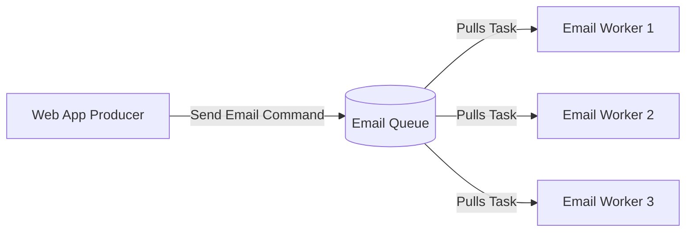
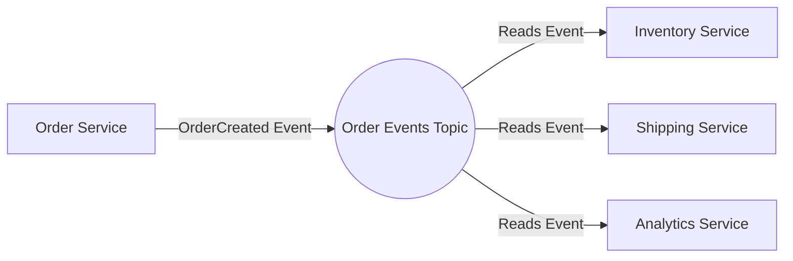

# Event-Driven Architecture: Pub/Sub vs Point-to-Point Message Queues

## The Problem: The Ambiguity of "Messaging"
When migrating from synchronous microservices (HTTP/REST) to an Event-Driven Architecture (EDA), engineers often say, "Let's just put Kafka in the middle" or "Let's use RabbitMQ." However, simply throwing a broker between services doesn't solve architecture problems. 

The core confusion stems from misunderstanding the fundamental difference between the two primary messaging models: **Publish/Subscribe (Pub/Sub)** and **Point-to-Point (Message Queues)**. Using the wrong model leads to duplicate processing, lost messages, and tightly coupled services that negate the benefits of event-driven design.

## The Mental Model: The Radio Broadcast vs. The Task List

**Pub/Sub (Publish/Subscribe)** is like a **Radio Broadcast**. 
The radio station (Publisher) transmits a signal (Event) into the air (Topic). It has absolutely no idea who is listening, how many people are listening, or what they will do with the information. You can have zero listeners, or a million. Every listener receives the exact same broadcast.

**Point-to-Point (Message Queues)** is like a **To-Do Task List** shared by a team of workers.
A manager (Producer) writes a task on a sticky note and places it in a pile (Queue). The team of workers (Consumers) takes turns pulling a task from the top of the pile. Once a worker takes a task and completes it, that task is thrown away. **A single task is processed by exactly one worker.**

## Model 1: Point-to-Point (Competing Consumers)
*Technologies: RabbitMQ, AWS SQS, ActiveMQ.*

In a Point-to-Point model, the focus is on **Command Distribution and Load Balancing**. The sender is telling the system *to do something*.

**Key Characteristics:**
- **Routing:** 1-to-1 processing. If there are 10 messages in the queue and 3 workers, the messages will be distributed among the workers. No message is processed twice.
- **Intent:** Usually represents a *Command* (e.g., `SendWelcomeEmail`, `GeneratePDF`).
- **Coupling:** High. The producer knows exactly what needs to be done, it's just delegating the work to scale it asynchronously.

## Model 2: Publish / Subscribe (Pub/Sub)
*Technologies: Apache Kafka, AWS SNS, Google Cloud Pub/Sub.*

In a Pub/Sub model, the focus is on **Domain Events and Decoupling**. The sender is announcing *that something happened in the past*.

**Key Characteristics:**
- **Routing:** 1-to-Many processing. When the `OrderService` publishes an `OrderCreated` event, the Inventory, Shipping, and Analytics services *all* receive a copy of the exact same event.
- **Intent:** Represents an *Event* (an immutable fact). 
- **Coupling:** Zero. The `OrderService` does not know or care that the `AnalyticsService` exists. If you add a new `FraudDetectionService` tomorrow, it just subscribes to the topic. The publisher requires zero code changes.

## The Hybrid: Consumer Groups (The Kafka Way)
Modern event streaming platforms like **Apache Kafka** blur the lines by offering both models simultaneously using the concept of **Consumer Groups**.

In Kafka, a Topic holds the events (Pub/Sub). However, subscribers organize themselves into Consumer Groups. 
- If `InventoryService` and `ShippingService` each have their own Consumer Group, they both get all the messages (Pub/Sub).
- If you spin up 5 instances of the `InventoryService` for scale, they all join the *same* `Inventory` Consumer Group. Kafka will load-balance the messages among those 5 instances (Point-to-Point / Competing Consumers).

## When to Use Which?

1.  **Use Point-to-Point (SQS, RabbitMQ Queues) when:**
    *   You need to execute a specific, targeted task asynchronously (e.g., resizing an uploaded image).
    *   You want strict competing consumer load balancing without the overhead of partitioned logs.
    *   You need granular message-level retries and Dead Letter Queues (DLQs).

2.  **Use Pub/Sub (Kafka, SNS) when:**
    *   You are building a reactive microservices architecture where one state change triggers multiple independent downstream reactions.
    *   You need the "Choreography" saga pattern.
    *   You want to retain events for a long time (Event Sourcing) so new services can replay history.

Mastering event-driven architecture requires distinguishing between asking a specific worker to do a job (Queues) and announcing to the world that a domain state has changed (Pub/Sub).