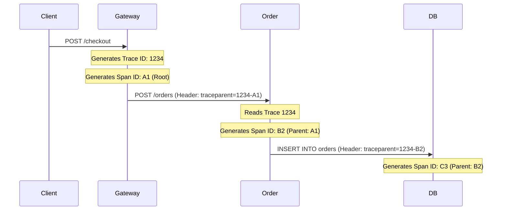

# Distributed Tracing: Context Propagation with OpenTelemetry and Jaeger

## The Problem: The Microservice Murder Mystery
In a monolithic application, debugging a slow or failed request is straightforward: you open the log file and follow the single thread of execution from top to bottom. 

In a microservices architecture, a single user click (e.g., "Checkout") might trigger a synchronous HTTP call to the `API Gateway`, which calls the `Order Service`, which publishes a message to `Kafka`, which is picked up by the `Inventory Service` and the `Billing Service`. If the checkout process takes 5 seconds, how do you know which of those 5 components was the bottleneck? If it fails, whose logs do you check? Searching by timestamp across 5 different Kibana dashboards is a "needle in a haystack" nightmare.

## The Mental Model: The Package Tracking Number
Think of a physical package moving through the postal system. To track its journey, FedEx slaps a barcode (a globally unique tracking number) on the box before it leaves the first facility. Every time the package arrives at a new warehouse, gets loaded onto a truck, or is delivered, a scanner reads that exact same barcode and records the timestamp. 

Distributed Tracing does exactly this for network requests. We generate a "tracking number" at the edge of our system and force every downstream microservice to pass that number along to the next service.

## The Solution: Trace IDs, Span IDs, and OpenTelemetry

### 1. The Anatomy of a Trace
A **Trace** represents the entire journey of a single request across the distributed system. 
A **Span** represents a single logical unit of work within that trace (e.g., a single database query, or a single HTTP call to a downstream service). 

- **Trace ID:** A globally unique identifier (e.g., a UUID) generated at the very beginning of the request (usually at the API Gateway).
- **Span ID:** A unique identifier for the specific operation currently happening. Spans have a `Parent Span ID`, allowing the tracing backend to reconstruct the tree of execution.

### 2. Context Propagation
For tracing to work, the Trace ID must be passed from service to service. This is called **Context Propagation**. Usually, this is done via HTTP Headers (e.g., the W3C standard `traceparent` header).

### 3. OpenTelemetry and Jaeger
Historically, every tracing tool (Zipkin, Datadog, New Relic) had its own proprietary SDKs. Today, **OpenTelemetry (OTel)** has become the absolute industry standard. OTel provides a vendor-neutral set of APIs, SDKs, and agents.

Instead of writing custom tracing code, you include the OpenTelemetry SDK in your application. The SDK intercepts incoming HTTP requests, extracts the Trace ID, injects the Trace ID into outbound HTTP/gRPC calls, and asynchronously fires the Span data (duration, success/failure) to a collector.

**Jaeger** is a popular open-source UI for visualizing this data. When Jaeger pieces the spans together based on their Trace IDs and Parent IDs, it generates a Gantt chart. You can visually see that the total request took 5 seconds, and 4.8 of those seconds were spent waiting on a single slow PostgreSQL `SELECT` query deep within the `Inventory Service`.

## Architectural Trade-offs
- **Performance Overhead:** Generating IDs, keeping track of context, and exporting span data consumes CPU and network bandwidth. In extremely high-throughput systems, you configure **Sampling** (e.g., only trace 1% of all requests) to reduce overhead.
- **Leaky Abstractions:** Context propagation requires every service to cooperate. If a single legacy service in the middle of the chain drops the HTTP header, the trace breaks, and the Gantt chart is split in two.
- **Log Correlation:** The true power of tracing is unlocked when you inject the `Trace ID` into your standard application logs (e.g., Logback/Log4j MDC). This allows you to jump directly from a visual trace in Jaeger to the exact log lines in Datadog/Elasticsearch that occurred during that specific request.