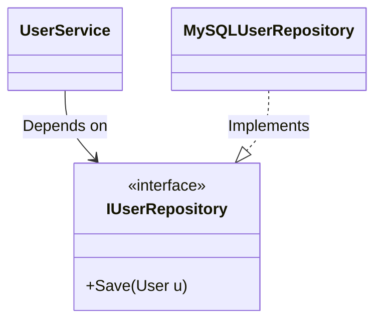

# Dependency Inversion vs Dependency Injection: IoC Container Mechanics

## The Problem: The Concrete Cement of Tight Coupling
As codebases grow, classes naturally begin to rely on other classes. A `UserService` needs to save data, so it creates an instance of a `MySQLUserRepository`. 

```csharp
public class UserService {
    private MySQLUserRepository _repository;
    
    public UserService() {
        // Tight Coupling!
        _repository = new MySQLUserRepository(); 
    }
}
```

This creates massive problems:
1.  **Untestable Code:** You cannot unit test `UserService` without actually connecting to a live MySQL database.
2.  **Rigidity:** If the business decides to switch from MySQL to PostgreSQL, you have to open the `UserService` class and rewrite its internal logic.
3.  **Transitive Dependencies:** The `UserService` now implicitly depends on whatever `MySQLUserRepository` depends on (e.g., connection strings, network drivers).

Engineers often throw around the terms **Dependency Inversion (DIP)**, **Dependency Injection (DI)**, and **Inversion of Control (IoC)** to solve this, but frequently confuse them. They are distinct concepts that stack together.

## 1. The Principle: Dependency Inversion (DIP)
The "D" in the SOLID principles stands for the Dependency Inversion Principle. It states:
*High-level modules should not depend on low-level modules. Both should depend on abstractions (interfaces).*

**The Mental Model:** The Electrical Outlet.
When you buy a TV, it doesn't come with a wire that you must directly solder into the power grid of your house (tight coupling). Instead, the house provides a standard abstraction (the wall socket). The TV relies on the socket, and the house wiring relies on the socket. 

To apply DIP to our code, we introduce an interface: `IUserRepository`. 


*Notice the arrow direction. The lower-level database code now points UP toward the abstraction. The dependency has been INVERTED.*

## 2. The Technique: Dependency Injection (DI)
DIP tells us we *should* depend on interfaces. **Dependency Injection** is the actual coding technique we use to pass that interface into the class, rather than having the class instantiate it.

The most common form is **Constructor Injection**:

```csharp
public class UserService {
    private readonly IUserRepository _repository;
    
    // The dependency is injected from the outside!
    public UserService(IUserRepository repository) {
        _repository = repository; 
    }
}
```

Now, `UserService` is completely ignorant of MySQL. In our unit tests, we can inject a `MockUserRepository`. In production, we can inject the `MySQLUserRepository`. 

## 3. The Mechanism: Inversion of Control (IoC) Containers
If `UserService` no longer creates the `MySQLUserRepository`, who does? We have pushed the problem up the chain. Eventually, *something* at the very start of the application (the composition root) must instantiate all the concrete classes and wire them together.

Doing this manually is tedious:
```csharp
var repo = new MySQLUserRepository(new DatabaseConnection("..."));
var emailer = new SmtpEmailService(new SmtpConfig());
var userService = new UserService(repo, emailer);
```

This is where **Inversion of Control (IoC) Containers** (like Spring for Java, or the built-in Microsoft.Extensions.DependencyInjection for .NET) come in. 
IoC is a broader principle where the framework takes control of program flow. In the context of dependencies, an IoC container acts as a giant dictionary. On startup, you register your mappings:

```csharp
// Startup.cs
services.AddScoped<IUserRepository, MySQLUserRepository>();
services.AddTransient<UserService>();
```

When an HTTP request comes in requiring the `UserService`, the IoC Container uses **Reflection** to inspect the `UserService` constructor. It sees it needs an `IUserRepository`. It looks up the dictionary, realizes it needs to build a `MySQLUserRepository`, instantiates it, and hands it to the `UserService` automatically.

## Summary
- **Dependency Inversion (DIP)** is the architectural *Design Principle* that dictates using interfaces to decouple high-level and low-level code.
- **Dependency Injection (DI)** is the *Software Pattern/Technique* of passing those interface implementations via constructors or setters.
- **IoC Containers** are the *Framework Tools* that automate the DI process, managing the lifetimes and automatic wiring of the object graph.