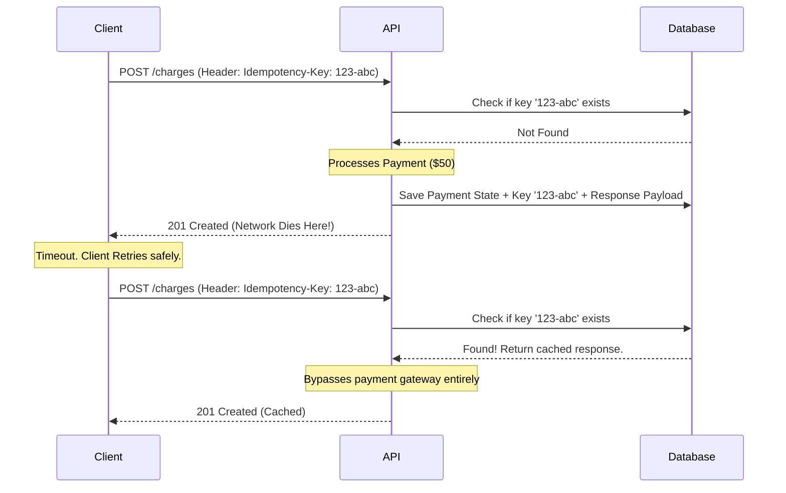

# Designing Idempotent APIs: Handling Network Retries Safely in Payments

## The Problem: The "Two Generals" of HTTP
In distributed systems, the network is inherently unreliable. When a client makes an HTTP POST request to a server—for example, a mobile app sending a "Charge Credit Card $50" payload—three things can happen:
1.  **Success:** The server processes it, charges the card, and returns HTTP 200 OK.
2.  **Explicit Failure:** The server rejects the card and returns HTTP 400 Bad Request.
3.  **Ambiguous Network Failure:** The client sends the request, but the connection times out. 

The third scenario is a nightmare. Did the request fail to reach the server? Or did the server successfully process the payment, but the network failed while sending the 200 OK response back? The client has no idea.

If the client assumes failure and retries, they risk double-charging the customer (charging $100). If the client does not retry, the user is left looking at a frozen loading spinner, and the order is never fulfilled.

## The Mental Model: Cashing a Check
Think about cashing a physical check at a bank. You hand the teller a check for $50. The teller processes it and gives you cash. If you suffer amnesia, walk out the door, turn around, and hand the teller a photocopy of that exact same check 5 minutes later, the teller will not give you another $50. The check has a unique routing and account/check number. The bank's ledger records that specific check as "cashed."

We need to build this same "check number" mechanism into our APIs.

## The Solution: Idempotency Keys
An operation is **idempotent** if executing it multiple times yields the same result as executing it exactly once. GET, PUT, and DELETE are inherently idempotent in REST. POST is not.

To make a POST request idempotent, the client must generate a unique identifier (usually a UUIDv4) for the specific intent of the transaction. This is passed in the HTTP headers as the `Idempotency-Key`.

### Implementing the Logic
1.  **Check the Ledger:** When the API receives the request, it immediately checks an `idempotency_keys` table in the database (or a fast key-value store like Redis) to see if the key exists.
2.  **Concurrent Race Conditions:** What if the client rapidly clicks the "Submit" button twice, sending two requests with the same key at the exact same millisecond? The database must enforce a **Unique Constraint** on the `idempotency_key` column. The first request will acquire the lock/insert the row. The second request will hit a constraint violation or be told to wait (HTTP 409 Conflict or 425 Too Early).
3.  **Payload Matching:** A malicious or buggy client might use the same idempotency key for two *different* payloads (e.g., trying to change the charge from $50 to $10). The server must hash the request body and verify that if an idempotency key exists, the stored payload hash matches the new payload hash. If they differ, return HTTP 400.
4.  **Return Cached Response:** If the key exists and the transaction previously succeeded, the server simply returns the exact same HTTP response body and status code that it generated the first time, without actually calling the payment gateway again.

## Architectural Trade-offs
- **Storage Overhead:** You must store every idempotency key and its corresponding response payload. Because this grows infinitely, it is standard practice to expire these keys after 24 to 72 hours (using Redis TTL or database chron jobs). After 24 hours, the client must generate a new key and start a fresh transaction.
- **Added Latency:** Every write operation now requires an initial read to verify the key, plus an extra write to save the response state. However, in financial transactions, the safety guarantee vastly outweighs the 10-millisecond database penalty.

By utilizing Idempotency Keys, clients can implement aggressive, safe retry policies (like Exponential Backoff with Jitter) during network turbulence, guaranteeing a flawless user experience without the fear of financial disaster.