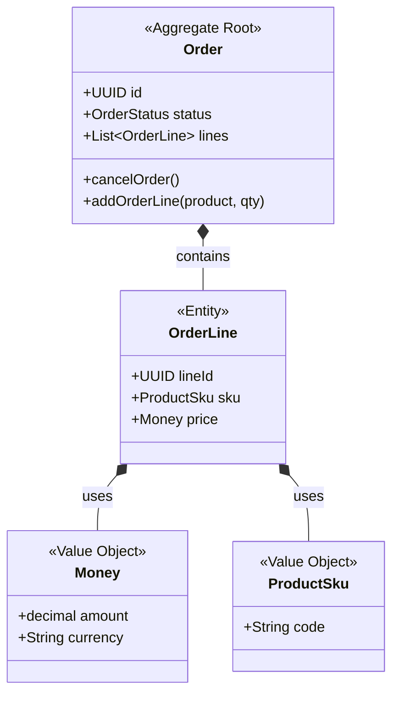

# Domain-Driven Design (DDD): Aggregates, Entities, and Value Objects

## The Problem: Data Inconsistency and Anemic Domain Models
In traditional data-driven architectures, systems often suffer from the "Anemic Domain Model" anti-pattern. Logic is pushed into bloated service classes, while data objects become mere property bags (getters and setters). As a result, maintaining invariants—business rules that must always be true—becomes an operational nightmare. When multiple threads or processes modify related data concurrently, the system quickly falls into an inconsistent state.

Consider an e-commerce `Order`. If an order is canceled, its `OrderLines` shouldn't be modifiable, and the `PaymentStatus` should reflect the cancellation. If these entities are modified independently by different services, the invariants are shattered.

## The Mental Model: Tactical DDD
Domain-Driven Design (DDD) offers tactical patterns to organize complex business logic. The core mental model revolves around defining strict boundaries of consistency. 

1. **Value Objects**: Attributes that describe things but have no conceptual identity. They are immutable. If two Value Objects have the same properties, they are identical.
2. **Entities**: Objects that have a distinct identity that runs through time and different states.
3. **Aggregates**: A cluster of domain objects (Entities and Value Objects) treated as a single unit for data changes. 
4. **Aggregate Root**: The only Entity inside the Aggregate that outside objects are allowed to hold references to. It acts as a gatekeeper, ensuring all business rules are validated before state changes.

### Visualizing the Aggregate Boundary



In this model, you cannot directly fetch an `OrderLine` from the database and modify it. You must load the `Order` (the Aggregate Root) and call `order.addOrderLine()`. The `Order` enforces the invariant (e.g., "Cannot add lines to a shipped order").

## Implementation: Building the Boundary
Let's model this in TypeScript to see how encapsulation and immutability are enforced.

### 1. The Value Object
Notice how `Money` is immutable. Operations on a Value Object always return a *new* instance.

```typescript
export class Money {
    constructor(
        public readonly amount: number,
        public readonly currency: string
    ) {
        if (amount < 0) throw new Error("Amount cannot be negative");
    }

    add(other: Money): Money {
        if (this.currency !== other.currency) {
            throw new Error("Currency mismatch");
        }
        return new Money(this.amount + other.amount, this.currency);
    }

    equals(other: Money): boolean {
        return this.amount === other.amount && this.currency === other.currency;
    }
}
```

### 2. The Entity (Internal to Aggregate)
`OrderLine` has an identity (`id`), but its lifecycle is entirely managed by the `Order`.

```typescript
export class OrderLine {
    constructor(
        public readonly id: string,
        public readonly sku: string,
        public readonly price: Money,
        public quantity: number
    ) {}

    updateQuantity(newQuantity: number) {
        if (newQuantity <= 0) throw new Error("Quantity must be > 0");
        this.quantity = newQuantity;
    }
}
```

### 3. The Aggregate Root
The `Order` protects its internal state. Properties are private or read-only to the outside world. State mutation occurs *only* through semantic methods (e.g., `cancel()`, `addLine()`).

```typescript
export class Order {
    private _lines: OrderLine[] = [];
    private _status: 'PENDING' | 'SHIPPED' | 'CANCELED' = 'PENDING';

    constructor(public readonly id: string) {}

    get lines(): ReadonlyArray<OrderLine> {
        return this._lines;
    }

    get status(): string {
        return this._status;
    }

    addLine(sku: string, price: Money, quantity: number): void {
        if (this._status !== 'PENDING') {
            throw new Error("Cannot modify an order that is not pending.");
        }
        
        const existingLine = this._lines.find(l => l.sku === sku);
        if (existingLine) {
            existingLine.updateQuantity(existingLine.quantity + quantity);
        } else {
            this._lines.push(new OrderLine(generateUUID(), sku, price, quantity));
        }
    }

    cancel(): void {
        if (this._status === 'SHIPPED') {
            throw new Error("Cannot cancel a shipped order.");
        }
        this._status = 'CANCELED';
    }
}
```

## Storage and Transactions
A critical rule of DDD is that **one transaction should modify exactly one aggregate**. If a business process requires updating multiple aggregates, you should embrace eventual consistency using Domain Events. 

When saving the `Order` aggregate to a relational database, an ORM like Entity Framework or TypeORM can map the entire graph to underlying tables (`Orders` and `OrderLines`) in a single ACID transaction. No other service should bypass the `Order` repository to write directly to the `OrderLines` table.

## Summary
By distinguishing between Aggregates, Entities, and Value Objects, you create a robust, defensively coded domain model. Value objects eliminate primitive obsession and aliasing bugs. Entities manage lifecycle and identity. Aggregate Roots enforce transactional consistency, guaranteeing your business logic never enters an invalid state.