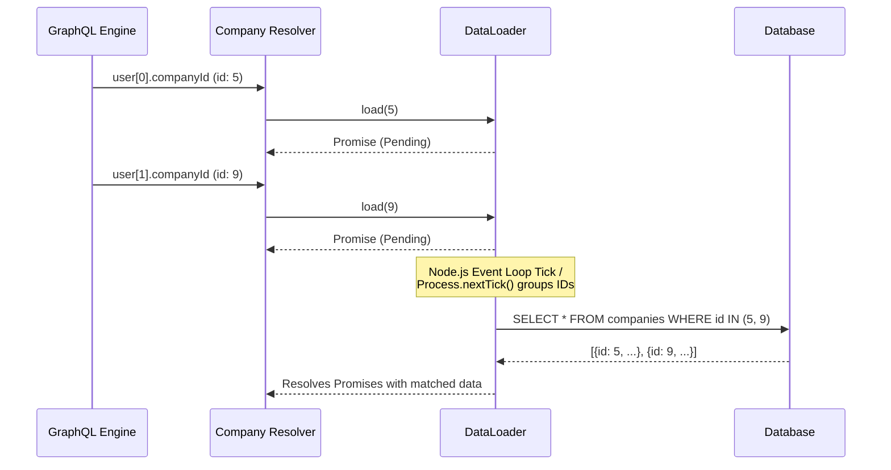

# GraphQL vs REST: Solving the N+1 Query Problem with DataLoaders

## The Problem: The N+1 Query Dilemma
GraphQL provides incredible flexibility, allowing clients to query exactly the data they need in a single request. However, this flexibility comes with a dangerous architectural trap: the **N+1 Query Problem**.

In REST, a server controls the exact payload returned, making it easy to optimize SQL queries using `JOIN`s. In GraphQL, execution is deeply nested and recursive. Each field in a query is backed by an independent function called a "Resolver". Because resolvers are executed independently per entity, fetching a list of items and their relationships results in an avalanche of database calls.

Consider querying 50 users and their associated companies:
```graphql
query {
  users(limit: 50) {
    name
    company {
      name
    }
  }
}
```

**The Execution flow:**
1. The `users` resolver runs and executes `SELECT * FROM users LIMIT 50`. (1 query)
2. GraphQL iterates over the 50 users. For *each* user, the `company` resolver executes `SELECT * FROM companies WHERE id = ?`. (50 queries)

Total queries: 1 + 50 = 51. This is the N+1 problem. As the data grows, the database is hammered with thousands of microscopic, sequential queries, destroying performance.

## The Mental Model: Batching and DataLoaders
To solve this, we must decouple the *request* for data from the *execution* of the database query. Instead of querying the database immediately inside the resolver, the resolver "registers" a request for an ID. We then wait a few milliseconds for all resolvers across the GraphQL tree to finish registering their IDs. Finally, we execute a *single* batched query for all collected IDs.

This pattern is implemented using a **DataLoader**, a utility originally popularized by Facebook.

### Visualizing the Batching Process



## Implementation: The DataLoader Pattern
In Node.js, DataLoader leverages the asynchronous event loop (specifically `process.nextTick`). When you call `.load(id)`, DataLoader returns a Promise but holds off on executing the underlying batch function until the current synchronous tick finishes.

### Step 1: Define the Batch Function
The batch function receives an array of IDs and must return an array of results *of the exact same length and in the exact same order*.

```typescript
import DataLoader from 'dataloader';
import { db } from './database';

// 1. The batching function
const batchCompanies = async (companyIds: readonly number[]) => {
    // Single query to the database: SELECT ... WHERE id IN (...)
    const companies = await db.query(
        'SELECT * FROM companies WHERE id = ANY($1)', 
        [companyIds]
    );

    // 2. Map the results back to the original requested IDs
    // This is critical because SQL IN (...) doesn't guarantee order
    // and might omit missing IDs.
    const companyMap = new Map(companies.map(c => [c.id, c]));
    
    return companyIds.map(id => companyMap.get(id) || null);
};
```

### Step 2: Instantiate DataLoader per Request
DataLoaders also cache results in memory. If `.load(5)` is called ten times in one GraphQL request, it only hits the database once. Because it caches, **DataLoader instances must be created per HTTP request**, not globally, to prevent cross-user data leakage.

```typescript
// Inside your GraphQL Server Context setup
const context = () => ({
    loaders: {
        company: new DataLoader(batchCompanies)
    }
});
```

### Step 3: Implement the Resolver
The resolver logic becomes incredibly clean. It simply calls `.load()` on the DataLoader context.

```typescript
const resolvers = {
    User: {
        // The resolver no longer talks to the DB directly
        company: async (parent, args, context) => {
            if (!parent.companyId) return null;
            return await context.loaders.company.load(parent.companyId);
        }
    }
};
```

## Summary
While GraphQL empowers frontend engineers, it places a heavy burden on the backend to execute queries efficiently. The N+1 problem is inherent to GraphQL's graph-traversal execution model. 

By utilizing the DataLoader pattern, developers invert control. Resolvers declare *what* they need, and the DataLoader intelligently aggregates, deduplicates, and batches those needs into a single, high-performance database query. This ensures you maintain the flexibility of GraphQL without sacrificing the relational efficiency of REST.