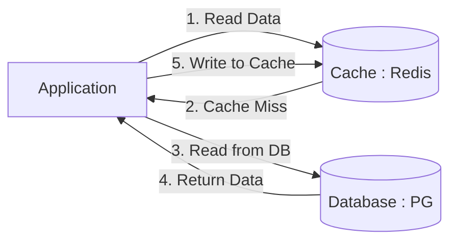
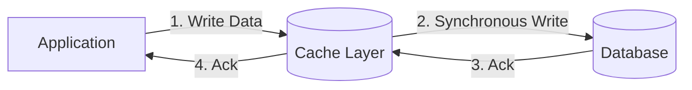

# Distributed Caching Strategies: Cache-Aside, Write-Through, and Write-Behind

## The Problem: Database Bottlenecks
As a system scales, databases inevitably become the primary bottleneck. Disk I/O, network latency, and complex query execution add up, resulting in sluggish response times for end users. Throwing hardware at a database (vertical scaling) only works up to a point. To alleviate database load, engineers introduce an in-memory caching layer (like Redis or Memcached). 

However, caching introduces a notoriously difficult problem: **Cache Invalidation and Data Consistency**. If the cache and the database fall out of sync, users see stale, incorrect data. Choosing the right caching strategy is paramount.

## The Mental Model: Caching Topologies
When introducing a cache, we must define the relationship between the Application, the Cache, and the Database. 

### 1. Cache-Aside (Lazy Loading)
In this pattern, the application is responsible for managing both the cache and the database. The cache does not interact with the database directly.

**Read Path:** The application asks the cache for data. If it’s a miss, it asks the database, saves the result to the cache, and returns it.
**Write Path:** The application updates the database directly and then either deletes or updates the cache entry.



**Pros:** Resilient to cache failures. If Redis goes down, the application falls back to the database (though latency spikes).
**Cons:** Requires custom code in the application layer. Data can become stale if a write updates the DB but fails to invalidate the cache.

**Implementation (Cache-Aside):**
```python
def get_user_profile(user_id):
    cache_key = f"user:{user_id}"
    
    # 1. Check Cache
    profile = redis_client.get(cache_key)
    if profile:
        return json.loads(profile)
        
    # 2. Fallback to DB
    profile = db.execute("SELECT * FROM users WHERE id = %s", user_id)
    
    # 3. Populate Cache with a TTL (Time-to-Live)
    redis_client.setex(cache_key, 3600, json.dumps(profile))
    
    return profile
```

### 2. Write-Through Cache
In a Write-Through configuration, the application treats the cache as the primary data store. The cache (or a caching proxy/abstraction layer) is responsible for synchronously writing data to the database.

**Write Path:** The application writes data to the cache. The cache synchronously writes the data to the database. The transaction is only successful when both are updated.



**Pros:** Complete data consistency. The cache is never stale.
**Cons:** Higher write latency because every write operation must traverse two network hops (App -> Cache -> DB).

### 3. Write-Behind (Write-Back)
Write-Behind is similar to Write-Through, but the database write happens *asynchronously*. The application writes to the cache, and the cache immediately returns an acknowledgment. A background process flushes the updated data to the database in batches.

**Pros:** Incredible write performance. The application never waits for disk I/O. Extremely resilient to database spikes, absorbing bursts of writes.
**Cons:** **Data Loss Risk.** If the cache node crashes before the background process flushes the data to the database, the data is permanently lost.

## Dealing with Stale Data: TTLs and Eviction
Regardless of the strategy, caches should never store data forever. 

1. **Time To Live (TTL):** Every cached item should have an expiration time. This guarantees that, even in the event of an invalidation bug, data will eventually become consistent.
2. **Eviction Policies:** When Redis runs out of memory, it must evict old data. `LRU` (Least Recently Used) is the most common policy, ensuring hot data stays in memory while cold data is purged.

## Summary
Choosing a caching strategy is an exercise in trade-offs. 
- Use **Cache-Aside** for read-heavy systems where occasional staleness is acceptable (e.g., user profiles, product catalogs).
- Use **Write-Through** for systems requiring strict consistency without sacrificing read performance (e.g., banking ledgers).
- Use **Write-Behind** for extreme write-heavy workloads where data loss can be mitigated or tolerated (e.g., gaming leaderboards, IoT sensor telemetry).