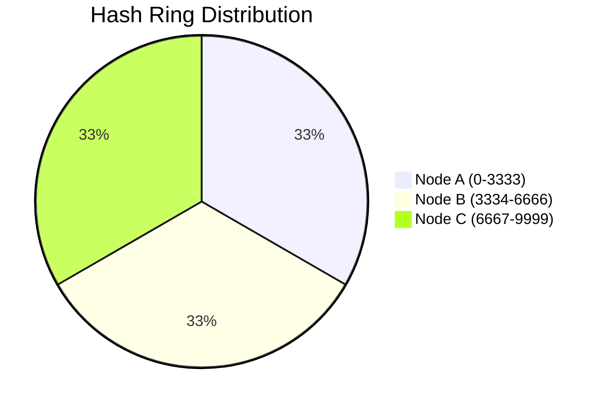

# Sharded Database Rebalancing: Moving Terabytes of Data Without Downtime

## The Problem: The Shard Imbalance
When a monolithic database reaches the limits of vertical scaling, engineers employ **Sharding** (horizontal partitioning). Data is distributed across multiple database nodes based on a Shard Key (e.g., `user_id % 4` for 4 shards). 

This works brilliantly until one of two things happens:
1. **The cluster runs out of capacity**, requiring a new shard to be added (going from 4 to 5 shards).
2. **A "Hot Spot" develops**. One shard fills up exponentially faster than others because certain users (e.g., Justin Bieber on Twitter) generate significantly more traffic than average.

If you simply change the formula to `user_id % 5`, the location of almost every record changes. The system would need to halt, redistribute terabytes of data, and restart. In a high-availability system, this downtime is unacceptable.

## The Mental Model: Virtual Buckets and Consistent Hashing
To solve the rebalancing problem without causing massive data displacement, modern distributed databases (like Cassandra, DynamoDB, and Redis Cluster) decouple the Shard Key from the physical server.

Instead of mapping data directly to physical nodes, data is mapped to a fixed number of **Virtual Buckets** (or a Hash Ring). The physical nodes then claim ownership of ranges of these buckets.

### Step 1: The Hash Ring
Imagine a ring representing the output space of a hash function (e.g., `0` to `9999`). 
We map our 3 physical servers onto this ring.
- Node A handles hashes `0 - 3333`
- Node B handles hashes `3334 - 6666`
- Node C handles hashes `6667 - 9999`

When a new user is created (`user_id = 1042`), we hash the ID. If `Hash(1042) = 4500`, the data goes to Node B.

### Step 2: Adding a Node (Consistent Hashing)
If we add **Node D** to the cluster, we don't recalculate the modulo for everyone. Instead, Node D takes a position on the ring—let's say it splits Node C's territory, taking `6667 - 8333`. 
Now, *only* the data in the `6667 - 8333` range moves from Node C to Node D. The data on Node A and Node B remains completely untouched.

## The Rebalancing Process (Zero Downtime)
Moving terabytes of data even between two nodes takes time. How do we move data from Node C to Node D while users are actively reading and writing to it? 

We use a multi-phase state machine coordinated by a routing proxy.

### Phase 1: Preparation (Double Writing)
Node D is spun up and assigned the target hash range. The routing layer updates its topology map: the range `6667 - 8333` is now in a **migrating state**.
- **Reads**: Routed to Node C (the old owner).
- **Writes**: Routed to **both** Node C and Node D. Node D processes the writes to ensure its new data is kept fresh.

### Phase 2: Background Copy
A background process begins iterating over all existing data in the `6667 - 8333` range on Node C and copying it to Node D. 
Because writes are being sent to both nodes simultaneously, the background copy only needs to transfer records that existed *before* the migration started.

### Phase 3: Validation and Cutover
Once the background copy is complete, Node D has all the historical data and all the new data. The proxy pauses writes for a few milliseconds, verifies the checksums or row counts, and then flips the topology state.

- **Reads**: Now routed exclusively to Node D.
- **Writes**: Now routed exclusively to Node D.

### Phase 4: Cleanup
Node C receives a signal that it is no longer the owner of the `6667 - 8333` range. It drops the tables or deletes the records associated with that hash space, freeing up terabytes of disk space.

## Conclusion
Sharded database rebalancing is a high-stakes operation. Naive modulo sharding results in catastrophic data redistribution. By utilizing Consistent Hashing (or Virtual Buckets) and employing a coordinated double-write replication strategy, distributed systems can seamlessly add capacity and balance hot spots without users ever noticing a blip in availability.