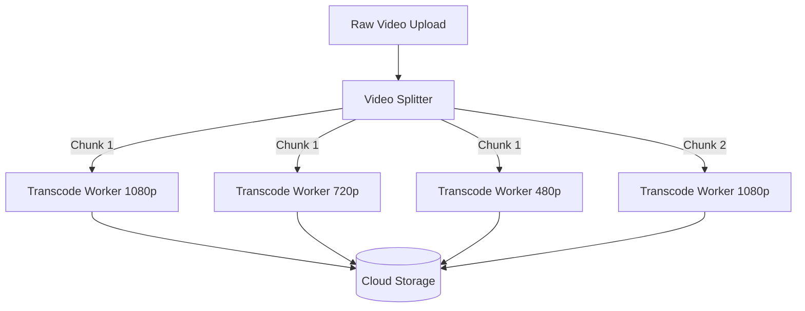

# Designing Netflix: Video Transcoding Pipelines and DASH Adaptive Streaming

## The Problem: Variability in Global Video Delivery
Delivering high-definition video to millions of concurrent users is arguably the most complex challenge in modern system design. A naive approach—uploading an `.mp4` file to a server and streaming it directly to users—will immediately fail in the real world. 

Why? 
1. **Device Variability**: A 4K Smart TV requires a drastically different video format and resolution than an iPhone 7.
2. **Bandwidth Volatility**: A user watching on a train will experience bandwidth fluctuations ranging from 5G to 3G drops. If the video bitrate exceeds the network capacity, the video buffers. If it's too low, the video is pixelated.

## The Mental Model: Transcoding and Chunking
To solve this, platforms like Netflix and YouTube do not serve single video files. Instead, they chop videos into thousands of tiny segments and offer those segments in dozens of different quality levels. The client (your TV or phone) dynamically chooses which quality segment to download next based on its current internet speed.

This architecture relies on two distinct phases: **The Ingestion/Transcoding Pipeline** (Backend) and **Adaptive Bitrate Streaming** (Frontend).

### Phase 1: The Transcoding Pipeline
When a studio uploads a raw master file (often hundreds of gigabytes), it enters a highly distributed parallel processing pipeline.

1. **Inspection**: The file is analyzed for resolution, framerate, and audio tracks.
2. **Chunking**: The master video is sliced into discrete time chunks (usually 2 to 10 seconds long).
3. **Parallel Transcoding**: A massive fleet of worker nodes (e.g., AWS EC2 instances) pulls these chunks from a queue. Each worker converts its assigned 10-second chunk into a specific format and resolution. 

If a 2-hour movie is cut into 10-second chunks, that’s 720 chunks. If Netflix supports 10 different resolutions/bitrates, that results in 7,200 individual video files generated in parallel.



### Phase 2: Dynamic Adaptive Streaming over HTTP (DASH)
Once all chunks are transcoded, the system generates a **Manifest File** (e.g., an MPD file for DASH or an M3U8 file for Apple's HLS). This text file acts as a map for the video player.

It tells the video player: "Here are all the available resolutions, their bitrates, and the URLs for every 10-second chunk."

```xml
<!-- Example Concept of a DASH MPD Manifest -->
<MPD>
  <Period>
    <AdaptationSet mimeType="video/mp4">
      <Representation id="1" bandwidth="5000000" width="1920" height="1080">
        <SegmentTemplate media="chunk-1080p-$Number$.m4v" />
      </Representation>
      <Representation id="2" bandwidth="1500000" width="1280" height="720">
        <SegmentTemplate media="chunk-720p-$Number$.m4v" />
      </Representation>
    </AdaptationSet>
  </Period>
</MPD>
```

#### How the Video Player Uses the Manifest
1. The user clicks "Play".
2. The client downloads the Manifest file.
3. The client measures the user's current internet download speed (e.g., 2 Mbps).
4. The client looks at the manifest and realizes the 1080p track requires 5 Mbps, but the 720p track only requires 1.5 Mbps.
5. The client downloads `chunk-720p-1.m4v`.
6. While chunk 1 is playing, the train enters a tunnel, and speed drops to 0.5 Mbps.
7. The client dynamically downgrades and requests `chunk-480p-2.m4v` for the next 10 seconds of video.

This constant evaluation happens in the background every few seconds. By the end of a movie, a user may have downloaded chunks from 5 different quality tiers seamlessly, without a single buffering screen.

## Global Delivery via CDNs
Because the video is chopped into standard `.m4v` chunks served over standard HTTP, caching becomes trivial. Netflix pushes these chunks to Content Delivery Networks (CDNs)—servers physically located inside local ISPs (Internet Service Providers) around the globe. When you stream *Stranger Things*, the video chunks are likely traveling less than 50 miles from a server in your own city, rather than crossing an ocean.

## Summary
Building a resilient video streaming platform requires abandoning the concept of a "video file." By leveraging massive parallel transcoding pipelines to create matrices of resolutions, and utilizing DASH manifests to allow client-driven adaptive degradation, systems can provide uninterrupted playback across varying network conditions worldwide.